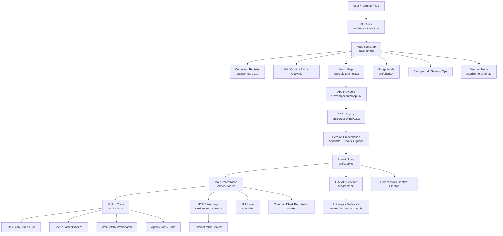
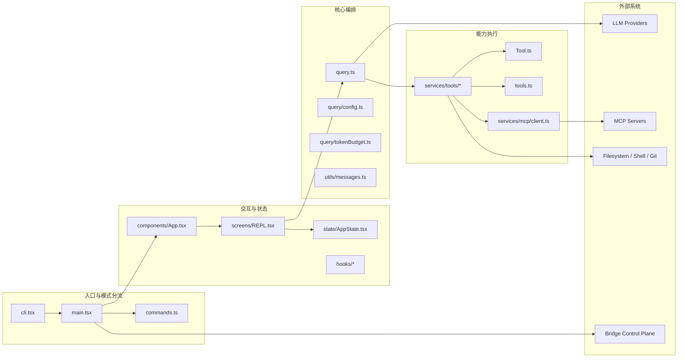
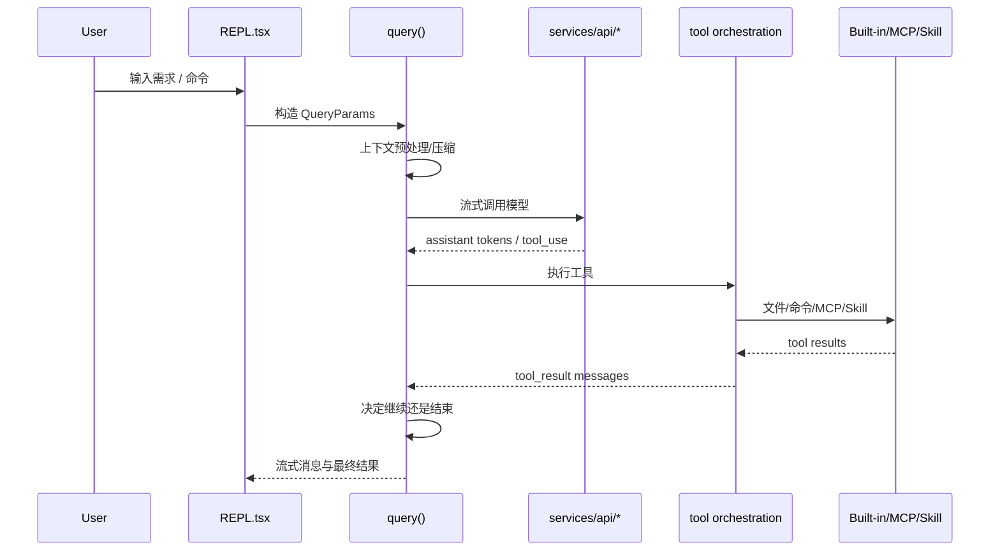

# Project Architecture Blueprint

生成时间: 2026-04-13

## 1. 项目概览

该项目是一个基于 `Bun + TypeScript` 的 Claude Code CLI/TUI 复刻实现，核心运行形态是:

- 命令行入口负责启动和模式分流
- `React + Ink` 负责终端交互界面
- `query()` 负责 agentic loop
- `Tool` 抽象负责文件、Shell、Web、MCP、Skill 等能力调用
- `services/*` 负责外部 API、MCP、通知、语音等集成
- `bridge/*` 负责远程控制模式

从代码组织看，这是一个以运行时能力为中心的模块化单体应用，而不是严格的经典分层 Web 应用。整体是"入口分流 + REPL 编排 + 查询循环 + 工具执行 + 外部服务接入"的混合架构。

## 2. 技术栈识别

- Runtime: `Bun`
- Language: `TypeScript`
- UI: `React`, `Ink`
- CLI parser: `@commander-js/extra-typings`
- LLM/Provider SDK: `@anthropic-ai/sdk`, Bedrock/Vertex/Azure 相关 SDK
- Extensibility: `MCP`, 本地 skills, plugin/agent 机制
- Observability: `OpenTelemetry`, `Sentry`, analytics/growthbook
- Build: `bun run build.ts`
- Test: `bun test`

## 3. 识别到的架构模式

- 主模式: 模块化单体
- 运行模式: 事件驱动 + 异步流式处理
- 交互模式: REPL/TUI
- 核心执行模式: Agentic Loop
- 扩展模式: Tool protocol + MCP federation + Skills
- 配置模式: Feature Flag 驱动的条件装配

## 4. 高层架构图



## 5. 运行时分层图



## 6. 关键入口与分流

### 6.1 CLI 启动入口

`src/entrypoints/cli.tsx` 是首个入口，负责:

- 解析进程参数
- 处理多个 fast-path
- 按运行模式动态导入具体模块
- 将普通路径落到 `src/main.tsx`

它不是简单的启动文件，而是一个轻量 dispatcher。这里体现出明显的"按功能延迟加载"策略，减少冷启动成本。

### 6.2 主引导层

`src/main.tsx` 是主装配点，负责:

- 初始化 profiling、配置、认证、analytics、policy limits
- 构建命令、工具、MCP、插件、skills 的运行上下文
- 创建 REPL 所需的初始状态
- 连接交互层与核心 `query()` 循环

这层承担了应用 composition root 的职责，是全局依赖装配中心。

### 6.3 命令系统

`src/commands.ts` 聚合大量命令模块，并通过 `feature()` 做条件装配:

- 内置 slash/CLI commands
- 可选特性命令，如 bridge、voice、workflow、buddy、ultraplan
- 动态 skills 命令
- 插件命令

因此命令系统本身也是一个扩展点，而不是固定枚举。

## 7. 交互层架构

### 7.1 App Provider 外壳

`src/components/App.tsx` 提供顶层 context:

- FPS metrics
- Stats store
- AppState provider

这是 REPL UI 的公共容器层。

### 7.2 状态管理

`src/state/AppState.tsx` 的设计特点:

- 使用外部 store + `useSyncExternalStore`
- Provider 保持稳定引用，避免无意义重渲染
- 将设置变更、权限模式切换、mailbox、voice 等上下文整合到统一状态树周围

这不是 Redux 式重框架，而是一个偏轻量、性能导向的应用状态容器。

### 7.3 REPL 终端界面

`src/screens/REPL.tsx` 是最核心的交互层组件，负责:

- 用户输入
- 消息展示
- 命令与消息队列
- 权限弹窗
- MCP elicitation UI
- 远程会话、SSH、Bridge 交互
- 成本统计、任务视图、快捷键、搜索高亮、工具反馈

这一层非常厚，说明项目选择了"以 REPL 为中心聚合行为"的设计，而不是将所有交互分散到多个独立 screen。

## 8. 核心执行链路

### 8.1 主链路



### 8.2 Agentic Loop

`src/query.ts` 是项目的核心引擎，职责包括:

- 消息规范化与上下文拼装
- token budget 与压缩策略
- 流式模型调用
- `tool_use` 检测与执行
- fallback/retry/recovery
- 终止条件控制

它本质上是一个异步状态机，而不是一次请求一次响应的线性流程。

### 8.3 工具执行模型

`query.ts` 通过如下能力与工具层协作:

- `StreamingToolExecutor`
- `runTools()`
- `ToolUseContext`
- `Tool` 抽象

这意味着工具既能作为"一轮结束后执行的动作"，也能在流式过程中逐步并行处理。

## 9. 工具架构

### 9.1 Tool 抽象

`src/Tool.ts` 是统一契约层，定义:

- Tool 输入 schema
- Tool 权限上下文
- ToolUseContext
- 进度事件
- UI 与执行之间的协作边界

这一层把"模型会调用的能力"统一成标准接口，是系统最关键的边界之一。

### 9.2 Tool 注册中心

`src/tools.ts` 是工具装配中心，负责:

- 注册内置工具
- 根据 feature flag 挂载可选工具
- 组合 MCP 工具
- 根据权限和模式过滤工具

`getAllBaseTools()` 体现出平台是"工具池 + 条件过滤"而不是"固定工具列表"。

### 9.3 工具池过滤

`src/utils/toolPool.ts` 说明该项目在工具层额外做了:

- built-in 与 MCP 去重
- 排序稳定化
- coordinator mode 下的工具裁剪

这反映出 prompt cache 稳定性和模式隔离是重要设计目标。

## 10. MCP 与外部扩展

### 10.1 MCP 客户端层

`src/services/mcp/client.ts` 是外部扩展的核心枢纽，负责:

- 连接远程或本地 MCP server
- 管理 transport、auth、timeout、session 过期
- 拉取工具、资源、命令
- 将 MCP 工具包装成统一 Tool 接口

### 10.2 MCP 在系统中的角色

MCP 不是旁路功能，而是一级能力来源:

- 可进入统一工具池
- 参与权限体系
- 可出现在 REPL 与 query loop 的同一调用链里
- 可与本地技能、内置工具并列提供能力

这使得系统具备"本地能力 + 外部能力联邦化"的扩展特征。

## 11. Bridge、后台与可选运行模式

### 11.1 Bridge 模式

`src/bridge/*` 提供远程控制能力，`bridgeMain.ts` 显示它具备:

- 环境注册
- 长轮询收取工作
- Session spawn / reconnect
- 心跳保活
- 权限响应回传
- 多会话容量管理

Bridge 子系统相当于把本地 CLI 变成远程执行节点。

### 11.2 Daemon 模式

入口中已经保留 `daemon` fast-path，但当前 `src/daemon/main.ts` 还是 stub:

- `daemonMain` 已存在接口
- 当前文件尚未承载完整实现

因此从架构上它是预留子系统，运行入口已经纳入主分流设计。

### 11.3 背景会话

CLI 入口对 `ps`、`logs`、`attach`、`kill`、`--bg` 做了专门 fast-path，说明后台会话管理被视为一级运行模式，而不是 REPL 的附属功能。

## 12. 横切关注点

### 12.1 权限模型

从 `ToolPermissionContext`、REPL 权限请求组件、工具过滤逻辑可以看出:

- 权限是系统边界，不是简单确认框
- 不同运行模式会改变可用工具集合
- 工具调用前后都可能触发权限与策略控制

### 12.2 Feature Flags

大量 `feature()` 条件导入表明:

- 编译时/运行时双重裁剪是核心机制
- 架构是可变的，不同构建产物功能不同
- 文档和运维都必须把 flag 视为架构的一部分

### 12.3 Observability

主入口和 bridge/mcp/api 层都广泛接入:

- profiling
- analytics
- growthbook
- sentry / telemetry

说明可观测性是基础设施层能力，不是后补功能。

## 13. 依赖方向

推荐把该项目理解为以下依赖方向:

```text
entrypoints/main
  -> commands + bootstrap + state
  -> REPL/UI
  -> query loop
  -> tool orchestration
  -> services / integrations
  -> external systems
```

总体上依赖方向是自上而下的，但 `REPL.tsx` 和 `main.tsx` 都偏厚，承担了较多运行时拼装责任，因此属于"中心协调器"而非纯展示层。

## 14. 从 graphify 观察到的结构特征

根据 `graphify-out/GRAPH_REPORT.md`:

- 全仓库约 `12411 nodes / 18268 edges / 1709 communities`
- God nodes 主要集中在 `ink` 和布局引擎相关抽象，如 `Node`、`Cursor`、`YogaLayoutNode`

这说明两件事:

- 该项目的终端 UI/布局系统复杂度很高
- 从全仓库图上看，基础渲染层连接度甚至高于业务命令层

因此如果要进一步模块化，`ink/*` 与 REPL/业务编排层之间的隔离会是重要优化方向。

## 15. 新功能落位建议

### 15.1 新增命令

优先放在:

- `src/commands/<feature>/`
- 若涉及 prompt/交互，接入 `commands.ts`
- 若只是 UI 触发，也要检查是否需要对应 slash 命令或 CLI 子命令

### 15.2 新增工具

优先放在:

- `src/tools/<ToolName>/`
- 在 `src/tools.ts` 注册
- 若需要权限控制，补齐 `ToolPermissionContext` 与规则匹配
- 若会影响 REPL 反馈，补齐对应 UI 呈现

### 15.3 新增外部集成

优先放在:

- `src/services/<domain>/`
- 如需变成模型能力，再通过 Tool/MCP 接入
- 如需独立运行模式，再在 `cli.tsx` / `main.tsx` 增加 fast-path 或装配逻辑

## 16. 架构风险与演进建议

- `REPL.tsx` 体量和职责较重，适合继续向 hooks/feature slices 拆分
- `main.tsx` 装配逻辑过厚，适合引入更明确的 runtime composition 模块
- feature flag 很多，建议补一份"模式矩阵"文档，避免分支组合失控
- daemon 子系统目前仍是占位实现，若继续推进，建议复用 bridge/bg 的进程治理模型
- graphify 显示底层 terminal/ink 抽象连接度极高，后续重构需要谨慎控制渲染层泄漏

## 17. 结论

该项目的实际架构可以概括为:

> 一个以 REPL 为中心、以 `query()` 为执行内核、以 Tool/MCP 为能力边界、以 feature flag 为装配机制的模块化智能体 CLI 平台。

如果只看高层，它像 CLI 应用。  
如果看执行内核，它是 Agent runtime。  
如果看扩展方式，它又像一个 Tool/MCP 平台。  
这三者共同构成了当前代码库的真实架构。
