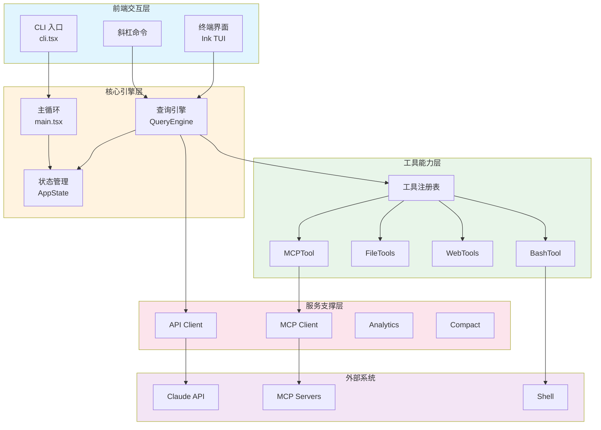
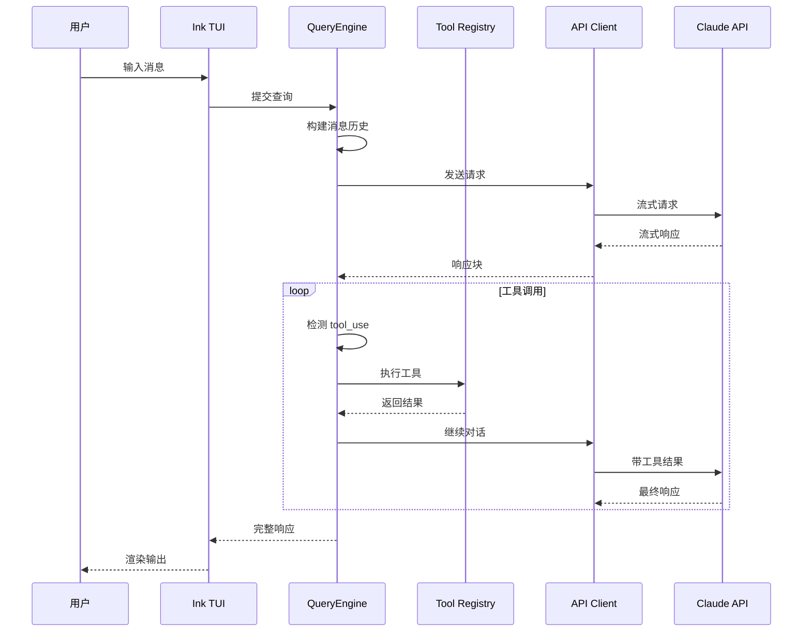
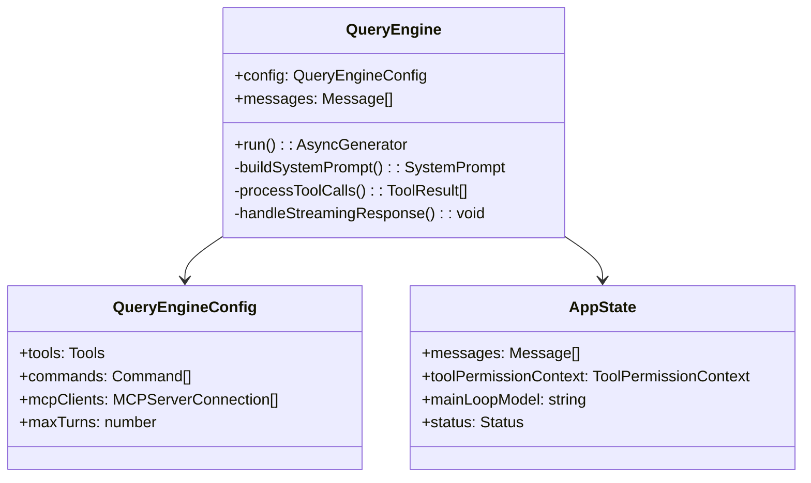
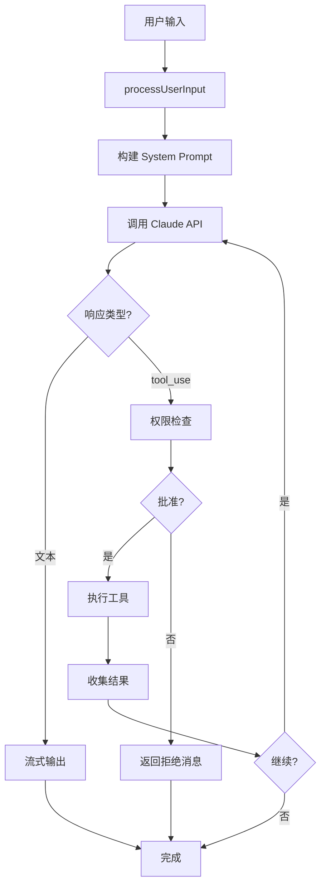
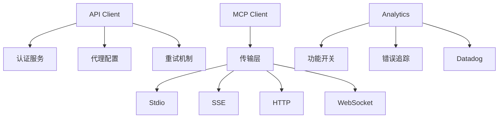
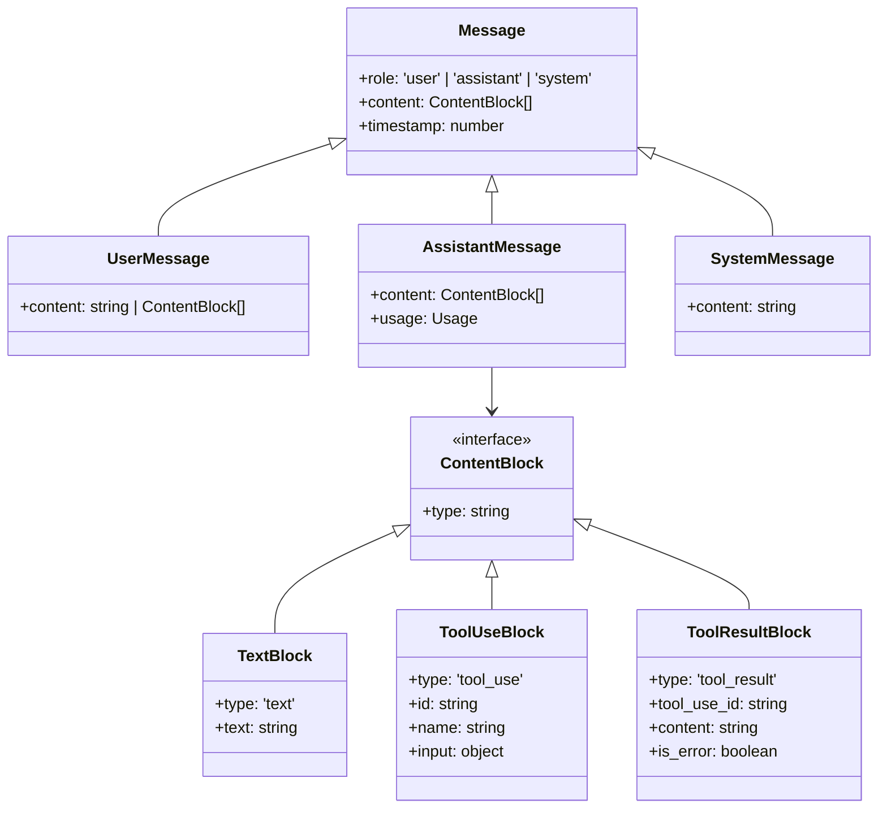
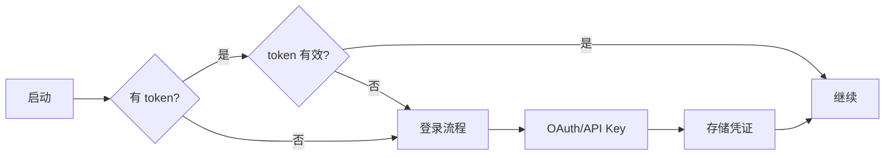

# 架构设计与核心流程

## 1. 架构概览

### 整体架构风格

Claude Code Best 采用**分层架构 + 事件驱动 + 插件化扩展**的混合架构模式：

- **分层架构**：清晰的入口层、引擎层、服务层、基础设施层划分
- **事件驱动**：基于 React 状态管理和消息流的事件响应
- **插件化**：通过 MCP 协议、Hook 系统、Skill 框架实现功能扩展

### 架构原则

1. **单一入口**：所有执行路径从 `cli.tsx` 统一分发
2. **懒加载优先**：动态导入减少启动时间
3. **工具即能力**：所有 Claude 能力抽象为 Tool 接口
4. **状态集中管理**：全局状态通过 AppState 统一管理
5. **协议标准化**：MCP 作为外部集成标准协议

### 架构约束

- 工具层不直接依赖 UI 层
- 服务层通过接口与引擎层解耦
- 配置与认证隔离于业务逻辑
- 循环依赖通过延迟导入（require）解决

---

## 2. 架构可视化

### 系统架构图



### 核心组件交互图



---

## 3. 核心架构组件

### 3.1 入口层 (Entry Layer)

**目的**：解析命令行参数，路由到不同执行路径

**组件**：
- `cli.tsx`：统一入口，快速路径检测（--version, --help, 特殊子命令）
- `main.tsx`：主循环初始化，Commander 命令解析
- `init.ts`：全局初始化（配置、认证、遥测）

**设计模式**：
- **策略模式**：不同子命令对应不同执行策略
- **外观模式**：`init.ts` 隐藏复杂的初始化细节

**关键代码**：
```typescript
// cli.tsx - 快速路径检测
if (args[0] === '--version') {
  console.log(MACRO.VERSION)
  return
}
if (args[0] === 'daemon') {
  await daemonMain(args.slice(1))
  return
}
// 其他路径...
const { main: cliMain } = await import('../main.jsx')
await cliMain()
```

### 3.2 引擎层 (Engine Layer)

**目的**：驱动对话循环，编排工具调用

**组件**：
- `QueryEngine`：核心执行引擎
- `query.ts`：API 调用封装
- `AppState`：全局状态存储

**内部结构**：



**执行流程**：



### 3.3 工具层 (Tool Layer)

**目的**：封装所有 Claude 可调用的能力

**核心抽象**：

```typescript
interface Tool<TInput, TProgress, TResult> {
  name: string
  inputSchema: ToolInputJSONSchema
  validateInput(input: TInput): ValidationResult
  canUse(context: ToolPermissionContext): boolean
  run(input: TInput, context: ToolUseContext): Promise<ToolResult<TResult>>
}
```

**设计模式**：
- **策略模式**：每个工具实现统一的 `run` 接口
- **模板方法**：`Tool.ts` 定义执行骨架，子类填充实现
- **责任链**：权限检查 -> 输入验证 -> 执行 -> 结果格式化

**工具分类**：

| 类别 | 工具 | 职责 |
|------|------|------|
| 执行 | BashTool, PowerShellTool | 命令行执行 |
| 文件 | FileReadTool, FileEditTool, FileWriteTool | 文件操作 |
| 搜索 | GlobTool, GrepTool | 代码搜索 |
| 网络 | WebFetchTool, WebSearchTool | 网络请求 |
| 任务 | AgentTool, TaskCreateTool | 子任务管理 |
| 集成 | MCPTool, LSPTool | 外部服务 |
| 元数据 | TodoWriteTool, BriefTool | 状态管理 |

### 3.4 服务层 (Service Layer)

**目的**：提供通用能力支持

**核心服务**：

| 服务 | 职责 | 关键文件 |
|------|------|---------|
| API Client | 与 Claude API 通信 | `services/api/` |
| MCP Client | MCP 协议实现 | `services/mcp/` |
| Analytics | 事件上报 | `services/analytics/` |
| Compact | 对话压缩 | `services/compact/` |
| LSP Manager | 语言服务器管理 | `services/lsp/` |
| Voice | 语音交互 | `services/voice.ts` |

**依赖关系**：



---

## 4. 分层与依赖

### 分层结构

```
┌─────────────────────────────────────┐
│         用户界面层 (UI Layer)         │
│  Ink Components / TUI / Commands    │
├─────────────────────────────────────┤
│         应用层 (Application)          │
│  QueryEngine / Message Processing   │
├─────────────────────────────────────┤
│         领域层 (Domain)              │
│  Tools / Skills / Agents            │
├─────────────────────────────────────┤
│         服务层 (Service)             │
│  API / MCP / Analytics / Storage    │
├─────────────────────────────────────┤
│         基础设施层 (Infrastructure)   │
│  Config / Auth / Permissions / Log  │
└─────────────────────────────────────┘
```

### 依赖规则

1. **单向依赖**：上层依赖下层，下层不依赖上层
2. **接口隔离**：层间通过接口通信，不暴露实现细节
3. **依赖注入**：服务通过参数注入，不硬编码依赖

### 循环依赖处理

```typescript
// 通过延迟导入打破循环依赖
const getTeammateUtils = () =>
  require('./utils/teammate.js') as typeof import('./utils/teammate.js')
```

---

## 5. 数据架构

### 消息模型



### 会话存储

| 存储位置 | 内容 | 格式 |
|---------|------|------|
| `~/.claude/sessions/` | 会话历史 | JSON |
| `~/.claude/auth.json` | 认证凭证 | JSON |
| `~/.claude/settings.json` | 用户设置 | JSON |
| `.claude/settings.json` | 项目设置 | JSON |
| `.mcp.json` | MCP 配置 | JSON |

### 缓存策略

```typescript
// 文件状态缓存
interface FileStateCache {
  contents: Map<string, { content: string; hash: string }>
  maxSize: number
  evictionPolicy: 'lru'
}

// 会话缓存
interface SessionCache {
  messages: Message[]
  compacted: boolean
  lastAccess: number
}
```

---

## 6. 横切关注点

### 6.1 认证与授权

**认证流程**：



**权限模式**：

| 模式 | 行为 | 适用场景 |
|------|------|---------|
| default | 每次确认 | 日常使用 |
| accept-all | 自动批准 | 受信环境 |
| bypass | 无限制 | 自动化脚本 |

### 6.2 错误处理

**重试策略**：
- API 错误：指数退避，最多 3 次
- 网络错误：立即重试
- 权限错误：不重试，提示用户

**错误分类**：
```typescript
type APIErrorType = 
  | 'rate_limit'      // 速率限制
  | 'overloaded'      // 服务过载
  | 'invalid_request' // 请求错误
  | 'auth_error'      // 认证失败
  | 'network_error'   // 网络问题
```

### 6.3 日志与监控

**埋点事件**：
- `session_start` / `session_end`
- `tool_use` / `tool_result`
- `query_start` / `query_end`
- `error_occurred`

**监控指标**：
- API 延迟
- Token 使用量
- 工具调用频率
- 错误率

---

## 7. 扩展与演进

### 7.1 添加新工具

```typescript
// 1. 定义工具类
export class MyTool implements Tool<MyInput, MyProgress, MyResult> {
  name = 'my_tool'
  inputSchema = { /* JSON Schema */ }
  
  async run(input: MyInput, context: ToolUseContext) {
    // 实现逻辑
    return { result: ... }
  }
}

// 2. 注册到 tools.ts
import { MyTool } from './tools/MyTool/MyTool.js'
```

### 7.2 添加新命令

```typescript
// 1. 在 commands/ 目录创建命令文件
export const myCommand: Command = {
  name: 'my-command',
  description: 'My command description',
  action: async (args) => {
    // 命令逻辑
  }
}

// 2. 注册到 commands.ts
```

### 7.3 集成外部服务

通过 MCP 协议：
```json
{
  "mcpServers": {
    "my-server": {
      "command": "my-mcp-server",
      "args": ["--port", "3000"]
    }
  }
}
```

---

## 8. 架构决策记录

### ADR-001: 选择 Ink 作为 TUI 框架

**背景**：需要终端 UI 支持复杂交互
**决策**：使用 Ink（React for CLI）
**原因**：
- React 组件模型熟悉
- 声明式 UI 开发效率高
- 生态成熟，社区活跃

### ADR-002: MCP 作为外部集成协议

**背景**：需要标准化方式接入外部工具
**决策**：采用 Anthropic MCP 协议
**原因**：
- 官方协议，兼容性保证
- 支持多种传输方式
- 工具/资源/提示符统一模型

### ADR-003: 懒加载优化启动性能

**背景**：启动时间影响用户体验
**决策**：关键路径动态导入
**原因**：
- 减少初始包体积
- 按需加载功能模块
- 快速响应 --version 等简单命令
