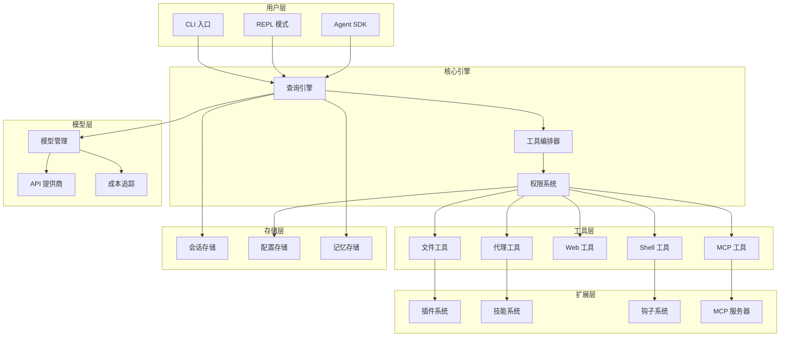

# Claude Code 核心功能知识地图

> 本文档作为 Claude Code 项目的功能索引与导航，基于代码事实构建，提供系统化的知识入口。

---

## 1. 工具系统 (Tool System)
> **代码入口**: `src/tools.ts` · **工具数量**: 55+ 内置工具 + MCP 动态扩展
> **核心抽象**: `src/Tool.ts` — 统一的 Tool 接口定义

Claude Code 拥有一个高度可扩展的工具系统，所有工具遵循统一的接口规范，支持 MCP 协议动态扩展。

### 1.1 工具架构与编排
- **文档**: [[01-tool-system-architecture]]
- 工具注册与发现机制 (`src/tools.ts:getAllBaseTools`)
- 工具权限过滤与黑白名单 (`filterToolsByDenyRules`)
- MCP 工具集成与合并 (`assembleToolPool`)
- 工具搜索延迟加载策略 (`ToolSearchTool`)

### 1.2 文件操作工具集
- **文档**: [[02-file-tools]]
- `FileReadTool` — 文件读取，支持图片/PDF、行范围、编码检测
- `FileEditTool` — 精确字符串替换编辑
- `FileWriteTool` — 文件写入与覆盖
- `GlobTool` — 文件模式匹配搜索
- `GrepTool` — 正则内容搜索（内置 ripgrep）
- `NotebookEditTool` — Jupyter Notebook 编辑

### 1.3 Shell 执行工具集
- **文档**: [[03-shell-tools]]
- `BashTool` — Bash 命令执行，沙箱隔离、权限控制、超时管理
- `PowerShellTool` — Windows PowerShell 支持
- Shell 安全策略：危险命令检测、操作符权限、路径验证

### 1.4 代理与任务工具集
- **文档**: [[04-agent-tools]]
- `AgentTool` — 子代理启动与管理
- `TaskCreateTool/TaskGetTool/TaskUpdateTool/TaskListTool` — 任务管理 (Todo V2)
- `TaskStopTool` — 任务终止控制
- `TaskOutputTool` — 任务输出收集
- `TodoWriteTool` — 待办事项追踪

### 1.5 Web 与网络工具集
- **文档**: [[05-web-tools]]
- `WebFetchTool` — 网页内容获取（支持 Defuddle 清理）
- `WebSearchTool` — Web 搜索集成
- `WebBrowserTool` — 浏览器自动化（实验性）

### 1.6 LSP 与代码智能工具集
- **文档**: [[06-lsp-tools]]
- `LSPTool` — 语言服务器协议集成，支持跳转定义、查找引用、补全
- 代码诊断与修复建议

### 1.7 扩展与集成工具集
- **文档**: [[07-extension-tools]]
- `SkillTool` — 技能加载与执行
- `MCPTool` — Model Context Protocol 服务器通信
- `ListMcpResourcesTool/ReadMcpResourceTool` — MCP 资源访问
- `ConfigTool` — 配置管理（Ant-only）
- `WorkflowTool` — 工作流脚本执行

### 1.8 辅助工具集
- **文档**: [[08-utility-tools]]
- `AskUserQuestionTool` — 交互式用户提问
- `BriefTool` — 上下文摘要
- `SendMessageTool` — 消息发送（多代理通信）
- `EnterPlanModeTool/ExitPlanModeV2Tool` — 计划模式切换
- `EnterWorktreeTool/ExitWorktreeTool` — Git Worktree 管理
- `ScheduleCronTool` — 定时任务调度

---

## 2. 对话引擎与会话管理 (Conversation Engine)
> **代码入口**: `src/query.ts` · `src/QueryEngine.ts`
> **核心流程**: 用户输入 → 消息处理 → API 调用 → 响应流式输出

### 2.1 消息处理流程
- **文档**: [[09-message-processing]]
- 用户消息解析与附件处理
- 上下文窗口管理与 Token 预算
- 系统提示词组装与缓存策略
- 流式响应处理与中断控制

### 2.2 会话状态管理
- **文档**: [[10-session-state]]
- 会话持久化与恢复 (`src/utils/conversationRecovery.ts`)
- 历史记录管理 (`src/history.ts`)
- 多轮对话上下文追踪
- 会话标题自动生成

### 2.3 上下文窗口优化
- **文档**: [[11-context-window]]
- Token 预算计算 (`src/query/tokenBudget.ts`)
- 上下文压缩策略
- 文件状态缓存 (`src/utils/fileStateCache.ts`)
- 提示词缓存优化

---

## 3. 模型管理与 API 集成 (Model & API)
> **代码入口**: `src/utils/model/` · `src/services/api/`
> **支持模型**: Claude 系列、OpenAI 兼容、Bedrock、Vertex AI

### 3.1 模型配置与选择
- **文档**: [[features/12-model-management]] ✓ 已完成
- 模型别名与解析 (`src/utils/model/model.ts:62-99` - 选择优先级, `446-507` - 别名解析)
- 模型能力检测（扩展思考、视觉等）
- 模型成本追踪 (`src/cost-tracker.ts`)
- 多提供商适配 (`src/utils/model/providers.ts:7-22` - 提供商检测)

### 3.2 API 认证与授权
- **文档**: [[features/13-authentication]] ✓ 已完成
- API Key 管理 (`src/utils/auth.ts:152-205` - 认证源检测)
- OAuth 流程 (`src/utils/auth.ts:1254-1299` - 令牌读取, `src/services/oauth/client.ts` - OAuth流程)
- AWS/GCP 凭证管理 (`src/utils/auth.ts:604-1013` - AWS/GCP凭证刷新)
- 自定义平台登录

### 3.3 流式响应处理
- **文档**: [[features/14-streaming]] ✓ 已完成
- SSE 流解析 (`src/services/api/claude.ts:165-352` - 事件处理)
- 工具调用流式处理
- 错误重试与熔断 (`src/services/api/withRetry.ts:85-267` - 重试机制, `src/services/api/errors.ts:784-883` - 错误处理)
- 速率限制处理

---

## 4. 权限与安全系统 (Security & Permissions)
> **代码入口**: `src/utils/permissions/` · `src/tools/BashTool/bashSecurity.ts`
> **安全策略**: 沙箱隔离、权限规则、危险操作检测

### 4.1 权限模型
- **文档**: [[15-permissions]]
- 权限规则定义与匹配
- 用户确认机制
- 权限持久化与继承
- MCP 工具权限隔离

### 4.2 沙箱隔离
- **文档**: [[16-sandbox]]
- 命令沙箱执行 (`src/utils/sandbox/`)
- 文件系统访问控制
- 网络访问限制
- 进程隔离

### 4.3 安全检测
- **文档**: [[17-security-checks]]
- 危险命令识别
- 敏感数据扫描 (`src/services/teamMemorySync/secretScanner.ts`)
- SSRF 防护 (`src/utils/hooks/ssrfGuard.ts`)
- 自动模式安全控制

---

## 5. 插件与扩展系统 (Plugin System)
> **代码入口**: `src/utils/plugins/` · `src/skills/`
> **扩展机制**: Marketplace、MCP、Skill、Hook

### 5.1 插件架构
- **文档**: [[18-plugin-architecture]]
- 插件生命周期管理 (`src/utils/plugins/pluginLoader.ts`)
- Marketplace 集成 (`src/utils/plugins/marketplaceManager.ts`)
- 插件依赖解析
- 插件热加载

### 5.2 Skill 技能系统
- **文档**: [[19-skill-system]]
- Skill 定义与加载 (`src/skills/loadSkillsDir.ts`)
- 内置技能 (`src/skills/bundled/`)
- 技能提示词模板
- 技能钩子机制

### 5.3 Hook 钩子系统
- **文档**: [[20-hook-system]]
- Hook 类型与注册 (`src/utils/hooks.ts`)
- 异步 Hook 执行 (`src/utils/hooks/AsyncHookRegistry.ts`)
- HTTP/Agent/Prompt Hook
- 前置/后置处理

### 5.4 MCP 集成
- **文档**: [[21-mcp-integration]]
- MCP 服务器管理 (`src/services/mcp/`)
- 资源与工具映射
- 传输协议适配
- 服务生命周期

---

## 6. 多代理协作 (Multi-Agent)
> **代码入口**: `src/utils/swarm/` · `src/coordinator/`
> **协作模式**: Team、Coordinator-Worker、In-Process

### 6.1 代理类型与角色
- **文档**: [[22-agent-types]]
- 主代理与子代理
- Teammate 协作代理
- Coordinator 协调代理
- Worker 工作代理

### 6.2 代理通信
- **文档**: [[23-agent-communication]]
- Mailbox 消息传递 (`src/utils/teammateMailbox.ts`)
- 权限同步 (`src/utils/swarm/permissionSync.ts`)
- 状态共享
- 任务分发

### 6.3 后端实现
- **文档**: [[24-agent-backends]]
- InProcessBackend (`src/utils/swarm/backends/InProcessBackend.ts`)
- TmuxBackend (`src/utils/swarm/backends/TmuxBackend.ts`)
- ITermBackend (`src/utils/swarm/backends/ITermBackend.ts`)
- 后端自动检测与选择

---

## 7. UI 与终端交互 (UI & Terminal)
> **代码入口**: `src/ink/` · `src/main.tsx`
> **UI 框架**: Ink (React for CLI)

### 7.1 终端渲染引擎
- **文档**: [[25-terminal-rendering]]
- Ink 框架集成 (`src/ink/`)
- ANSI 转义序列处理
- 光标与选择管理
- 双向文本支持 (BiDi)

### 7.2 交互组件
- **文档**: [[26-interactive-components]]
- 输入框与编辑器
- 列表与选择器
- 确认对话框
- 进度指示器

### 7.3 Vim 模式
- **文档**: [[27-vim-mode]]
- Vim 键位模拟 (`src/vim/`)
- 模式切换（Normal/Insert/Visual）
- 文本对象与操作符
- Motion 与跳转

---

## 8. 配置与设置 (Configuration)
> **代码入口**: `src/utils/settings/` · `src/utils/config.ts`
> **配置层级**: 全局 → 项目 → 会话

### 8.1 设置管理
- **文档**: [[28-settings]]
- 设置源与优先级 (`src/utils/settings/settings.ts`)
- 迁移机制 (`src/migrations/`)
- MDM 配置覆盖
- 验证与类型安全

### 8.2 环境与特性开关
- **文档**: [[29-feature-flags]]
- 环境变量解析 (`src/utils/envUtils.ts`)
- Feature Flag 系统 (`feature()` 函数)
- GrowthBook 集成 (`src/services/analytics/growthbook.ts`)
- 动态特性开关

### 8.3 项目配置
- **文档**: [[30-project-config]]
- CLAUDE.md 文件解析 (`src/utils/claudemd.ts`)
- AGENTS.md 项目指令
- .claude/ 目录结构
- Worktree 配置隔离

---

## 9. 记忆与上下文增强 (Memory & Context)
> **代码入口**: `src/services/SessionMemory/` · `src/services/autoDream/`
> **记忆类型**: Session Memory、Auto Dream、Team Memory

### 9.1 会话记忆
- **文档**: [[31-session-memory]]
- 记忆提取与存储 (`src/services/SessionMemory/`)
- 记忆提示词生成
- 记忆检索与注入

### 9.2 自动整理 (Auto Dream)
- **文档**: [[32-auto-dream]]
- 后台整理机制 (`src/services/autoDream/`)
- 整理提示词 (`consolidationPrompt.ts`)
- 锁机制防止冲突
- 定期触发策略

### 9.3 团队记忆
- **文档**: [[33-team-memory]]
- 跨代理记忆同步 (`src/services/teamMemorySync/`)
- 秘密扫描与脱敏
- 文件监视与更新

---

## 10. 监控与分析 (Monitoring & Analytics)
> **代码入口**: `src/services/analytics/` · `src/utils/log.ts`
> **监控平台**: Datadog、GrowthBook、Sentry

### 10.1 事件追踪
- **文档**: [[34-analytics]]
- 事件埋点 (`src/services/analytics/`)
- First-party 事件日志
- Datadog 集成
- 遥测数据上报

### 10.2 错误监控
- **文档**: [[35-error-monitoring]]
- Sentry 集成
- 错误分类与上报
- 调试日志系统 (`src/utils/debug.ts`)
- 崩溃恢复

### 10.3 性能监控
- **文档**: [[36-performance]]
- 慢操作追踪 (`src/utils/slowOperations.ts`)
- Token 使用统计
- 成本追踪 (`src/cost-tracker.ts`)
- 响应时间监控

---

## 11. 开发者工具 (Developer Tools)
> **代码入口**: `src/entrypoints/` · `packages/`
> **SDK**: Agent SDK、REPL 模式

### 11.1 Agent SDK
- **文档**: [[37-agent-sdk]]
- SDK 类型定义 (`src/entrypoints/agentSdkTypes.ts`)
- 运行时 API
- 嵌入式使用
- 程序化控制

### 11.2 REPL 模式
- **文档**: [[38-repl-mode]]
- REPL 工具 (`src/tools/REPLTool/`)
- VM 沙箱执行
- 交互式调试
- 脚本化操作

### 11.3 远程控制
- **文档**: [[39-remote-control]]
- WebSocket 会话管理 (`src/remote/`)
- SDK 消息适配
- 远程权限桥接
- 跨进程通信

---

## 12. 高级特性 (Advanced Features)
> **代码入口**: 各 Feature Flag 控制的模块

### 12.1 Computer Use
- **文档**: [[40-computer-use]]
- 屏幕截图与分析
- 鼠标键盘控制
- UI 自动化 (`packages/@ant/computer-use-swift/`)

### 12.2 Chrome 集成
- **文档**: [[41-chrome-integration]]
- Native Host 通信
- 浏览器扩展协议
- Chrome Use 工具

### 12.3 Voice Mode
- **文档**: [[42-voice-mode]]
- 语音识别 (`src/services/voice.ts`)
- 语音合成
- 关键词检测 (`src/services/voiceKeyterms.ts`)
- 实时转录

### 12.4 Bridge Mode
- **文档**: [[43-bridge-mode]]
- IDE 集成模式
- 文件变更监听
- 诊断追踪 (`src/services/diagnosticTracking.ts`)

---

## 附录：架构概览图

---

## 导航说明

1. **文档编号规则**: 两位数字编号，如 `01-xxx`、`02-xxx`
2. **层级结构**: 一级功能模块 → 二级子功能
3. **代码引用**: 每个功能点标注关键代码路径
4. **交叉引用**: 使用 `[[文档名]]` 进行 wiki 风格链接

---

*基于 graphify 知识图谱构建 · 最后更新: 2026-04-26*
