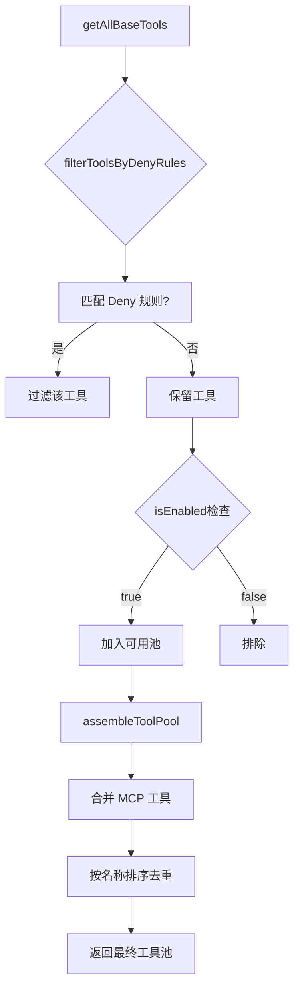

# 工具架构与编排

> 工具系统的核心抽象、注册发现机制、权限过滤与MCP集成

---

## 概述

Claude Code 拥有一个高度可扩展的工具系统，包含 55+ 内置工具，并通过 MCP (Model Context Protocol) 协议支持动态扩展。所有工具遵循统一的 `Tool` 接口规范，实现了声明式定义、权限控制、并发安全等核心能力。

**解决的问题**：
- 统一的工具抽象：从简单文件操作到复杂代理启动，所有能力通过统一接口暴露
- 安全的执行环境：权限系统在工具调用前进行校验，支持黑白名单
- 动态扩展能力：MCP 协议允许运行时加载外部工具服务器
- Token 预算优化：工具搜索延迟加载策略减少提示词体积

---

## 设计原理

### 架构决策

```
┌─────────────────────────────────────────────────────────────────┐
│                     QueryEngine                                  │
│                    (调用入口)                                    │
└────────────────────────┬────────────────────────────────────────┘
                         │
                         ▼
┌─────────────────────────────────────────────────────────────────┐
│                   assembleToolPool()                             │
│              (工具池组装核心逻辑)                                 │
├─────────────────────────────────────────────────────────────────┤
│  1. getTools(permissionContext)  →  内置工具                    │
│  2. filterToolsByDenyRules()     →  权限过滤                    │
│  3. 合并 MCP 工具                →  去重排序                     │
└────────────────────────┬────────────────────────────────────────┘
                         │
          ┌──────────────┼──────────────┐
          ▼              ▼              ▼
   ┌──────────┐   ┌──────────┐   ┌──────────┐
   │ 内置工具  │   │ MCP 工具  │   │ 动态工具  │
   │(55+ 常驻) │   │(服务器扩展)│   │(延迟加载) │
   └──────────┘   └──────────┘   └──────────┘
```

### 核心设计原则

1. **统一接口** (`src/Tool.ts:362-695`)
   - 所有工具实现 `Tool<Input, Output, Progress>` 接口
   - 使用 Zod Schema 定义输入/输出类型
   - 通过 `buildTool()` 提供安全默认值

2. **分层过滤** (`src/tools.ts:260-267`)
   - 全局拒绝规则优先：`filterToolsByDenyRules()`
   - 按环境特性筛选：`isEnabled()` 检查
   - 运行时权限校验：`checkPermissions()` 方法

3. **延迟发现** (`src/tools.ts:247`)
   - `ToolSearchTool` 支持工具延迟加载
   - 减少 55+ 工具全部加载的 Token 开销

---

## 实现原理

### 工具注册与发现

**入口函数**: `getAllBaseTools()` (`src/tools.ts:191-249`)

```typescript
export function getAllBaseTools(): Tools {
  return [
    AgentTool,
    TaskOutputTool,
    BashTool,
    ...(hasEmbeddedSearchTools() ? [] : [GlobTool, GrepTool]),
    FileReadTool,
    FileEditTool,
    FileWriteTool,
    // ... 条件加载的工具
    ...(isEnvTruthy(process.env.ENABLE_LSP_TOOL) ? [LSPTool] : []),
    ...(isWorktreeModeEnabled() ? [EnterWorktreeTool, ExitWorktreeTool] : []),
    // MCP 工具在 assembleToolPool 中合并
  ]
}
```

**关键机制**：
- 静态注册 + 条件加载：部分工具通过 Feature Flag 控制
- 死代码消除：Ant-only 工具通过 `process.env.USER_TYPE` 条件加载
- 循环依赖破解：TeamCreateTool/TeamDeleteTool 使用 `require()` 延迟加载

### 权限过滤流程



**权限规则匹配** (`src/tools.ts:260-267`)：

```typescript
export function filterToolsByDenyRules<T>(tools: readonly T[], permissionContext) {
  return tools.filter(tool => !getDenyRuleForTool(permissionContext, tool))
}
```

### MCP 工具集成

**合并策略** (`src/tools.ts:343-365`)：

```typescript
export function assembleToolPool(
  permissionContext: ToolPermissionContext,
  mcpTools: Tools,
): Tools {
  const builtInTools = getTools(permissionContext)
  const allowedMcpTools = filterToolsByDenyRules(mcpTools, permissionContext)
  
  // 排序策略：内置工具优先，保持缓存稳定性
  return uniqBy(
    [...builtInTools].sort(byName).concat(allowedMcpTools.sort(byName)),
    'name', // 内置工具优先（保留插入顺序）
  )
}
```

**关键决策**：
- 内置工具优先：`uniqBy` 保留首次出现的工具
- 排序稳定：确保提示词缓存有效
- MCP 前缀识别：`mcp__server__tool` 格式

---

## 功能展开

### 1. Tool 接口规范

**核心方法** (`src/Tool.ts:362-695`)：

| 方法 | 用途 | 必需 |
|------|------|------|
| `call()` | 执行工具逻辑 | ✓ |
| `description()` | 返回工具描述 | ✓ |
| `prompt()` | 生成系统提示词 | ✓ |
| `inputSchema` | Zod 输入验证 | ✓ |
| `checkPermissions()` | 权限检查 | ✓ |
| `isEnabled()` | 环境可用性 | 默认 true |
| `isConcurrencySafe()` | 并发安全 | 默认 false |
| `isReadOnly()` | 只读操作 | 默认 false |
| `isDestructive()` | 破坏性操作 | 默认 false |
| `validateInput()` | 输入预校验 | 可选 |

### 2. buildTool 工厂函数

**默认值填充** (`src/Tool.ts:757-792`)：

```typescript
const TOOL_DEFAULTS = {
  isEnabled: () => true,
  isConcurrencySafe: () => false,  // 默认不安全
  isReadOnly: () => false,         // 默认写操作
  isDestructive: () => false,
  checkPermissions: (input) => ({ behavior: 'allow', updatedInput: input }),
  toAutoClassifierInput: () => '',
  userFacingName: () => name,
}
```

### 3. 工具搜索延迟加载

**设计动机**：55+ 工具全部加载占用大量 Token

**实现机制** (`src/tools.ts:247`)：
- `ToolSearchTool` 作为搜索入口
- 工具标记 `shouldDefer: true` 延迟加载
- 工具标记 `alwaysLoad: true` 强制立即加载

---

## 数据结构

### ToolPermissionContext

```typescript
type ToolPermissionContext = DeepImmutable<{
  mode: PermissionMode
  additionalWorkingDirectories: Map<string, AdditionalWorkingDirectory>
  alwaysAllowRules: ToolPermissionRulesBySource
  alwaysDenyRules: ToolPermissionRulesBySource
  alwaysAskRules: ToolPermissionRulesBySource
  isBypassPermissionsModeAvailable: boolean
  isAutoModeAvailable?: boolean
  shouldAvoidPermissionPrompts?: boolean
}>
```

### ToolUseContext

```typescript
type ToolUseContext = {
  options: {
    commands: Command[]
    tools: Tools
    mcpClients: MCPServerConnection[]
    agentDefinitions: AgentDefinitionsResult
  }
  abortController: AbortController
  readFileState: FileStateCache
  getAppState(): AppState
  messages: Message[]
  // ...
}
```

---

## 组合使用

### 与权限系统协作

```
Tool.checkPermissions()
        │
        ▼
┌─────────────────────────┐
│   permissions.ts        │
│  - getDenyRuleForTool   │
│  - matchingRuleForInput │
└───────────┬─────────────┘
            │
            ▼
┌─────────────────────────┐
│   PermissionDecision    │
│  - allow                │
│  - ask                  │
│  - deny                 │
└─────────────────────────┘
```

### 与 Hook 系统协作

```typescript
// Hook 可以拦截工具调用
// src/utils/hooks.ts
type HookType = 'PreToolUse' | 'PostToolUse' | 'PreCompact' | ...

// 工具调用流程
1. PreToolUse Hook 执行
2. checkPermissions() 权限校验
3. call() 执行工具
4. PostToolUse Hook 执行
```

---

## 小结

### 设计取舍

| 决策 | 收益 | 代价 |
|------|------|------|
| 统一 Tool 接口 | 一致的扩展模型 | 部分工具有冗余方法 |
| 延迟加载策略 | Token 预算优化 | 首次调用延迟 |
| 内置优先合并 | 缓存稳定性 | MCP 无法覆盖内置 |

### 局限性

1. **工具命名冲突**：MCP 工具与内置工具同名时，内置优先
2. **权限粒度**：某些工具（如 Bash）需要额外的命令级权限
3. **并发限制**：非并发安全工具需要串行执行

### 演进方向

1. **工具市场**：通过 Marketplace 分发第三方工具
2. **工具组合**：支持工具链式调用
3. **智能调度**：基于上下文自动选择最佳工具

---

*基于 graphify 知识图谱构建 · 关键代码路径: `src/Tool.ts`, `src/tools.ts`*
