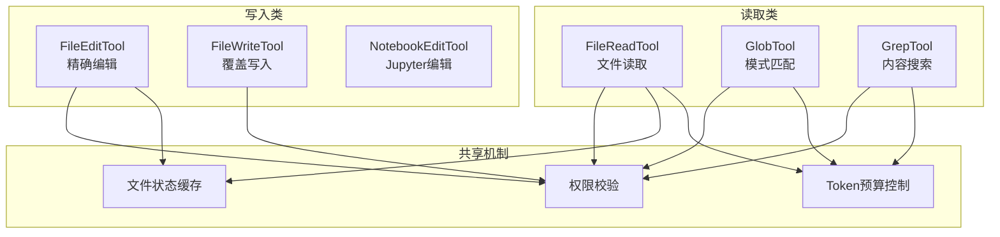
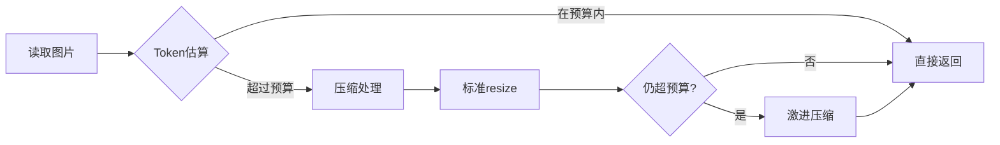

# 文件操作工具集

> 文件系统访问的核心工具：Read、Edit、Write、Glob、Grep、NotebookEdit

---

## 概述

文件操作工具集提供对文件系统的完整操作能力，包括读取、编辑、写入、搜索等功能。这些工具是 Claude Code 最基础也是最频繁使用的工具集，承担着代码分析、文件管理、内容搜索等核心任务。

**解决的问题**：
- 安全的文件访问：路径验证、权限检查、危险设备阻断
- 高效的内容处理：图片压缩、PDF 解析、Notebook 支持
- Token 预算控制：行范围读取、结果截断、去重缓存

---

## 设计原理

### 工具矩阵



### 核心设计原则

1. **权限优先**：所有文件操作前先校验 `toolPermissionContext`
2. **Token 感知**：大文件自动截断、提供行范围参数
3. **并发安全**：读操作可并发，写操作需串行

---

## 实现原理

### FileReadTool - 文件读取

**核心实现** (`src/tools/FileReadTool/FileReadTool.ts`)：

```typescript
// 输入 Schema
z.strictObject({
  file_path: z.string(),
  offset: z.number().optional(),    // 起始行号
  limit: z.number().optional(),     // 读取行数
  pages: z.string().optional(),     // PDF 页码范围
})

// 输出类型
z.discriminatedUnion('type', [
  { type: 'text', file: { content, numLines, startLine, totalLines } },
  { type: 'image', file: { base64, type, dimensions } },
  { type: 'pdf', file: { base64, originalSize } },
  { type: 'notebook', file: { cells } },
  { type: 'file_unchanged', file: { filePath } },  // 去重缓存
])
```

**关键特性**：

| 特性 | 实现位置 | 说明 |
|------|----------|------|
| 图片支持 | `FileReadTool.ts:866-891` | 自动压缩到 Token 预算 |
| PDF 支持 | `FileReadTool.ts:894-1017` | 页码范围提取 |
| Notebook 支持 | `FileReadTool.ts:822-863` | .ipynb 解析 |
| 去重缓存 | `FileReadTool.ts:530-573` | 相同文件避免重复读取 |
| 设备阻断 | `FileReadTool.ts:98-128` | 阻止 /dev/zero 等危险设备 |

**Token 预算控制** (`FileReadTool.ts:755-772`)：

```typescript
async function validateContentTokens(content, ext, maxTokens) {
  const tokenEstimate = roughTokenCountEstimationForFileType(content, ext)
  if (tokenEstimate > effectiveMaxTokens) {
    throw new MaxFileReadTokenExceededError(tokenEstimate, maxTokens)
  }
}
```

### GlobTool - 模式匹配搜索

**核心实现** (`src/tools/GlobTool/GlobTool.ts`)：

```typescript
const inputSchema = z.strictObject({
  pattern: z.string().describe('The glob pattern to match files against'),
  path: z.string().optional().describe('The directory to search in'),
})

// 调用内置 glob 实现
const { files, truncated } = await glob(
  input.pattern,
  GlobTool.getPath(input),
  { limit: 100, offset: 0 },
  abortController.signal,
  appState.toolPermissionContext,
)
```

**关键特性**：
- 结果限制：默认返回 100 个文件
- 路径验证：检查目录是否存在
- 权限过滤：尊重 `toolPermissionContext`

### GrepTool - 正则内容搜索

**内置 ripgrep 集成** (`src/tools/GrepTool/GrepTool.ts`)：

```typescript
// 支持的正则选项
z.strictObject({
  pattern: z.string(),
  path: z.string().optional(),
  include: z.string().optional(),   // 文件类型过滤
  output_mode: z.enum(['files', 'content']).optional(),
})
```

**设计决策**：
- 内置 ripgrep：避免依赖外部 `grep` 命令
- 延迟加载：当系统有 `bfs/ugrep` 时跳过

### FileEditTool - 精确字符串替换

**核心机制**：

```typescript
// 编辑输入
z.strictObject({
  file_path: z.string(),
  oldString: z.string(),
  newString: z.string(),
  replaceAll: z.boolean().optional(),
})

// 精确匹配策略
1. 读取文件内容
2. 查找 oldString 精确匹配
3. 替换为 newString
4. 写回文件
```

**关键校验**：
- `oldString` 必须唯一匹配（除非 `replaceAll: true`）
- 编辑前检查 `readFileState` 缓存
- 文件修改时间验证

### FileWriteTool - 覆盖写入

**实现要点** (`src/tools/FileWriteTool/FileWriteTool.ts`)：

```typescript
z.strictObject({
  file_path: z.string(),
  content: z.string(),
})

// 写入流程
1. 权限校验
2. 父目录创建（如不存在）
3. 内容写入
4. 更新 readFileState 缓存
```

---

## 功能展开

### 1. 多格式支持

**图片处理流程** (`FileReadTool.ts:1097-1183`)：



**PDF 处理**：
- 小 PDF（< 阈值）：直接返回 base64
- 大 PDF：提取指定页码为图片
- 需要 `poppler-utils` 支持

### 2. 安全机制

**路径安全检查** (`FileReadTool.ts:418-495`)：

```typescript
async validateInput({ file_path }) {
  // 1. 拒绝规则匹配
  if (matchingRuleForInput(fullFilePath, permissionContext, 'read', 'deny')) {
    return { result: false, message: 'File is denied by permission settings.' }
  }
  
  // 2. UNC 路径阻断（防止 NTLM 泄露）
  if (isUncPath(fullFilePath)) {
    return { result: true }  // 延迟到权限授予后
  }
  
  // 3. 二进制文件阻断
  if (hasBinaryExtension(fullFilePath) && !isPDFExtension(ext)) {
    return { result: false, message: 'Cannot read binary files.' }
  }
  
  // 4. 危险设备阻断
  if (isBlockedDevicePath(fullFilePath)) {
    return { result: false, message: 'Device file would block.' }
  }
}
```

### 3. 去重缓存

**设计动机**：相同文件重复读取浪费 Token

**实现** (`FileReadTool.ts:530-573`)：

```typescript
// readFileState 存储
readFileState.set(fullFilePath, {
  content,
  timestamp: Math.floor(mtimeMs),
  offset,
  limit,
})

// 下次读取时检查
const existingState = readFileState.get(fullFilePath)
if (existingState && 
    existingState.offset === offset && 
    existingState.limit === limit &&
    mtimeMs === existingState.timestamp) {
  return { type: 'file_unchanged', file: { filePath } }
}
```

---

## 数据结构

### FileStateCache

```typescript
type FileStateCache = Map<string, {
  content: string
  timestamp: number   // 修改时间戳
  offset?: number     // 读取偏移
  limit?: number      // 读取限制
  isPartialView?: boolean
}>
```

### 读取限制配置

```typescript
const defaults = {
  maxTokens: 2000,        // 最大 Token 数
  maxSizeBytes: 256KB,    // 最大文件大小
}
```

---

## 组合使用

### 典型工作流

```
1. GlobTool 找到目标文件
2. GrepTool 搜索关键词
3. FileReadTool 读取具体内容
4. FileEditTool 修改代码
```

### 与 Bash 工具协作

```typescript
// 大文件处理
Read → 超出限制 → 建议使用 Bash + jq/head/tail

// 示例提示
"Notebook content exceeds maximum. Use Bash with jq:
  cat file.ipynb | jq '.cells[:20]'"
```

---

## 小结

### 设计取舍

| 决策 | 收益 | 代价 |
|------|------|------|
| 内置 glob/grep | 无外部依赖 | 二进制体积增加 |
| 去重缓存 | Token 节省 | 内存占用 |
| 图片自动压缩 | 视觉支持 | 质量损失 |

### 局限性

1. **大文件处理**：超出限制需降级到 Bash
2. **二进制文件**：除图片/PDF 外不支持
3. **编码检测**：依赖文件扩展名

### 演进方向

1. **增量读取**：流式读取超大文件
2. **智能压缩**：基于内容类型的压缩策略
3. **版本感知**：与 Git 集成，读取历史版本

---

*关键代码路径: `src/tools/FileReadTool/`, `src/tools/GlobTool/`, `src/tools/GrepTool/`, `src/tools/FileEditTool/`, `src/tools/FileWriteTool/`*
