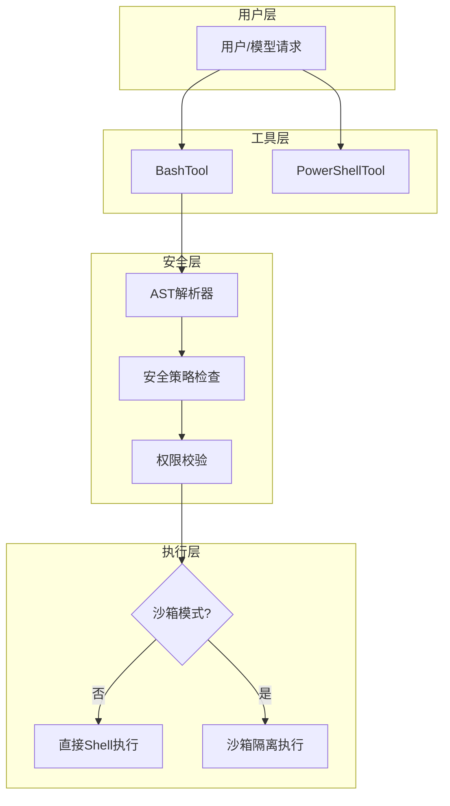
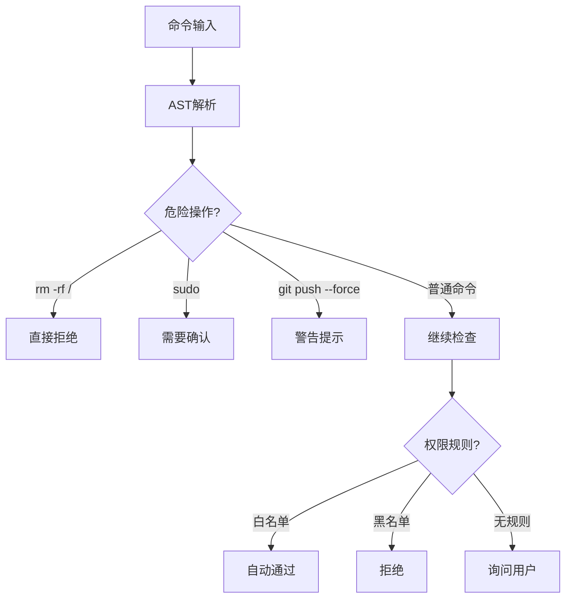
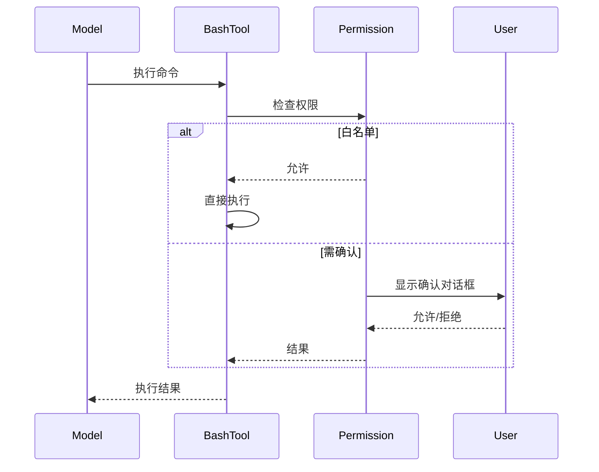

# Shell 执行工具集

> 命令行执行的核心能力：Bash、PowerShell、沙箱隔离、安全策略

---

## 概述

Shell 执行工具集提供与操作系统命令行的交互能力，是 Claude Code 最强大也最敏感的工具。通过 BashTool 和 PowerShellTool，可以执行任意命令、管理进程、操作文件系统。同时配套了完善的安全机制，防止危险操作和权限滥用。

**解决的问题**：
- 安全的命令执行：危险命令检测、权限控制、沙箱隔离
- 跨平台支持：macOS/Linux 用 Bash，Windows 用 PowerShell
- 灵活的超时管理：命令级超时、自动后台化

---

## 设计原理

### 架构总览



### 核心设计原则

1. **安全优先**：命令解析 → 安全检查 → 权限校验 → 执行
2. **渐进授权**：白名单命令自动通过，敏感命令需要确认
3. **沙箱可选**：高风险命令强制沙箱执行

---

## 实现原理

### BashTool - 核心实现

**入口实现** (`src/tools/BashTool/BashTool.tsx`)：

```typescript
// 输入 Schema
z.strictObject({
  command: z.string().describe('The command to execute'),
  timeout: semanticNumber(z.number().optional()),
  description: z.string().optional(),
  workdir: z.string().optional(),
})

// 核心调用流程
async call(input, context, canUseTool, parentMessage, onProgress) {
  // 1. AST 解析命令
  const parsed = parseForSecurity(input.command)
  
  // 2. 安全策略检查
  const securityCheck = await checkBashSecurity(parsed, context)
  
  // 3. 权限校验
  const permission = await bashToolHasPermission(input, context)
  
  // 4. 选择执行方式
  if (shouldUseSandbox(input.command)) {
    return execInSandbox(input.command, options)
  }
  return exec(input.command, options)
}
```

**命令分类识别** (`BashTool.tsx:120-166`)：

```typescript
// 搜索命令（可折叠显示）
const BASH_SEARCH_COMMANDS = new Set([
  'find', 'grep', 'rg', 'ag', 'ack', 'locate', 'which', 'whereis',
])

// 读取命令（可折叠显示）
const BASH_READ_COMMANDS = new Set([
  'cat', 'head', 'tail', 'less', 'more', 'wc', 'stat', 'file', 'strings',
  'jq', 'awk', 'cut', 'sort', 'uniq', 'tr',
])

// 列表命令
const BASH_LIST_COMMANDS = new Set(['ls', 'tree', 'du'])

// 静默命令（成功时无输出）
const BASH_SILENT_COMMANDS = new Set([
  'mv', 'cp', 'rm', 'mkdir', 'rmdir', 'chmod', 'chown', 'touch', 'ln',
])
```

### AST 解析与安全检查

**命令解析** (`src/utils/bash/ast.ts`)：

```typescript
// 将命令解析为 AST 结构
function parseForSecurity(command: string): ParsedCommand {
  // 识别：
  // - 管道操作符: |, |&
  // - 重定向: >, >>, 2>, &
  // - 后台执行: &
  // - 条件执行: &&, ||
  // - 子shell: $(...), `...`
}
```

**安全策略检查** (`src/tools/BashTool/bashSecurity.ts`)：



### 权限规则匹配

**bashPermissions.ts** (`src/tools/BashTool/bashPermissions.ts`)：

```typescript
// 规则格式示例
// Bash(git *) → 允许所有 git 命令
// Bash(rm -rf /) → 禁止危险删除

function bashToolHasPermission(input, context): Promise<PermissionResult> {
  // 1. 检查黑白名单规则
  const rule = getRuleByContentsForTool(permissionContext, 'Bash', input.command)
  
  // 2. 提取命令前缀匹配
  const prefix = permissionRuleExtractPrefix(input.command)
  
  // 3. 通配符匹配
  if (matchWildcardPattern(rulePattern, input.command)) {
    return rule.behavior
  }
}
```

### 沙箱隔离执行

**沙箱管理器** (`src/utils/sandbox/sandbox-adapter.ts`)：

```typescript
class SandboxManager {
  // 创建隔离环境
  async createSandbox(options: SandboxOptions): Promise<Sandbox>
  
  // 在沙箱中执行命令
  async execInSandbox(command: string, sandbox: Sandbox): Promise<ExecResult>
  
  // 清理沙箱
  async cleanup(sandbox: Sandbox): Promise<void>
}

// 沙箱选项
type SandboxOptions = {
  workdir: string
  networkAccess: boolean
  fileAccess: 'readonly' | 'write' | 'full'
}
```

**沙箱触发条件** (`src/tools/BashTool/shouldUseSandbox.ts`)：

```typescript
function shouldUseSandbox(command: string): boolean {
  // 强制沙箱的场景：
  // 1. 自动模式下的写操作
  // 2. 未知来源的命令
  // 3. 敏感路径操作
}
```

### PowerShell 工具

**Windows 支持** (`src/tools/PowerShellTool/PowerShellTool.ts`)：

```typescript
// 检测是否启用
function isPowerShellToolEnabled(): boolean {
  return process.platform === 'win32' || isEnvTruthy(process.env.ENABLE_POWERSHELL)
}

// PowerShell 特有语法处理
// - ExecutionPolicy 绕过
// - 路径分隔符转换
// - 编码处理
```

---

## 功能展开

### 1. 超时管理

**超时配置** (`src/tools/BashTool/prompt.ts`)：

```typescript
function getDefaultTimeoutMs(): number {
  return 120_000  // 默认 2 分钟
}

function getMaxTimeoutMs(): number {
  return 600_000  // 最大 10 分钟
}
```

**自动后台化** (`BashTool.tsx:117`)：

```typescript
// 主代理中，阻塞命令超过 15 秒自动后台化
const ASSISTANT_BLOCKING_BUDGET_MS = 15_000
```

### 2. 进度显示

**长时间命令提示** (`BashTool.tsx:114-115`)：

```typescript
const PROGRESS_THRESHOLD_MS = 2000  // 2秒后显示进度

// 显示后台提示
if (elapsed > PROGRESS_THRESHOLD_MS) {
  onProgress({ type: 'background_hint', message: 'Command running...' })
}
```

### 3. 输出处理

**大输出截断** (`src/utils/toolResultStorage.ts`)：

```typescript
const PREVIEW_SIZE_BYTES = 51200  // 50KB 预览

// 超过限制时持久化到文件
if (output.length > maxResultSizeChars) {
  const filePath = await persistToolResult(output)
  return `Output saved to ${filePath}`
}
```

### 4. Git 操作追踪

**git 操作识别** (`src/tools/shared/gitOperationTracking.ts`)：

```typescript
function trackGitOperations(command: string): GitOperation[] {
  // 识别并记录：
  // - git add, commit, push, pull
  // - git rebase, merge, cherry-pick
  // - git worktree 操作
}
```

---

## 数据结构

### ExecResult

```typescript
type ExecResult = {
  stdout: string
  stderr: string
  exitCode: number
  signal?: string
  duration: number
}
```

### BashProgress

```typescript
type BashProgress = {
  type: 'output' | 'background_hint' | 'timeout_warning'
  stdout?: string
  stderr?: string
  message?: string
}
```

---

## 组合使用

### 与文件工具协作

```
Bash → 发现大文件 → Read 工具读取
Bash → jq 解析 JSON → 如失败建议 Read + 分析
```

### 与代理工具协作

```
Agent → 后台任务 → Bash 执行
TaskOutput → 获取 Bash 后台结果
```

### 与权限系统集成



---

## 小结

### 设计取舍

| 决策 | 收益 | 代价 |
|------|------|------|
| AST 解析 | 精确的安全检查 | 解析开销 |
| 沙箱隔离 | 高安全性 | 性能损失 |
| 自动后台化 | 避免长时间阻塞 | 用户体验中断 |

### 局限性

1. **复杂管道**：多阶段管道的安全分析复杂
2. **环境差异**：不同 Shell 语法支持有限
3. **交互式命令**：无法处理需要用户输入的命令

### 演进方向

1. **智能安全分析**：基于 ML 的风险识别
2. **容器化执行**：Docker 容器隔离
3. **审计日志**：完整的操作追溯

---

*关键代码路径: `src/tools/BashTool/`, `src/tools/PowerShellTool/`, `src/utils/bash/`, `src/utils/sandbox/`*
