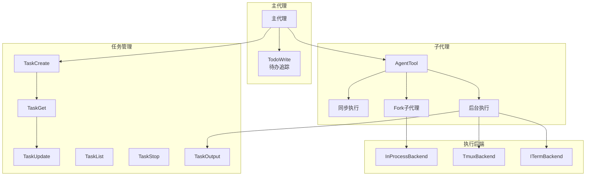
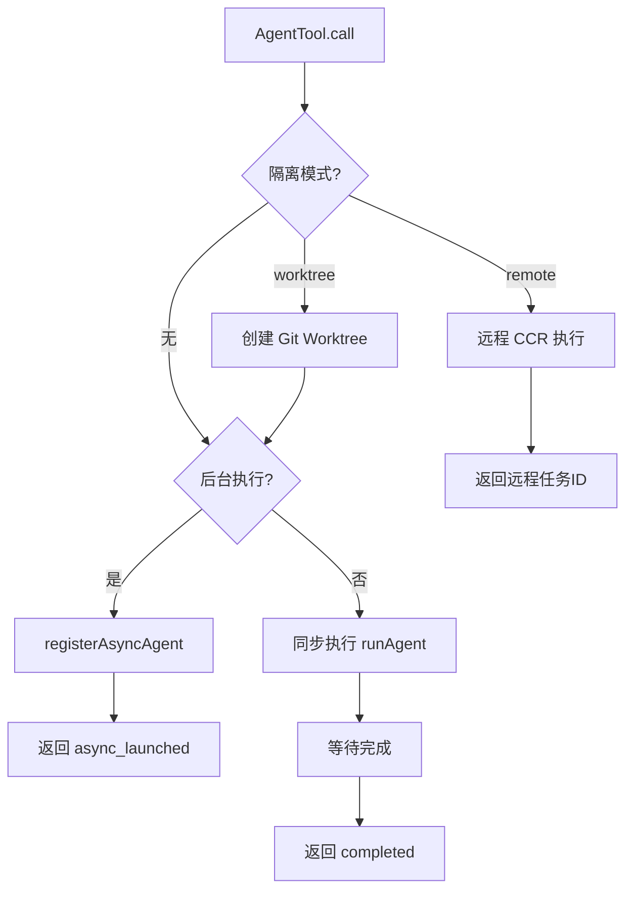
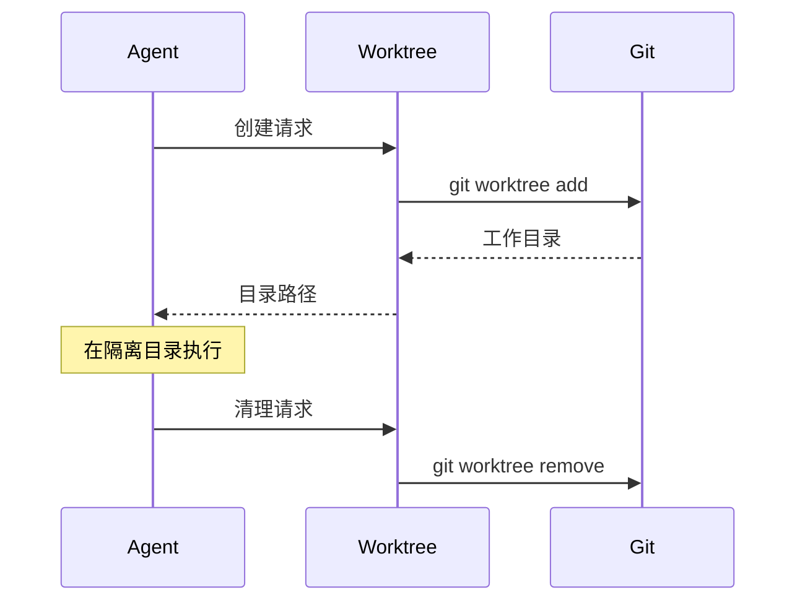
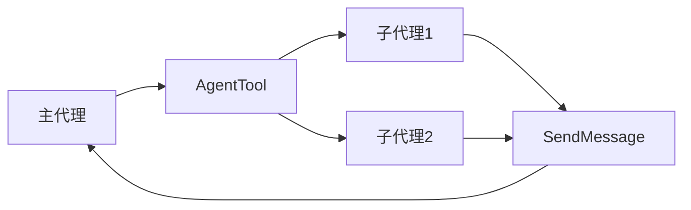

# 代理与任务工具集

> 多代理协作的核心机制：Agent、Task、Todo、TaskStop

---

## 概述

代理与任务工具集实现了 Claude Code 的多代理协作能力。通过 AgentTool 可以启动子代理处理复杂任务，Task 系列工具提供任务管理能力，TodoWrite 工具支持待办事项追踪。这套工具让 Claude Code 能够并行处理多个任务，实现"一人抵团队"的效果。

**解决的问题**：
- 任务分解：将复杂任务拆分为子任务并行执行
- 资源隔离：子代理有独立的 Token 预算和工作目录
- 状态管理：任务状态持久化、进度追踪、结果收集

---

## 设计原理

### 架构总览



### 核心概念

| 概念 | 说明 | 工具 |
|------|------|------|
| 主代理 | 用户直接交互的代理实例 | - |
| 子代理 | 由 AgentTool 启动的独立代理 | AgentTool |
| 任务 | 异步执行的代理任务 | TaskCreate/Get/Update/List |
| 待办 | 用户的任务追踪列表 | TodoWrite |
| 隔离模式 | worktree/remote 隔离执行 | AgentTool.isolation |

---

## 实现原理

### AgentTool - 子代理启动

**核心实现** (`src/tools/AgentTool/AgentTool.tsx`)：

```typescript
// 输入 Schema
z.object({
  description: z.string().describe('3-5 word task description'),
  prompt: z.string().describe('The task for the agent to perform'),
  subagent_type: z.string().optional(),
  model: z.enum(['sonnet', 'opus', 'haiku']).optional(),
  run_in_background: z.boolean().optional(),
  name: z.string().optional(),           // 多代理名称
  team_name: z.string().optional(),      // 团队名
  mode: permissionModeSchema().optional(),
  isolation: z.enum(['worktree', 'remote']).optional(),
  cwd: z.string().optional(),
})

// 输出类型
z.union([
  { status: 'completed', result, prompt },           // 同步完成
  { status: 'async_launched', agentId, outputFile }, // 后台启动
  { status: 'teammate_spawned', agentId },           // 多代理启动
])
```

**执行路径选择** (`AgentTool.tsx:300+`)：



### Fork 子代理机制

**设计动机**：子代理复用父代理的提示词缓存

**实现** (`src/tools/AgentTool/forkSubagent.ts`)：

```typescript
// Fork 启用条件
function isForkSubagentEnabled(): boolean {
  return feature('FORK_SUBAGENT') && !isInForkChild()
}

// Fork 消息构建
function buildForkedMessages(parentMessages, prompt): Message[] {
  // 继承父代理的消息历史
  // 添加子任务提示词
  // 保留缓存断点
}
```

### Task 系列工具 (Todo V2)

**TaskCreate** - 创建任务：

```typescript
z.object({
  title: z.string(),
  description: z.string().optional(),
  priority: z.enum(['low', 'medium', 'high']).optional(),
  assignee: z.string().optional(),  // 多代理分配
})
```

**TaskGet/Update/List** - 任务查询与更新：

```typescript
// TaskGet
z.object({ task_id: z.string() })

// TaskUpdate  
z.object({
  task_id: z.string(),
  status: z.enum(['pending', 'in_progress', 'completed', 'blocked']),
  progress: z.number().optional(),
  notes: z.string().optional(),
})

// TaskList
z.object({
  status: z.enum(['pending', 'in_progress', 'completed', 'blocked']).optional(),
  assignee: z.string().optional(),
})
```

### TodoWrite - 待办追踪

**实现** (`src/tools/TodoWriteTool/TodoWriteTool.ts`)：

```typescript
z.object({
  todos: z.array(z.object({
    content: z.string(),
    activeForm: z.string().optional(),  // 进行中状态描述
    status: z.enum(['pending', 'in_progress', 'completed']),
  }))
})
```

**设计特点**：
- 全量更新模式：每次传入完整待办列表
- UI 实时同步：更新到侧边栏面板
- 不输出到消息流：结果不显示在对话中

### TaskStop - 任务终止

**实现** (`src/tools/TaskStopTool/TaskStopTool.ts`)：

```typescript
z.object({
  task_id: z.string(),  // 或 agent_id
})

// 终止逻辑
1. 查找任务/代理实例
2. 中止 AbortController
3. 清理资源（worktree、远程会话）
4. 更新任务状态为 cancelled
```

---

## 功能展开

### 1. 后台任务执行

**注册流程** (`src/tasks/LocalAgentTask/LocalAgentTask.ts`)：

```typescript
function registerAsyncAgent(options): string {
  const agentId = createAgentId()
  const outputPath = getTaskOutputPath(agentId)
  
  // 启动后台执行
  const task = spawnAgentTask(options)
  
  // 注册到任务列表
  asyncTasks.set(agentId, {
    id: agentId,
    status: 'running',
    outputPath,
    abortController: task.abortController,
  })
  
  return agentId
}
```

**进度追踪**：

```typescript
// 进度写入
updateAsyncAgentProgress(agentId, progress)

// 进度读取
getProgressUpdate(agentId) → { status, progress, partialResult }
```

### 2. Worktree 隔离

**创建流程** (`src/utils/worktree.ts`)：



**变更检测**：

```typescript
function hasWorktreeChanges(worktreePath): boolean {
  // git status --porcelain
  // 返回是否有未提交变更
}
```

### 3. 远程执行

**远程任务** (`src/tasks/RemoteAgentTask/RemoteAgentTask.ts`)：

```typescript
async function registerRemoteAgentTask(options): Promise<string> {
  // 前置条件检查
  const eligibility = await checkRemoteAgentEligibility()
  if (!eligibility.ok) {
    throw new Error(formatPreconditionError(eligibility))
  }
  
  // 启动远程会话
  const sessionUrl = await getRemoteTaskSessionUrl(options)
  return sessionUrl
}
```

### 4. 执行后端

**后端选择** (`src/utils/swarm/backends/`)：

| 后端 | 平台 | 特点 |
|------|------|------|
| InProcessBackend | 通用 | 进程内执行，共享内存 |
| TmuxBackend | macOS/Linux | 独立终端会话 |
| ITermBackend | macOS | iTerm2 窗口 |

**自动检测**：

```typescript
function detectBackend(): BackendType {
  if (process.platform === 'darwin' && hasITerm2()) return 'iterm'
  if (hasTmux()) return 'tmux'
  return 'inprocess'
}
```

---

## 数据结构

### AgentDefinition

```typescript
type AgentDefinition = {
  name: string
  description: string
  model?: 'sonnet' | 'opus' | 'haiku'
  systemPrompt?: string
  tools?: string[]  // 可用工具列表
  mcpRequirements?: string[]  // MCP 服务器依赖
}
```

### TaskState

```typescript
type TaskState = {
  id: string
  status: 'pending' | 'in_progress' | 'completed' | 'blocked' | 'cancelled'
  progress?: number
  outputPath?: string
  result?: unknown
  error?: string
}
```

---

## 组合使用

### 典型工作流

```
1. TodoWrite 记录任务列表
2. TaskCreate 创建子任务
3. AgentTool 启动子代理执行
4. TaskOutput 获取进度
5. TaskStop 终止异常任务
```

### 多代理协作



**消息传递** (`src/tools/SendMessageTool/SendMessageTool.ts`)：

```typescript
z.object({
  to: z.string(),      // 目标代理名
  message: z.string(), // 消息内容
})
```

---

## 小结

### 设计取舍

| 决策 | 收益 | 代价 |
|------|------|------|
| Fork 子代理 | 缓存共享 | 隔离性降低 |
| 后台任务 | 非阻塞执行 | 调试困难 |
| Worktree 隔离 | 安全执行 | 磁盘占用 |

### 局限性

1. **任务依赖**：不支持任务间的显式依赖声明
2. **资源限制**：并发子代理数量受限
3. **状态同步**：跨进程状态一致性挑战

### 演进方向

1. **DAG 任务编排**：声明式任务依赖
2. **资源池管理**：动态分配计算资源
3. **检查点机制**：任务中断恢复

---

*关键代码路径: `src/tools/AgentTool/`, `src/tools/TaskCreateTool/`, `src/tasks/`, `src/utils/swarm/`*
