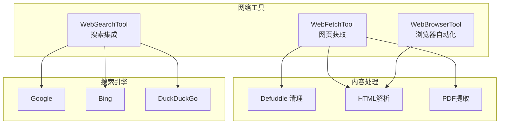
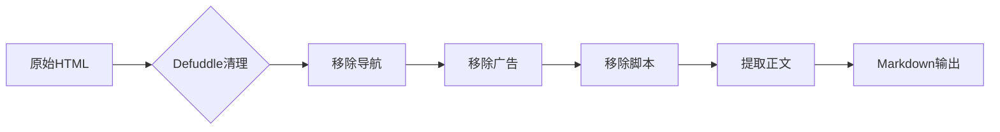

# Web 与网络工具集

> 网络访问能力：WebFetch、WebSearch、WebBrowser

---

## 概述

Web 与网络工具集提供 Claude Code 与互联网交互的能力。WebFetchTool 支持网页内容获取和解析，WebSearchTool 集成搜索引擎查询，WebBrowserTool（实验性）提供浏览器自动化能力。这些工具扩展了 Claude Code 的信息获取边界，从本地代码库延伸到整个互联网。

**解决的问题**：
- 信息获取：搜索最新文档、查找解决方案
- 内容解析：从网页提取结构化信息
- 动态交互：浏览器级别的页面操作

---

## 设计原理

### 工具矩阵



### 核心设计原则

1. **内容优先**：获取网页的语义内容，而非原始 HTML
2. **Token 效率**：自动清理导航、广告等无关内容
3. **隐私保护**：搜索查询不记录敏感信息

---

## 实现原理

### WebFetchTool - 网页获取

**核心实现** (`src/tools/WebFetchTool/WebFetchTool.ts`)：

```typescript
// 输入 Schema
z.strictObject({
  url: z.string().url(),
  format: z.enum(['markdown', 'text', 'html']).optional(),
  timeout: z.number().optional(),
})

// 输出
z.object({
  content: z.string(),
  format: z.string(),
  metadata: z.object({
    title: z.string().optional(),
    description: z.string().optional(),
  }).optional(),
})
```

**内容清理策略**：



**Defuddle 集成**：

```typescript
// 使用 Defuddle CLI 清理网页
// 移除 clutter 和 navigation，节省 Token
import { defuddle } from 'defuddle'

async function fetchCleanContent(url: string): Promise<string> {
  const html = await fetch(url).then(r => r.text())
  const clean = await defuddle(html, { url })
  return clean.markdown
}
```

### WebSearchTool - 搜索集成

**核心实现** (`src/tools/WebSearchTool/WebSearchTool.ts`)：

```typescript
// 输入 Schema
z.strictObject({
  query: z.string().describe('Search query'),
  provider: z.enum(['google', 'bing', 'duckduckgo']).optional(),
  limit: z.number().optional(),
})

// 输出
z.object({
  results: z.array(z.object({
    title: z.string(),
    url: z.string(),
    snippet: z.string(),
  })),
  provider: z.string(),
})
```

**搜索适配器** (`src/tools/WebSearchTool/adapters/`)：

```typescript
// 适配器接口
interface SearchAdapter {
  search(query: string, options: SearchOptions): Promise<SearchResult[]>
}

// Google 适配器
class GoogleAdapter implements SearchAdapter {
  async search(query, options) {
    // 使用 Custom Search API 或 SerpAPI
  }
}

// Bing 适配器
class BingAdapter implements SearchAdapter {
  async search(query, options) {
    // 使用 Bing Search API
  }
}

// DuckDuckGo 适配器（无需 API Key）
class DuckDuckGoAdapter implements SearchAdapter {
  async search(query, options) {
    // 使用 DuckDuckGo HTML 搜索
  }
}
```

### WebBrowserTool - 浏览器自动化（实验性）

**设计** (`src/tools/WebBrowserTool/WebBrowserTool.ts`)：

```typescript
// 输入 Schema
z.strictObject({
  action: z.enum([
    'navigate',
    'click',
    'type',
    'screenshot',
    'extract',
    'wait',
  ]),
  url: z.string().optional(),
  selector: z.string().optional(),
  text: z.string().optional(),
  timeout: z.number().optional(),
})

// 使用 Puppeteer 或 Playwright
// 功能开关: feature('WEB_BROWSER_TOOL')
```

**安全限制**：
- 仅允许访问 HTTP/HTTPS 协议
- 禁止访问本地文件 URL
- 超时保护防止无限等待

---

## 功能展开

### 1. 内容解析

**Markdown 转换**：

```typescript
// HTML → Markdown
function htmlToMarkdown(html: string): string {
  // Turndown 或类似库
  // 保留代码块、链接、图片
}
```

**PDF 支持**：

```typescript
// PDF 网页提取
async function extractPdfFromUrl(url: string): Promise<PdfContent> {
  const buffer = await fetch(url).then(r => r.arrayBuffer())
  return parsePdf(buffer)
}
```

### 2. 搜索结果处理

**结果格式化**：

```typescript
function formatSearchResults(results: SearchResult[]): string {
  return results.map((r, i) => 
    `${i + 1}. ${r.title}\n   ${r.url}\n   ${r.snippet}`
  ).join('\n\n')
}
```

**去重与排序**：

```typescript
function deduplicateResults(results: SearchResult[]): SearchResult[] {
  // 按 URL 去重
  // 按相关性排序
  // 过滤低质量结果
}
```

### 3. SSRF 防护

**安全检查** (`src/utils/hooks/ssrfGuard.ts`)：

```typescript
const BLOCKED_IPS = [
  '127.0.0.1',
  '0.0.0.0',
  '169.254.169.254',  // AWS 元数据
  '10.0.0.0/8',       // 私有网络
  '172.16.0.0/12',
  '192.168.0.0/16',
]

async function validateUrl(url: string): Promise<boolean> {
  const parsed = new URL(url)
  
  // 协议检查
  if (!['http:', 'https:'].includes(parsed.protocol)) {
    return false
  }
  
  // DNS 重绑定防护
  const resolved = await dns.lookup(parsed.hostname)
  if (isBlockedIP(resolved.address)) {
    return false
  }
  
  return true
}
```

---

## 数据结构

### WebFetchResult

```typescript
type WebFetchResult = {
  content: string
  format: 'markdown' | 'text' | 'html'
  metadata?: {
    title?: string
    description?: string
    ogImage?: string
    canonical?: string
  }
  links?: string[]
}
```

### SearchResult

```typescript
type SearchResult = {
  title: string
  url: string
  snippet: string
  position?: number
  date?: string
}
```

---

## 组合使用

### 典型工作流

```
1. WebSearchTool 搜索关键词
2. 从结果中选择相关链接
3. WebFetchTool 获取页面内容
4. 分析内容并执行后续操作
```

### 与其他工具协作

```
WebFetch → 获取文档 → FileWrite 保存
WebSearch → 找到 API 文档 → LSPTool 跳转定义
WebBrowser → 登录页面 → 截图分析 → Bash 执行 CLI
```

---

## 小结

### 设计取舍

| 决策 | 收益 | 代价 |
|------|------|------|
| Defuddle 清理 | Token 节省 | 可能丢失信息 |
| 多搜索适配器 | 灵活性 | 维护成本 |
| 实验性浏览器 | 高级能力 | 稳定性风险 |

### 局限性

1. **动态内容**：SPA 页面可能无法正确解析
2. **认证墙**：需要登录的页面无法访问
3. **搜索配额**：API 调用次数限制

### 演进方向

1. **智能解析**：基于内容类型的自适应解析
2. **缓存机制**：避免重复获取相同页面
3. **代理支持**：通过代理访问受限内容

---

*关键代码路径: `src/tools/WebFetchTool/`, `src/tools/WebSearchTool/`, `src/utils/hooks/ssrfGuard.ts`*
