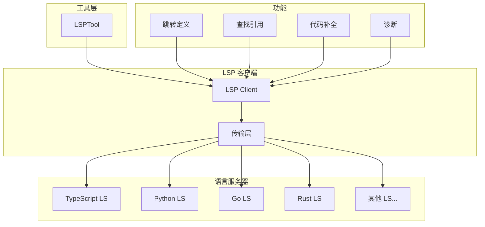
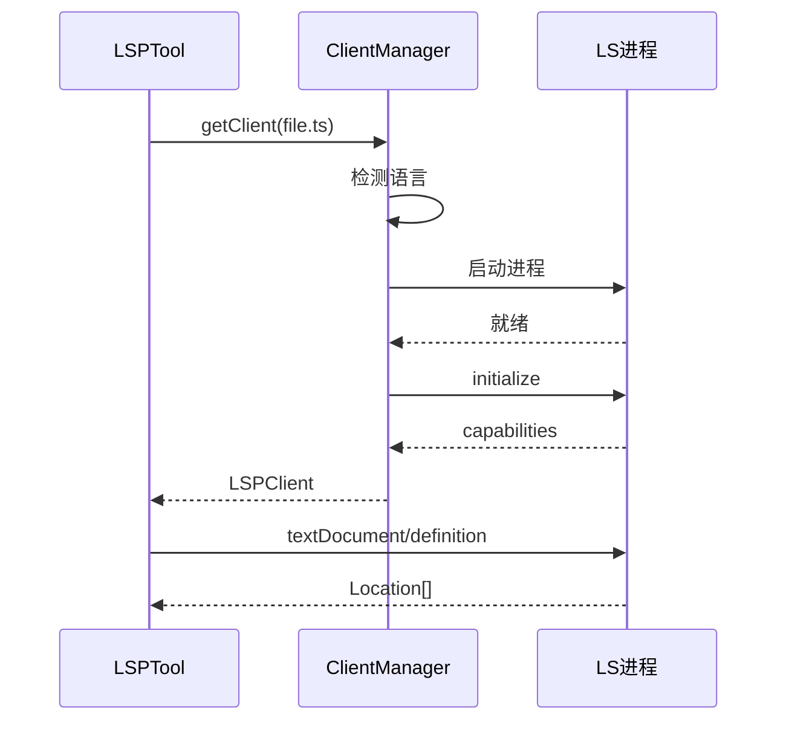

# LSP 与代码智能工具集

> 语言服务器协议集成：代码导航、补全、诊断

---

## 概述

LSP (Language Server Protocol) 工具集为 Claude Code 提供深度的代码理解能力。通过集成语言服务器，支持跳转定义、查找引用、代码补全、诊断报告等功能，让 Claude Code 具备 IDE 级别的代码智能。

**解决的问题**：
- 精确导航：跳转到定义、查找引用
- 实时诊断：获取编译错误、类型错误
- 智能补全：基于语义的代码补全

---

## 设计原理

### 架构总览



### 核心概念

| 概念 | LSP 方法 | 说明 |
|------|----------|------|
| 定义跳转 | textDocument/definition | 跳转到符号定义 |
| 引用查找 | textDocument/references | 查找所有引用位置 |
| 代码补全 | textDocument/completion | 获取补全建议 |
| 诊断 | textDocument/diagnostic | 获取错误和警告 |
| 悬停 | textDocument/hover | 获取类型信息 |
| 签名帮助 | textDocument/signatureHelp | 函数签名 |

---

## 实现原理

### LSPTool - 核心实现

**入口实现** (`src/tools/LSPTool/LSPTool.ts`)：

```typescript
// 输入 Schema
z.strictObject({
  action: z.enum([
    'definition',
    'references', 
    'completion',
    'diagnostics',
    'hover',
    'signatureHelp',
  ]),
  file_path: z.string(),
  line: z.number(),
  character: z.number(),
  query: z.string().optional(),  // 补全过滤
})

// 功能开关
isEnabled() {
  return isEnvTruthy(process.env.ENABLE_LSP_TOOL)
}
```

**语言服务器管理** (`src/services/lsp/`)：

```typescript
class LSPClientManager {
  private clients: Map<string, LSPClient> = new Map()
  
  // 获取或创建客户端
  async getClient(filePath: string): Promise<LSPClient> {
    const langId = this.detectLanguage(filePath)
    if (!this.clients.has(langId)) {
      const client = await this.createClient(langId)
      this.clients.set(langId, client)
    }
    return this.clients.get(langId)!
  }
  
  // 检测语言类型
  detectLanguage(filePath: string): string {
    const ext = path.extname(filePath)
    const langMap = {
      '.ts': 'typescript',
      '.tsx': 'typescriptreact',
      '.js': 'javascript',
      '.py': 'python',
      '.go': 'go',
      '.rs': 'rust',
    }
    return langMap[ext] || 'plaintext'
  }
}
```

### LSP 通信协议

**传输层实现**：

```typescript
// stdio 传输
class StdioTransport {
  private process: ChildProcess
  
  async send(request: Request): Promise<Response> {
    const json = JSON.stringify(request)
    this.process.stdin.write(`Content-Length: ${json.length}\r\n\r\n${json}`)
    return this.readResponse()
  }
}

// socket 传输
class SocketTransport {
  private socket: net.Socket
  
  async send(request: Request): Promise<Response> {
    // 通过 TCP socket 发送
  }
}
```

**消息格式**：

```typescript
// 请求
type Request = {
  jsonrpc: '2.0'
  id: number
  method: string
  params: object
}

// 响应
type Response = {
  jsonrpc: '2.0'
  id: number
  result?: unknown
  error?: { code: number, message: string }
}
```

### 功能实现

**跳转定义**：

```typescript
async function getDefinition(
  client: LSPClient,
  filePath: string,
  line: number,
  character: number,
): Promise<Location[]> {
  const result = await client.sendRequest('textDocument/definition', {
    textDocument: { uri: `file://${filePath}` },
    position: { line, character },
  })
  
  return result ? [result].flat().map(loc => ({
    file: URI.parse(loc.uri).fsPath,
    line: loc.range.start.line,
    character: loc.range.start.character,
  })) : []
}
```

**查找引用**：

```typescript
async function getReferences(
  client: LSPClient,
  filePath: string,
  line: number,
  character: number,
): Promise<Location[]> {
  const result = await client.sendRequest('textDocument/references', {
    textDocument: { uri: `file://${filePath}` },
    position: { line, character },
    context: { includeDeclaration: true },
  })
  
  return result.map(loc => ({
    file: URI.parse(loc.uri).fsPath,
    line: loc.range.start.line,
    snippet: '', // 需要额外读取
  }))
}
```

**诊断获取**：

```typescript
async function getDiagnostics(
  client: LSPClient,
  filePath: string,
): Promise<Diagnostic[]> {
  const result = await client.sendRequest('textDocument/diagnostic', {
    textDocument: { uri: `file://${filePath}` },
  })
  
  return result.items.map(d => ({
    line: d.range.start.line,
    message: d.message,
    severity: d.severity,  // Error, Warning, Information, Hint
    source: d.source,
  }))
}
```

---

## 功能展开

### 1. 语言服务器配置

**自动检测**：

```typescript
const LANGUAGE_SERVERS = {
  typescript: {
    command: 'typescript-language-server',
    args: ['--stdio'],
    module: 'typescript',
  },
  python: {
    command: 'pylsp',
    args: [],
    module: 'python-lsp-server',
  },
  go: {
    command: 'gopls',
    args: ['serve'],
    module: 'gopls',
  },
  rust: {
    command: 'rust-analyzer',
    args: [],
    module: 'rust-analyzer',
  },
}
```

**启动流程**：



### 2. 文件同步

**文档变更通知**：

```typescript
// 文档打开
await client.sendNotification('textDocument/didOpen', {
  textDocument: {
    uri: `file://${filePath}`,
    languageId: langId,
    version: 1,
    text: fileContent,
  }
})

// 文档变更
await client.sendNotification('textDocument/didChange', {
  textDocument: { uri, version: version + 1 },
  contentChanges: [{ text: newContent }],
})
```

### 3. 结果格式化

**定义跳转输出**：

```
Definition: src/utils/parser.ts:42
```

**引用查找输出**：

```
References (3):
1. src/main.ts:15
   import { parse } from './utils/parser'
   
2. src/utils/parser.ts:42
   export function parse(input: string) { ... }
   
3. tests/parser.test.ts:8
   const result = parse('test')
```

**诊断输出**：

```
Diagnostics for src/main.ts:
Error: Line 23 - Cannot find name 'undefined'
Warning: Line 45 - Unused variable 'temp'
```

---

## 数据结构

### Location

```typescript
type Location = {
  file: string
  line: number
  character?: number
  snippet?: string
}
```

### Diagnostic

```typescript
type Diagnostic = {
  line: number
  character?: number
  message: string
  severity: 'Error' | 'Warning' | 'Information' | 'Hint'
  source?: string
  code?: string | number
}
```

### CompletionItem

```typescript
type CompletionItem = {
  label: string
  kind: 'Function' | 'Variable' | 'Class' | 'Method' | ...
  detail?: string
  documentation?: string
  insertText?: string
}
```

---

## 组合使用

### 与文件工具协作

```
LSPTool definition → FileReadTool 读取定义
LSPTool references → GrepTool 搜索文本引用
```

### 与编辑工具协作

```
LSPTool diagnostics → FileEditTool 修复错误
LSPTool completion → FileEditTool 插入代码
```

### 典型工作流

```
1. LSPTool 获取诊断
2. 分析错误信息
3. LSPTool 获取相关定义
4. FileEditTool 应用修复
5. LSPTool 重新诊断验证
```

---

## 小结

### 设计取舍

| 决策 | 收益 | 代价 |
|------|------|------|
| 功能开关 | 可选依赖 | 需要手动启用 |
| 按需启动 | 资源节省 | 首次延迟 |
| stdio 传输 | 简单可靠 | 单进程限制 |

### 局限性

1. **服务器依赖**：需要安装语言服务器
2. **项目配置**：部分语言需要正确配置
3. **并发限制**：同一语言服务器串行处理

### 演进方向

1. **自动安装**：自动检测并安装语言服务器
2. **项目配置检测**：自动识别 tsconfig、pyproject 等
3. **缓存优化**：缓存 LSP 响应减少延迟

---

*关键代码路径: `src/tools/LSPTool/`, `src/services/lsp/`*
