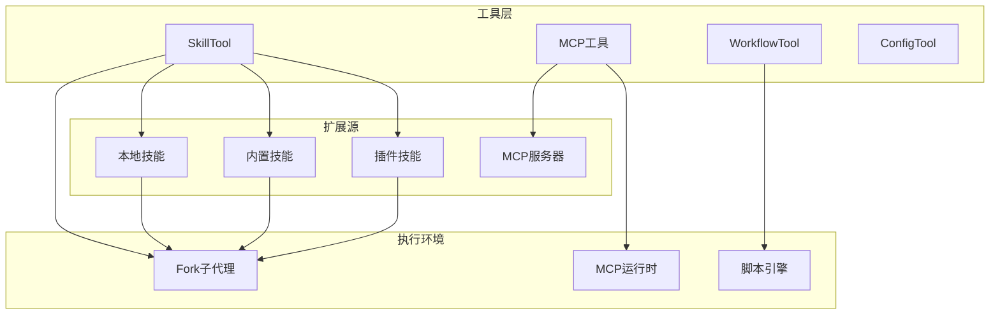
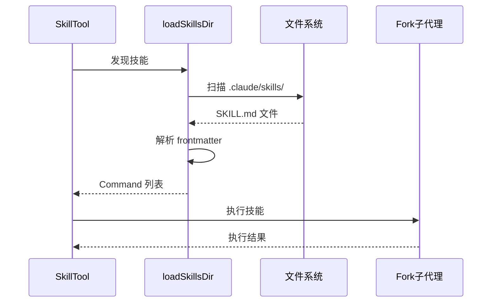
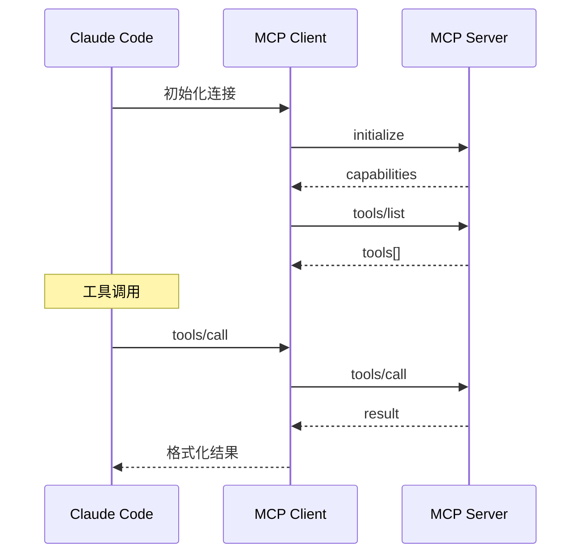

# 扩展与集成工具集

> 动态扩展能力：Skill、MCP、Workflow、Config

---

## 概述

扩展与集成工具集为 Claude Code 提供动态扩展能力。SkillTool 支持技能加载和执行，MCP 工具集成外部工具服务器，WorkflowTool 执行工作流脚本，ConfigTool 管理 Ant-only 配置。这套工具让 Claude Code 具备无限的扩展潜力。

**解决的问题**：
- 技能系统：加载领域特定的提示词模板
- MCP 协议：与外部工具服务器通信
- 工作流：执行预定义的操作序列
- 配置管理：运行时配置修改

---

## 设计原理

### 架构总览



### 核心概念

| 概念 | 说明 | 入口 |
|------|------|------|
| Skill | 领域特定的提示词模板 | `.claude/skills/` |
| MCP Server | 外部工具服务器 | MCP 配置文件 |
| Workflow | 预定义操作序列 | `.claude/workflows/` |
| Plugin | 可安装的扩展包 | Marketplace |

---

## 实现原理

### SkillTool - 技能执行

**核心实现** (`src/tools/SkillTool/SkillTool.ts`)：

```typescript
// 输入 Schema
z.strictObject({
  name: z.string().describe('Skill name'),
  args: z.string().optional().describe('Skill arguments'),
})

// 输出
z.object({
  status: z.enum(['completed', 'error']),
  result: z.string(),
  messages: z.array(z.any()).optional(),
})
```

**技能发现** (`SkillTool.ts:81-94`)：

```typescript
async function getAllCommands(context: ToolUseContext): Promise<Command[]> {
  // MCP 技能（来自 MCP 服务器）
  const mcpSkills = context.getAppState().mcp.commands.filter(
    cmd => cmd.type === 'prompt' && cmd.loadedFrom === 'mcp'
  )
  
  // 本地技能
  const localCommands = await getCommands(getProjectRoot())
  
  return uniqBy([...localCommands, ...mcpSkills], 'name')
}
```

**Fork 执行模式** (`SkillTool.ts:122-200`)：

```typescript
async function executeForkedSkill(
  command: Command & { type: 'prompt' },
  args: string | undefined,
  context: ToolUseContext,
): Promise<ToolResult<Output>> {
  // 在 Fork 子代理中执行技能
  // 独立的 Token 预算
  // 隔离的消息历史
  
  const agentId = createAgentId()
  const messages = await buildForkedMessages(context.messages, command.prompt, args)
  
  return runAgent({
    messages,
    agentId,
    systemPrompt: buildEffectiveSystemPrompt(command),
  })
}
```

**技能加载流程**：



### MCP 工具集成

**MCP 服务器管理** (`src/services/mcp/`)：

```typescript
// ListMcpResourcesTool
z.strictObject({})

// ReadMcpResourceTool
z.strictObject({
  uri: z.string(),
})

// MCP 工具调用流程
1. 获取 MCP 客户端连接
2. 发送 tools/call 请求
3. 解析响应结果
4. 格式化返回
```

**MCP 协议交互**：



### WorkflowTool - 工作流执行

**设计** (`src/tools/WorkflowTool/WorkflowTool.ts`)：

```typescript
z.strictObject({
  name: z.string().describe('Workflow name'),
  input: z.record(z.any()).optional(),
})

// 工作流定义
type Workflow = {
  name: string
  description: string
  steps: WorkflowStep[]
}

type WorkflowStep = {
  tool: string
  input: Record<string, unknown>
  condition?: string
  onError?: 'continue' | 'abort'
}
```

**执行引擎**：

```typescript
async function executeWorkflow(workflow: Workflow, input: unknown): Promise<Result> {
  const context = { input, results: {} }
  
  for (const step of workflow.steps) {
    if (step.condition && !evaluateCondition(step.condition, context)) {
      continue
    }
    
    try {
      const result = await executeToolCall(step.tool, step.input)
      context.results[step.tool] = result
    } catch (error) {
      if (step.onError === 'abort') throw error
      context.results[step.tool] = { error: error.message }
    }
  }
  
  return context.results
}
```

### ConfigTool - 配置管理（Ant-only）

**实现** (`src/tools/ConfigTool/ConfigTool.ts`)：

```typescript
z.strictObject({
  action: z.enum(['get', 'set', 'list']),
  key: z.string().optional(),
  value: z.any().optional(),
})

// 仅 Ant 用户可用
isEnabled() {
  return process.env.USER_TYPE === 'ant'
}
```

---

## 功能展开

### 1. 技能定义格式

**SKILL.md 结构**：

```markdown
---
name: my-skill
description: A custom skill
model: sonnet
tools:
  - Read
  - Edit
  - Bash
---

# System Prompt

You are an expert at...

## Instructions

1. First, read the file...
2. Then, analyze...
```

**Frontmatter 解析** (`src/utils/frontmatterParser.ts`)：

```typescript
function parseFrontmatter(content: string): { data: object, content: string } {
  const match = content.match(/^---\n([\s\S]*?)\n---\n([\s\S]*)$/)
  if (!match) return { data: {}, content }
  
  const data = yaml.load(match[1])
  const body = match[2]
  
  return { data, content: body }
}
```

### 2. MCP 工具映射

**工具名称转换**：

```typescript
// MCP 工具命名: mcp__<server>__<tool>
// 示例: mcp__filesystem__read_file

function mcpToolToTool(mcpTool: MCPTool, serverName: string): Tool {
  return {
    name: `mcp__${serverName}__${mcpTool.name}`,
    isMcp: true,
    mcpInfo: { serverName, toolName: mcpTool.name },
    inputSchema: convertJSONSchemaToZod(mcpTool.inputSchema),
    call: async (input, context) => {
      const client = getMcpClient(serverName)
      return client.callTool(mcpTool.name, input)
    },
  }
}
```

### 3. 插件系统集成

**插件加载** (`src/utils/plugins/pluginLoader.ts`)：

```typescript
async function loadPlugin(pluginPath: string): Promise<Plugin> {
  const manifest = await readManifest(pluginPath)
  
  return {
    name: manifest.name,
    skills: await loadPluginSkills(pluginPath),
    hooks: await loadPluginHooks(pluginPath),
    mcp: await loadPluginMcp(pluginPath),
  }
}
```

**Marketplace 集成** (`src/utils/plugins/marketplaceManager.ts`)：

```typescript
async function installFromMarketplace(identifier: string): Promise<void> {
  // 1. 解析标识符 (marketplace/plugin@version)
  // 2. 下载插件包
  // 3. 验证签名
  // 4. 安装到本地
  // 5. 注册技能/钩子/MCP
}
```

---

## 数据结构

### Command (Skill)

```typescript
type Command = {
  name: string
  type: 'prompt'
  description?: string
  prompt: string
  source: 'local' | 'bundled' | 'plugin' | 'mcp'
  loadedFrom?: string
  pluginInfo?: {
    repository: string
    pluginManifest: { name: string, version: string }
  }
  model?: 'sonnet' | 'opus' | 'haiku'
}
```

### MCPConnection

```typescript
type MCPServerConnection = {
  name: string
  transport: 'stdio' | 'http' | 'websocket'
  status: 'connecting' | 'connected' | 'error'
  tools: MCPTool[]
  resources: MCPResource[]
}
```

### PluginManifest

```typescript
type PluginManifest = {
  name: string
  version: string
  description?: string
  skills?: string[]      // 技能目录
  hooks?: string[]       // 钩子配置
  mcp?: MCPConfig[]      // MCP 服务器配置
}
```

---

## 组合使用

### 技能 + 代理

```
SkillTool 执行技能 → 内部使用 AgentTool → 多层嵌套
```

### MCP + 文件工具

```
MCP filesystem server → 提供远程文件访问
替代本地 FileReadTool
```

### Workflow + 多工具

```
WorkflowTool 编排:
1. WebFetch 获取文档
2. Read 读取本地代码
3. Edit 应用修改
4. Bash 运行测试
```

---

## 小结

### 设计取舍

| 决策 | 收益 | 代价 |
|------|------|------|
| Fork 技能执行 | Token 隔离 | 启动开销 |
| MCP 协议 | 标准化扩展 | 协议开销 |
| 插件系统 | 可安装扩展 | 安全风险 |

### 局限性

1. **技能发现**：需要显式调用，无自动推荐
2. **MCP 延迟**：进程间通信开销
3. **工作流调试**：执行失败难以定位

### 演进方向

1. **技能市场**：在线浏览和安装技能
2. **MCP 服务发现**：自动发现和连接 MCP 服务器
3. **可视化工作流**：拖拽式工作流编辑器

---

*关键代码路径: `src/tools/SkillTool/`, `src/services/mcp/`, `src/tools/WorkflowTool/`, `src/utils/plugins/`*
