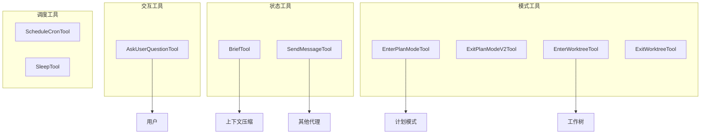
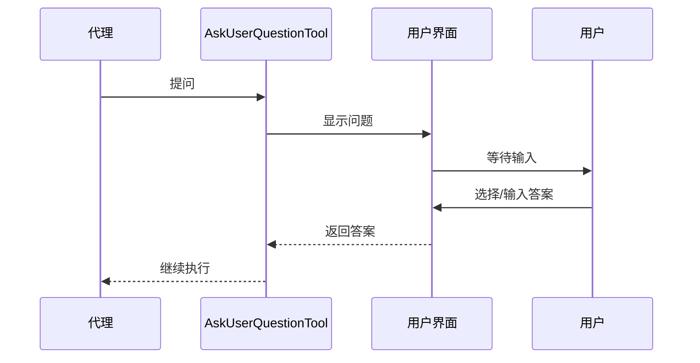
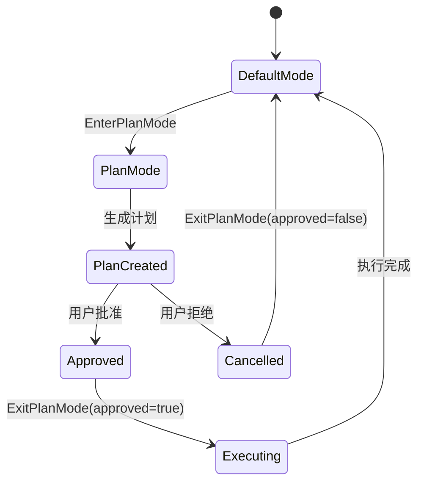

# 辅助工具集

> 交互与状态管理：AskUserQuestion、Brief、SendMessage、PlanMode、Worktree

---

## 概述

辅助工具集提供用户交互、状态管理和工作流控制能力。AskUserQuestionTool 支持交互式提问，BriefTool 提供上下文摘要，SendMessageTool 实现代理间通信，PlanMode 工具支持计划模式切换，Worktree 工具管理 Git 工作树。这些工具完善了 Claude Code 的交互体验和状态管理。

**解决的问题**：
- 用户交互：在复杂场景下向用户提问
- 上下文管理：压缩和摘要对话历史
- 代理通信：多代理间消息传递
- 模式切换：计划模式和执行模式
- 工作树管理：隔离的工作环境

---

## 设计原理

### 工具矩阵



---

## 实现原理

### AskUserQuestionTool - 交互式提问

**核心实现** (`src/tools/AskUserQuestionTool/AskUserQuestionTool.ts`)：

```typescript
// 输入 Schema
z.strictObject({
  question: z.string().describe('The question to ask'),
  options: z.array(z.object({
    label: z.string(),
    value: z.string(),
    description: z.string().optional(),
  })).optional(),
  default: z.string().optional(),
})

// 输出
z.object({
  answer: z.union([z.string(), z.array(z.string())]),
  cancelled: z.boolean().optional(),
})
```

**交互流程**：



**关键特性**：
- 支持选择题（options）和开放题
- 阻塞式：等待用户响应才继续
- 可取消：用户可跳过问题

### BriefTool - 上下文摘要

**核心实现** (`src/tools/BriefTool/BriefTool.ts`)：

```typescript
z.strictObject({
  target: z.enum(['conversation', 'files', 'recent']).optional(),
  maxTokens: z.number().optional(),
})

// 生成摘要
async call(input, context) {
  const messages = context.messages
  
  // 压缩策略
  const summary = await summarizeMessages(messages, {
    maxTokens: input.maxTokens ?? 1000,
    preserveRecent: 5,  // 保留最近5条
  })
  
  return { data: { summary, tokensUsed: summary.length } }
}
```

**压缩策略**：

```typescript
function summarizeMessages(messages: Message[], options: SummarizeOptions): string {
  // 1. 提取关键信息
  const keyPoints = extractKeyPoints(messages)
  
  // 2. 合并相似内容
  const merged = mergeSimilarContent(keyPoints)
  
  // 3. 格式化摘要
  return formatSummary(merged, options.maxTokens)
}
```

### SendMessageTool - 代理间通信

**核心实现** (`src/tools/SendMessageTool/SendMessageTool.ts`)：

```typescript
z.strictObject({
  to: z.string().describe('Target agent name'),
  message: z.string().describe('Message content'),
  type: z.enum(['text', 'task', 'query']).optional(),
})

// 消息传递
async call(input, context) {
  // 获取目标代理
  const targetAgent = getAgentByName(input.to)
  
  if (!targetAgent) {
    throw new Error(`Agent "${input.to}" not found`)
  }
  
  // 投递到邮箱
  deliverToMailbox(targetAgent.agentId, {
    from: context.agentId,
    message: input.message,
    type: input.type,
    timestamp: Date.now(),
  })
  
  return { data: { delivered: true, to: input.to } }
}
```

**邮箱机制** (`src/utils/teammateMailbox.ts`)：

```typescript
type Mailbox = Map<AgentId, Message[]>

function deliverToMailbox(agentId: AgentId, message: Message): void {
  const mailbox = mailboxes.get(agentId) ?? []
  mailbox.push(message)
  mailboxes.set(agentId, mailbox)
}

function checkMailbox(agentId: AgentId): Message[] {
  return mailboxes.get(agentId) ?? []
}
```

### PlanMode 工具

**EnterPlanModeTool** (`src/tools/EnterPlanModeTool/EnterPlanModeTool.ts`)：

```typescript
z.strictObject({
  reason: z.string().optional(),
})

// 进入计划模式
async call(input, context) {
  // 1. 保存当前权限模式
  const prePlanMode = context.getAppState().permissionMode
  
  // 2. 切换到计划模式
  context.setAppState(prev => ({
    ...prev,
    permissionMode: 'plan',
    prePlanMode,  // 保存以便恢复
  }))
  
  return { data: { entered: true } }
}
```

**ExitPlanModeV2Tool**：

```typescript
z.strictObject({
  approved: z.boolean(),
  feedback: z.string().optional(),
})

// 退出计划模式
async call(input, context) {
  const appState = context.getAppState()
  
  // 恢复之前的权限模式
  context.setAppState(prev => ({
    ...prev,
    permissionMode: prev.prePlanMode ?? 'default',
    prePlanMode: undefined,
  }))
  
  if (input.approved) {
    // 执行计划
    return { data: { status: 'executing' } }
  } else {
    // 取消计划
    return { data: { status: 'cancelled' } }
  }
}
```

### Worktree 工具

**EnterWorktreeTool** (`src/tools/EnterWorktreeTool/EnterWorktreeTool.ts`)：

```typescript
z.strictObject({
  branch: z.string().optional(),
  create: z.boolean().optional(),
})

// 创建并进入 worktree
async call(input, context) {
  const worktreePath = await createAgentWorktree({
    branch: input.branch,
    create: input.create ?? false,
  })
  
  // 切换工作目录
  context.setAppState(prev => ({
    ...prev,
    worktreePath,
    originalCwd: prev.cwd,
    cwd: worktreePath,
  }))
  
  return { data: { path: worktreePath } }
}
```

**ExitWorktreeTool**：

```typescript
z.strictObject({})

// 退出并清理 worktree
async call(input, context) {
  const appState = context.getAppState()
  
  // 检查是否有未提交变更
  if (await hasWorktreeChanges(appState.worktreePath)) {
    // 提示用户
    return { data: { needsCleanup: true } }
  }
  
  // 移除 worktree
  await removeAgentWorktree(appState.worktreePath)
  
  // 恢复原始目录
  context.setAppState(prev => ({
    ...prev,
    cwd: prev.originalCwd,
    worktreePath: undefined,
    originalCwd: undefined,
  }))
  
  return { data: { exited: true } }
}
```

### ScheduleCronTool - 定时任务

**实现** (`src/tools/ScheduleCronTool/`)：

```typescript
// CronCreateTool
z.strictObject({
  schedule: z.string().describe('Cron expression'),
  task: z.string().describe('Task to execute'),
})

// CronDeleteTool
z.strictObject({
  id: z.string(),
})

// CronListTool
z.strictObject({})
```

**调度引擎**：

```typescript
class CronScheduler {
  private jobs: Map<string, CronJob> = new Map()
  
  create(expression: string, task: string): string {
    const id = createId()
    const job = new CronJob(expression, () => {
      executeTask(task)
    })
    this.jobs.set(id, job)
    job.start()
    return id
  }
  
  delete(id: string): void {
    const job = this.jobs.get(id)
    job?.stop()
    this.jobs.delete(id)
  }
}
```

---

## 功能展开

### 1. 用户交互模式

**选择题**：

```
AskUserQuestionTool: {
  question: "选择测试框架",
  options: [
    { label: "Jest", value: "jest", description: "Facebook 出品" },
    { label: "Vitest", value: "vitest", description: "Vite 原生支持" },
  ]
}
```

**开放题**：

```
AskUserQuestionTool: {
  question: "请描述你想要的功能"
}
```

### 2. 上下文压缩

**Brief 输出示例**：

```
摘要:
- 用户请求实现用户认证功能
- 讨论了 JWT vs Session 方案
- 决定使用 JWT
- 创建了 auth.ts 文件
- 当前正在实现登录接口
```

### 3. 计划模式流程



---

## 数据结构

### Question

```typescript
type Question = {
  question: string
  options?: Array<{
    label: string
    value: string
    description?: string
  }>
  default?: string
}
```

### Message

```typescript
type AgentMessage = {
  from: AgentId
  to: AgentId
  message: string
  type: 'text' | 'task' | 'query'
  timestamp: number
}
```

### CronJob

```typescript
type CronJobConfig = {
  id: string
  expression: string
  task: string
  lastRun?: number
  nextRun?: number
  status: 'active' | 'paused'
}
```

---

## 组合使用

### 计划 + 执行

```
1. EnterPlanMode 进入计划模式
2. 生成计划等待用户审批
3. ExitPlanMode 执行或取消
```

### 代理协作

```
1. AgentTool 启动子代理
2. SendMessageTool 发送任务
3. 子代理检查邮箱执行任务
```

### Worktree 隔离

```
1. EnterWorktree 创建隔离环境
2. Bash/Edit 在隔离环境执行
3. ExitWorktree 清理环境
```

---

## 小结

### 设计取舍

| 决策 | 收益 | 代价 |
|------|------|------|
| 阻塞式提问 | 确保响应 | 阻塞执行 |
| 计划模式 | 安全确认 | 额外步骤 |
| Worktree 隔离 | 安全执行 | 磁盘占用 |

### 局限性

1. **Brief 质量**：摘要可能丢失细节
2. **消息延迟**：邮箱检查有延迟
3. **Cron 精度**：依赖系统调度

### 演进方向

1. **智能摘要**：基于重要性的选择性压缩
2. **实时通信**：WebSocket 替代邮箱
3. **可视化计划**：图形化计划编辑器

---

*关键代码路径: `src/tools/AskUserQuestionTool/`, `src/tools/BriefTool/`, `src/tools/SendMessageTool/`, `src/tools/EnterPlanModeTool/`, `src/tools/EnterWorktreeTool/`, `src/tools/ScheduleCronTool/`*
