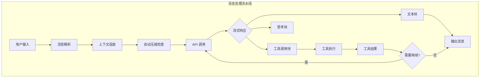
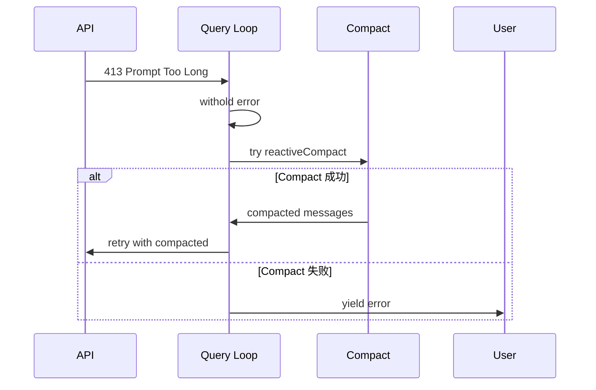
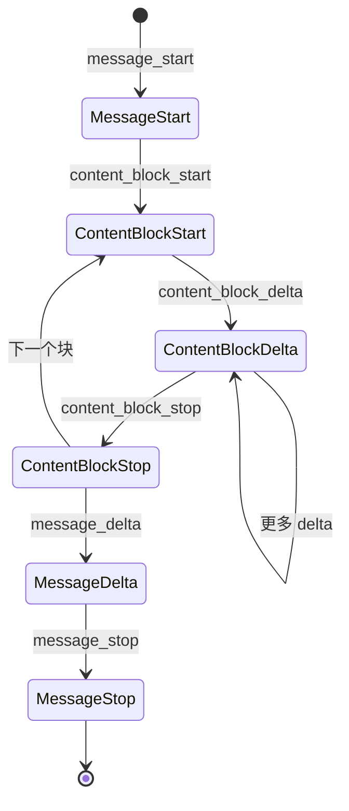
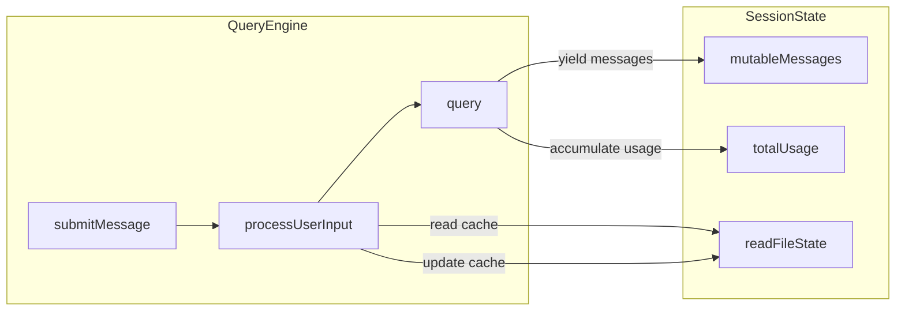

# 09 - 消息处理流程

> **代码入口**: `src/query.ts` · `src/QueryEngine.ts`
> **核心流程**: 用户输入 → 消息解析 → API 调用 → 流式响应 → 工具执行

---

## 概述

消息处理流程是 Claude Code 对话引擎的核心，负责将用户输入转化为 AI 响应。它处理从用户消息提交到响应流式输出的完整生命周期，包括消息解析、上下文管理、API 调用、工具执行和错误恢复。

### 解决的问题

1. **流式响应处理** - 大语言模型响应需要实时流式输出
2. **工具调用编排** - 模型可能发起多个工具调用，需要并行/串行执行
3. **上下文管理** - 对话历史需要正确传递给 API
4. **错误恢复** - 网络错误、token 限制等需要优雅处理

---

## 设计原理

### 架构决策

1. **生成器模式** - 使用 `AsyncGenerator` 实现流式输出，支持增量返回消息
2. **状态机模型** - 查询循环通过状态对象管理跨迭代状态
3. **事件驱动** - 流式事件驱动 UI 更新和工具执行

### 设计动机



---

## 实现原理

### 核心机制

#### 1. 查询循环 (Query Loop)

`src/query.ts:241-1192`

```typescript
async function* queryLoop(
  params: QueryParams,
  consumedCommandUuids: string[],
): AsyncGenerator<StreamEvent | Message, Terminal> {
  let state: State = {
    messages: params.messages,
    toolUseContext: params.toolUseContext,
    maxOutputTokensOverride: params.maxOutputTokensOverride,
    autoCompactTracking: undefined,
    // ...
  }
  
  while (true) {
    // 1. 上下文处理 (压缩、裁剪)
    // 2. API 调用
    // 3. 流式响应处理
    // 4. 工具执行
    // 5. 状态更新和继续判断
  }
}
```

#### 2. 流式工具执行器

`src/query.ts:561-568` · `src/services/tools/StreamingToolExecutor.ts`

```typescript
let streamingToolExecutor = useStreamingToolExecution
  ? new StreamingToolExecutor(
      toolUseContext.options.tools,
      canUseTool,
      toolUseContext,
    )
  : null

// 在流式响应中即时添加工具调用
for (const toolBlock of msgToolUseBlocks) {
  streamingToolExecutor.addTool(toolBlock, assistantMessage)
}

// 获取已完成的工具结果
for (const result of streamingToolExecutor.getCompletedResults()) {
  if (result.message) {
    yield result.message
  }
}
```

#### 3. 消息类型系统

`src/types/message.ts`

```typescript
type Message = 
  | UserMessage           // 用户消息
  | AssistantMessage      // AI 响应
  | AttachmentMessage     // 附件（文件、图片等）
  | SystemMessage         // 系统消息
  | ProgressMessage       // 进度更新
  | TombstoneMessage      // 墓碑（删除标记）
  | ToolUseSummaryMessage // 工具使用摘要
```

### 关键算法

#### 消息规范化

`src/utils/messages.ts:normalizeMessages`

将不同来源的消息转换为 API 兼容格式：

1. **工具结果配对** - 确保每个 `tool_use` 有对应的 `tool_result`
2. **思考块保护** - 保留 thinking 块的完整性
3. **签名验证** - 检查 extended thinking 签名

#### 错误恢复机制

`src/query.ts:1088-1186`



---

## 功能展开

### 2.1 消息解析与组装

#### 用户消息创建

`src/utils/messages.ts:createUserMessage`

```typescript
export function createUserMessage({
  content,
  toolUseResult,
  sourceToolAssistantUUID,
  isMeta,
}: {
  content: string | ContentBlockParam[]
  toolUseResult?: string
  sourceToolAssistantUUID?: UUID
  isMeta?: boolean
}): UserMessage {
  return {
    type: 'user',
    uuid: randomUUID(),
    message: {
      role: 'user',
      content,
    },
    toolUseResult,
    sourceToolAssistantUUID,
    isMeta,
    timestamp: new Date().toISOString(),
  }
}
```

#### API 消息规范化

`src/utils/messages.ts:normalizeMessagesForAPI`

将内部消息格式转换为 Anthropic API 格式：

- 过滤非 API 兼容消息
- 合并连续的 assistant 消息
- 处理工具结果配对

### 2.2 流式响应处理

#### 流事件类型

`src/types/message.ts:StreamEvent`

```typescript
type StreamEvent = {
  type: 'stream_event'
  event: 
    | { type: 'message_start'; message: BetaMessage }
    | { type: 'content_block_start'; index: number; content_block: BetaContentBlock }
    | { type: 'content_block_delta'; index: number; delta: BetaContentBlockDelta }
    | { type: 'content_block_stop'; index: number }
    | { type: 'message_delta'; delta: { stop_reason: string } }
    | { type: 'message_stop' }
}
```

#### 流式处理流程

`src/query.ts:659-867`



### 2.3 工具执行编排

#### 并行工具执行

`src/services/tools/toolOrchestration.ts:runTools`

```typescript
export async function* runTools(
  toolUseBlocks: ToolUseBlock[],
  context: ToolUseContext,
  canUseTool: CanUseToolFn,
): AsyncGenerator<ToolExecutionUpdate> {
  const parallelTools = toolUseBlocks.filter(t => !t.requiresSequential)
  const sequentialTools = toolUseBlocks.filter(t => t.requiresSequential)
  
  // 并行执行可并行工具
  yield* runToolsInParallel(parallelTools, context)
  
  // 串行执行需要顺序的工具
  yield* runToolsSequentially(sequentialTools, context)
}
```

### 2.4 中断处理

#### 用户中断

`src/query.ts:1018-1055`

```typescript
if (toolUseContext.abortController.signal.aborted) {
  // 1. 生成合成工具结果
  for await (const update of streamingToolExecutor.getRemainingResults()) {
    if (update.message) {
      yield update.message
    }
  }
  
  // 2. 发送中断消息
  yield createUserInterruptionMessage({ toolUse: false })
  return { reason: 'aborted_streaming' }
}
```

---

## 数据结构

### 核心实体

#### QueryParams

`src/query.ts:181-199`

```typescript
type QueryParams = {
  messages: Message[]              // 对话历史
  systemPrompt: SystemPrompt       // 系统提示词
  userContext: Record<string, string>    // 用户上下文变量
  systemContext: Record<string, string>  // 系统上下文变量
  canUseTool: CanUseToolFn         // 权限检查函数
  toolUseContext: ToolUseContext   // 工具执行上下文
  fallbackModel?: string           // 备用模型
  querySource: QuerySource         // 查询来源
  maxOutputTokensOverride?: number // 输出 token 限制
  maxTurns?: number                // 最大轮次
  taskBudget?: { total: number }   // 任务预算
}
```

#### State (循环状态)

`src/query.ts:204-217`

```typescript
type State = {
  messages: Message[]
  toolUseContext: ToolUseContext
  autoCompactTracking: AutoCompactTrackingState | undefined
  maxOutputTokensRecoveryCount: number
  hasAttemptedReactiveCompact: boolean
  maxOutputTokensOverride: number | undefined
  pendingToolUseSummary: Promise<ToolUseSummaryMessage | null> | undefined
  stopHookActive: boolean | undefined
  turnCount: number
  transition: Continue | undefined
}
```

#### ToolUseContext

`src/Tool.ts`

```typescript
type ToolUseContext = {
  options: {
    tools: Tools
    mainLoopModel: string
    thinkingConfig: ThinkingConfig
    mcpClients: MCPServerConnection[]
    isNonInteractiveSession: boolean
  }
  messages: Message[]
  abortController: AbortController
  readFileState: FileStateCache
  getAppState: () => AppState
  agentId?: string
  queryTracking?: { chainId: string; depth: number }
}
```

---

## 组合使用

### 与会话状态管理协作



### 与上下文窗口优化协作

`src/query.ts:365-467`

```typescript
// 1. 应用工具结果预算
messagesForQuery = await applyToolResultBudget(messagesForQuery, ...)

// 2. 应用 snip 裁剪
if (feature('HISTORY_SNIP')) {
  const snipResult = snipModule!.snipCompactIfNeeded(messagesForQuery)
  messagesForQuery = snipResult.messages
}

// 3. 应用 microcompact
const microcompactResult = await deps.microcompact(messagesForQuery, ...)

// 4. 应用 context collapse
if (feature('CONTEXT_COLLAPSE')) {
  const collapseResult = await contextCollapse.applyCollapsesIfNeeded(...)
}

// 5. 应用 autocompact
const { compactionResult } = await deps.autocompact(messagesForQuery, ...)
```

---

## 小结

### 设计取舍

1. **生成器 vs 回调** - 选择生成器模式，支持自然的中断和恢复
2. **并行 vs 串行工具** - 支持混合模式，根据工具特性选择
3. **同步 vs 异步压缩** - 在响应前同步检查，避免 API 错误

### 局限性

1. **内存压力** - 长对话可能积累大量消息
2. **复杂状态** - 多层嵌套状态机难以调试
3. **错误传播** - 异步错误可能丢失上下文

### 演进方向

1. **响应式压缩** - 在 API 返回 413 前主动压缩
2. **增量状态快照** - 支持会话中断后精确恢复
3. **工具结果流式** - 大型工具结果流式返回

---

*相关文档*: [[10-session-state]] | [[11-context-window]]
*源码索引*: Community 9 (src/query.ts, src/QueryEngine.ts)
