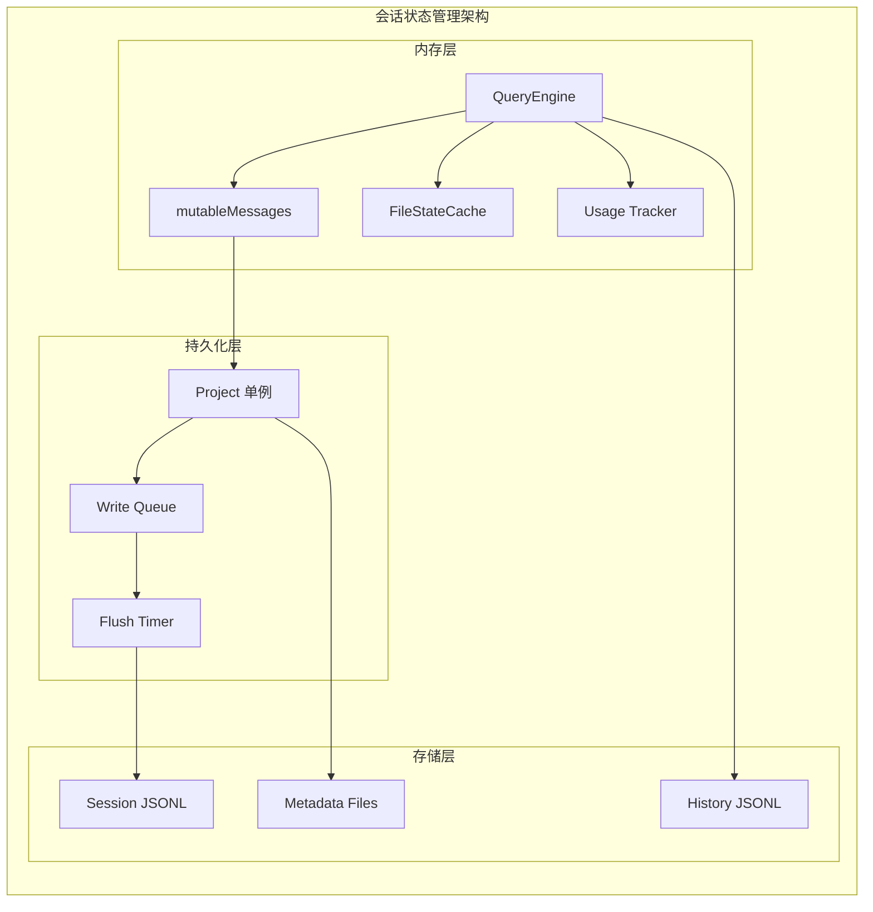
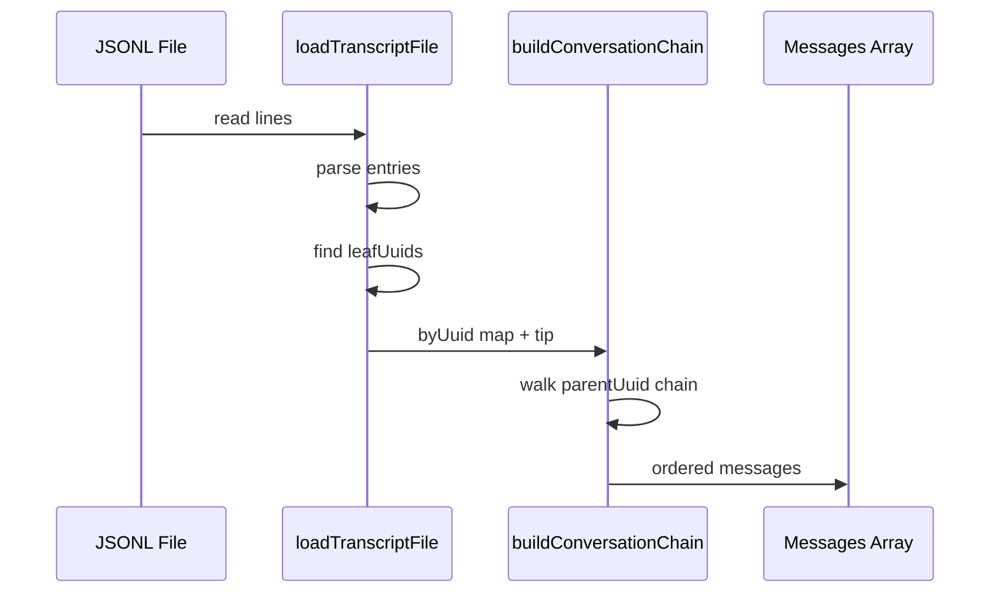
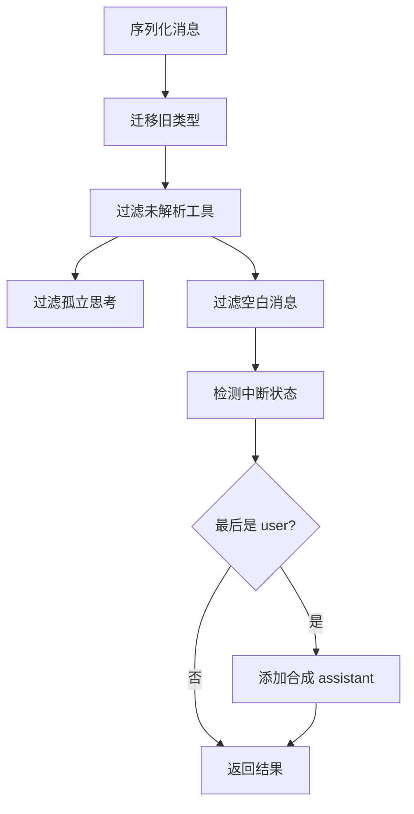
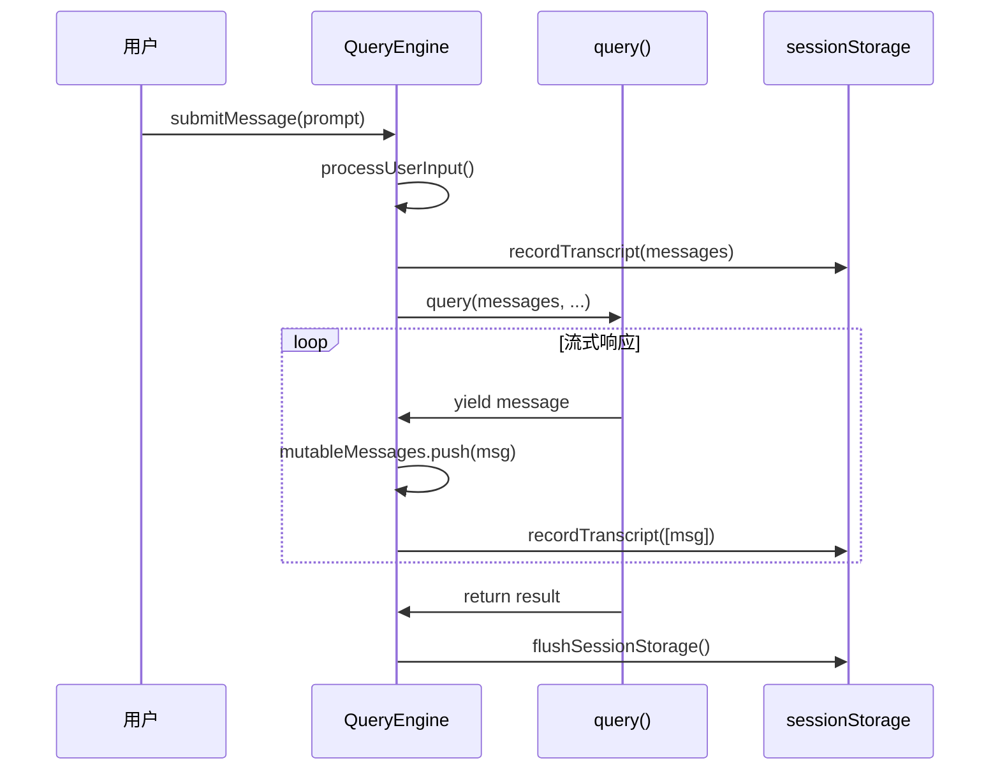

# 10 - 会话状态管理

> **代码入口**: `src/QueryEngine.ts` · `src/utils/conversationRecovery.ts`
> **核心功能**: 会话持久化、恢复、历史记录、状态追踪

---

## 概述

会话状态管理负责对话生命周期的状态维护，包括会话持久化到磁盘、从磁盘恢复、历史记录管理和多轮对话上下文追踪。它是 Claude Code 支持长时间对话和跨进程恢复的基础设施。

### 解决的问题

1. **会话持久化** - 对话需要保存到磁盘，支持程序重启后恢复
2. **历史记录** - 用户可以查看和重用之前的命令
3. **状态追踪** - 跟踪会话的运行状态、权限模式等
4. **中断恢复** - 意外中断后可以继续之前的对话

---

## 设计原理

### 架构决策

1. **JSONL 格式** - 使用 JSON Lines 格式存储会话，支持增量追加
2. **UUID 链式结构** - 每条消息通过 `parentUuid` 形成链表
3. **延迟写入** - 批量写入减少磁盘 I/O

### 架构概览



---

## 实现原理

### 核心机制

#### 1. QueryEngine 会话管理

`src/QueryEngine.ts:186-209`

```typescript
export class QueryEngine {
  private config: QueryEngineConfig
  private mutableMessages: Message[]
  private abortController: AbortController
  private permissionDenials: SDKPermissionDenial[]
  private totalUsage: NonNullableUsage
  private readFileState: FileStateCache
  private discoveredSkillNames = new Set<string>()
  private loadedNestedMemoryPaths = new Set<string>()

  constructor(config: QueryEngineConfig) {
    this.config = config
    this.mutableMessages = config.initialMessages ?? []
    this.abortController = config.abortController ?? createAbortController()
    this.readFileState = config.readFileCache
    this.totalUsage = EMPTY_USAGE
  }
}
```

#### 2. 会话持久化

`src/utils/sessionStorage.ts:993-1084`

```typescript
async insertMessageChain(
  messages: Transcript,
  isSidechain: boolean = false,
  agentId?: string,
  startingParentUuid?: UUID | null,
) {
  return this.trackWrite(async () => {
    let parentUuid: UUID | null = startingParentUuid ?? null
    
    for (const message of messages) {
      const transcriptMessage: TranscriptMessage = {
        parentUuid: isCompactBoundary ? null : effectiveParentUuid,
        logicalParentUuid: isCompactBoundary ? parentUuid : undefined,
        isSidechain,
        agentId,
        ...message,
        sessionId,
        timestamp: new Date().toISOString(),
        version: VERSION,
      }
      await this.appendEntry(transcriptMessage)
      if (isChainParticipant(message)) {
        parentUuid = message.uuid
      }
    }
  })
}
```

#### 3. 会话恢复

`src/utils/conversationRecovery.ts:459-599`

```typescript
export async function loadConversationForResume(
  source: string | LogOption | undefined,
  sourceJsonlFile: string | undefined,
): Promise<{
  messages: Message[]
  turnInterruptionState: TurnInterruptionState
  fileHistorySnapshots?: FileHistorySnapshot[]
  attributionSnapshots?: AttributionSnapshotMessage[]
  contentReplacements?: ContentReplacementRecord[]
  sessionId: UUID | undefined
  // ... 更多元数据
} | null> {
  // 1. 加载日志
  let log = await getLastSessionLog(source)
  
  // 2. 反序列化消息
  const deserialized = deserializeMessagesWithInterruptDetection(messages)
  
  // 3. 处理会话启动钩子
  const hookMessages = await processSessionStartHooks('resume', { sessionId })
  
  // 4. 返回恢复结果
  return {
    messages: [...deserialized.messages, ...hookMessages],
    turnInterruptionState: deserialized.turnInterruptionState,
    // ...
  }
}
```

### 关键算法

#### 消息链重建

`src/utils/sessionStorage.ts:buildConversationChain`



#### 中断检测

`src/utils/conversationRecovery.ts:272-333`

```typescript
function detectTurnInterruption(
  messages: NormalizedMessage[],
): InternalInterruptionState {
  const lastMessage = messages.findLast(
    m => m.type !== 'system' && m.type !== 'progress'
  )
  
  if (lastMessage.type === 'assistant') {
    // assistant 作为最后一条消息，轮次完成
    return { kind: 'none' }
  }
  
  if (lastMessage.type === 'user') {
    if (isToolUseResultMessage(lastMessage)) {
      // tool_result 作为最后一条，可能中断
      return { kind: 'interrupted_turn' }
    }
    // 纯文本用户消息，还未开始响应
    return { kind: 'interrupted_prompt', message: lastMessage }
  }
  
  return { kind: 'none' }
}
```

---

## 功能展开

### 3.1 会话持久化

#### 写入队列机制

`src/utils/sessionStorage.ts:606-686`

```typescript
private enqueueWrite(filePath: string, entry: Entry): Promise<void> {
  return new Promise<void>(resolve => {
    let queue = this.writeQueues.get(filePath)
    if (!queue) {
      queue = []
      this.writeQueues.set(filePath, queue)
    }
    queue.push({ entry, resolve })
    this.scheduleDrain()
  })
}

private async drainWriteQueue(): Promise<void> {
  for (const [filePath, queue] of this.writeQueues) {
    const batch = queue.splice(0)
    let content = ''
    for (const { entry, resolve } of batch) {
      const line = jsonStringify(entry) + '\n'
      content += line
    }
    await this.appendToFile(filePath, content)
  }
}
```

#### 元数据管理

`src/utils/sessionStorage.ts:721-839`

```typescript
reAppendSessionMetadata(skipTitleRefresh = false): void {
  // 重新追加会话元数据到文件末尾
  // 确保元数据在 tail 读取窗口内
  
  if (this.currentSessionTitle) {
    appendEntryToFile(this.sessionFile, {
      type: 'custom-title',
      customTitle: this.currentSessionTitle,
      sessionId,
    })
  }
  if (this.currentSessionTag) {
    appendEntryToFile(this.sessionFile, {
      type: 'tag',
      tag: this.currentSessionTag,
      sessionId,
    })
  }
  // ... 其他元数据
}
```

### 3.2 历史记录管理

#### 命令历史

`src/history.ts:355-434`

```typescript
async function addToPromptHistory(
  command: HistoryEntry | string,
): Promise<void> {
  const storedPastedContents: Record<number, StoredPastedContent> = {}
  
  for (const [id, content] of Object.entries(entry.pastedContents)) {
    if (content.content.length <= MAX_PASTED_CONTENT_LENGTH) {
      // 小内容内联存储
      storedPastedContents[Number(id)] = {
        id: content.id,
        type: content.type,
        content: content.content,
      }
    } else {
      // 大内容哈希引用
      const hash = hashPastedText(content.content)
      storedPastedContents[Number(id)] = {
        id: content.id,
        type: content.type,
        contentHash: hash,
      }
      void storePastedText(hash, content.content)
    }
  }
  
  pendingEntries.push(logEntry)
  void flushPromptHistory(0)
}
```

#### 历史检索

`src/history.ts:145-217`

```typescript
export async function* getHistory(): AsyncGenerator<HistoryEntry> {
  const currentProject = getProjectRoot()
  const currentSession = getSessionId()
  const otherSessionEntries: LogEntry[] = []
  
  for await (const entry of makeLogEntryReader()) {
    if (entry.project !== currentProject) continue
    
    // 当前会话优先
    if (entry.sessionId === currentSession) {
      yield await logEntryToHistoryEntry(entry)
    } else {
      otherSessionEntries.push(entry)
    }
  }
  
  // 然后是其他会话
  for (const entry of otherSessionEntries) {
    yield await logEntryToHistoryEntry(entry)
  }
}
```

### 3.3 状态追踪

#### 会话状态

`src/utils/sessionState.ts`

```typescript
export type SessionState = 'idle' | 'running' | 'requires_action'

export type RequiresActionDetails = {
  tool_name: string
  action_description: string
  tool_use_id: string
  request_id: string
  input?: Record<string, unknown>
}

export function notifySessionStateChanged(
  state: SessionState,
  details?: RequiresActionDetails,
): void {
  currentState = state
  stateListener?.(state, details)
  
  // 同步到外部元数据
  if (state === 'requires_action' && details) {
    metadataListener?.({ pending_action: details })
  }
}
```

#### 文件状态缓存

`src/utils/fileStateCache.ts`

```typescript
export class FileStateCache {
  private cache: LRUCache<string, FileState>

  constructor(maxEntries: number, maxSizeBytes: number) {
    this.cache = new LRUCache<string, FileState>({
      max: maxEntries,
      maxSize: maxSizeBytes,
      sizeCalculation: value => Math.max(1, Buffer.byteLength(value.content)),
    })
  }

  get(key: string): FileState | undefined {
    return this.cache.get(normalize(key))
  }

  set(key: string, value: FileState): this {
    this.cache.set(normalize(key), value)
    return this
  }
}

export type FileState = {
  content: string
  timestamp: number
  offset: number | undefined
  limit: number | undefined
  isPartialView?: boolean
}
```

### 3.4 中断恢复

#### 反序列化流程

`src/utils/conversationRecovery.ts:154-252`



#### 技能状态恢复

`src/utils/conversationRecovery.ts:384-406`

```typescript
export function restoreSkillStateFromMessages(messages: Message[]): void {
  for (const message of messages) {
    if (message.type !== 'attachment') continue
    
    if (message.attachment.type === 'invoked_skills') {
      const skills = message.attachment.skills
      for (const skill of skills) {
        if (skill.name && skill.path && skill.content) {
          addInvokedSkill(skill.name, skill.path, skill.content, null)
        }
      }
    }
    
    // 避免重复发送技能列表提醒
    if (message.attachment.type === 'skill_listing') {
      suppressNextSkillListing()
    }
  }
}
```

---

## 数据结构

### 核心实体

#### LogOption

`src/types/logs.ts`

```typescript
type LogOption = {
  messages: Message[]
  sessionId?: UUID
  customTitle?: string
  tag?: string
  agentName?: string
  agentColor?: string
  agentSetting?: string
  mode?: 'coordinator' | 'normal'
  worktreeSession?: PersistedWorktreeSession
  prNumber?: number
  prUrl?: string
  prRepository?: string
  fullPath?: string
  fileHistorySnapshots?: FileHistorySnapshot[]
  attributionSnapshots?: AttributionSnapshotMessage[]
  contentReplacements?: ContentReplacementRecord[]
}
```

#### Entry (JSONL 条目)

`src/types/logs.ts`

```typescript
type Entry = 
  | TranscriptMessage       // user/assistant/attachment/system
  | SummaryEntry           // 压缩摘要
  | CustomTitleEntry       // 自定义标题
  | TagEntry               // 标签
  | AgentNameEntry         // 代理名称
  | AgentColorEntry        // 代理颜色
  | ModeEntry              // 模式
  | WorktreeStateEntry     // worktree 状态
  | PrLinkEntry            // PR 链接
  | FileHistorySnapshotMessage
  | AttributionSnapshotMessage
  | ContentReplacementEntry
  | QueueOperationMessage
  // ...
```

#### QueryEngineConfig

`src/QueryEngine.ts:132-175`

```typescript
type QueryEngineConfig = {
  cwd: string
  tools: Tools
  commands: Command[]
  mcpClients: MCPServerConnection[]
  agents: AgentDefinition[]
  canUseTool: CanUseToolFn
  getAppState: () => AppState
  setAppState: (f: (prev: AppState) => AppState) => void
  initialMessages?: Message[]
  readFileCache: FileStateCache
  customSystemPrompt?: string
  appendSystemPrompt?: string
  userSpecifiedModel?: string
  fallbackModel?: string
  thinkingConfig?: ThinkingConfig
  maxTurns?: number
  maxBudgetUsd?: number
  taskBudget?: { total: number }
  jsonSchema?: Record<string, unknown>
  verbose?: boolean
  replayUserMessages?: boolean
  handleElicitation?: ToolUseContext['handleElicitation']
  includePartialMessages?: boolean
  setSDKStatus?: (status: SDKStatus) => void
  abortController?: AbortController
  orphanedPermission?: OrphanedPermission
}
```

---

## 组合使用

### 与消息处理协作



### 与上下文窗口协作

```typescript
// 在 QueryEngine 中
const readFileState = config.readFileCache

// 文件读取后更新缓存
readFileState.set(filePath, {
  content: fileContent,
  timestamp: Date.now(),
  offset: readOffset,
  limit: readLimit,
})

// 压缩后保留缓存
const merged = mergeFileStateCaches(
  preCompactCache,
  postCompactCache
)
```

---

## 小结

### 设计取舍

1. **JSONL vs SQLite** - JSONL 简单易读，但不支持高效查询
2. **内存缓存 vs 磁盘优先** - 内存缓存提升性能，但需要同步机制
3. **追加写入 vs 就地更新** - 追加写入安全，但文件会增长

### 局限性

1. **大文件问题** - 长会话 JSONL 可达 GB 级别
2. **并发写入** - 多进程写入需要锁机制
3. **恢复延迟** - 完整恢复需要读取整个链

### 演进方向

1. **增量快照** - 定期创建快照，加速恢复
2. **压缩存储** - 自动压缩旧消息
3. **分布式存储** - 支持远程会话存储

---

*相关文档*: [[09-message-processing]] | [[11-context-window]]
*源码索引*: Community 9 (src/QueryEngine.ts), Community 0 (src/utils/sessionStorage.ts)
