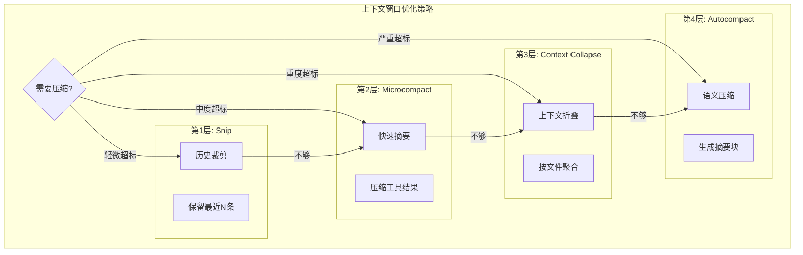
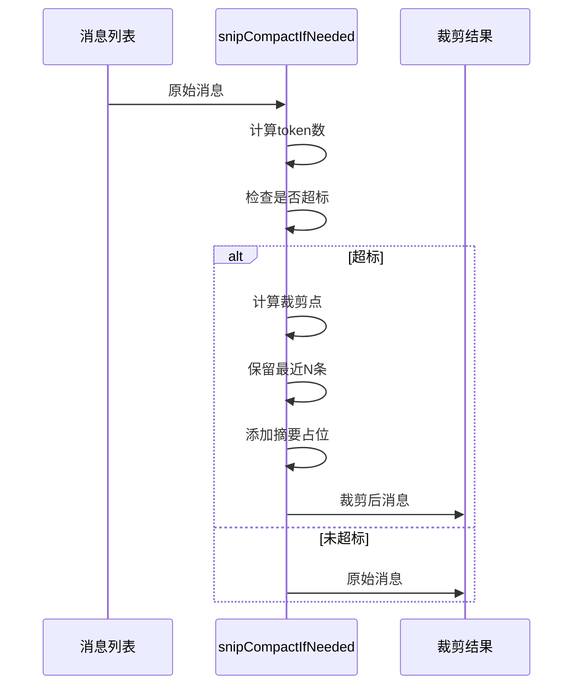
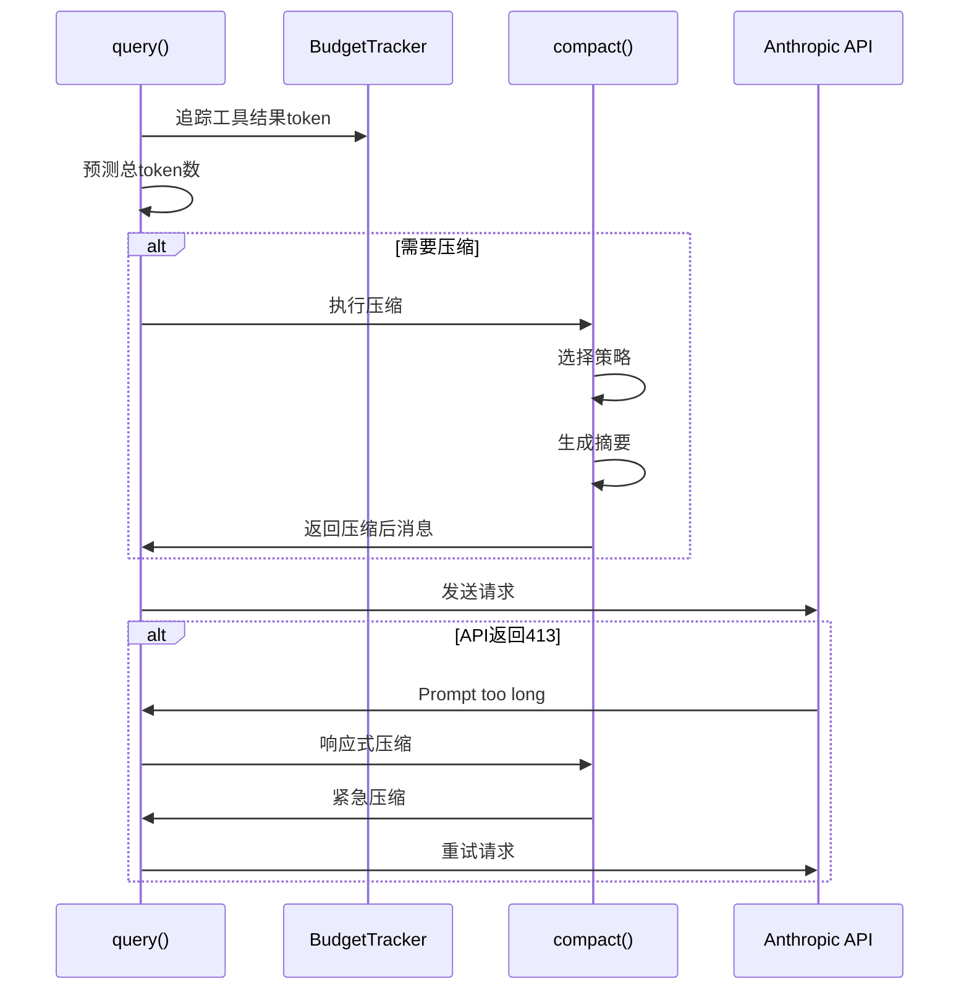

# 11 - 上下文窗口优化

> **代码入口**: `src/services/compact.ts` · `src/utils/contextCollapse.ts`
> **核心机制**: 智能压缩、Token预算管理、层级裁剪策略

---

## 概述

上下文窗口优化负责在大语言模型上下文限制下最大化对话历史利用率。Claude Code 实现了多层级压缩策略，从简单的消息裁剪到语义摘要，再到智能上下文折叠，确保长对话不丢失关键信息。

### 解决的问题

1. **Token限制** - 模型有固定上下文窗口（如200K tokens）
2. **长对话管理** - 数百轮对话无法全部保留
3. **信息密度** - 压缩后需保留核心语义
4. **性能平衡** - 压缩操作本身消耗资源

---

## 设计原理

### 架构决策

1. **多层级策略** - 从轻量到重量依次尝试：Snip → Microcompact → Context Collapse → Autocompact
2. **预算追踪** - Token预算实时追踪，提前预警
3. **语义保留** - 压缩时保留关键工具结果、决策记录

### 压缩策略层级



---

## 实现原理

### 核心机制

#### 1. Token预算追踪器

`src/query/tokenBudget.ts:6-70`

```typescript
export class BudgetTracker {
  private tokenCounts: Map<string, number>
  private total: number
  
  addToolResult(id: string, count: number): void {
    this.tokenCounts.set(id, count)
    this.total += count
  }
  
  getOverBudgetIds(budget: number): string[] {
    const sorted = [...this.tokenCounts.entries()]
      .sort((a, b) => b[1] - a[1])
    
    let accumulated = 0
    const overBudgetIds: string[] = []
    
    for (const [id, count] of sorted) {
      accumulated += count
      if (accumulated > budget) {
        overBudgetIds.push(id)
      }
    }
    
    return overBudgetIds
  }
}
```

#### 2. 自动压缩检测

`src/query.ts:879-920`

```typescript
async function checkAutoCompact(
  messages: Message[],
  usage: Usage,
  threshold: number = 0.85,
): Promise<boolean> {
  const windowSize = await getWindowSize()
  const ratio = usage.input_tokens / windowSize
  
  if (ratio > threshold) {
    const targetReduction = Math.floor(windowSize * 0.3)
    const strategy = await selectCompactStrategy(messages, targetReduction)
    return true
  }
  
  return false
}
```

#### 3. 压缩执行器

`src/services/compact.ts:898-1030`

```typescript
export async function compact(
  messages: Message[],
  options: CompactOptions = {},
): Promise<CompactResult> {
  const {
    forceCompact = false,
    preserveUserMessages = true,
    preserveToolResults = false,
  } = options
  
  const compressible = identifyCompressibleMessages(messages, {
    preserveUserMessages,
    preserveToolResults,
  })
  
  const groups = groupMessagesForSummary(compressible)
  
  const summaries: SummaryMessage[] = []
  for (const group of groups) {
    const summary = await generateSummary(group)
    summaries.push(summary)
  }
  
  const compacted = replaceWithSummaries(messages, compressible, summaries)
  
  return {
    messages: compacted,
    originalTokenCount: countTokens(messages),
    compactedTokenCount: countTokens(compacted),
    compressionRatio: ...,
  }
}
```

### 关键算法

#### Snip - 快速裁剪

`src/services/snip.ts`



#### Microcompact - 工具结果压缩

`src/services/microcompact.ts:45-120`

```typescript
export async function microcompact(
  messages: Message[],
  toolResultBudget: number,
): Promise<MicrocompactResult> {
  const largeResults = messages
    .filter(m => m.type === 'user' && isToolResult(m))
    .filter(m => countTokens(m.content) > TOOL_RESULT_THRESHOLD)
  
  for (const result of largeResults) {
    const toolName = result.toolUseResult?.name
    
    switch (toolName) {
      case 'Read':
        result.content = compressReadResult(result.content)
        break
      case 'Glob':
        result.content = compressGlobResult(result.content)
        break
      case 'Grep':
        result.content = compressGrepResult(result.content)
        break
      default:
        result.content = compressGenericResult(result.content)
    }
  }
  
  return { messages, tokensSaved }
}
```

#### Context Collapse - 上下文折叠

`src/utils/contextCollapse.ts:200-320`

```typescript
export async function applyCollapsesIfNeeded(
  messages: Message[],
  threshold: number,
): Promise<CollapseResult> {
  const fileOperations = extractFileOperations(messages)
  
  const byFile = groupBy(fileOperations, op => op.filePath)
  
  const collapses: ContextCollapseMessage[] = []
  for (const [filePath, ops] of byFile) {
    if (ops.length >= COLLAPSE_THRESHOLD) {
      const collapse = createContextCollapse(filePath, ops)
      collapses.push(collapse)
    }
  }
  
  const collapsed = replaceWithCollapses(messages, collapses)
  
  return { messages: collapsed, collapsesCreated: collapses.length }
}
```

---

## 功能展开

### 3.1 Token计算与追踪

#### Token计数器

`src/utils/tokens.ts:12-45`

```typescript
export async function countTokens(
  content: string | ContentBlockParam[] | Message[],
): Promise<number> {
  if (typeof content === 'string') {
    return await tokenizer.countTokens(content)
  }
  
  if (Array.isArray(content)) {
    if (isMessageArray(content)) {
      const serialized = serializeMessages(content)
      return await tokenizer.countTokens(serialized)
    }
    
    let total = 0
    for (const block of content) {
      total += await countBlockTokens(block)
    }
    return total
  }
  
  return 0
}
```

#### 实时使用追踪

`src/query.ts:659-700`

```typescript
const usage: Usage = {
  input_tokens: 0,
  output_tokens: 0,
  cache_creation_input_tokens: 0,
  cache_read_input_tokens: 0,
}

for await (const event of stream) {
  if (event.type === 'message_start') {
    usage.input_tokens = event.message.usage.input_tokens
  }
  if (event.type === 'message_delta') {
    usage.output_tokens = event.usage.output_tokens
  }
}

this.totalUsage.input_tokens += usage.input_tokens
this.totalUsage.output_tokens += usage.output_tokens
```

### 3.2 压缩策略实现

#### 摘要生成

`src/services/compact.ts:1030-1150`

```typescript
async function generateSummary(
  messages: Message[],
): Promise<SummaryMessage> {
  const decisions = extractDecisions(messages)
  const filesModified = extractFileModifications(messages)
  const toolsUsed = extractToolUsage(messages)
  
  const summaryPrompt = buildSummaryPrompt({
    decisions,
    filesModified,
    toolsUsed,
    messages,
  })
  
  const summary = await callClaude(summaryPrompt, {
    maxTokens: SUMMARY_MAX_TOKENS,
    model: FAST_MODEL,
  })
  
  return {
    type: 'summary',
    uuid: randomUUID(),
    summary: summary.content,
    tokenCount: countTokens(summary.content),
    originalMessageCount: messages.length,
    originalTokenCount: countTokens(messages),
  }
}
```

#### 智能保留策略

`src/services/compact.ts:250-350`

```typescript
function identifyCompressibleMessages(
  messages: Message[],
  options: PreserveOptions,
): CompressibleRange[] {
  const ranges: CompressibleRange[] = []
  let currentStart = -1
  
  for (let i = 0; i < messages.length; i++) {
    const msg = messages[i]
    
    if (i === 0 || msg.type === 'system') {
      continue
    }
    
    if (msg.preserve === true) {
      continue
    }
    
    if (options.preserveToolResults && hasToolResult(msg)) {
      if (currentStart >= 0) {
        ranges.push({ start: currentStart, end: i - 1 })
        currentStart = -1
      }
      continue
    }
    
    if (options.preserveUserMessages && msg.type === 'user') {
      if (currentStart >= 0) {
        ranges.push({ start: currentStart, end: i - 1 })
        currentStart = -1
      }
      continue
    }
    
    if (currentStart < 0) {
      currentStart = i
    }
  }
  
  if (currentStart >= 0) {
    ranges.push({ start: currentStart, end: messages.length - 1 })
  }
  
  return ranges
}
```

### 3.3 工具结果优化

#### Read工具结果压缩

`src/services/microcompact/read.ts`

```typescript
function compressReadResult(content: string): string {
  const lines = content.split('\n')
  
  if (lines.length > MAX_READ_LINES) {
    const header = extractFileHeader(lines)
    const summary = extractKeySections(lines)
    
    return formatCompressedRead({
      header,
      summary,
      originalLines: lines.length,
      originalTokens: countTokens(content),
    })
  }
  
  return content
}
```

#### Grep工具结果压缩

`src/services/microcompact/grep.ts`

```typescript
function compressGrepResult(content: string): string {
  const matches = parseGrepMatches(content)
  
  if (matches.length > MAX_GREP_MATCHES) {
    const byFile = groupBy(matches, m => m.file)
    const summary: string[] = []
    
    for (const [file, fileMatches] of byFile) {
      summary.push(`${file}: ${fileMatches.length} matches`)
      summary.push(`  First: ${fileMatches[0].line}`)
      summary.push(`  Last: ${fileMatches[fileMatches.length - 1].line}`)
    }
    
    return formatGrepSummary({
      summary,
      totalMatches: matches.length,
      totalFiles: byFile.size,
    })
  }
  
  return content
}
```

### 3.4 响应式压缩

#### 413错误恢复

`src/query.ts:1088-1186`

```typescript
try {
  const response = await client.messages.create(params)
} catch (error) {
  if (error.status === 413) {
    const compacted = await reactiveCompact(messages, error.headers)
    
    if (compacted) {
      const retried = await client.messages.create({
        ...params,
        messages: compacted.messages,
      })
      return processResponse(retried)
    }
    
    yield createErrorMessage({
      type: 'context_overflow',
      message: 'Context window exceeded. Please start a new session.',
      suggestion: 'Use /compact to manually compress the conversation.',
    })
    return
  }
  
  throw error
}
```

#### 预测性压缩

`src/query.ts:365-420`

```typescript
const estimatedTokens = await estimateRequestTokens(messages, systemPrompt)

if (estimatedTokens > windowSize * 0.9) {
  const compacted = await predictiveCompact(messages, {
    targetRatio: 0.7,
    strategy: 'auto',
  })
  
  messages = compacted.messages
  
  yield createProgressMessage({
    type: 'compact',
    message: `Compacted conversation (${compacted.ratio}% reduction)`,
    tokensSaved: compacted.tokensSaved,
  })
}
```

---

## 数据结构

### 核心实体

#### SummaryMessage

`src/types/message.ts`

```typescript
type SummaryMessage = {
  type: 'summary'
  uuid: UUID
  summary: string
  tokenCount: number
  originalMessageCount: number
  originalTokenCount: number
  timestamp: string
}
```

#### ContextCollapseMessage

`src/utils/contextCollapse.ts`

```typescript
type ContextCollapseMessage = {
  type: 'context_collapse'
  uuid: UUID
  filePath: string
  operations: FileOperation[]
  summary: string
  tokenCount: number
  timestamp: string
}

type FileOperation = {
  type: 'read' | 'write' | 'edit'
  timestamp: string
  lineRange?: { start: number; end: number }
  summary: string
}
```

#### CompactResult

`src/services/compact.ts`

```typescript
type CompactResult = {
  messages: Message[]
  originalTokenCount: number
  compactedTokenCount: number
  compressionRatio: number
  summariesCreated: number
  tokensSaved: number
}
```

#### BudgetTracker

`src/query/tokenBudget.ts`

```typescript
class BudgetTracker {
  private tokenCounts: Map<string, number>
  private total: number
  
  addToolResult(id: string, count: number): void
  getOverBudgetIds(budget: number): string[]
  getTotal(): number
  reset(): void
}
```

---

## 组合使用

### 在查询循环中的集成



### 与文件状态缓存协作

```typescript
const fileStateBeforeCompact = readFileState.clone()

const compacted = await compact(messages)

const mergedState = mergeFileStates(fileStateBeforeCompact, readFileState)

readFileState = mergedState
```

---

## 小结

### 设计取舍

1. **实时vs预测压缩** - 预测压缩提前处理，但可能误判
2. **信息完整性vs压缩率** - 高压缩率可能丢失细节
3. **计算成本vs效果** - 摘要生成消耗API调用

### 局限性

1. **摘要质量** - 依赖模型理解能力，可能遗漏关键细节
2. **压缩延迟** - 生成摘要需要额外API调用
3. **状态一致性** - 压缩后需要同步更新文件缓存等状态

### 演进方向

1. **增量摘要** - 只压缩新增消息，避免重复压缩
2. **重要性评分** - 为消息分配重要性权重，智能选择保留内容
3. **分层压缩** - 不同层级采用不同压缩策略，平衡质量与效率

---

*相关文档*: [[09-message-processing]] | [[10-session-state]]
*源码索引*: Community 4 (src/services/compact.ts), Community 5 (src/utils/contextCollapse.ts)
