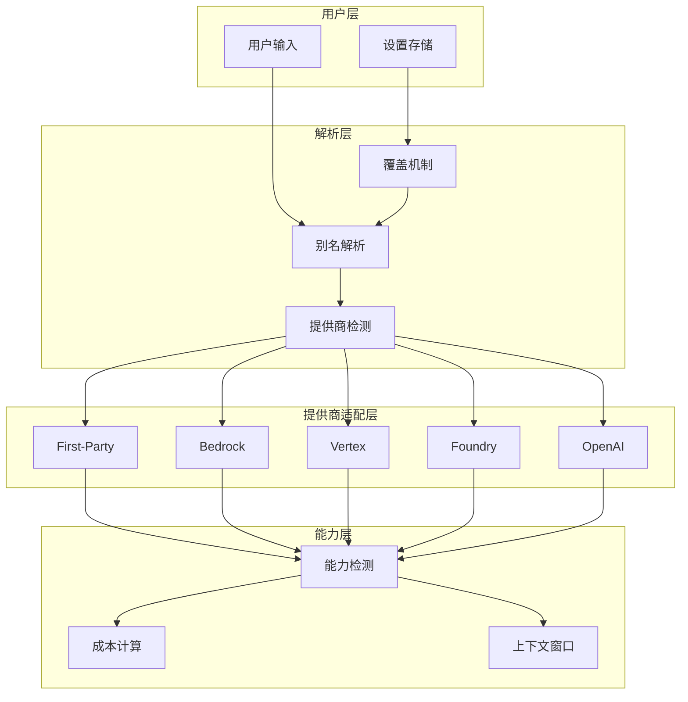
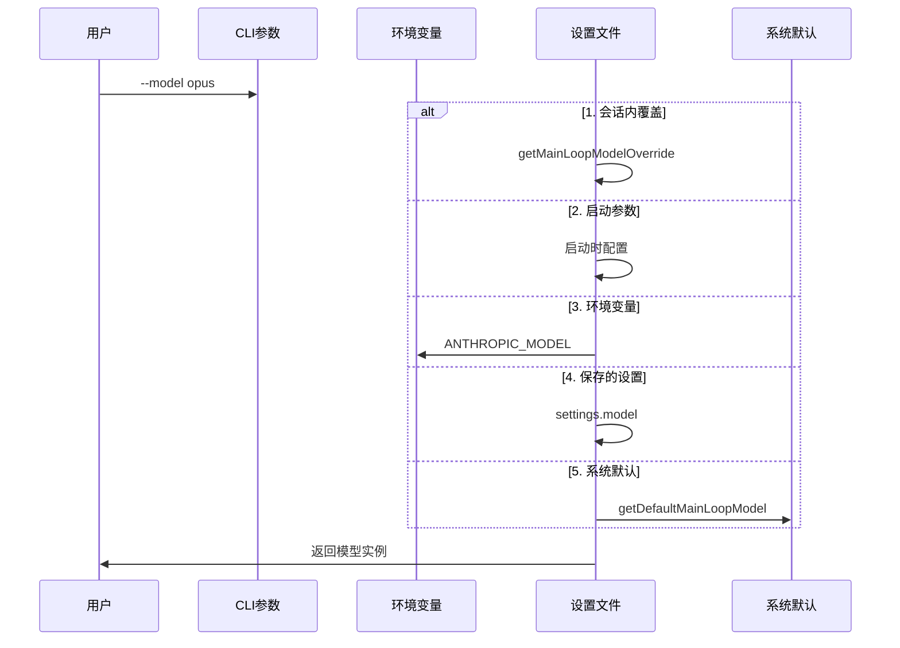

# 12. 模型配置与选择

> **代码入口**: `src/utils/model/model.ts`, `src/utils/model/providers.ts`  
> **核心功能**: 模型别名解析、多提供商适配、模型能力检测、成本追踪

## 概述

Claude Code 的模型管理系统负责将用户指定的模型标识符解析为实际可用的模型实例，并支持跨多个 API 提供商的透明切换。核心设计目标：

1. **别名抽象**：用户无需记忆完整模型ID，可使用简短别名
2. **提供商无关**：相同的模型别名在不同提供商上自动映射到对应的模型ID
3. **能力检测**：自动识别模型支持的特性（扩展思考、视觉、1M上下文等）
4. **成本透明**：实时追踪各模型的 token 成本

## 设计原理

### 架构决策：别名中心化设计



**设计动机**：
- 模型ID随版本迭代变化频繁，别名提供稳定的用户接口
- 不同提供商的模型ID格式差异大，适配层隔离这些差异
- 订阅级别决定可用模型，解析时需结合用户订阅状态

### 模型选择优先级



**代码路径**：`src/utils/model/model.ts:62-99`

## 实现原理

### 1. 别名解析机制

**代码路径**：`src/utils/model/model.ts:446-507`

将简短标识符映射到完整模型ID，支持`[1m]`后缀启用1M上下文：

- **1M上下文标记**：支持 `[1m]` 后缀（如 `opus[1m]`）
- **别名检测**：`isModelAlias()` 函数判断输入是否为已知别名
- **版本继承**：别名默认指向最新版本，旧版本模型自动重映射

### 2. 多提供商适配

**代码路径**：`src/utils/model/providers.ts:7-22`

提供商检测决定模型ID的具体格式：

- **First-Party**：`claude-opus-4-6-20250219`
- **Bedrock**：`us.anthropic.claude-opus-4-6-v1:0` 或 ARN
- **Vertex**：`claude-opus-4-6@20250219`
- **Foundry**：用户自定义部署ID

### 3. 模型能力检测

**代码路径**：`src/utils/model/modelCapabilities.ts`

能力检测确保请求参数与模型能力匹配：
- `modelSupportsThinking()` - 是否支持扩展思考
- `modelSupports1M()` - 是否支持1M上下文

### 4. 成本追踪系统

**代码路径**：`src/cost-tracker.ts`

独立于模型选择，记录每次API调用的费用。

## 功能展开

### 12.1 模型别名系统

**代码路径**：`src/utils/model/aliases.ts`

支持别名：`opus`, `sonnet`, `haiku`, `best`, `opusplan`

特殊别名：
- `opusplan`：计划模式使用 Opus，其他模式使用 Sonnet
- `best`：始终指向当前最强大的模型

### 12.2 模型字符串映射

**代码路径**：`src/utils/model/modelStrings.ts`

根据提供商返回对应的模型ID字符串。

### 12.3 模型选项生成

**代码路径**：`src/utils/model/modelOptions.ts:272-377`

为用户界面生成模型选项列表，根据用户订阅级别显示不同的选项。

### 12.4 遗留模型处理

**代码路径**：`src/utils/model/model.ts:539-555`

自动将不再可用的旧模型重映射到当前版本。

### 12.5 自定义模型支持

环境变量配置：
- `ANTHROPIC_MODEL`：覆盖默认模型
- `ANTHROPIC_DEFAULT_OPUS_MODEL`：自定义 Opus 模型ID
- `ANTHROPIC_DEFAULT_SONNET_MODEL`：自定义 Sonnet 模型ID

## 数据结构

### 核心类型定义

```typescript
// src/utils/model/model.ts:33-35
export type ModelShortName = string
export type ModelName = string
export type ModelSetting = ModelName | ModelAlias | null

// src/utils/model/modelOptions.ts:39-44
export type ModelOption = {
  value: ModelSetting
  label: string
  description: string
  descriptionForModel?: string
}

// src/utils/model/providers.ts:5
export type APIProvider = 'firstParty' | 'bedrock' | 'vertex' | 'foundry' | 'openai'
```

## 组合使用

### 与认证系统的协作

模型选择需考虑用户订阅级别（Max/Pro/Enterprise）。

### 与流式响应的协作

模型能力决定是否启用特定功能（扩展思考、1M上下文等）。

### 与上下文窗口的协作

**代码路径**：`src/utils/context.ts`
- `getModelMaxOutputTokens()` - 获取模型最大输出token
- `has1mContext()` - 检查是否启用1M上下文

## 小结

### 设计取舍

**优势**：
1. 用户友好：别名系统隐藏了复杂的模型ID格式
2. 提供商无关：业务逻辑不需要关心底层API提供商
3. 灵活扩展：新增模型只需更新映射表和成本配置

**局限**：
1. 版本追踪：别名默认指向最新版本，用户无法明确指定旧版本
2. 提供商差异：部分提供商的模型能力不完全一致

### 演进方向

1. 模型发现API：动态获取可用模型列表
2. 智能模型选择：根据任务复杂度自动选择最合适的模型
3. 成本优化提示：在用户选择模型时显示预估成本

---

**相关文档**：
- [[13-authentication]] - API认证与授权
- [[14-streaming]] - 流式响应处理
- [[11-context-window]] - 上下文窗口优化

**代码索引**：
- `src/utils/model/model.ts:62-99` - 模型选择优先级
- `src/utils/model/model.ts:446-507` - 别名解析
- `src/utils/model/providers.ts:7-22` - 提供商检测
