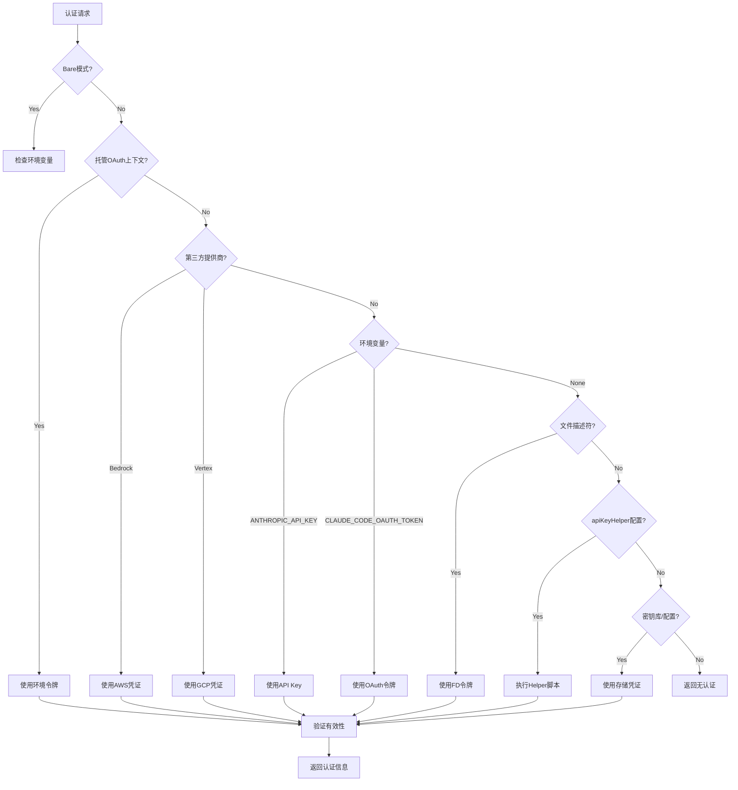
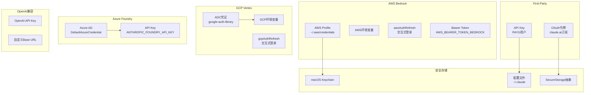

# 13. API认证与授权

> **代码入口**: `src/utils/auth.ts`, `src/services/api/client.ts`  
> **核心功能**: 多源认证、OAuth流程、云提供商凭证管理、安全存储

## 概述

Claude Code 的认证系统支持多种认证方式，包括 API Key、OAuth、AWS/GCP 凭证，并实现了安全存储、自动刷新、多进程同步等高级特性。核心设计目标：

1. **多源优先级**：支持环境变量、设置文件、OAuth令牌、云凭证等多种认证源
2. **自动刷新**：OAuth令牌和云凭证自动刷新，无需用户干预
3. **安全存储**：使用操作系统密钥库安全存储敏感凭证
4. **进程同步**：多进程环境下凭证状态的同步与冲突解决

## 设计原理

### 认证源优先级与决策流程



**代码路径**：`src/utils/auth.ts:100-148`

### 多提供商认证架构



## 实现原理

### 1. 认证源检测

**代码路径**：`src/utils/auth.ts:152-205`

```typescript
export function getAuthTokenSource() {
  // --bare模式：仅支持apiKeyHelper
  if (isBareMode()) {
    if (getConfiguredApiKeyHelper()) {
      return { source: 'apiKeyHelper', hasToken: true }
    }
    return { source: 'none', hasToken: false }
  }

  // 环境变量令牌
  if (process.env.ANTHROPIC_AUTH_TOKEN && !isManagedOAuthContext()) {
    return { source: 'ANTHROPIC_AUTH_TOKEN', hasToken: true }
  }

  // OAuth令牌（环境变量或文件描述符）
  if (process.env.CLAUDE_CODE_OAUTH_TOKEN) {
    return { source: 'CLAUDE_CODE_OAUTH_TOKEN', hasToken: true }
  }

  // ... 其他认证源检测
}
```

### 2. OAuth令牌管理

**代码路径**：`src/utils/auth.ts:1254-1299`

OAuth令牌存储在安全存储中，支持自动刷新：

```typescript
export const getClaudeAIOAuthTokens = memoize((): OAuthTokens | null => {
  // 环境变量令牌（推断型，无刷新令牌）
  if (process.env.CLAUDE_CODE_OAUTH_TOKEN) {
    return {
      accessToken: process.env.CLAUDE_CODE_OAUTH_TOKEN,
      refreshToken: null,
      expiresAt: null,
      scopes: ['user:inference'],
      subscriptionType: null,
      rateLimitTier: null,
    }
  }

  // 从安全存储读取
  const secureStorage = getSecureStorage()
  const storageData = secureStorage.read()
  return storageData?.claudeAiOauth
})
```

**自动刷新机制**：`src/utils/auth.ts:1426-1444`

### 3. AWS凭证管理

**代码路径**：`src/utils/auth.ts:604-806`

支持多种AWS认证方式：

- **AWS Profile**：从 `~/.aws/credentials` 读取
- **环境变量**：`AWS_ACCESS_KEY_ID`, `AWS_SECRET_ACCESS_KEY`
- **交互式登录**：`awsAuthRefresh` 设置项执行 `aws sso login`
- **Bearer Token**：`AWS_BEARER_TOKEN_BEDROCK` 环境变量

**自动刷新与缓存**：`src/utils/auth.ts:786-806`

### 4. GCP凭证管理

**代码路径**：`src/utils/auth.ts:812-1013`

使用 `google-auth-library` 进行认证：

- **ADC**：Application Default Credentials
- **服务账号**：`GOOGLE_APPLICATION_CREDENTIALS` 环境变量
- **交互式登录**：`gcpAuthRefresh` 设置项执行 `gcloud auth`

**凭证有效性检查**：`src/utils/auth.ts:846-865`

### 5. API客户端创建

**代码路径**：`src/services/api/client.ts:88-316`

根据提供商类型创建对应的客户端实例：

```typescript
export async function getAnthropicClient({
  apiKey,
  maxRetries,
  model,
}: {
  apiKey?: string
  maxRetries: number
  model?: string
}): Promise<Anthropic> {
  // Bedrock
  if (isEnvTruthy(process.env.CLAUDE_CODE_USE_BEDROCK)) {
    const { AnthropicBedrock } = await import('@anthropic-ai/bedrock-sdk')
    // 刷新AWS凭证
    const cachedCredentials = await refreshAndGetAwsCredentials()
    return new AnthropicBedrock({
      awsAccessKey: cachedCredentials.accessKeyId,
      awsSecretKey: cachedCredentials.secretAccessKey,
      awsSessionToken: cachedCredentials.sessionToken,
    })
  }

  // Vertex
  if (isEnvTruthy(process.env.CLAUDE_CODE_USE_VERTEX)) {
    const { AnthropicVertex } = await import('@anthropic-ai/vertex-sdk')
    await refreshGcpCredentialsIfNeeded()
    return new AnthropicVertex({ googleAuth })
  }

  // First-Party
  return new Anthropic({
    apiKey: isClaudeAISubscriber() ? null : apiKey || getAnthropicApiKey(),
    authToken: isClaudeAISubscriber() 
      ? getClaudeAIOAuthTokens()?.accessToken 
      : undefined,
  })
}
```

## 功能展开

### 13.1 OAuth流程

**代码路径**：`src/services/oauth/client.ts`

完整的OAuth 2.0流程：
1. 授权码获取
2. 令牌交换
3. 令牌刷新
4. 用户信息获取

### 13.2 安全存储

**代码路径**：`src/utils/secureStorage/`

平台特定的安全存储实现：
- **macOS**：Keychain Services
- **Linux/Windows**：加密文件

### 13.3 apiKeyHelper

**代码路径**：`src/utils/auth.ts:468-573`

自定义脚本获取API Key，支持：
- 带缓存的异步执行
- 工作区信任验证
- 超时控制

### 13.4 多进程同步

**代码路径**：`src/utils/auth.ts:1312-1335`

跨进程的令牌状态同步：
- 文件修改时间检测
- 锁机制防止并发刷新

### 13.5 认证错误处理

**代码路径**：`src/services/api/errors.ts:784-883`

针对不同认证错误的专门处理：
- 401：令牌过期/无效
- 403：组织禁用/权限不足
- OAuth令牌撤销

## 数据结构

### OAuth令牌结构

```typescript
// src/services/oauth/types.ts
export type OAuthTokens = {
  accessToken: string
  refreshToken: string | null
  expiresAt: number | null
  scopes: string[]
  subscriptionType: SubscriptionType | null
  rateLimitTier: string | null
}

export type SubscriptionType = 
  | 'claude_ai_free'
  | 'claude_ai_pro'
  | 'claude_ai_max'
  | 'claude_ai_team_premium'
  | 'claude_ai_enterprise'
```

### API Key来源

```typescript
// src/utils/auth.ts:207-211
export type ApiKeySource =
  | 'ANTHROPIC_API_KEY'
  | 'apiKeyHelper'
  | '/login managed key'
  | 'none'
```

## 组合使用

### 与模型管理的协作

认证状态决定可用的模型选项：
- 订阅用户：Max/Pro 可用模型
- PAYG用户：所有模型可用

### 与流式响应的协作

401错误触发OAuth令牌刷新：

```typescript
// src/services/api/withRetry.ts:232-249
if (lastError instanceof APIError && lastError.status === 401) {
  const failedAccessToken = getClaudeAIOAuthTokens()?.accessToken
  if (failedAccessToken) {
    await handleOAuth401Error(failedAccessToken)
  }
  client = await getClient()
}
```

### 与权限系统的协作

**代码路径**：`src/utils/auth.ts:545-555`

项目设置的 `apiKeyHelper` 和 `awsAuthRefresh` 需要工作区信任确认。

## 小结

### 设计取舍

**优势**：
1. 灵活性：支持多种认证方式，适应不同部署环境
2. 自动化：令牌和凭证自动刷新，用户无感知
3. 安全性：使用操作系统密钥库，凭证不暴露在进程列表中

**局限**：
1. 复杂性：多认证源导致优先级逻辑复杂
2. 跨平台差异：不同平台的安全存储实现不一致
3. 调试困难：认证问题需要检查多个配置源

### 演进方向

1. 统一认证接口：抽象出统一的CredentialProvider接口
2. 凭证轮换：定期自动轮换API Key
3. 审计日志：记录所有认证操作用于安全审计

---

**相关文档**：
- [[12-model-management]] - 模型配置与选择
- [[14-streaming]] - 流式响应处理
- [[15-permissions]] - 权限模型

**代码索引**：
- `src/utils/auth.ts:100-205` - 认证源检测
- `src/utils/auth.ts:1254-1299` - OAuth令牌读取
- `src/services/api/client.ts:88-316` - 客户端创建
- `src/services/oauth/client.ts` - OAuth流程
