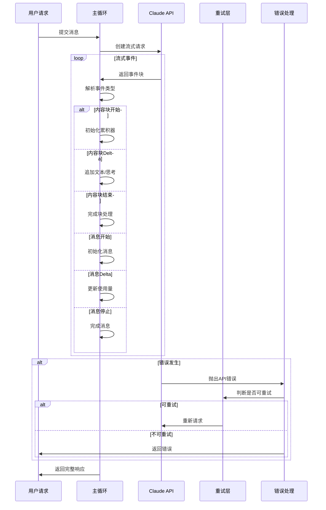
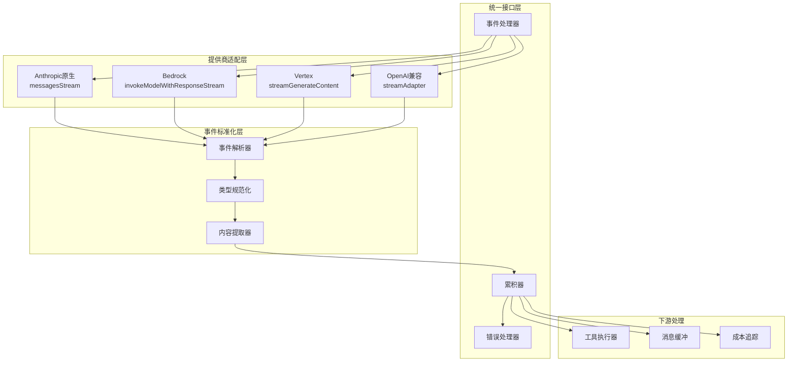

# 14. 流式响应处理

> **代码入口**: `src/services/api/claude.ts`, `src/services/api/withRetry.ts`  
> **核心功能**: 流式响应适配、错误恢复、思考模式集成、跨提供商兼容

## 概述

Claude Code 的流式响应系统负责处理来自多个 API 提供商的流式数据，统一转换为内部事件格式，并实现重试、错误处理、思考模式集成等高级功能。核心设计目标：

1. **统一接口**：不同提供商的流式响应转换为统一事件格式
2. **错误恢复**：自动重试、断点续传、降级策略
3. **思考集成**：扩展思考模式的流式输出处理
4. **性能优化**：低延迟、高吞吐、内存效率

## 设计原理

### 流式响应处理流程



**代码路径**：`src/services/api/claude.ts:165-352`

### 跨提供商适配架构



**代码路径**：
- `src/services/api/client.ts:88-316` - 客户端创建
- `src/services/api/openai/streamAdapter.ts:16-210` - OpenAI适配

## 实现原理

### 1. 流式事件处理

**代码路径**：`src/services/api/claude.ts:165-352`

核心事件类型处理：

```typescript
for await (const event of stream) {
  switch (event.type) {
    case 'content_block_start':
      // 初始化内容块（文本或思考）
      currentContentBlock = event.content_block
      break
      
    case 'content_block_delta':
      // 追加增量内容
      if (event.delta.type === 'text_delta') {
        yield { type: 'text', text: event.delta.text }
      } else if (event.delta.type === 'thinking_delta') {
        yield { type: 'thinking', thinking: event.delta.thinking }
      }
      break
      
    case 'content_block_stop':
      // 完成当前内容块
      break
      
    case 'message_start':
      // 初始化消息，包含使用量信息
      break
      
    case 'message_delta':
      // 更新使用量统计
      break
      
    case 'message_stop':
      // 完成消息处理
      break
  }
}
```

### 2. 扩展思考模式集成

**代码路径**：`src/services/api/claude.ts:218-275`

扩展思考模式下的特殊处理：
- 思考内容独立于文本内容
- 支持思考内容的流式输出
- 思考块作为特殊内容块处理

```typescript
if (currentContentBlock.type === 'thinking') {
  yield {
    type: 'thinking',
    thinking: (event.delta as ThinkingDelta).thinking,
  }
}
```

### 3. OpenAI流适配

**代码路径**：`src/services/api/openai/streamAdapter.ts:16-210`

将OpenAI格式的流转换为Anthropic格式：

```typescript
export async function* adaptOpenAIStream(
  stream: AsyncIterable<OpenAI.ChatCompletionChunk>
): AsyncGenerator<ClaudeEvent> {
  for await (const chunk of stream) {
    const delta = chunk.choices[0]?.delta
    
    if (delta?.content) {
      yield {
        type: 'content_block_delta',
        index: 0,
        delta: { type: 'text_delta', text: delta.content },
      }
    }
    
    if (delta?.reasoning_content) {
      // 处理推理内容
      yield {
        type: 'content_block_delta',
        index: 1,
        delta: { type: 'thinking_delta', thinking: delta.reasoning_content },
      }
    }
  }
}
```

### 4. 错误恢复机制

**代码路径**：`src/services/api/withRetry.ts:85-267`

多层级重试策略：

```typescript
export async function withRetry<T>(
  operation: () => Promise<T>,
  options: RetryOptions
): Promise<T> {
  let lastError: Error | null = null
  
  for (let attempt = 0; attempt < options.maxRetries; attempt++) {
    try {
      return await operation()
    } catch (error) {
      lastError = error
      
      // 判断是否可重试
      if (!isRetryableError(error)) {
        throw error
      }
      
      // 401特殊处理：刷新OAuth令牌
      if (error.status === 401) {
        await handleOAuth401Error()
      }
      
      // 指数退避
      const delay = calculateBackoff(attempt, options)
      await sleep(delay)
    }
  }
  
  throw lastError
}
```

**可重试错误判断**：`src/services/api/errors.ts:784-883`

### 5. 使用量追踪

**代码路径**：`src/services/api/claude.ts:320-345`

实时追踪token使用量：

```typescript
case 'message_delta':
  if (event.usage) {
    usage.input_tokens = event.usage.input_tokens
    usage.output_tokens = event.usage.output_tokens
    
    if (event.usage.cache_read_input_tokens) {
      usage.cache_read_input_tokens = event.usage.cache_read_input_tokens
    }
    
    if (event.usage.cache_creation_input_tokens) {
      usage.cache_creation_input_tokens = event.usage.cache_creation_input_tokens
    }
  }
  break
```

## 功能展开

### 14.1 内容块累积

**代码路径**：`src/services/api/claude.ts:185-215`

累积文本和思考内容：
- 文本块：`type: 'text'`
- 思考块：`type: 'thinking'`
- 工具使用块：`type: 'tool_use'`

### 14.2 工具调用处理

**代码路径**：`src/services/api/claude.ts:280-315`

工具调用的流式处理：
- 工具名称和参数的增量接收
- JSON参数的流式解析
- 工具结果的处理

### 14.3 超时控制

**代码路径**：`src/services/api/claude.ts:138-163`

流式请求的超时处理：
- 连接超时
- 首字节超时
- 空闲超时

### 14.4 取消机制

**代码路径**：`src/services/api/claude.ts:355-378`

支持请求取消：
- AbortController集成
- 流式响应的优雅终止
- 资源清理

### 14.5 成本计算

**代码路径**：`src/cost-tracker.ts`

基于使用量计算成本：
- 输入token成本
- 输出token成本
- 缓存读取折扣
- 缓存创建成本

## 数据结构

### 流式事件类型

```typescript
// src/services/api/types.ts
export type ClaudeEvent =
  | { type: 'message_start'; message: Message }
  | { type: 'content_block_start'; index: number; content_block: ContentBlock }
  | { type: 'content_block_delta'; index: number; delta: Delta }
  | { type: 'content_block_stop'; index: number }
  | { type: 'message_delta'; delta: MessageDelta; usage: Usage }
  | { type: 'message_stop' }

export type ContentBlock =
  | { type: 'text'; text: string }
  | { type: 'thinking'; thinking: string }
  | { type: 'tool_use'; id: string; name: string; input: object }

export type Delta =
  | { type: 'text_delta'; text: string }
  | { type: 'thinking_delta'; thinking: string }
  | { type: 'input_json_delta'; partial_json: string }
```

### 使用量统计

```typescript
// src/services/api/types.ts
export type Usage = {
  input_tokens: number
  output_tokens: number
  cache_read_input_tokens?: number
  cache_creation_input_tokens?: number
}
```

## 组合使用

### 与模型管理的协作

**代码路径**：`src/services/api/claude.ts:58-95`

模型能力决定请求参数：
- 扩展思考：`modelSupportsThinking()`
- 1M上下文：`modelSupports1M()`

### 与认证系统的协作

**代码路径**：`src/services/api/withRetry.ts:232-249`

401错误触发令牌刷新：
- OAuth令牌自动刷新
- AWS凭证刷新
- GCP凭证刷新

### 与工具执行系统的协作

**代码路径**：`src/services/api/claude.ts:280-315`

工具调用块的流式处理：
- 工具名称识别
- 参数JSON流式解析
- 工具执行调度

## 小结

### 设计取舍

**优势**：
1. 统一接口：不同提供商的流式响应统一处理
2. 错误恢复：多层重试机制提高可靠性
3. 扩展性：易于添加新的提供商适配器

**局限**：
1. 复杂性：流式状态管理复杂，容易引入bug
2. 内存压力：大型响应的累积可能占用大量内存
3. 调试困难：流式错误的复现和调试困难

### 演进方向

1. 流式压缩：支持流式响应的压缩传输
2. 断点续传：支持长时间流式请求的断点续传
3. 智能缓冲：基于网络状况动态调整缓冲策略

---

**相关文档**：
- [[12-model-management]] - 模型配置与选择
- [[13-authentication]] - API认证与授权
- [[09-tool-system]] - 工具系统

**代码索引**：
- `src/services/api/claude.ts:165-352` - 流式事件处理
- `src/services/api/withRetry.ts:85-267` - 重试机制
- `src/services/api/openai/streamAdapter.ts:16-210` - OpenAI适配
- `src/services/api/errors.ts:784-883` - 错误处理
