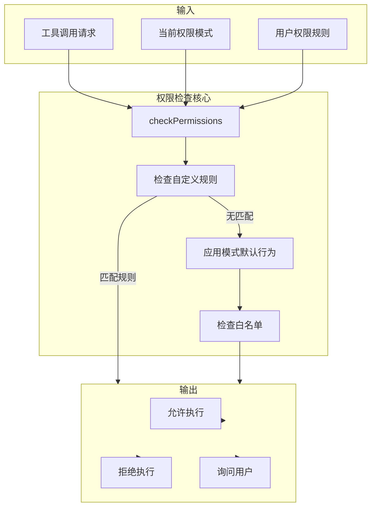
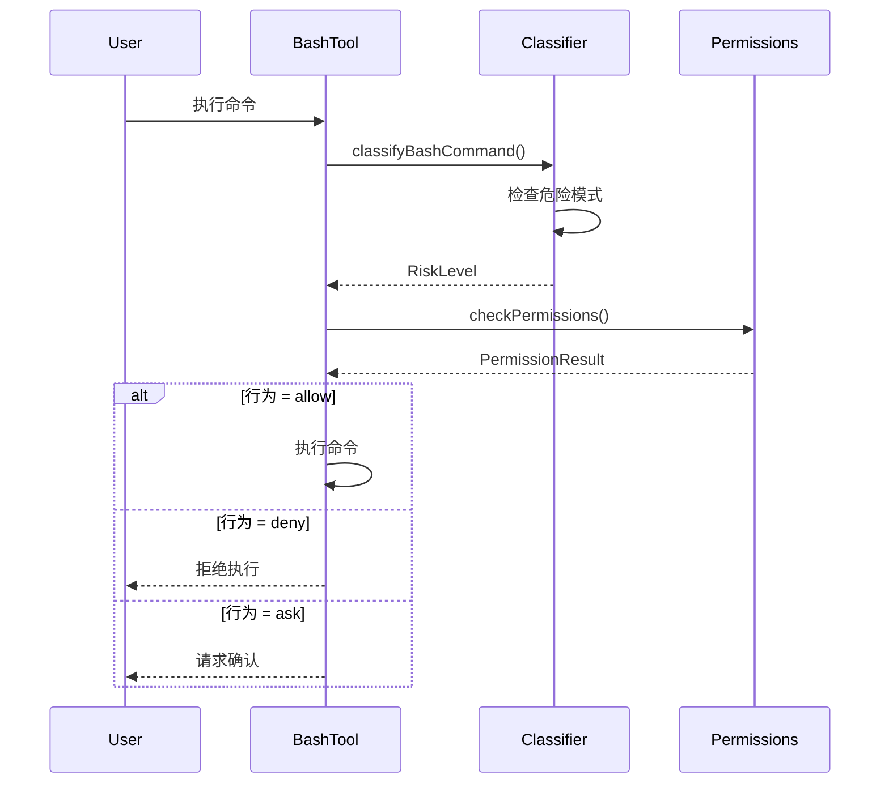

# 15. Permissions (权限系统)

## Overview

Claude Code 的权限系统是一个多层级、可配置的访问控制框架，用于决定 AI 助手是否可以执行特定操作。系统支持四种权限模式，采用"默认拒绝 + 规则覆盖"的策略，通过规则匹配和行为决策实现细粒度控制。

**核心设计目标：**
- 提供可预测的权限行为，避免意外操作
- 支持从严格到宽松的多种使用场景
- 允许用户自定义权限规则覆盖默认行为
- 透明化权限决策过程，便于审计

## Key Concepts

### 1. Permission Mode (权限模式)

定义在 `src/utils/permissions/PermissionMode.ts:45-70`：

```typescript
export const permissionModes: Record<PermissionModeName, PermissionMode> = {
  default: {
    // 最严格模式：任何非安全操作都需确认
    allowlist: [],
    askOnMissing: true,
    behavior: "ask",
  },
  plan: {
    // 规划模式：禁止所有写入操作
    allowlist: [],
    askOnMissing: false,
    behavior: "deny",
  },
  acceptEdits: {
    // 编辑模式：自动接受文件编辑
    allowlist: ["edit_file", "write_file"],
    askOnMissing: false,
    behavior: "deny",
  },
  bypassPermissions: {
    // 绕过模式：允许所有操作
    allowlist: [],
    askOnMissing: false,
    behavior: "allow",
  },
}
```

| 模式 | 行为 | 适用场景 |
|------|------|----------|
| `default` | 缺省询问 | 日常使用，安全优先 |
| `plan` | 缺省拒绝 | 只读分析，安全审计 |
| `acceptEdits` | 编辑自动接受 | 批量编辑场景 |
| `bypassPermissions` | 全部允许 | 受控环境，CI/CD |

### 2. Permission Rule (权限规则)

定义在 `src/utils/permissions/PermissionRule.ts:25-40`：

```typescript
export const permissionRuleSchema = z.object({
  toolName: z.string(),           // 目标工具名
  ruleContent: z.string().optional(), // 匹配内容（如文件路径）
  behavior: z.enum(["allow", "deny", "ask"]), // 决策
  source: z.enum(["user", "memory"]), // 规则来源
})
```

**规则匹配逻辑：**
- `toolName` 支持通配符：`*` 匹配所有工具
- `ruleContent` 用于工具特定参数匹配（如 Bash 命令、文件路径）
- 规则按来源优先级：`user` > `memory` > 默认模式

### 3. Permission Result (权限决策)

定义在 `src/utils/permissions/PermissionResult.ts:15-25`：

```typescript
type PermissionResult =
  | { behavior: "allow"; reason: string }
  | { behavior: "deny"; reason: string }
  | { behavior: "ask"; reason: string; options: PermissionOption[] }
```

## Architecture



## Implementation Details

### 核心检查流程

入口函数 `checkPermissions()` 位于 `src/utils/permissions/permissions.ts:80-150`：

```typescript
export async function checkPermissions(
  toolName: string,
  input: unknown,
  context: PermissionContext
): Promise<PermissionResult> {
  // 1. 检查自定义规则
  const ruleResult = checkCustomRules(toolName, input, context.rules)
  if (ruleResult) return ruleResult
  
  // 2. 获取模式配置
  const mode = permissionModes[context.mode]
  
  // 3. 检查白名单
  if (mode.allowlist.includes(toolName)) {
    return { behavior: "allow", reason: "In mode allowlist" }
  }
  
  // 4. 应用默认行为
  return {
    behavior: mode.behavior,
    reason: `Mode default: ${context.mode}`,
    options: mode.askOnMissing ? generateOptions(toolName, input) : undefined
  }
}
```

### 规则匹配算法

规则匹配支持两种模式：

**1. 精确匹配**
```typescript
// 匹配特定工具
{ toolName: "Bash", behavior: "deny", source: "user" }

// 匹配特定文件路径
{ toolName: "write_file", ruleContent: "/etc/passwd", behavior: "deny" }
```

**2. 通配符匹配**
```typescript
// 匹配所有工具
{ toolName: "*", behavior: "allow", source: "memory" }

// 匹配目录下所有文件
{ toolName: "write_file", ruleContent: "/safe-dir/**", behavior: "allow" }
```

### 权限规则持久化

规则存储在用户记忆系统中（`memory` 来源），支持跨会话保持：

```typescript
// 保存规则到记忆
await memory.add({
  type: "permission_rule",
  content: ruleContent,
  metadata: { toolName, behavior }
})

// 加载时自动恢复
const rules = await memory.getPermissionRules()
```

## Classifiers (分类器)

权限系统包含多个分类器，用于智能判断操作风险：

### BashClassifier

位于 `src/utils/permissions/bashClassifier.ts:20-80`：

```typescript
export function classifyBashCommand(command: string): RiskLevel {
  // 检测危险模式
  if (matchesDangerousPattern(command)) {
    return "high"
  }
  
  // 检测文件操作
  if (isFileOperation(command)) {
    return "medium"
  }
  
  // 检测系统信息查询
  if (isSystemQuery(command)) {
    return "low"
  }
  
  return "unknown"
}
```

### YoloClassifier (Ant-only)

位于 `src/utils/permissions/yoloClassifier.ts:15-40`：

此分类器仅在 Anthropic 内部构建中可用，外部构建为 stub：

```typescript
// 外部构建版本
export function classifyForYolo(input: unknown): boolean {
  return false // 始终返回 false
}
```

内部版本会根据输入内容智能判断是否可以自动执行。

## Dangerous Patterns

危险模式列表定义在 `src/utils/permissions/dangerousPatterns.ts:18-58`：

```typescript
export const dangerousPatterns = [
  // 系统破坏
  /rm\s+-rf\s+\//,
  /mkfs/,
  /dd\s+if=.*of=\/dev/,
  
  // 权限提升
  /sudo/,
  /chmod\s+777/,
  /chown\s+root/,
  
  // 网络操作
  /iptables/,
  /nc\s+-l/,
  /curl.*\|.*sh/,
  
  // 进程操作
  /kill\s+-9\s+1/,
  /pkill\s+-9/,
]
```

**模式检测流程：**



## Filesystem Permissions

文件系统权限验证位于 `src/utils/permissions/filesystem.ts:25-60`：

```typescript
export function checkFilesystemPermission(
  operation: "read" | "write",
  path: string,
  rules: PermissionRule[]
): PermissionResult | null {
  // 检查路径是否在允许的目录内
  const normalizedPath = normalizePath(path)
  
  for (const rule of rules) {
    if (rule.toolName !== "read_file" && rule.toolName !== "write_file") {
      continue
    }
    
    if (matchesPath(normalizedPath, rule.ruleContent)) {
      return { behavior: rule.behavior, reason: `Rule: ${rule.source}` }
    }
  }
  
  return null // 无匹配规则，使用默认行为
}
```

**路径匹配支持：**
- 绝对路径精确匹配
- 相对路径（相对于工作目录）
- glob 模式：`**`, `*`, `?`

## Integration Points

### 与工具系统集成

每个工具在执行前都会调用权限检查：

```typescript
// 通用工具包装器
async function executeTool(toolName: string, input: unknown) {
  const result = await checkPermissions(toolName, input, context)
  
  switch (result.behavior) {
    case "allow":
      return toolImplementation(input)
    case "deny":
      throw new PermissionDeniedError(result.reason)
    case "ask":
      return askUserConfirmation(result.options)
  }
}
```

### 与 Hook 系统集成

权限检查可以作为 Hook 前置条件：

```typescript
// 在 Hook 中注册权限检查
hooks.register("preToolCall", async (toolName, input) => {
  const result = await checkPermissions(toolName, input, context)
  if (result.behavior === "deny") {
    throw new Error(result.reason)
  }
})
```

## Configuration Examples

### 场景 1：只读分析模式

```json
{
  "permissionMode": "plan",
  "rules": []
}
```

效果：所有写入操作被拒绝，只允许读取。

### 场景 2：受信任目录自动写入

```json
{
  "permissionMode": "default",
  "rules": [
    {
      "toolName": "write_file",
      "ruleContent": "/home/user/safe-dir/**",
      "behavior": "allow",
      "source": "user"
    }
  ]
}
```

效果：在 `/home/user/safe-dir/` 下写入文件无需确认。

### 场景 3：禁止特定命令

```json
{
  "permissionMode": "bypassPermissions",
  "rules": [
    {
      "toolName": "Bash",
      "ruleContent": "rm *",
      "behavior": "deny",
      "source": "user"
    }
  ]
}
```

效果：即使在绕过模式，也禁止执行 `rm` 命令。

## Error Handling

```typescript
// 权限拒绝错误
class PermissionDeniedError extends Error {
  constructor(public reason: string) {
    super(`Permission denied: ${reason}`)
  }
}

// 权限检查失败
class PermissionCheckError extends Error {
  constructor(public cause: Error) {
    super(`Permission check failed: ${cause.message}`)
  }
}
```

## Performance Considerations

1. **规则缓存**：规则列表在会话期间缓存，避免重复加载
2. **模式切换成本**：切换模式只需更新引用，无额外开销
3. **模式匹配优化**：危险模式使用预编译正则，避免运行时编译

## Security Considerations

1. **默认拒绝原则**：未知操作默认询问或拒绝
2. **规则来源验证**：`user` 规则优先级高于 `memory`
3. **路径规范化**：防止路径遍历攻击（如 `../../../etc/passwd`）
4. **模式不可降级**：严格模式不能通过规则降级为宽松模式

## Testing

权限系统测试位于 `tests/permissions/`：

```typescript
describe("checkPermissions", () => {
  it("should deny dangerous commands in default mode", async () => {
    const result = await checkPermissions("Bash", { command: "rm -rf /" }, defaultContext)
    expect(result.behavior).toBe("deny")
  })
  
  it("should allow safe commands in bypass mode", async () => {
    const result = await checkPermissions("Bash", { command: "ls" }, bypassContext)
    expect(result.behavior).toBe("allow")
  })
})
```

## Related Files

| 文件 | 功能 |
|------|------|
| `src/utils/permissions/permissions.ts` | 权限检查主入口 |
| `src/utils/permissions/PermissionMode.ts` | 权限模式定义 |
| `src/utils/permissions/PermissionRule.ts` | 权限规则 Schema |
| `src/utils/permissions/PermissionResult.ts` | 权限决策结果类型 |
| `src/utils/permissions/bashClassifier.ts` | Bash 命令风险分类 |
| `src/utils/permissions/yoloClassifier.ts` | 自动模式分类器 |
| `src/utils/permissions/dangerousPatterns.ts` | 危险模式列表 |
| `src/utils/permissions/filesystem.ts` | 文件系统权限验证 |
