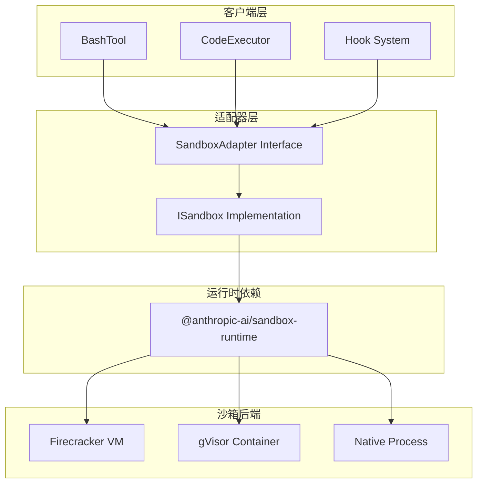
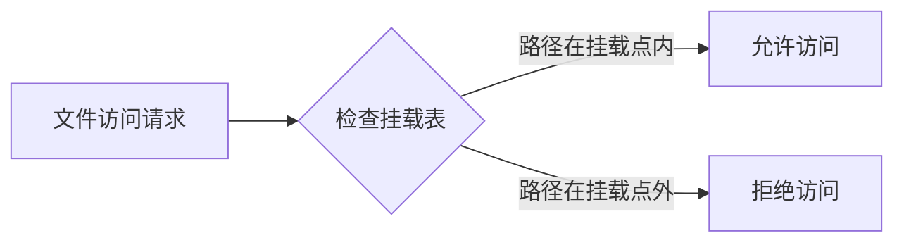

# 16. Sandbox (沙箱隔离)

## Overview

沙箱系统为 Claude Code 提供进程级隔离能力，用于在不信任环境中安全执行代码和命令。系统基于 `@anthropic-ai/sandbox-runtime` 包实现，通过适配器模式封装底层沙箱实现，支持多种沙箱后端。

**核心设计目标：**
- 隔离执行不受信任的代码
- 限制资源访问（文件系统、网络、进程）
- 提供一致的执行接口
- 支持多种沙箱后端切换

## Key Concepts

### 1. Sandbox Adapter (沙箱适配器)

定义在 `src/utils/sandbox/sandbox-adapter.ts:1-50`：

```typescript
export interface SandboxAdapter {
  execute(command: string, options?: ExecuteOptions): Promise<ExecuteResult>
  readFile(path: string): Promise<string>
  writeFile(path: string, content: string): Promise<void>
  start(): Promise<void>
  stop(): Promise<void>
  isRunning(): boolean
}
```

**适配器模式优势：**
- 解耦上层逻辑与底层实现
- 支持运行时切换沙箱后端
- 便于测试和模拟

### 2. Execute Options (执行选项)

```typescript
interface ExecuteOptions {
  timeout?: number
  cwd?: string
  env?: Record<string, string>
  stdin?: string
  memoryLimit?: number
  cpuLimit?: number
}
```

### 3. Execute Result (执行结果)

```typescript
interface ExecuteResult {
  stdout: string
  stderr: string
  exitCode: number
  usage?: {
    memory: number
    cpuTime: number
    wallTime: number
  }
}
```

## Architecture



## Implementation Details

### 沙箱初始化

位于 `src/utils/sandbox/sandbox-adapter.ts:30-60`：

```typescript
export async function createSandbox(config?: SandboxConfig): Promise<SandboxAdapter> {
  const sandbox = new ISandbox({
    backend: config?.backend ?? detectBackend(),
    rootfs: config?.rootfs ?? defaultRootfs,
    network: config?.network ?? "none",
  })
  
  await sandbox.start()
  
  return {
    execute: sandbox.execute.bind(sandbox),
    readFile: sandbox.readFile.bind(sandbox),
    writeFile: sandbox.writeFile.bind(sandbox),
    start: sandbox.start.bind(sandbox),
    stop: sandbox.stop.bind(sandbox),
    isRunning: () => sandbox.status === "running",
  }
}
```

### 后端检测

系统会自动检测可用的沙箱后端：

```typescript
function detectBackend(): BackendType {
  if (hasFirecracker()) {
    return "firecracker"
  }
  if (hasGVisor()) {
    return "gvisor"
  }
  return "native"
}
```

**隔离级别对比：**

| 后端 | 隔离级别 | 性能开销 | 适用场景 |
|------|----------|----------|----------|
| Firecracker | VM 级（最强） | 高 | 执行完全不受信任代码 |
| gVisor | 容器级（中） | 中 | 执行半信任代码 |
| Native | 进程级（无） | 低 | 受信任环境开发调试 |

### 命令执行流程

```mermaid
sequenceDiagram
    participant Client
    participant Adapter
    participant Runtime
    participant Backend
    
    Client->>Adapter: execute(cmd, options)
    Adapter->>Adapter: 验证输入
    Adapter->>Runtime: runtime.execute(cmd)
    Runtime->>Backend: 启动隔离环境
    Backend->>Backend: 执行命令
    Backend-->>Runtime: 返回结果
    Runtime-->>Adapter: ExecuteResult
    Adapter-->>Client: 返回结果
```



## Resource Limits

### 内存限制

```typescript
const result = await sandbox.execute("node script.js", {
  memoryLimit: 512 * 1024 * 1024  // 512MB
})
```

内存超限行为：
- Firecracker：进程被 OOM Killer 终止
- gVisor：容器内存不足，进程崩溃
- Native：无限制，可能影响宿主系统

### CPU 时间限制

```typescript
const result = await sandbox.execute("compute-intensive", {
  cpuLimit: 5000  // 5秒 CPU 时间
})
```

CPU 超限行为：
- 进程收到 SIGXCPU 信号
- 可捕获处理，但通常终止

### 超时控制

```typescript
const result = await sandbox.execute("long-running", {
  timeout: 30000  // 30秒墙钟超时
})
```

超时处理：
- 发送 SIGTERM 信号
- 等待 5 秒优雅退出
- 发送 SIGKILL 强制终止

## Network Isolation

### 网络模式

```typescript
// 无网络（默认）
await createSandbox({ network: "none" })

// 限制出站网络
await createSandbox({ network: "limited" })

// 完全网络访问
await createSandbox({ network: "full" })
```

| 模式 | 允许操作 | 风险等级 |
|------|----------|----------|
| none | 无网络 | 最安全 |
| limited | DNS + 特定白名单 | 中等 |
| full | 完整网络访问 | 需信任代码 |

### 网络隔离实现

```typescript
// Firecracker: 虚拟机无网络设备
// gVisor: netstack 用户态网络栈
// Native: 依赖系统防火墙
```

## Filesystem Isolation

### 挂载策略

```typescript
const sandbox = await createSandbox({
  mounts: [
    { source: "/workspace", target: "/workspace", readonly: false },
    { source: "/data", target: "/data", readonly: true },
  ]
})
```

### 文件访问控制



### 只读保护

```typescript
// 保护关键系统文件
mounts: [
  { source: "/usr", target: "/usr", readonly: true },
  { source: "/lib", target: "/lib", readonly: true },
  { source: "/bin", target: "/bin", readonly: true },
]
```

## Lifecycle Management

### 启动流程

```typescript
const sandbox = await createSandbox()

// 1. 检测后端
// 2. 准备 rootfs
// 3. 配置网络
// 4. 启动隔离环境
// 5. 验证可用性
```

### 停止流程

```typescript
await sandbox.stop()

// 1. 发送终止信号
// 2. 等待进程退出
// 3. 清理资源
// 4. 释放隔离环境
```

### 错误恢复

```typescript
try {
  await sandbox.execute(cmd)
} catch (error) {
  if (error instanceof SandboxCrashError) {
    // 重启沙箱
    await sandbox.stop()
    await sandbox.start()
  }
}
```

## Integration with BashTool

BashTool 在检测到危险命令时会使用沙箱执行：

```typescript
// src/tools/BashTool/index.ts
async function executeBash(command: string, input: BashInput) {
  const riskLevel = classifyBashCommand(command)
  
  if (riskLevel === "high" && !input.trusted) {
    // 使用沙箱执行
    const sandbox = await getSandbox()
    return sandbox.execute(command, {
      timeout: input.timeout,
      memoryLimit: 256 * 1024 * 1024,
    })
  }
  
  // 直接执行
  return execDirect(command)
}
```

## Security Guarantees

### Firecracker 后端

- **硬件隔离**：每个沙箱一个微型 VM
- **内核隔离**：独立内核实例
- **网络隔离**：虚拟网络完全隔离
- **文件隔离**：独立 rootfs

### gVisor 后端

- **系统调用拦截**：用户态内核处理
- **内存隔离**：独立地址空间
- **网络隔离**：netstack 用户态栈
- **文件隔离**：托管文件系统

### Native 后端

- **无隔离**：直接执行
- **仅适用于信任环境**
- **依赖操作系统权限**

## Performance Comparison

| 操作 | Firecracker | gVisor | Native |
|------|-------------|--------|--------|
| 启动时间 | ~100ms | ~50ms | ~1ms |
| 命令执行 | ~5% 开销 | ~10% 开销 | 无开销 |
| 内存占用 | ~50MB 基础 | ~20MB 基础 | 无额外占用 |
| 文件 I/O | ~15% 开销 | ~20% 开销 | 无开销 |

## Error Handling

```typescript
class SandboxError extends Error {
  constructor(message: string, public cause?: Error) {
    super(message)
  }
}

class SandboxTimeoutError extends SandboxError {}
class SandboxMemoryError extends SandboxError {}
class SandboxNetworkError extends SandboxError {}
class SandboxCrashError extends SandboxError {}
```

## Configuration

### 环境变量

```bash
# 强制指定后端
SANDBOX_BACKEND=firecracker

# 内存限制默认值
SANDBOX_MEMORY_LIMIT=536870912

# CPU 限制默认值
SANDBOX_CPU_LIMIT=10000

# 网络模式
SANDBOX_NETWORK=none
```

### 配置文件

```json
{
  "sandbox": {
    "backend": "auto",
    "memoryLimit": "512MB",
    "cpuLimit": "10s",
    "network": "none",
    "mounts": [
      { "source": "${workspace}", "target": "/workspace" }
    ]
  }
}
```

## Testing

```typescript
describe("SandboxAdapter", () => {
  it("should isolate execution", async () => {
    const sandbox = await createSandbox({ backend: "native" })
    
    // 文件隔离测试
    await sandbox.writeFile("/tmp/test.txt", "content")
    const exists = fs.existsSync("/tmp/test.txt")
    expect(exists).toBe(false)  // 隔离环境不影响宿主
  })
  
  it("should enforce memory limit", async () => {
    const sandbox = await createSandbox()
    const result = sandbox.execute("node -e 'a=Array(1e9)'", {
      memoryLimit: 10 * 1024 * 1024
    })
    await expect(result).rejects.toThrow(SandboxMemoryError)
  })
})
```

## Related Files

| 文件 | 功能 |
|------|------|
| `src/utils/sandbox/sandbox-adapter.ts` | 沙箱适配器接口和实现 |
| `src/tools/BashTool/index.ts` | Bash 工具沙箱集成 |
| `src/tools/BashTool/bashSecurity.ts` | 命令安全检测 |
