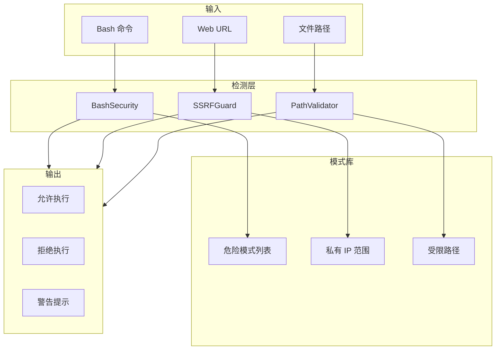
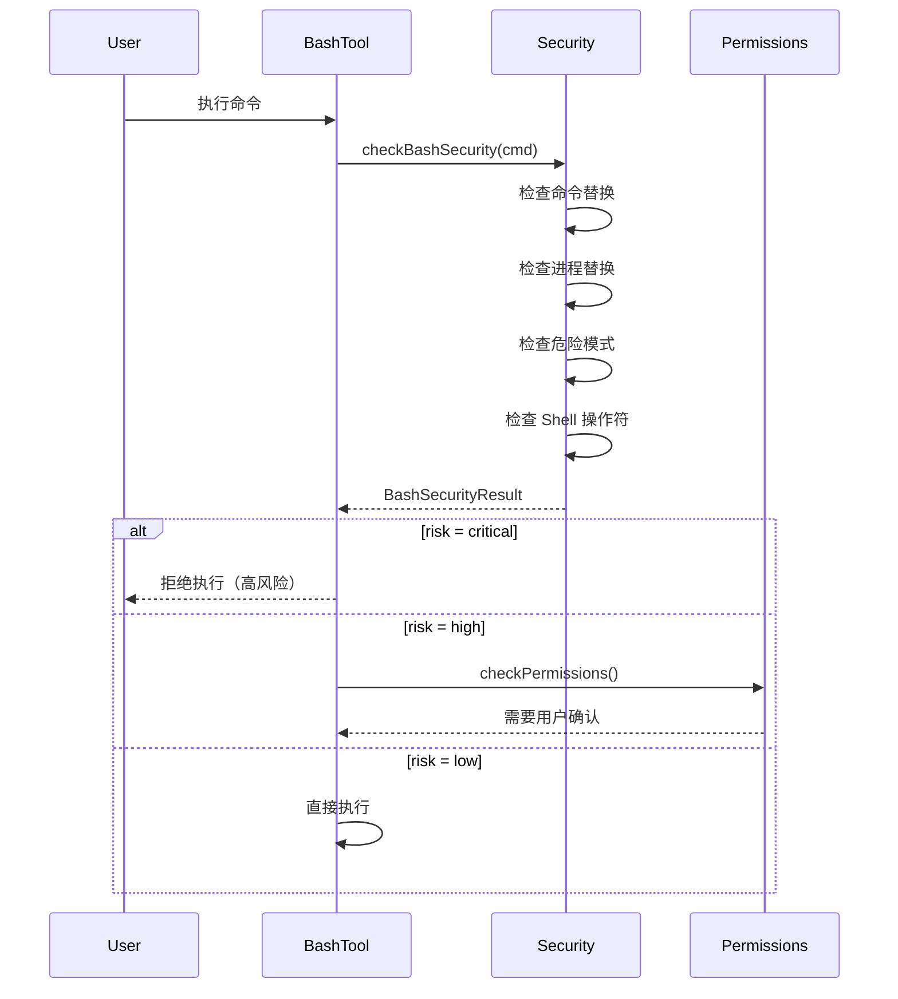
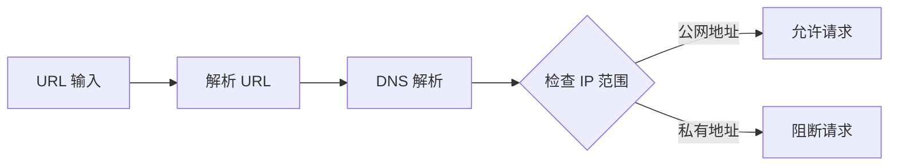
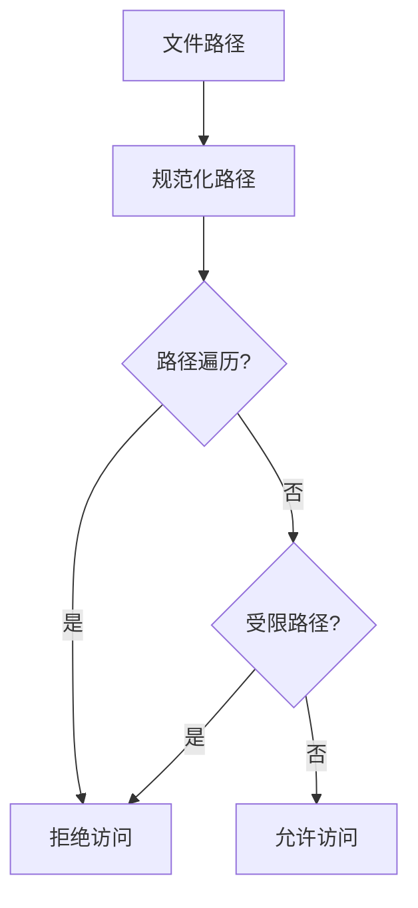

# 17. Security Checks (安全检测)

## Overview

安全检测系统是 Claude Code 的防护层，在命令执行、网络请求、文件操作前进行风险评估和阻断。系统采用多层次检测策略，包括静态模式匹配、动态内容分析和上下文验证。

**核心设计目标：**
- 阻止已知危险操作
- 检测潜在安全风险
- 提供清晰的拒绝理由
- 保持最小误报率

## Key Concepts

### 1. Bash Security (命令安全)

定义在 `src/tools/BashTool/bashSecurity.ts:16-36`：

```typescript
export interface BashSecurityResult {
  safe: boolean
  risk: "low" | "medium" | "high" | "critical"
  reason: string
  patterns: string[]
}
```

### 2. SSRF Protection (SSRF 防护)

定义在 `src/utils/hooks/ssrfGuard.ts:20-50`：

```typescript
export interface SSRFCheckResult {
  allowed: boolean
  blocked: boolean
  reason: string
  address: string
}
```

### 3. Dangerous Patterns (危险模式)

定义在 `src/utils/permissions/dangerousPatterns.ts:18-58`：

```typescript
export const dangerousPatterns: DangerousPattern[] = [
  { pattern: /rm\s+-rf\s+\//, risk: "critical", category: "filesystem" },
  { pattern: /sudo\s+/, risk: "high", category: "privilege" },
  { pattern: /curl.*\|.*sh/, risk: "critical", category: "remote-exec" },
]
```

## Architecture



## Bash Security Detection

### 命令替换检测

位于 `src/tools/BashTool/bashSecurity.ts:16-36`：

```typescript
export const commandSubstitutionPatterns = [
  /\$\(/,          // $(command)
  /`[^`]+`/,       // `command`
  /\$\{/,          // ${...}
  /\$\(\(/,        // $((arithmetic))
]
```

**检测逻辑：**

```typescript
function detectCommandSubstitution(command: string): boolean {
  for (const pattern of commandSubstitutionPatterns) {
    if (pattern.test(command)) {
      return true
    }
  }
  return false
}
```

### 进程替换检测

```typescript
export const processSubstitutionPatterns = [
  /<\(/,   // <(command)
  />\(/,   // >(command)
]
```

进程替换会将命令输出作为文件传递，可能导致注入。

### Shell 操作符检测

```typescript
export const shellOperatorPatterns = [
  /\|\|/,   // or
  /&&/,     // and
  /;/,      // separator
  /\|/,     // pipe
  /&/,      // background
]
```

操作符检测用于防止命令链注入。

### 完整检测流程



### 风险等级分类

| 等级 | 示例 | 行为 |
|------|------|------|
| critical | rm -rf /, curl pipe sh | 直接拒绝 |
| high | sudo, chmod 777 | 需要确认 |
| medium | cat /etc/passwd, ps aux | 警告提示 |
| low | ls, pwd, echo | 正常执行 |

## SSRF Protection

### 私有地址阻断

位于 `src/utils/hooks/ssrfGuard.ts:20-50`：

```typescript
export const privateIPRanges = [
  // IPv4 私有地址
  { start: "10.0.0.0", end: "10.255.255.255" },
  { start: "172.16.0.0", end: "172.31.255.255" },
  { start: "192.168.0.0", end: "192.168.255.255" },
  
  // 链路本地地址
  { start: "169.254.0.0", end: "169.254.255.255" },
  
  // IPv6 私有地址
  { start: "fc00::", end: "fdff:ffff:ffff:ffff:ffff:ffff:ffff:ffff" },
  { start: "fe80::", end: "febf:ffff:ffff:ffff:ffff:ffff:ffff:ffff" },
]
```

### 地址检测流程



### DNS 重绑定防护

```typescript
export async function checkSSRF(url: string): Promise<SSRFCheckResult> {
  const parsed = new URL(url)
  const addresses = await dnsLookup(parsed.hostname)
  
  for (const addr of addresses) {
    if (isPrivateIP(addr) && !isLoopback(addr)) {
      return {
        allowed: false,
        blocked: true,
        reason: `Private IP detected: ${addr}`,
        address: addr,
      }
    }
  }
  
  return {
    allowed: true,
    blocked: false,
    reason: "Public IP",
    address: addresses[0],
  }
}
```

### 特殊地址处理

| 地址类型 | 行为 | 理由 |
|----------|------|------|
| 127.0.0.1 | 允许 | 本地开发需要 |
| 0.0.0.0 | 阻断 | 可能绑定所有接口 |
| 169.254.x.x | 阻断 | 链路本地地址 |
| 192.168.x.x | 阻断 | 内网地址 |
| 10.x.x.x | 阻断 | 内网地址 |

## Dangerous Patterns

### 文件系统危险操作

位于 `src/utils/permissions/dangerousPatterns.ts:25-35`：

```typescript
const filesystemPatterns = [
  { pattern: /rm\s+-rf\s+\//, risk: "critical" },
  { pattern: /rm\s+-rf\s+\*/, risk: "critical" },
  { pattern: /mkfs/, risk: "critical" },
  { pattern: /dd\s+if=.*of=\/dev/, risk: "critical" },
  { pattern: />.*\/dev\/sda/, risk: "critical" },
]
```

### 权限提升操作

```typescript
const privilegePatterns = [
  { pattern: /sudo\s+/, risk: "high" },
  { pattern: /su\s+/, risk: "high" },
  { pattern: /chmod\s+777/, risk: "high" },
  { pattern: /chown\s+root/, risk: "high" },
  { pattern: /setuid/, risk: "critical" },
]
```

### 远程执行操作

```typescript
const remoteExecPatterns = [
  { pattern: /curl.*\|.*sh/, risk: "critical" },
  { pattern: /wget.*\|.*sh/, risk: "critical" },
  { pattern: /nc\s+-l/, risk: "high" },
  { pattern: /python.*-c/, risk: "medium" },
]
```

### 网络操作

```typescript
const networkPatterns = [
  { pattern: /iptables/, risk: "critical" },
  { pattern: /ifconfig/, risk: "medium" },
  { pattern: /ip\s+route/, risk: "medium" },
  { pattern: /tcpdump/, risk: "medium" },
]
```

## File Path Validation

### 路径遍历检测

```typescript
export function detectPathTraversal(path: string): boolean {
  const normalized = pathNormalize(path)
  const original = path
  
  // 检测 ../
  if (path.includes("..")) {
    return true
  }
  
  // 检测规范化后不一致
  if (normalized !== original) {
    return true
  }
  
  return false
}
```

### 受限路径列表

```typescript
export const restrictedPaths = [
  "/etc/passwd",
  "/etc/shadow",
  "/etc/sudoers",
  "/root/.ssh",
  "/var/log/auth.log",
  "~/.ssh/id_rsa",
]
```

### 路径验证流程



## Hook Integration

### SSRF Hook

```typescript
// src/utils/hooks/ssrfGuard.ts
export const ssrfGuardHook: Hook = {
  name: "ssrf-guard",
  trigger: "pre:webfetch",
  
  async handler(input: { url: string }) {
    const result = await checkSSRF(input.url)
    
    if (result.blocked) {
      throw new Error(`SSRF blocked: ${result.reason}`)
    }
    
    return input
  }
}
```

### Bash Security Hook

```typescript
export const bashSecurityHook: Hook = {
  name: "bash-security",
  trigger: "pre:bash",
  
  async handler(input: { command: string }) {
    const result = checkBashSecurity(input.command)
    
    if (result.risk === "critical") {
      throw new Error(`Command blocked: ${result.reason}`)
    }
    
    return input
  }
}
```

## Security Logging

### 审计日志格式

```typescript
interface SecurityAuditLog {
  timestamp: string
  type: "bash" | "ssrf" | "path"
  action: "blocked" | "warned" | "allowed"
  input: string
  reason: string
  risk: string
}
```

### 日志示例

```json
{
  "timestamp": "2025-01-15T10:30:00Z",
  "type": "bash",
  "action": "blocked",
  "input": "rm -rf /",
  "reason": "Matches critical pattern: rm -rf /",
  "risk": "critical"
}
```

## Error Handling

```typescript
class SecurityError extends Error {
  constructor(
    message: string,
    public risk: string,
    public patterns: string[]
  ) {
    super(message)
  }
}

class SSRFError extends SecurityError {
  constructor(public address: string) {
    super(`SSRF blocked: ${address}`, "high", ["private-ip"])
  }
}

class BashSecurityError extends SecurityError {
  constructor(command: string, result: BashSecurityResult) {
    super(
      `Command blocked: ${result.reason}`,
      result.risk,
      result.patterns
    )
  }
}
```

## Configuration

### 白名单配置

```json
{
  "security": {
    "allowedPrivateIPs": ["127.0.0.1", "::1"],
    "allowedCommands": ["ls", "cat", "grep"],
    "allowedPaths": ["/workspace/**", "/tmp/**"]
  }
}
```

### 模式覆盖

```json
{
  "security": {
    "patternOverrides": [
      {
        "pattern": "rm -rf /workspace/*",
        "risk": "medium",
        "reason": "Workspace cleanup allowed"
      }
    ]
  }
}
```

## Performance Considerations

1. **模式预编译**：危险模式正则在启动时预编译
2. **DNS 缓存**：DNS 查询结果缓存 5 分钟
3. **路径规范化缓存**：相同路径只规范化一次

## Testing

```typescript
describe("BashSecurity", () => {
  it("should block critical commands", () => {
    const result = checkBashSecurity("rm -rf /")
    expect(result.risk).toBe("critical")
    expect(result.safe).toBe(false)
  })
  
  it("should allow safe commands", () => {
    const result = checkBashSecurity("ls -la")
    expect(result.risk).toBe("low")
    expect(result.safe).toBe(true)
  })
})

describe("SSRFGuard", () => {
  it("should block private IPs", async () => {
    const result = await checkSSRF("http://192.168.1.1/admin")
    expect(result.blocked).toBe(true)
  })
  
  it("should allow public IPs", async () => {
    const result = await checkSSRF("https://example.com")
    expect(result.allowed).toBe(true)
  })
})
```

## Related Files

| 文件 | 功能 |
|------|------|
| `src/tools/BashTool/bashSecurity.ts` | Bash 命令安全检测 |
| `src/utils/hooks/ssrfGuard.ts` | SSRF 防护 Hook |
| `src/utils/permissions/dangerousPatterns.ts` | 危险模式定义 |
| `src/utils/permissions/bashClassifier.ts` | Bash 命令风险分类 |
| `src/utils/permissions/filesystem.ts` | 文件系统权限验证 |
