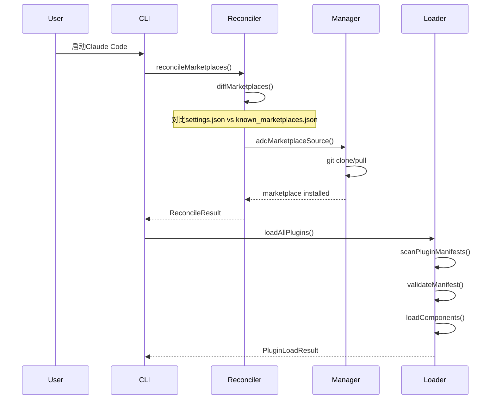
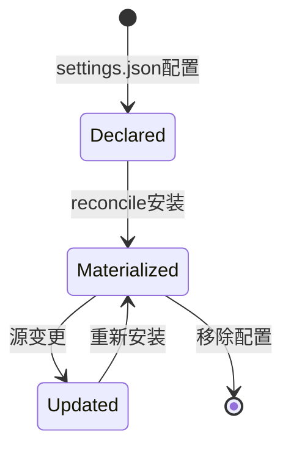

# 18. 插件架构

## 18.1 概述

Claude Code的插件架构提供了一个可扩展的生态系统，允许用户通过安装插件来增强AI助手的能力。插件系统采用市场驱动的分发模式，支持官方和第三方插件市场，同时提供本地开发调试能力。

**核心设计目标**:
- **安全性**: 官方命名保护、来源验证、同形攻击防护
- **可扩展性**: 支持命令、代理、技能、Hook、MCP服务器、LSP服务器
- **灵活性**: 多源发现（市场插件、本地目录、内建插件）
- **一致性**: 统一的manifest格式和加载流程

**关键代码路径**:
- `src/utils/plugins/pluginLoader.ts` - 插件加载核心逻辑
- `src/utils/plugins/marketplaceManager.ts` - 市场管理
- `src/utils/plugins/reconciler.ts` - 状态协调
- `src/utils/plugins/schemas.ts` - Schema验证

---

## 18.2 设计原理

### 18.2.1 多源发现机制

插件系统支持3种发现源，按优先级排序：

```mermaid
graph TB
    subgraph "插件发现源"
        M[Marketplace插件] --> |plugin@marketplace| L[LoadedPlugin]
        S[Session插件] --> |--plugin-dir CLI| L
        B[内建插件] --> |编译时注册| L
    end
    
    subgraph "加载流程"
        L --> V[Schema验证]
        V --> C[组件扫描]
        C --> R[注册到AppState]
    end
```

**Marketplace插件**: 通过`plugin-name@marketplace-name`格式标识，从已安装的市场加载
**Session插件**: 通过`--plugin-dir` CLI参数指定的本地目录，仅当前会话有效
**内建插件**: 编译时通过`registerBundledSkill()`注册，用户可启用/禁用

### 18.2.2 安全防护体系

插件系统实施多层安全防护：

**第一层：官方命名保护** (`schemas.ts:14-101`)
```typescript
// 预留的官方市场名称
ALLOWED_OFFICIAL_MARKETPLACE_NAMES = new Set([
  'claude-code-marketplace',
  'anthropic-marketplace',
  'agent-skills',
  // ...
])

// 阻止冒充官方的模式
BLOCKED_OFFICIAL_NAME_PATTERN = 
  /(?:official[^a-z0-9]*(anthropic|claude)|...)/i

// 阻止非ASCII字符（同形攻击）
NON_ASCII_PATTERN = /[^\u0020-\u007E]/
```

**第二层：来源验证** (`schemas.ts:119-157`)
```typescript
function validateOfficialNameSource(name, source) {
  // 只有官方GitHub组织才能使用预留名称
  if (source.source === 'github') {
    if (!repo.startsWith('anthropics/')) {
      return error('Reserved name must come from official org')
    }
  }
}
```

---

## 18.3 实现原理

### 18.3.1 加载流程

插件加载遵循以下步骤：



**代码实现** (`reconciler.ts:114-234`):
```typescript
async function reconcileMarketplaces() {
  const declared = getDeclaredMarketplaces()  // 从settings读取
  const materialized = await loadKnownMarketplacesConfig()  // 从JSON读取
  
  const diff = diffMarketplaces(declared, materialized)
  
  // 安装缺失的市场
  for (const name of diff.missing) {
    await addMarketplaceSource(declared[name].source)
  }
  
  // 更新源变更的市场
  for (const {name, declaredSource} of diff.sourceChanged) {
    await addMarketplaceSource(declaredSource)
  }
}
```

### 18.3.2 Manifest验证

插件必须提供`plugin.json` manifest文件，Schema定义在`schemas.ts:274-400`：

```typescript
const PluginManifestMetadataSchema = z.object({
  name: z.string().min(1).refine(noSpaces),
  version: z.string().optional(),
  description: z.string().optional(),
  author: PluginAuthorSchema.optional(),
  
  // 组件路径
  commands: z.union([
    z.string(),  // 单路径: "./commands"
    z.array(z.string()),  // 多路径
    z.record(CommandMetadataSchema)  // 对象映射
  ]).optional(),
  
  agents: z.union([...]).optional(),
  skills: z.union([...]).optional(),
  hooks: HooksSchema.optional(),
  mcpServers: McpServerConfigSchema.optional(),
  lspServers: LspServerConfigSchema.optional(),
  
  // 依赖声明
  dependsOn: z.array(z.string()).optional(),
})
```

### 18.3.3 组件扫描

加载器扫描manifest声明的各组件路径：

**命令扫描** (`pluginLoader.ts:~400-500`):
```typescript
async function loadCommands(plugin) {
  const commandsPath = plugin.commandsPath || plugin.commandsPaths
  
  if (typeof commandsPath === 'string') {
    // 扫描目录下的.md文件
    const files = await glob(`${commandsPath}/*.md`)
    for (const file of files) {
      const command = await parseCommandFile(file)
      commands.push(command)
    }
  } else if (typeof commandsPath === 'object') {
    // 对象映射格式：直接使用metadata
    for (const [name, metadata] of Object.entries(commandsPath)) {
      commands.push({ name, ...metadata })
    }
  }
}
```

---

## 18.4 功能展开

### 18.4.1 市场管理

**市场生命周期**:



**市场配置优先级** (`marketplaceManager.ts`):
1. `settings.json`中的`marketplaces`字段
2. CLI参数`--marketplace`
3. 项目级`.claude/settings.json`

### 18.4.2 插件启用/禁用

插件状态存储在用户设置的`enabledPlugins`字段：

```typescript
// pluginLoader.ts
function isPluginEnabled(plugin: LoadedPlugin): boolean {
  const userPref = settings.enabledPlugins?.[plugin.name]
  return userPref ?? plugin.manifest.defaultEnabled ?? true
}
```

### 18.4.3 依赖解析

插件可声明依赖关系：

```json
{
  "name": "advanced-automation",
  "dependsOn": ["basic-utils", "data-process"]
}
```

加载器检查依赖是否满足 (`pluginLoader.ts:~600-650`):
```typescript
function checkDependencies(plugin) {
  for (const dep of plugin.manifest.dependsOn || []) {
    if (!enabledPlugins.has(dep)) {
      errors.push({
        type: 'dependency-unsatisfied',
        plugin: plugin.name,
        dependency: dep,
        reason: 'not-enabled'
      })
    }
  }
}
```

---

## 18.5 数据结构

### 18.5.1 核心类型定义

**LoadedPlugin** (`types/plugin.ts:48-70`):
```typescript
type LoadedPlugin = {
  name: string
  manifest: PluginManifest
  path: string
  source: string  // marketplace名称或'builtin'
  enabled?: boolean
  isBuiltin?: boolean
  sha?: string  // Git commit SHA
  
  // 组件路径
  commandsPath?: string
  commandsPaths?: string[]
  agentsPath?: string
  skillsPath?: string
  hooksConfig?: HooksSettings
  mcpServers?: Record<string, McpServerConfig>
  lspServers?: Record<string, LspServerConfig>
}
```

**PluginError** (`types/plugin.ts:101-283`):
采用discriminated union设计，支持24种错误类型：
```typescript
type PluginError =
  | { type: 'path-not-found', source, plugin, path, component }
  | { type: 'git-auth-failed', source, gitUrl, authType }
  | { type: 'manifest-validation-error', source, validationErrors }
  | { type: 'dependency-unsatisfied', source, plugin, dependency, reason }
  // ... 20 more types
```

### 18.5.2 市场配置

**MarketplaceSource** (`schemas.ts:~500-600`):
```typescript
type MarketplaceSource =
  | { source: 'github', repo: string, branch?: string }
  | { source: 'git', url: string, branch?: string }
  | { source: 'directory', path: string }
  | { source: 'file', path: string }
```

---

## 18.6 组合使用

### 18.6.1 完整插件示例

```
my-plugin/
├── plugin.json
├── commands/
│   ├── analyze.md
│   └── transform.md
├── agents/
│   └── code-review.md
├── skills/
│   └── SKILL.md
├── hooks/
│   └── hooks.json
└── mcp-servers/
    └── data-provider.json
```

**plugin.json**:
```json
{
  "name": "my-plugin",
  "version": "1.0.0",
  "description": "Code analysis and transformation toolkit",
  "author": {
    "name": "Developer",
    "email": "dev@example.com"
  },
  "commands": "./commands",
  "agents": "./agents",
  "skills": "./skills",
  "hooks": "./hooks/hooks.json",
  "mcpServers": {
    "data-provider": {
      "type": "stdio",
      "command": "node",
      "args": ["./mcp-servers/data-provider.js"]
    }
  },
  "dependsOn": ["utils-core"]
}
```

### 18.6.2 与其他系统集成

**插件 → Skill**: 插件的`skills`路径被扫描并加载为可调用技能
**插件 → Hook**: 插件的`hooks.json`被合并到全局Hook配置
**插件 → MCP**: 插件的MCP服务器在启动时连接
**插件 → LSP**: 插件的LSP服务器为代码智能提供支持

---

## 18.7 小结

Claude Code的插件架构通过以下特点实现了安全、灵活、可扩展的生态系统：

| 特性 | 实现方式 | 代码位置 |
|-----|---------|---------|
| 多源发现 | Marketplace/Session/Builtin三源合一 | `pluginLoader.ts:~200-350` |
| 安全防护 | 官方命名保护 + 来源验证 + 同形攻击检测 | `schemas.ts:14-157` |
| 状态协调 | settings意图 vs JSON状态的diff算法 | `reconciler.ts:50-83` |
| 组件化 | 6种组件类型的统一加载流程 | `pluginLoader.ts:~400-700` |
| 依赖管理 | 启用时检查依赖满足情况 | `pluginLoader.ts:~600-650` |

**关键设计决策**:
1. **幂等安装**: `addMarketplaceSource`对相同源返回`alreadyMaterialized:true`
2. **Worktree支持**: 相对路径解析到canonical root而非worktree cwd
3. **错误类型化**: 24种PluginError支持精准的错误处理和用户提示
4. **渐进式验证**: Schema → 依赖 → 组件，层层把关
