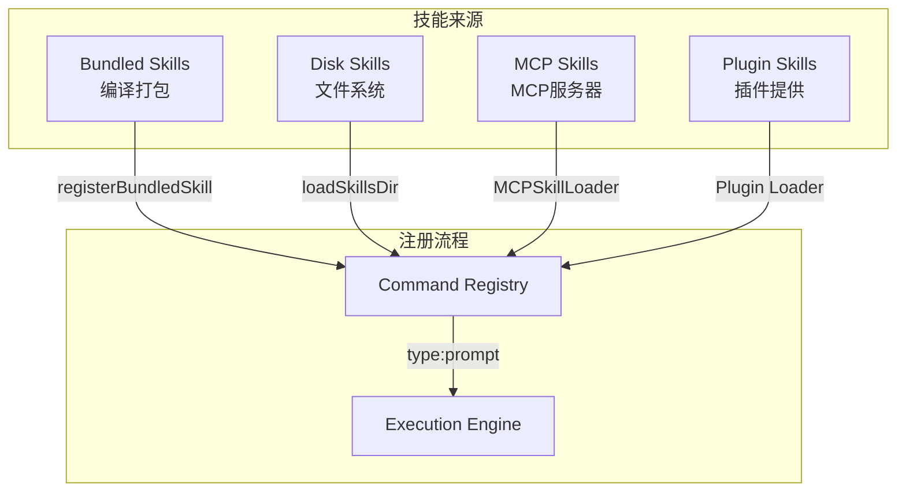
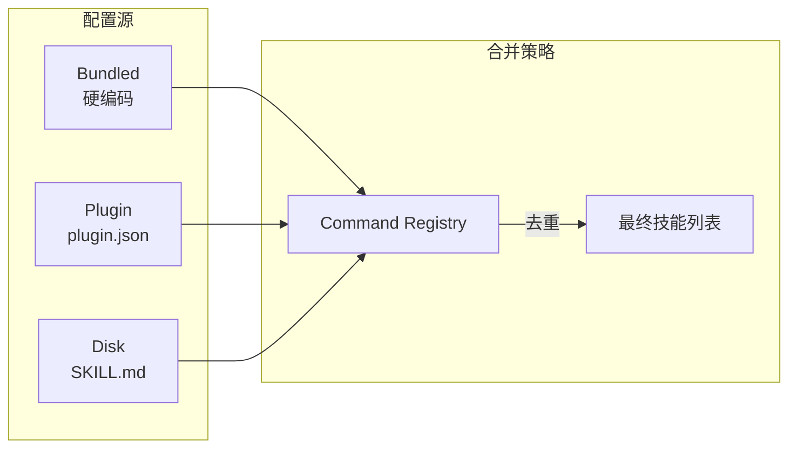

# 19. 技能系统

## 19.1 概述

技能(Skill)是Claude Code中一种特殊类型的提示扩展，它为AI助手提供领域专业知识和工作流程指导。与简单的命令不同，技能通常包含详细的背景知识、参考文件和执行策略，适用于复杂任务的完成。

**核心特点**:
- **Bundled Skills**: 编译时打包到CLI二进制中，始终可用
- **Disk Skills**: 从本地文件系统加载，支持用户自定义
- **Lazy Extraction**: Bundled技能的参考文件按需解压到磁盘
- **Hook集成**: 技能可配置专属Hook，在调用前后执行

**关键代码路径**:
- `src/skills/bundledSkills.ts` - Bundled技能注册与管理
- `src/skills/loadSkillsDir.ts` - 磁盘技能加载
- `src/skills/mcpSkills.ts` - MCP服务器作为技能
- `src/utils/permissions/filesystem.ts` - 技能根目录权限管理

---

## 19.2 设计原理

### 19.2.1 技能类型层次



### 19.2.2 技能定义结构

**BundledSkillDefinition** (`bundledSkills.ts:15-41`):
```typescript
type BundledSkillDefinition = {
  name: string
  description: string
  aliases?: string[]
  whenToUse?: string
  argumentHint?: string
  allowedTools?: string[]
  model?: string
  disableModelInvocation?: boolean
  userInvocable?: boolean
  isEnabled?: () => boolean
  hooks?: HooksSettings
  context?: 'inline' | 'fork'
  agent?: string
  
  // 参考文件（按需解压）
  files?: Record<string, string>
  
  // 动态提示生成
  getPromptForCommand: (args, context) => Promise<ContentBlockParam[]>
}
```

---

## 19.3 实现原理

### 19.3.1 Bundled技能注册

Bundled技能在模块初始化时注册：

```mermaid
sequenceDiagram
    participant Module as 模块初始化
    participant Registry as 技能注册表
    participant Extractor as 文件解压器
    participant FS as 文件系统
    
    Module->>Registry: registerBundledSkill(definition)
    
    alt 有参考文件
        Registry->>Registry: 创建解压目录路径
        Note over Registry: getBundledSkillExtractDir()
        
        Registry->>Registry: 包装getPromptForCommand
        Note over Registry: 闭包缓存extractionPromise
        
        当首次调用时
        Registry->>Extractor: extractBundledSkillFiles()
        Extractor->>FS: 创建目录 (mode 0o700)
        Extractor->>FS: 写入文件 (O_NOFOLLOW|O_EXCL)
        Extractor-->>Registry: 返回目录路径
        Registry->>Registry: prependBaseDir(blocks, dir)
    end
    
    Registry->>Registry: 创建Command对象
    Registry->>Registry: 推入bundledSkills数组
```

**代码实现** (`bundledSkills.ts:53-100`):
```typescript
function registerBundledSkill(definition) {
  const { files } = definition
  let skillRoot
  let getPromptForCommand = definition.getPromptForCommand
  
  if (files && Object.keys(files).length > 0) {
    skillRoot = getBundledSkillExtractDir(definition.name)
    
    // 闭包级memoization：每个进程只解压一次
    let extractionPromise
    const inner = definition.getPromptForCommand
    getPromptForCommand = async (args, ctx) => {
      extractionPromise ??= extractBundledSkillFiles(name, files)
      const extractedDir = await extractionPromise
      const blocks = await inner(args, ctx)
      if (extractedDir) {
        return prependBaseDir(blocks, extractedDir)
      }
      return blocks
    }
  }
  
  const command = {
    type: 'prompt',
    name: definition.name,
    source: 'bundled',
    getPromptForCommand,
    // ...
  }
  bundledSkills.push(command)
}
```

### 19.3.2 安全解压机制

为防止符号链接攻击和权限泄露，文件解压采用严格的安全措施：

**防御策略** (`bundledSkills.ts:131-206`):
```typescript
// 1. 进程级nonce作为目录名（不可预测）
const skillRoot = join(getBundledSkillsRoot(), skillName)

// 2. 严格的文件创建标志
const SAFE_WRITE_FLAGS = O_WRONLY | O_CREAT | O_EXCL | O_NOFOLLOW

// 3. 目录和文件权限（owner-only）
await mkdir(parent, { recursive: true, mode: 0o700 })
await open(path, SAFE_WRITE_FLAGS, 0o600)

// 4. 路径遍历检查
function resolveSkillFilePath(baseDir, relPath) {
  const normalized = normalize(relPath)
  if (isAbsolute(normalized) || normalized.includes('..')) {
    throw new Error('Path escapes skill dir')
  }
  return join(baseDir, normalized)
}
```

### 19.3.3 磁盘技能加载

从指定目录扫描SKILL.md文件：

**loadSkillsDir流程** (`loadSkillsDir.ts`):
```typescript
async function loadSkillsDir(skillsDir, source) {
  const skills = []
  
  // 扫描子目录
  const entries = await readdir(skillsDir, { withFileTypes: true })
  
  for (const entry of entries) {
    if (!entry.isDirectory()) continue
    
    const skillPath = join(skillsDir, entry.name, 'SKILL.md')
    if (await pathExists(skillPath)) {
      const skill = await loadSkill(skillPath, source)
      skills.push(skill)
    }
  }
  
  return skills
}

async function loadSkill(skillPath, source) {
  const content = await readFile(skillPath, 'utf8')
  const { frontmatter, body } = parseFrontmatter(content)
  
  return {
    type: 'prompt',
    name: frontmatter.name,
    description: frontmatter.description,
    content: body,
    skillRoot: dirname(skillPath),
    source,
    // ...
  }
}
```

---

## 19.4 功能展开

### 19.4.1 技能目录结构

标准技能目录结构：

```
my-skill/
├── SKILL.md          # 必需：技能定义
├── reference.md      # 可选：详细参考文档
├── examples/         # 可选：示例文件
│   ├── basic.md
│   └── advanced.md
└── templates/        # 可选：模板文件
    └── component.md
```

**SKILL.md格式**:
```markdown
---
name: code-review
description: Automated code review with best practices
whenToUse: Use when reviewing pull requests or code changes
allowedTools:
  - Read
  - Grep
  - Bash
---

# Code Review Skill

You are an expert code reviewer. Analyze the provided code for:

1. **Correctness**: Logic errors, edge cases
2. **Security**: Vulnerabilities, sensitive data exposure
3. **Performance**: Inefficiencies, memory leaks
4. **Maintainability**: Code smell, naming conventions

## Reference Files
The skill can access additional context from:
- `reference.md` - Detailed checklist
- `examples/` - Sample reviews
```

### 19.4.2 参考文件访问

技能的参考文件通过`skillRoot`机制访问：

```typescript
// 技能加载时设置skillRoot
const skill = {
  skillRoot: dirname(skillPath),  // 磁盘技能
  // 或
  skillRoot: getBundledSkillExtractDir(name),  // Bundled技能
}

// 提示生成时添加base目录前缀
function prependBaseDir(blocks, baseDir) {
  const prefix = `Base directory for this skill: ${baseDir}\n\n`
  // 前缀到第一个文本块
}
```

AI可以通过Read/Grep工具访问这些文件：
```
Base directory for this skill: /path/to/skill/root

[Skill prompt content...]
```

### 19.4.3 技能Hook集成

技能可配置专属Hook：

```typescript
const skill = {
  name: 'deploy',
  hooks: {
    PrePrompt: [
      { type: 'command', command: 'npm test' }
    ],
    PostPrompt: [
      { type: 'command', command: 'notify-send "Deploy completed"' }
    ]
  }
}
```

---

## 19.5 数据结构

### 19.5.1 Command类型（技能复用）

技能在系统中作为`type: 'prompt'`的Command存在：

```typescript
type Command = {
  type: 'prompt'  // 技能类型
  
  // 基础信息
  name: string
  description: string
  aliases?: string[]
  whenToUse?: string
  argumentHint?: string
  
  // 执行配置
  allowedTools?: string[]
  model?: string
  disableModelInvocation?: boolean
  userInvocable?: boolean
  isEnabled?: () => boolean
  isHidden?: boolean
  
  // 来源信息
  source: 'bundled' | 'disk' | 'plugin' | 'mcp'
  loadedFrom: string
  contentLength: number
  
  // 技能特有
  skillRoot?: string
  hooks?: HooksSettings
  context?: 'inline' | 'fork'
  agent?: string
  
  // 提示生成
  getPromptForCommand: (args, ctx) => Promise<ContentBlockParam[]>
}
```

### 19.5.2 技能配置来源



---

## 19.6 组合使用

### 19.6.1 完整技能示例

**文件结构**:
```
skills/
└── api-design/
    ├── SKILL.md
    ├── openapi-reference.md
    └── examples/
        ├── rest-api.md
        └── graphql-api.md
```

**SKILL.md**:
```markdown
---
name: api-design
description: Design RESTful and GraphQL APIs with OpenAPI specification
whenToUse: Use when designing new APIs or documenting existing ones
allowedTools:
  - Read
  - Write
  - Edit
argumentHint: "<api-type> <description>"
---

# API Design Skill

You are an API design expert specializing in REST and GraphQL.

## Available Resources
- `openapi-reference.md` - OpenAPI 3.0 specification guide
- `examples/rest-api.md` - REST API design patterns
- `examples/graphql-api.md` - GraphQL schema patterns

## Workflow
1. Analyze requirements
2. Design resource models
3. Define endpoints/queries
4. Generate OpenAPI schema
```

**使用方式**:
```
User: /api-design rest User management system
AI: [加载技能，访问参考文件，生成API设计]
```

### 19.6.2 与其他系统集成

| 集成点 | 说明 | 代码位置 |
|-------|------|---------|
| Plugin → Skill | 插件的skills路径被扫描 | `pluginLoader.ts:~550` |
| Skill → Hook | 技能Hook在调用时执行 | `hooks.ts:~800` |
| Skill → Agent | 技能可指定使用特定代理 | `Command.agent` |
| Skill → Tools | 技能可限制可用工具集 | `Command.allowedTools` |

---

## 19.7 小结

Claude Code的技能系统通过以下设计实现了灵活的知识注入：

| 特性 | 实现方式 | 代码位置 |
|-----|---------|---------|
| Bundled技能 | 编译时注册 + 按需解压 | `bundledSkills.ts:53-100` |
| 安全解压 | O_NOFOLLOW\|O_EXCL + 0o700权限 | `bundledSkills.ts:131-206` |
| 参考文件 | skillRoot + prependBaseDir | `bundledSkills.ts:208-220` |
| 多源加载 | Bundled/Disk/Plugin/MCP四源合一 | `loadSkillsDir.ts` |
| Lazy加载 | 首次调用时解压，Promise缓存 | `bundledSkills.ts:66-72` |

**关键设计决策**:
1. **Command复用**: 技能作为`type: 'prompt'`的Command，统一管理
2. **闭包memoization**: extractionPromise确保并发调用只解压一次
3. **权限隔离**: 0o700目录 + 0o600文件防止权限泄露
4. **目录前缀**: Base directory提示让AI知道可访问文件位置
