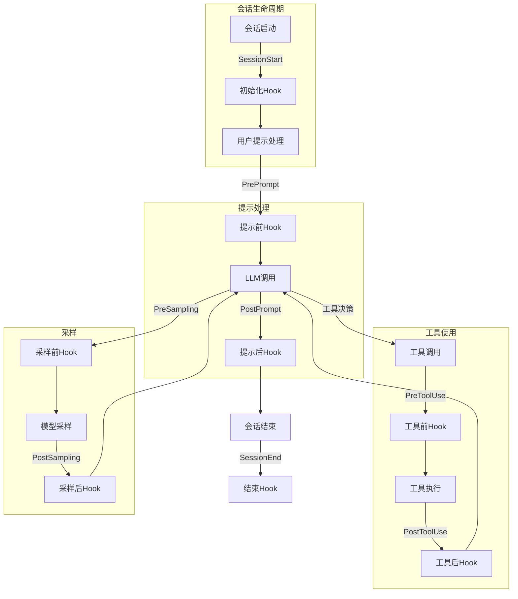
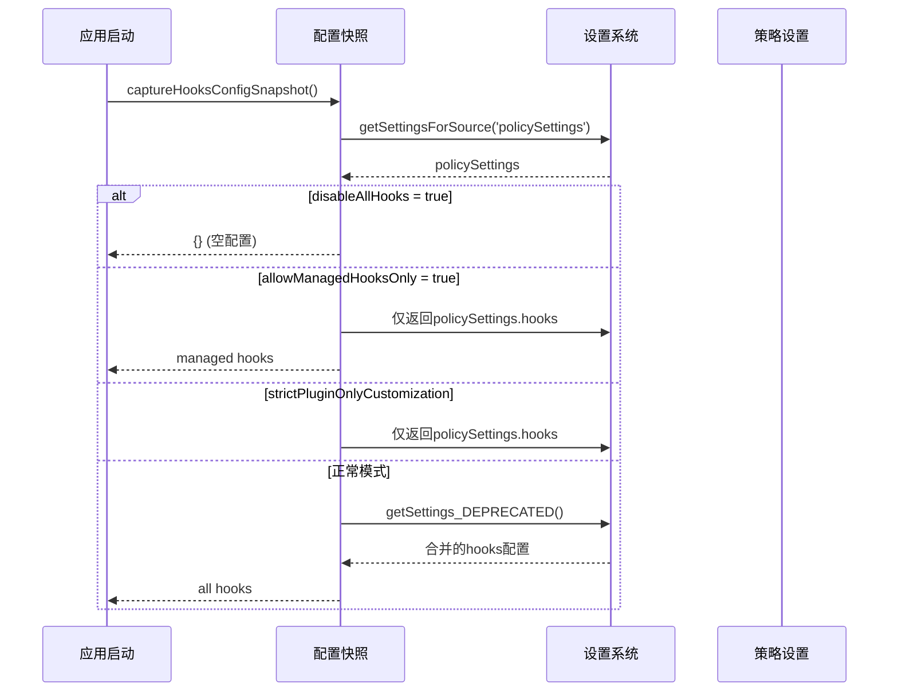

# 20. Hook系统

## 20.1 概述

Hook系统是Claude Code的事件驱动扩展机制，允许用户在AI助手的关键生命周期节点注入自定义逻辑。Hook可以执行Shell命令、发送HTTP请求或调用Agent，实现自动化工作流、安全检查和外部系统集成。

**核心特性**:
- **生命周期Hook**: 覆盖AI交互的各个阶段（PreToolUse, PostToolUse等）
- **多执行模式**: Command/HTTP/Agent三种Hook类型
- **策略控制**: 企业级Hook策略管理（allowManagedHooksOnly）
- **异步执行**: 非阻塞执行，支持超时控制

**关键代码路径**:
- `src/utils/hooks.ts` - Hook执行引擎
- `src/utils/hooks/hooksConfigSnapshot.ts` - Hook配置快照
- `src/utils/hooks/execPromptHook.ts` - Command Hook执行
- `src/utils/hooks/execHttpHook.ts` - HTTP Hook执行
- `src/utils/hooks/execAgentHook.ts` - Agent Hook执行

---

## 20.2 设计原理

### 20.2.1 Hook生命周期



### 20.2.2 Hook类型定义

**HooksSettings结构** (`types/settings.ts`):
```typescript
type HooksSettings = {
  SessionStart?: Hook[]
  SessionEnd?: Hook[]
  PrePrompt?: Hook[]
  PostPrompt?: Hook  // New API: Block-based prompt response
  PreToolUse?: Hook[]
  PostToolUse?: Hook[]
  PreSampling?: Hook[]  // 模型采样前
  PostSampling?: Hook[]  // 模型采样后
}

type Hook =
  | { type: 'command', command: string, timeout?: number }
  | { type: 'http', url: string, method?: string, headers?: Record<string, string> }
  | { type: 'agent', agent: string }
```

---

## 20.3 实现原理

### 20.3.1 配置快照机制

为防止Hook配置在会话中被修改，系统在启动时捕获快照：



**代码实现** (`hooksConfigSnapshot.ts:18-53`):
```typescript
function getHooksFromAllowedSources(): HooksSettings {
  const policySettings = getSettingsForSource('policySettings')
  
  // 托管设置禁用所有Hook
  if (policySettings?.disableAllHooks === true) {
    return {}
  }
  
  // 仅允许托管Hook
  if (policySettings?.allowManagedHooksOnly === true) {
    return policySettings.hooks ?? {}
  }
  
  // strictPluginOnly策略
  if (isRestrictedToPluginOnly('hooks')) {
    return policySettings?.hooks ?? {}
  }
  
  // 用户设置禁用Hook（托管Hook仍运行）
  const mergedSettings = getSettings_DEPRECATED()
  if (mergedSettings.disableAllHooks === true) {
    return policySettings?.hooks ?? {}
  }
  
  // 合并所有来源的Hook
  return mergedSettings.hooks ?? {}
}
```

### 20.3.2 Hook执行流程

**主执行器** (`hooks.ts`):
```typescript
async function executeHook(
  hook: Hook,
  hookName: string,
  context: HookContext
): Promise<HookResult> {
  const timeout = hook.timeout ?? 60000
  
  try {
    switch (hook.type) {
      case 'command':
        return await execPromptHook(hook, context, timeout)
      case 'http':
        return await execHttpHook(hook, context, timeout)
      case 'agent':
        return await execAgentHook(hook, context, timeout)
    }
  } catch (error) {
    return {
      status: 'error',
      error: errorMessage(error)
    }
  }
}
```

**执行上下文** (`hooks.ts:~200-300`):
```typescript
type HookContext = {
  hookName: string  // PreToolUse, PostToolUse等
  
  // 工具相关上下文
  tool?: string
  toolInput?: unknown
  toolOutput?: unknown
  
  // 采样相关上下文
  samplingMessages?: Message[]
  samplingModel?: string
  
  // 提示相关上下文
  prompt?: string
  promptResponse?: ContentBlockParam[]
  
  // 会话上下文
  sessionId?: string
  cwd?: string
}
```

### 20.3.3 Command Hook执行

**执行机制** (`execPromptHook.ts`):
```typescript
async function execPromptHook(
  hook: CommandHook,
  context: HookContext,
  timeout: number
): Promise<HookResult> {
  // 构建环境变量
  const env = {
    ...process.env,
    HOOK_NAME: context.hookName,
    HOOK_TOOL: context.tool,
    HOOK_INPUT: JSON.stringify(context.toolInput),
    HOOK_OUTPUT: JSON.stringify(context.toolOutput),
    // ...
  }
  
  // 执行命令
  const { stdout, stderr } = await execFile(hook.command, {
    env,
    timeout,
    maxBuffer: 10 * 1024 * 1024,  // 10MB
    cwd: context.cwd
  })
  
  // 解析输出
  if (stdout.includes('HOOK_RESULT:')) {
    const result = parseHookResult(stdout)
    return { status: 'success', ...result }
  }
  
  return { status: 'success', output: stdout }
}
```

### 20.3.4 HTTP Hook执行

**请求构建** (`execHttpHook.ts`):
```typescript
async function execHttpHook(
  hook: HttpHook,
  context: HookContext,
  timeout: number
): Promise<HookResult> {
  const response = await fetch(hook.url, {
    method: hook.method ?? 'POST',
    headers: {
      'Content-Type': 'application/json',
      ...hook.headers
    },
    body: JSON.stringify({
      hook: context.hookName,
      tool: context.tool,
      input: context.toolInput,
      output: context.toolOutput,
      sessionId: context.sessionId,
      timestamp: new Date().toISOString()
    }),
    signal: AbortSignal.timeout(timeout)
  })
  
  const result = await response.json()
  return {
    status: 'success',
    ...result
  }
}
```

### 20.3.5 Agent Hook执行

**委托执行** (`execAgentHook.ts`):
```typescript
async function execAgentHook(
  hook: AgentHook,
  context: HookContext
): Promise<HookResult> {
  // 加载Agent定义
  const agent = await loadAgent(hook.agent)
  
  // 构建Agent输入
  const agentInput = buildAgentInput(context)
  
  // 执行Agent（可能fork新会话）
  const result = await runAgent(agent, agentInput)
  
  return {
    status: 'success',
    output: result.output
  }
}
```

---

## 20.4 功能展开

### 20.4.1 Hook结果处理

Hook可以返回结构化结果影响AI行为：

**批准/拒绝工具调用** (`hooks.ts:~600-700`):
```typescript
type HookResult = {
  status: 'success' | 'error' | 'timeout'
  
  // 工具调用控制
  approve?: boolean  // false时阻止工具执行
  reason?: string    // 拒绝原因
  
  // 输出修改
  output?: string    // 替换工具输出
  
  // 提示修改
  prompt?: string    // 修改用户提示
  
  // 错误信息
  error?: string
}

// PreToolUse Hook拒绝示例
{
  status: 'success',
  approve: false,
  reason: 'Blocked by security policy: production file access'
}
```

### 20.4.2 Hook超时与错误处理

**超时控制** (`hooks.ts:~400-500`):
```typescript
async function executeHooksWithTimeout(
  hooks: Hook[],
  context: HookContext
): Promise<HookResult[]> {
  return await Promise.all(
    hooks.map(hook => 
      withTimeout(
        executeHook(hook, context),
        hook.timeout ?? 60000
      ).catch(error => ({
        status: 'error',
        error: errorMessage(error)
      }))
    )
  )
}

// 超时包装器
function withTimeout<T>(promise: Promise<T>, ms: number): Promise<T> {
  return Promise.race([
    promise,
    new Promise<T>((_, reject) =>
      setTimeout(() => reject(new Error('Timeout')), ms)
    )
  ])
}
```

### 20.4.3 策略控制

**企业级Hook策略** (`hooksConfigSnapshot.ts:62-76`):

```mermaid
graph TB
    subgraph "策略级别"
        M[托管设置<br/>policySettings] --> |disableAllHooks| D1[禁用所有Hook]
        M --> |allowManagedHooksOnly| D2[仅托管Hook]
        
        U[用户设置<br/>local/project] --> |disableAllHooks| D3[禁用用户Hook<br/>托管Hook仍运行]
    end
    
    D1 --> F[{}]
    D2 --> F
    D3 --> G[policySettings.hooks]
```

**优先级规则**:
1. 托管设置的`disableAllHooks`完全禁用所有Hook
2. 托管设置的`allowManagedHooksOnly`只允许托管Hook
3. 用户设置的`disableAllHooks`只禁用用户Hook，托管Hook继续运行
4. `strictPluginOnlyCustomization`策略阻止用户/项目Hook

---

## 20.5 数据结构

### 20.5.1 Hook配置示例

**settings.json**:
```json
{
  "hooks": {
    "SessionStart": [
      {
        "type": "command",
        "command": "echo 'Session started at $(date)'"
      }
    ],
    "PreToolUse": [
      {
        "type": "http",
        "url": "https://api.company.com/hook/pre-tool",
        "timeout": 5000
      }
    ],
    "PostToolUse": [
      {
        "type": "command",
        "command": "/scripts/log-tool.sh",
        "timeout": 30000
      }
    ],
    "PrePrompt": [
      {
        "type": "agent",
        "agent": "security-scanner"
      }
    ]
  }
}
```

### 20.5.2 Hook执行状态

```typescript
type HookExecutionState = {
  hookName: string
  hookType: 'command' | 'http' | 'agent'
  startTime: number
  endTime?: number
  duration?: number
  status: 'running' | 'success' | 'error' | 'timeout'
  result?: HookResult
  error?: string
}
```

---

## 20.6 组合使用

### 20.6.1 安全审计工作流

**场景**: 记录所有敏感操作并实时通知

```json
{
  "hooks": {
    "PreToolUse": [
      {
        "type": "command",
        "command": "/security/check-operation.sh"
      }
    ],
    "PostToolUse": [
      {
        "type": "http",
        "url": "https://audit.company.com/log",
        "headers": {
          "Authorization": "Bearer ${AUDIT_TOKEN}"
        }
      }
    ]
  }
}
```

**check-operation.sh**:
```bash
#!/bin/bash
TOOL=$HOOK_TOOL
INPUT=$HOOK_INPUT

# 检查敏感文件访问
if echo "$INPUT" | grep -q "/etc/passwd\|/etc/shadow"; then
  echo "HOOK_RESULT: {\"approve\": false, \"reason\": \"Sensitive file access blocked\"}"
  exit 0
fi

# 检查危险命令
if [ "$TOOL" = "Bash" ]; then
  CMD=$(echo "$INPUT" | jq -r '.command')
  if echo "$CMD" | grep -qE "rm -rf|sudo|chmod 777"; then
    echo "HOOK_RESULT: {\"approve\": false, \"reason\": \"Dangerous command blocked\"}"
    exit 0
  fi
fi

echo "HOOK_RESULT: {\"approve\": true}"
```

### 20.6.2 自动化测试工作流

**场景**: 代码修改后自动运行测试

```json
{
  "hooks": {
    "PostToolUse": [
      {
        "type": "command",
        "command": "/scripts/auto-test.sh",
        "timeout": 120000
      }
    ]
  }
}
```

**auto-test.sh**:
```bash
#!/bin/bash
TOOL=$HOOK_TOOL

# 只在文件编辑后运行测试
if [ "$TOOL" = "Edit" ] || [ "$TOOL" = "Write" ]; then
  FILE=$(echo "$HOOK_INPUT" | jq -r '.filePath')
  
  # 检测测试文件
  if [[ "$FILE" == *test* ]] || [[ "$FILE" == *spec* ]]; then
    npm test -- "$FILE"
  else
    # 运行相关测试
    npm test -- --findRelatedTests "$FILE"
  fi
fi
```

### 20.6.3 与其他系统集成

| 集成点 | 说明 | 代码位置 |
|-------|------|---------|
| Plugin → Hook | 插件的hooks配置被合并 | `pluginLoader.ts:~650` |
| Skill → Hook | 技能的hooks在调用时执行 | `hooks.ts:~800` |
| Agent → Hook | Agent frontmatter可定义hooks | `runAgent.ts:~535` |
| Settings → Hook | 用户/项目设置提供hooks | `hooksConfigSnapshot.ts:18` |

---

## 20.7 小结

Claude Code的Hook系统通过以下设计实现了灵活的事件驱动扩展：

| 特性 | 实现方式 | 代码位置 |
|-----|---------|---------|
| 生命周期覆盖 | 8个Hook时机点 | `types/settings.ts` |
| 多执行模式 | Command/HTTP/Agent三种类型 | `hooks.ts:~200` |
| 策略控制 | allowManagedHooksOnly + disableAllHooks | `hooksConfigSnapshot.ts:18-53` |
| 超时控制 | Promise.race + AbortSignal | `hooks.ts:~400` |
| 结果处理 | 批准/拒绝/修改输出 | `hooks.ts:~600` |

**关键设计决策**:
1. **配置快照**: 启动时捕获，防止运行时修改
2. **非阻塞执行**: 异步并行执行，不阻塞主流程
3. **托管优先**: 用户不能禁用托管Hook，托管可禁用所有
4. **结构化输出**: HOOK_RESULT协议支持复杂交互
5. **环境变量传递**: 通过环境变量传递上下文，Shell友好
