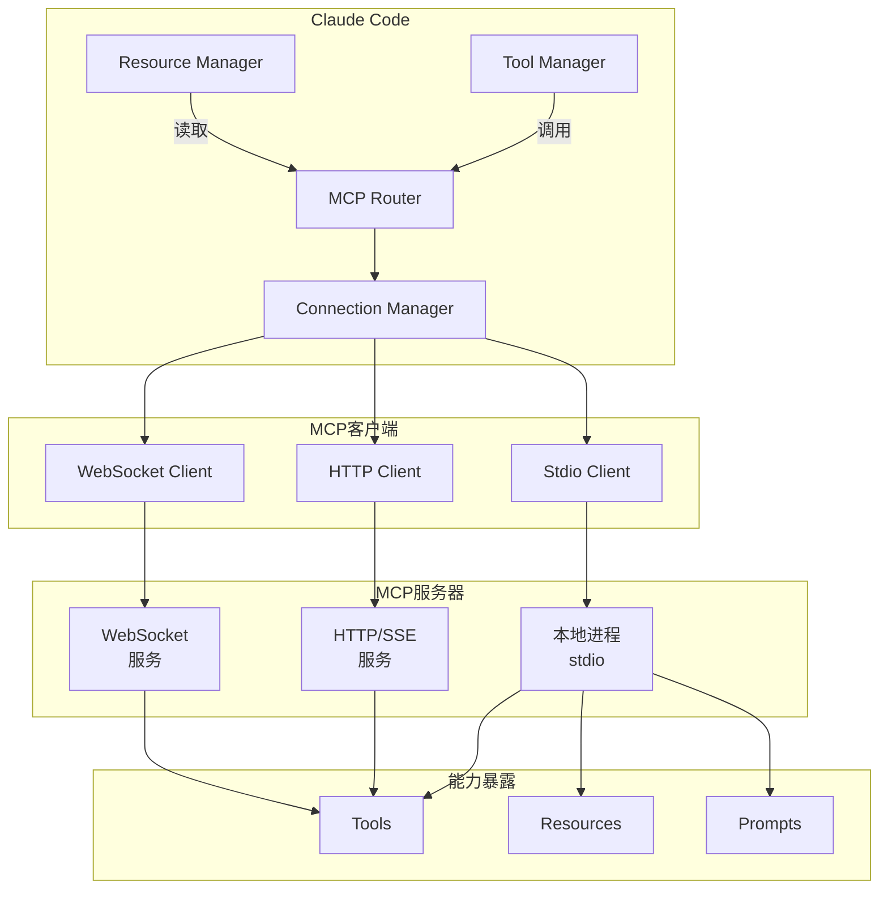
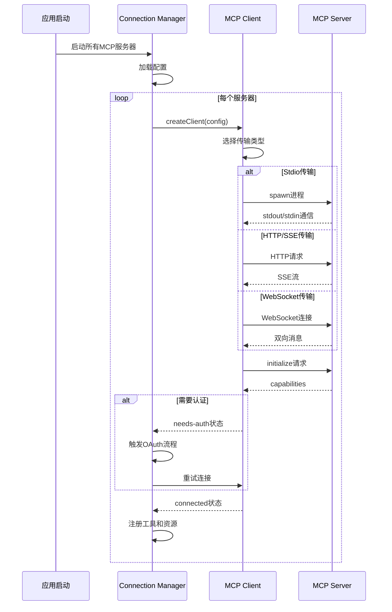
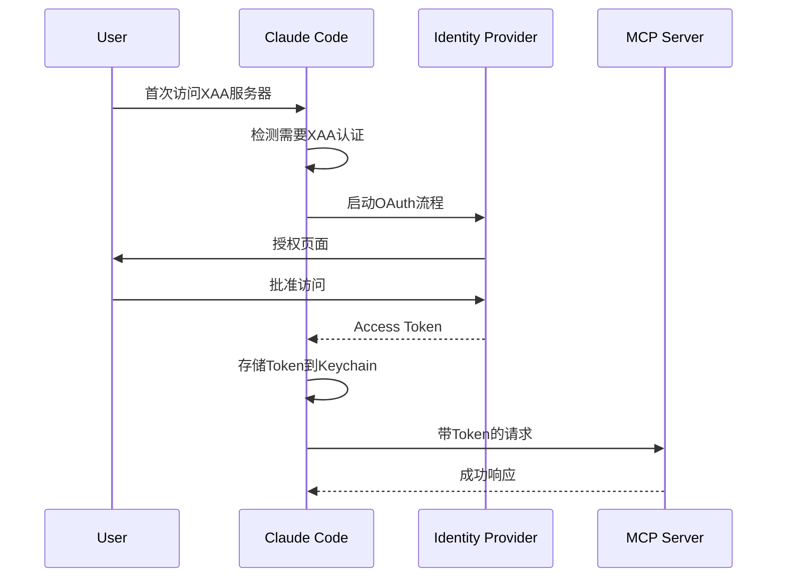
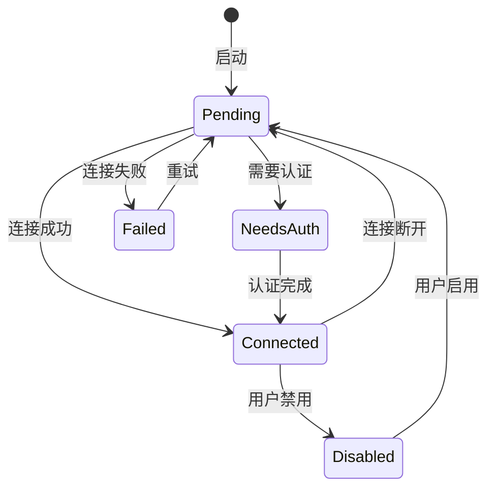

# 21. MCP集成

## 21.1 概述

MCP (Model Context Protocol) 是Anthropic推出的标准化协议，用于连接AI助手与外部数据源和工具。Claude Code深度集成了MCP，支持多种传输协议、OAuth认证、资源访问和工具调用，为AI提供了丰富的上下文能力。

**核心特性**:
- **多传输协议**: Stdio、SSE、HTTP、WebSocket
- **OAuth认证**: 支持OAuth 2.0流程和Cross-App Access
- **资源访问**: 动态发现和读取MCP服务器提供的资源
- **工具调用**: 将MCP工具映射为Claude Code原生工具
- **连接管理**: 自动重连、健康检查、状态监控

**关键代码路径**:
- `src/services/mcp/client.ts` - MCP客户端核心实现
- `src/services/mcp/types.ts` - MCP类型定义
- `src/services/mcp/connectionManager.ts` - 连接管理
- `src/services/mcp/toolRegistry.ts` - 工具注册

---

## 21.2 设计原理

### 21.2.1 MCP架构概览



### 21.2.2 服务器配置类型

**McpServerConfig联合类型** (`types.ts:124-161`):

```typescript
type McpServerConfig =
  | McpStdioServerConfig      // 本地进程
  | McpSSEServerConfig        // SSE连接
  | McpHTTPServerConfig       // HTTP连接
  | McpWebSocketServerConfig  // WebSocket连接
  | McpSdkServerConfig        // SDK内置
  | McpClaudeAIProxyServerConfig  // Claude.ai代理
```

---

## 21.3 实现原理

### 21.3.1 连接建立流程



**代码实现** (`client.ts:~100-300`):
```typescript
async function connectMcpServer(
  name: string,
  config: ScopedMcpServerConfig
): Promise<MCPServerConnection> {
  try {
    let transport: Transport
    
    switch (config.type) {
      case 'stdio':
        transport = await createStdioTransport(config)
        break
      case 'sse':
        transport = await createSSETransport(config)
        break
      case 'http':
        transport = await createHTTPTransport(config)
        break
      case 'ws':
        transport = await createWebSocketTransport(config)
        break
      case 'sdk':
        return createSdkClient(config)
    }
    
    const client = new Client({ name: 'claude-code', version: VERSION }, {
      capabilities: { tools: {}, resources: {} }
    })
    
    await client.connect(transport)
    
    const capabilities = client.getServerCapabilities()
    
    return {
      type: 'connected',
      client,
      name,
      capabilities,
      config,
      cleanup: async () => {
        await client.close()
        await transport.close()
      }
    }
  } catch (error) {
    if (isAuthError(error)) {
      return { type: 'needs-auth', name, config }
    }
    return { type: 'failed', name, config, error: errorMessage(error) }
  }
}
```

### 21.3.2 Stdio传输实现

**进程通信** (`client.ts:~400-500`):
```typescript
async function createStdioTransport(config: McpStdioServerConfig) {
  const childProcess = spawn(config.command, config.args, {
    env: { ...process.env, ...config.env },
    stdio: ['pipe', 'pipe', 'pipe']
  })
  
  const transport = new StdioClientTransport(
    childProcess.stdin,
    childProcess.stdout
  )
  
  // 捕获stderr用于调试
  childProcess.stderr.on('data', (data) => {
    logForDebugging(`MCP server stderr: ${data}`)
  })
  
  return transport
}
```

### 21.3.3 HTTP/SSE传输实现

**SSE客户端** (`client.ts:~500-600`):
```typescript
async function createSSETransport(config: McpSSEServerConfig) {
  // 处理OAuth
  let headers = config.headers || {}
  if (config.oauth) {
    const token = await getOAuthToken(config.oauth)
    headers = { ...headers, Authorization: `Bearer ${token}` }
  }
  
  const transport = new SSEClientTransport(
    new URL(config.url),
    { headers }
  )
  
  return transport
}
```

### 21.3.4 工具发现与注册

**工具映射** (`toolRegistry.ts`):
```typescript
async function registerMcpTools(client: ConnectedMCPServer) {
  if (!client.capabilities.tools) return
  
  const { tools } = await client.client.listTools()
  
  for (const tool of tools) {
    // 标准化工具名称（防止命名冲突）
    const normalizedName = normalizeToolName(client.name, tool.name)
    
    // 注册到Claude Code工具系统
    registerTool({
      name: normalizedName,
      description: tool.description,
      inputSchema: tool.inputSchema,
      
      // 执行时调用MCP工具
      execute: async (input) => {
        const result = await client.client.callTool({
          name: tool.name,
          arguments: input
        })
        return transformToolResult(result)
      }
    })
  }
}
```

**名称标准化**:
```typescript
function normalizeToolName(serverName: string, toolName: string): string {
  // mcp__<server>__<tool> 格式
  return `mcp__${serverName}__${toolName}`
}

// 示例: slack服务器的post_message工具
// -> mcp__slack__post_message
```

### 21.3.5 资源访问

**资源发现** (`client.ts:~700-800`):
```typescript
async function discoverResources(client: ConnectedMCPServer) {
  if (!client.capabilities.resources) return []
  
  const { resources } = await client.client.listResources()
  
  return resources.map(resource => ({
    uri: resource.uri,
    name: resource.name,
    mimeType: resource.mimeType,
    server: client.name
  }))
}

async function readResource(
  client: ConnectedMCPServer,
  uri: string
): Promise<ResourceContents> {
  const { contents } = await client.client.readResource({ uri })
  return contents
}
```

---

## 21.4 功能展开

### 21.4.1 OAuth认证流程

**Cross-App Access (XAA)** (`types.ts:37-56`):


**配置示例**:
```json
{
  "mcpServers": {
    "enterprise-data": {
      "type": "http",
      "url": "https://mcp.company.com",
      "oauth": {
        "authServerMetadataUrl": "https://auth.company.com/.well-known/oauth",
        "xaa": true
      }
    }
  }
}
```

### 21.4.2 连接状态管理

**状态机**:


**状态定义** (`types.ts:180-227`):
```typescript
type MCPServerConnection =
  | ConnectedMCPServer  // 已连接
  | FailedMCPServer     // 连接失败
  | NeedsAuthMCPServer  // 需要认证
  | PendingMCPServer    // 等待连接
  | DisabledMCPServer   // 已禁用
```

### 21.4.3 自动重连机制

**重连策略** (`connectionManager.ts`):
```typescript
async function handleDisconnect(name: string, attempt: number) {
  const maxAttempts = 5
  const baseDelay = 1000  // 1秒
  
  if (attempt >= maxAttempts) {
    updateConnection(name, { type: 'failed', error: 'Max reconnect attempts' })
    return
  }
  
  const delay = baseDelay * Math.pow(2, attempt)  // 指数退避
  await sleep(delay)
  
  try {
    const connection = await connectMcpServer(name, config)
    updateConnection(name, connection)
  } catch (error) {
    await handleDisconnect(name, attempt + 1)
  }
}
```

### 21.4.4 工具调用转换

**MCP工具结果 → Claude Code格式**:
```typescript
function transformToolResult(result: CallToolResult): ToolResult {
  const contents: ContentBlock[] = []
  
  for (const content of result.content) {
    switch (content.type) {
      case 'text':
        contents.push({ type: 'text', text: content.text })
        break
      case 'image':
        contents.push({
          type: 'image',
          source: {
            type: 'base64',
            media_type: content.mimeType,
            data: content.data
          }
        })
        break
      case 'resource':
        contents.push({
          type: 'resource',
          resource: content.resource
        })
        break
    }
  }
  
  return { content: contents }
}
```

---

## 21.5 数据结构

### 21.5.1 服务器配置详解

**Stdio配置** (`types.ts:28-35`):
```typescript
type McpStdioServerConfig = {
  type?: 'stdio'  // 可选，向后兼容
  command: string  // 执行命令
  args?: string[]  // 命令参数
  env?: Record<string, string>  // 环境变量
}

// 示例
{
  "command": "node",
  "args": ["server.js", "--port", "3000"],
  "env": {
    "DEBUG": "mcp:*",
    "API_KEY": "${MCP_API_KEY}"
  }
}
```

**HTTP配置** (`types.ts:89-97`):
```typescript
type McpHTTPServerConfig = {
  type: 'http'
  url: string
  headers?: Record<string, string>
  headersHelper?: string  // 动态获取headers的脚本
  oauth?: McpOAuthConfig
}
```

### 21.5.2 连接状态

**ConnectedMCPServer** (`types.ts:180-192`):
```typescript
type ConnectedMCPServer = {
  client: Client  // @modelcontextprotocol/sdk客户端
  name: string
  type: 'connected'
  capabilities: ServerCapabilities  // 服务器能力
  
  serverInfo?: {
    name: string
    version: string
  }
  instructions?: string  // 服务器使用说明
  
  config: ScopedMcpServerConfig
  cleanup: () => Promise<void>
}
```

### 21.5.3 工具序列化

**SerializedTool** (`types.ts:232-244`):
```typescript
interface SerializedTool {
  name: string
  description: string
  inputJSONSchema?: {
    type: 'object'
    properties?: { [x: string]: unknown }
  }
  isMcp?: boolean
  originalToolName?: string  // MCP原始工具名
}
```

---

## 21.6 组合使用

### 21.6.1 完整MCP服务器配置

**settings.json**:
```json
{
  "mcpServers": {
    "filesystem": {
      "type": "stdio",
      "command": "npx",
      "args": ["-y", "@anthropic/mcp-server-filesystem", "/home/user/projects"]
    },
    "slack": {
      "type": "http",
      "url": "https://slack-mcp.company.com",
      "oauth": {
        "authServerMetadataUrl": "https://slack.com/.well-known/oauth"
      }
    },
    "database": {
      "type": "stdio",
      "command": "python",
      "args": ["mcp_db_server.py"],
      "env": {
        "DATABASE_URL": "${DB_CONNECTION_STRING}"
      }
    }
  }
}
```

### 21.6.2 插件提供MCP服务器

**plugin.json**:
```json
{
  "name": "my-plugin",
  "mcpServers": {
    "custom-api": {
      "type": "http",
      "url": "https://api.example.com/mcp"
    }
  }
}
```

**加载流程**:


### 21.6.3 与其他系统集成

| 集成点 | 说明 | 代码位置 |
|-------|------|---------|
| Plugin → MCP | 插件可提供MCP服务器 | `pluginLoader.ts:~650` |
| MCP → Tool | MCP工具注册为原生工具 | `toolRegistry.ts` |
| MCP → Resource | MCP资源可通过Read访问 | `client.ts:~700` |
| MCP → Hook | MCP工具调用触发Hook | `hooks.ts` |

---

## 21.7 小结

Claude Code的MCP集成通过以下设计实现了强大的外部能力扩展：

| 特性 | 实现方式 | 代码位置 |
|-----|---------|---------|
| 多传输协议 | Stdio/SSE/HTTP/WS四种传输 | `client.ts:~400-600` |
| OAuth认证 | OAuth 2.0 + XAA支持 | `types.ts:37-56` |
| 工具映射 | mcp__server__tool命名空间 | `toolRegistry.ts` |
| 连接管理 | 状态机 + 自动重连 | `connectionManager.ts` |
| 资源访问 | listResources + readResource | `client.ts:~700` |

**关键设计决策**:
1. **统一抽象**: 所有MCP服务器类型共用Client接口
2. **命名空间**: mcp__前缀防止工具名冲突
3. **配置合并**: 多来源配置按优先级合并
4. **错误隔离**: 单个服务器失败不影响其他服务器
5. **安全隔离**: OAuth token存储在系统Keychain

**MCP协议优势**:
- **标准化**: Anthropic主导的开放协议
- **可发现**: 工具和资源动态发现
- **可扩展**: 支持自定义能力声明
- **安全**: OAuth 2.0标准认证
