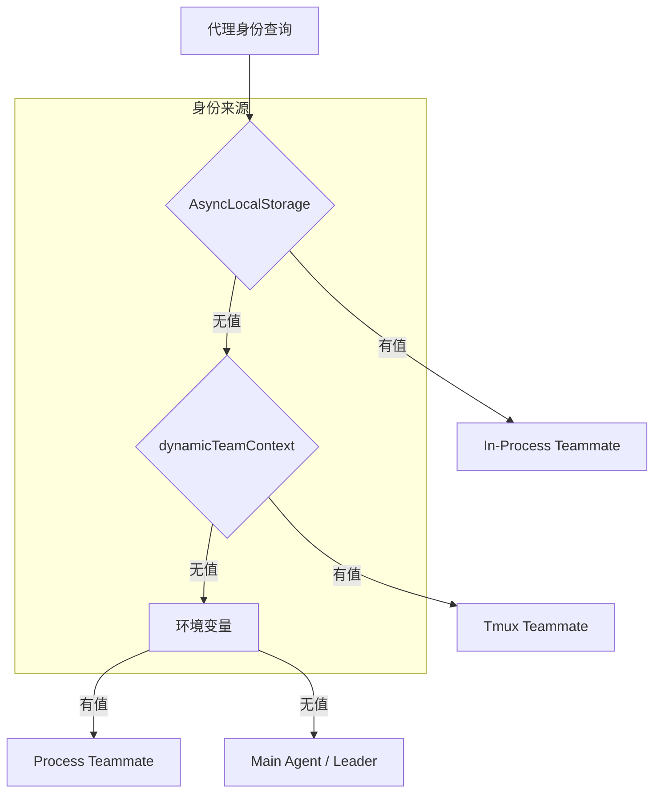
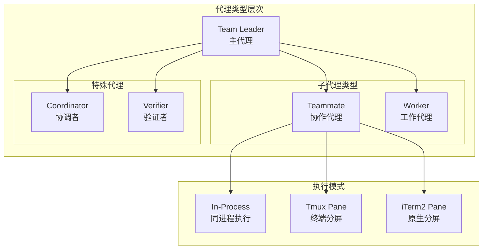
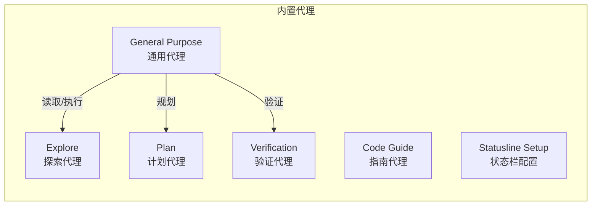
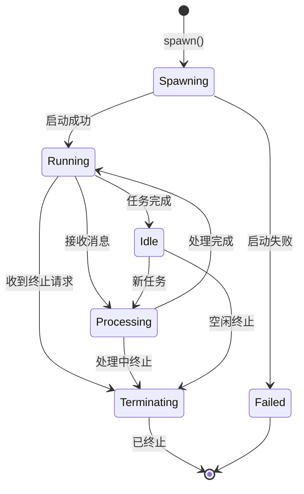
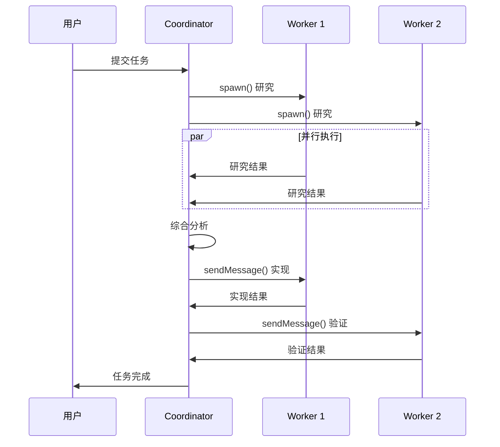
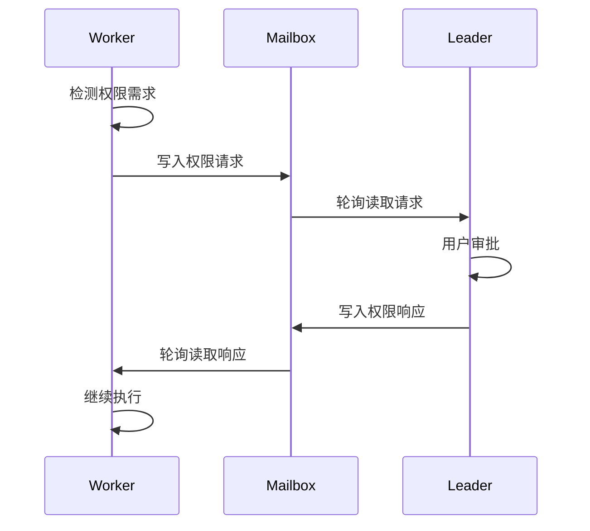

# 22. 代理类型与角色

> 多代理协作系统中的代理身份定义与角色分工

---

## 概述

Claude Code 的多代理协作系统支持多种代理类型，每种代理承担不同的职责。代理类型决定了代理的执行模式、权限边界和通信方式。

**核心概念**：
- **主代理 (Leader)**：用户直接交互的代理，负责协调和分配任务
- **子代理 (Teammate)**：由主代理启动的工作代理，执行具体任务
- **Coordinator**：协调者模式的代理，专注于任务编排而非执行
- **Worker**：执行者代理，接收任务并产出结果

---

## 设计原理

### 代理身份解析优先级

系统通过多种机制识别代理身份，按优先级解析：



**解析顺序** (`src/utils/teammate.ts:88-131`)：
1. **AsyncLocalStorage**：进程内代理的隔离上下文
2. **dynamicTeamContext**：运行时动态加入的代理身份
3. **环境变量**：通过 CLI 参数传递的进程级代理

### 代理类型架构



---

## 实现原理

### TeammateContext 结构

进程内代理通过 `AsyncLocalStorage` 实现上下文隔离：

```typescript
// src/utils/teammateContext.ts:22-39
type TeammateContext = {
  agentId: string          // 完整代理ID: "researcher@my-team"
  agentName: string        // 显示名称: "researcher"
  teamName: string         // 所属团队
  color?: string           // UI颜色标识
  planModeRequired: boolean // 是否需要计划模式审批
  parentSessionId: string  // 父会话ID
  isInProcess: true        // 类型标识
  abortController: AbortController // 生命周期控制
}
```

**关键设计**：
- 使用 `AsyncLocalStorage` 避免全局状态冲突
- 每个进程内代理拥有独立的 AbortController
- 上下文在代理执行期间持续有效

### 代理定义结构

代理通过 `AgentDefinition` 类型定义，包含三种变体：

```typescript
// src/tools/AgentTool/loadAgentsDir.ts:106-165
type BaseAgentDefinition = {
  agentType: string        // 代理类型标识
  whenToUse: string        // 使用场景描述
  tools?: string[]         // 可用工具列表
  disallowedTools?: string[] // 禁用工具列表
  skills?: string[]        // 预加载技能
  mcpServers?: AgentMcpServerSpec[] // MCP服务器配置
  hooks?: HooksSettings    // 会话钩子
  color?: AgentColorName   // UI颜色
  model?: string           // 使用的模型
  effort?: EffortValue     // 努力程度
  permissionMode?: PermissionMode // 权限模式
  maxTurns?: number        // 最大轮次
  background?: boolean     // 后台执行
  memory?: AgentMemoryScope // 记忆范围
  isolation?: 'worktree' | 'remote' // 隔离模式
}
```

**代理来源分类**：

| 来源 | 类型 | 描述 |
|------|------|------|
| built-in | BuiltInAgentDefinition | 系统内置代理 |
| userSettings | CustomAgentDefinition | 用户配置代理 |
| projectSettings | CustomAgentDefinition | 项目配置代理 |
| plugin | PluginAgentDefinition | 插件扩展代理 |

### 内置代理

系统内置多种专用代理 (`src/tools/AgentTool/builtInAgents.ts:22-72`)：



**代理用途**：
- **General Purpose**：默认代理，处理通用任务
- **Explore**：代码库探索、文件查找
- **Plan**：任务规划、架构设计
- **Verification**：代码验证、测试执行
- **Code Guide**：使用指南、最佳实践

---

## 功能展开

### 1. 代理身份检测

```typescript
// src/utils/teammate.ts:125-131
export function isTeammate(): boolean {
  const inProcessCtx = getTeammateContext()
  if (inProcessCtx) return true
  return !!(dynamicTeamContext?.agentId && dynamicTeamContext?.teamName)
}

// src/utils/teammate.ts:171-198
export function isTeamLead(teamContext): boolean {
  if (!teamContext?.leadAgentId) return false
  const myAgentId = getAgentId()
  if (myAgentId === teamContext.leadAgentId) return true
  if (!myAgentId) return true  // 向后兼容
  return false
}
```

### 2. 代理颜色管理

代理通过颜色标识实现 UI 区分 (`src/tools/AgentTool/agentColorManager.ts`)：

```typescript
const AGENT_COLORS = [
  'red', 'blue', 'green', 'yellow', 
  'purple', 'orange', 'pink', 'cyan'
] as const

export function setAgentColor(agentType: string, color: AgentColorName): void
export function getAgentColor(agentType: string): AgentColorName | undefined
export function assignColorToAgent(agentType: string): AgentColorName
```

### 3. 代理生命周期



### 4. Coordinator 模式

Coordinator 模式是一种特殊的代理角色 (`src/coordinator/coordinatorMode.ts:111-369`)：



**Coordinator 特性**：
- 不直接执行工具，只协调 Worker
- 接收 Worker 结果为 `<task-notification>` 消息
- 使用 `AgentTool` 启动 Worker
- 使用 `SendMessageTool` 继续 Worker

---

## 数据结构

### TeammateIdentity

```typescript
// src/utils/swarm/backends/types.ts:191-200
type TeammateIdentity = {
  name: string              // 代理名称
  teamName: string          // 团队名称
  color?: AgentColorName    // 颜色标识
  planModeRequired?: boolean // 计划模式要求
}
```

### TeammateSpawnConfig

```typescript
// src/utils/swarm/backends/types.ts:205-225
type TeammateSpawnConfig = TeammateIdentity & {
  prompt: string            // 初始提示词
  cwd: string               // 工作目录
  model?: string            // 模型选择
  systemPrompt?: string     // 系统提示词
  systemPromptMode?: 'default' | 'replace' | 'append'
  worktreePath?: string     // Git worktree 路径
  parentSessionId: string   // 父会话ID
  permissions?: string[]    // 工具权限
  allowPermissionPrompts?: boolean
}
```

### TeammateSpawnResult

```typescript
// src/utils/swarm/backends/types.ts:230-254
type TeammateSpawnResult = {
  success: boolean
  agentId: string           // 格式: "agentName@teamName"
  error?: string
  abortController?: AbortController  // In-Process 专用
  taskId?: string           // AppState.tasks 中的ID
  paneId?: PaneId           // Pane-based 专用
}
```

---

## 组合使用

### 与权限系统协作

代理权限通过 `permissionSync.ts` 实现跨代理协调：



### 与团队管理协作

代理通过团队机制组织 (`src/utils/swarm/teamHelpers.ts`)：

```typescript
// 团队文件路径: ~/.claude/teams/{teamName}/team.json
type TeamFile = {
  name: string
  leadAgentId: string
  members: Array<{
    agentId: string
    name: string
    color?: string
    status: 'running' | 'idle' | 'stopped'
  }>
}
```

### 与消息系统协作

代理间通过 Mailbox 通信 (`src/utils/teammateMailbox.ts`)：

```typescript
// 消息类型
type TeammateMessage = {
  from: string
  text: string
  timestamp: string
  read: boolean
  color?: string
  summary?: string
}

// 结构化协议消息
type PermissionRequestMessage = {...}
type PermissionResponseMessage = {...}
type ShutdownRequestMessage = {...}
type IdleNotificationMessage = {...}
```

---

## 小结

### 设计取舍

| 方面 | 选择 | 权衡 |
|------|------|------|
| 身份解析 | 多源优先级 | 增加复杂性，但支持多种启动方式 |
| 上下文隔离 | AsyncLocalStorage | 避免全局状态，但需注意异步边界 |
| 代理定义 | 联合类型 | 类型安全，但需要类型守卫 |
| 执行模式 | 后端抽象 | 灵活切换，但增加抽象层 |

### 局限性

1. **进程内代理**：无法跨进程持久化上下文
2. **Pane-based代理**：依赖外部工具 (tmux/iTerm2)
3. **Coordinator模式**：需要显式启用环境变量

### 演进方向

1. **动态代理加载**：运行时发现和注册新代理类型
2. **代理能力协商**：自动匹配代理与任务需求
3. **跨会话代理**：支持代理状态的持久化和恢复

---

*基于代码分析构建 · 关键路径: `src/utils/teammate.ts`, `src/tools/AgentTool/loadAgentsDir.ts`, `src/coordinator/coordinatorMode.ts`*
