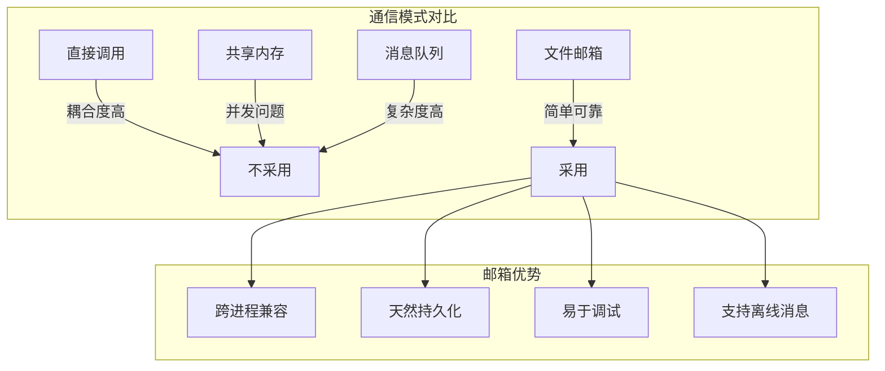
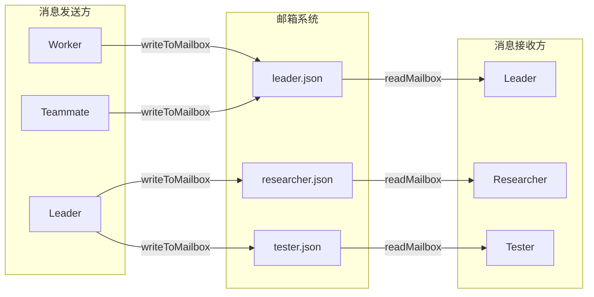
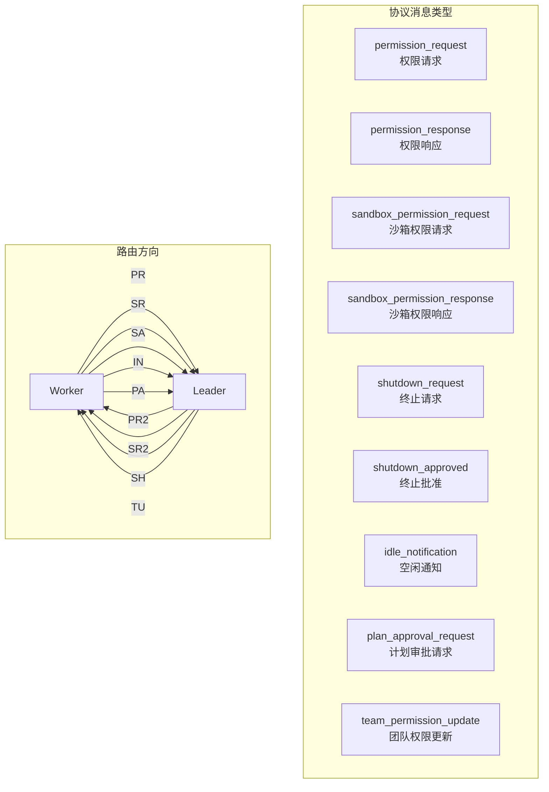
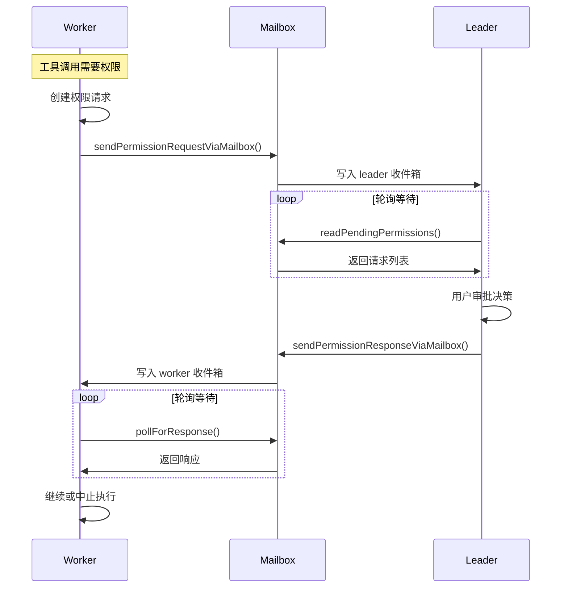
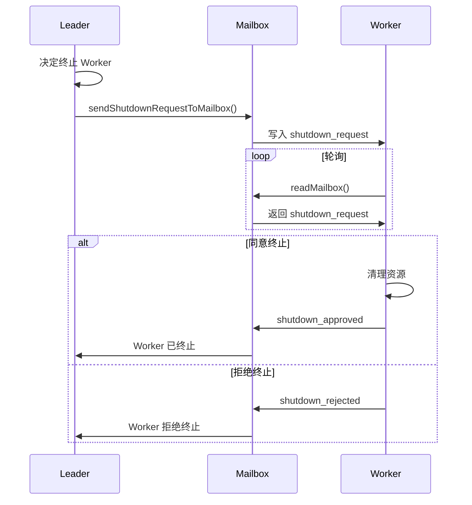

# 23. 代理通信

> 多代理协作系统中的消息传递、权限同步与状态共享机制

---

## 概述

Claude Code 的多代理通信系统采用**邮箱模式 (Mailbox Pattern)** 实现异步消息传递。每个代理拥有独立的收件箱，其他代理可向其写入消息，接收方通过轮询读取。

**核心机制**：
- **文件邮箱**：基于 JSON 文件的持久化消息存储
- **权限代理**：Worker 请求 Leader 审批工具权限
- **状态广播**：代理状态变更通知 (idle/running/stopped)
- **协议消息**：结构化的控制消息路由

---

## 设计原理

### 通信模型选择



**为什么选择文件邮箱**：
1. 进程内代理和进程外代理统一通信方式
2. 消息持久化，支持断点恢复
3. 文件锁定保证并发安全
4. 便于调试和监控

### 通信架构



---

## 实现原理

### 邮箱路径结构

```
~/.claude/teams/{team_name}/inboxes/{agent_name}.json
```

**路径解析** (`src/utils/teammateMailbox.ts:56-66`)：

```typescript
export function getInboxPath(agentName: string, teamName?: string): string {
  const team = teamName || getTeamName() || 'default'
  const safeTeam = sanitizePathComponent(team)
  const safeAgentName = sanitizePathComponent(agentName)
  const inboxDir = join(getTeamsDir(), safeTeam, 'inboxes')
  return join(inboxDir, `${safeAgentName}.json`)
}
```

### 消息结构

```typescript
// src/utils/teammateMailbox.ts:43-50
type TeammateMessage = {
  from: string        // 发送方代理名
  text: string        // 消息内容
  timestamp: string   // ISO 时间戳
  read: boolean       // 已读标记
  color?: string      // 发送方颜色
  summary?: string    // 5-10 字预览摘要
}
```

### 文件锁定机制

邮箱写入使用文件锁保证并发安全 (`src/utils/teammateMailbox.ts:134-192`)：

```typescript
export async function writeToMailbox(
  recipientName: string,
  message: Omit<TeammateMessage, 'read'>,
  teamName?: string,
): Promise<void> {
  await ensureInboxDir(teamName)
  const inboxPath = getInboxPath(recipientName, teamName)
  const lockFilePath = `${inboxPath}.lock`
  
  // 创建文件（proper-lockfile 要求文件存在）
  await writeFile(inboxPath, '[]', { encoding: 'utf-8', flag: 'wx' })
  
  let release: (() => Promise<void>) | undefined
  try {
    // 获取文件锁（带重试）
    release = await lockfile.lock(inboxPath, {
      lockfilePath: lockFilePath,
      retries: { retries: 10, minTimeout: 5, maxTimeout: 100 }
    })
    
    // 重新读取最新状态
    const messages = await readMailbox(recipientName, teamName)
    messages.push({ ...message, read: false })
    
    await writeFile(inboxPath, jsonStringify(messages, null, 2), 'utf-8')
  } finally {
    if (release) await release()
  }
}
```

---

## 功能展开

### 1. 消息类型

#### 普通消息

代理间的基本通信：

```typescript
// 发送
await writeToMailbox('researcher', {
  from: 'team-lead',
  text: '请检查 auth 模块的错误处理',
  timestamp: new Date().toISOString(),
  color: 'blue'
}, 'my-team')

// 接收
const messages = await readMailbox('researcher', 'my-team')
```

#### 结构化协议消息

系统定义多种协议消息，通过 `type` 字段路由：



**协议消息检测** (`src/utils/teammateMailbox.ts:1073-1095`)：

```typescript
export function isStructuredProtocolMessage(messageText: string): boolean {
  try {
    const parsed = jsonParse(messageText)
    if (!parsed || typeof parsed !== 'object' || !('type' in parsed)) {
      return false
    }
    const type = parsed.type
    return (
      type === 'permission_request' ||
      type === 'permission_response' ||
      type === 'sandbox_permission_request' ||
      type === 'sandbox_permission_response' ||
      type === 'shutdown_request' ||
      type === 'shutdown_approved' ||
      type === 'team_permission_update' ||
      type === 'mode_set_request' ||
      type === 'plan_approval_request' ||
      type === 'plan_approval_response'
    )
  } catch {
    return false
  }
}
```

### 2. 权限同步通信

Worker 请求 Leader 审批权限的完整流程 (`src/utils/swarm/permissionSync.ts`)：



**权限请求结构** (`src/utils/swarm/permissionSync.ts:49-90`)：

```typescript
type SwarmPermissionRequest = {
  id: string                 // 请求唯一ID
  workerId: string           // Worker 代理ID
  workerName: string         // Worker 名称
  workerColor?: string       // Worker 颜色
  teamName: string           // 团队名
  toolName: string           // 工具名
  toolUseId: string          // 工具调用ID
  description: string        // 操作描述
  input: Record<string, unknown>  // 工具输入
  permissionSuggestions: unknown[]  // 建议规则
  status: 'pending' | 'approved' | 'rejected'
  resolvedBy?: 'worker' | 'leader'
  resolvedAt?: number
  feedback?: string
  updatedInput?: Record<string, unknown>
  permissionUpdates?: unknown[]
  createdAt: number
}
```

### 3. 状态广播

代理状态变更通过 `IdleNotificationMessage` 广播：

```typescript
// src/utils/teammateMailbox.ts:394-430
type IdleNotificationMessage = {
  type: 'idle_notification'
  from: string
  timestamp: string
  idleReason?: 'available' | 'interrupted' | 'failed'
  summary?: string           // 最后发送的消息摘要
  completedTaskId?: string
  completedStatus?: 'resolved' | 'blocked' | 'failed'
  failureReason?: string
}

export function createIdleNotification(
  agentId: string,
  options?: {
    idleReason?: 'available' | 'interrupted' | 'failed'
    summary?: string
    completedTaskId?: string
    completedStatus?: 'resolved' | 'blocked' | 'failed'
    failureReason?: string
  }
): IdleNotificationMessage
```

### 4. 终止协商

优雅终止代理的协商流程 (`src/utils/teammateMailbox.ts:719-863`)：



---

## 数据结构

### 权限请求/响应

```typescript
// src/utils/teammateMailbox.ts:452-483
type PermissionRequestMessage = {
  type: 'permission_request'
  request_id: string
  agent_id: string
  tool_name: string
  tool_use_id: string
  description: string
  input: Record<string, unknown>
  permission_suggestions: unknown[]
}

type PermissionResponseMessage =
  | { type: 'permission_response', request_id: string, subtype: 'success',
      response?: { updated_input?: ..., permission_updates?: ... } }
  | { type: 'permission_response', request_id: string, subtype: 'error',
      error: string }
```

### 沙箱权限请求

```typescript
// src/utils/teammateMailbox.ts:576-607
type SandboxPermissionRequestMessage = {
  type: 'sandbox_permission_request'
  requestId: string
  workerId: string
  workerName: string
  workerColor?: string
  hostPattern: { host: string }
  createdAt: number
}

type SandboxPermissionResponseMessage = {
  type: 'sandbox_permission_response'
  requestId: string
  host: string
  allow: boolean
  timestamp: string
}
```

### 计划审批请求

```typescript
// src/utils/teammateMailbox.ts:684-715
type PlanApprovalRequestMessage = {
  type: 'plan_approval_request'
  from: string
  timestamp: string
  planFilePath: string
  planContent: string
  requestId: string
}

type PlanApprovalResponseMessage = {
  type: 'plan_approval_response'
  requestId: string
  approved: boolean
  feedback?: string
  timestamp: string
  permissionMode?: PermissionMode
}
```

---

## 组合使用

### 与 SendMessageTool 集成

```typescript
// src/tools/SendMessageTool/
// Leader 通过 SendMessageTool 向 Worker 发送消息
await sendMessageTool({
  to: 'researcher',        // 目标代理名
  message: '继续分析依赖关系',
  summary: '继续分析'       // 5-10 字预览
})
```

### 与 Inbox Poller 集成

系统通过 `useInboxPoller` hook 轮询邮箱：

```typescript
// 轮询逻辑伪代码
async function pollInbox() {
  const messages = await readMailbox(agentName, teamName)
  
  for (const msg of messages) {
    if (isStructuredProtocolMessage(msg.text)) {
      // 路由到专用处理队列
      const parsed = jsonParse(msg.text)
      switch (parsed.type) {
        case 'permission_request':
          handlePermissionRequest(parsed)
          break
        case 'shutdown_request':
          handleShutdownRequest(parsed)
          break
        // ...
      }
    } else {
      // 普通消息作为附件显示
      displayMessageAttachment(msg)
    }
  }
}
```

### 与团队权限更新集成

Leader 审批权限后，可广播权限更新给所有 Worker：

```typescript
type TeamPermissionUpdateMessage = {
  type: 'team_permission_update'
  permissionUpdate: {
    type: 'addRules'
    rules: Array<{ toolName: string, ruleContent?: string }>
    behavior: 'allow' | 'deny' | 'ask'
    destination: 'session'
  }
  directoryPath: string
  toolName: string
}
```

---

## 小结

### 设计取舍

| 方面 | 选择 | 权衡 |
|------|------|------|
| 通信模式 | 文件邮箱 | 简单可靠，但需要轮询 |
| 并发控制 | 文件锁定 | 保证原子性，但有性能开销 |
| 消息路由 | 类型字段 | 灵活扩展，但需要类型检测 |
| 持久化 | JSON 文件 | 易于调试，但大量消息时有性能问题 |

### 局限性

1. **轮询开销**：高频轮询可能影响性能
2. **消息堆积**：未读消息会持续累积
3. **跨平台**：文件锁在不同系统行为可能不同

### 演进方向

1. **事件驱动**：引入文件监视替代轮询
2. **消息压缩**：支持大量消息的高效存储
3. **优先级队列**：支持紧急消息优先处理

---

*基于代码分析构建 · 关键路径: `src/utils/teammateMailbox.ts`, `src/utils/swarm/permissionSync.ts`*
