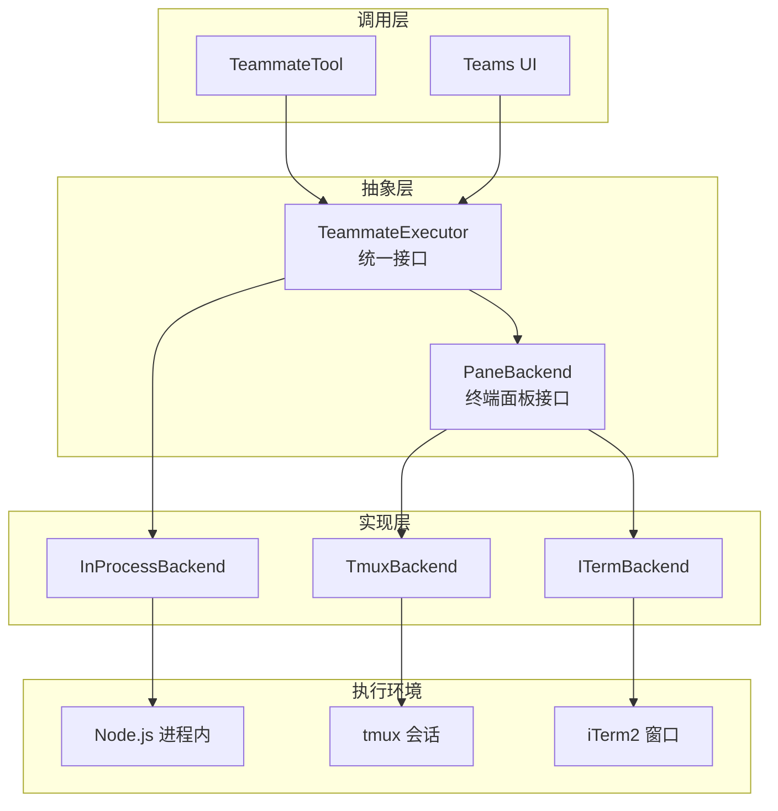
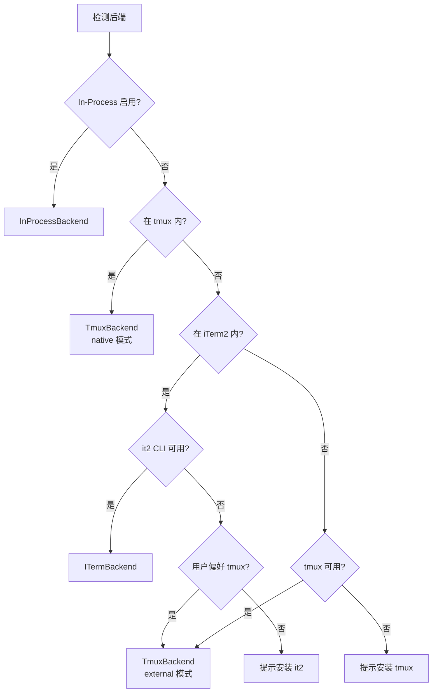
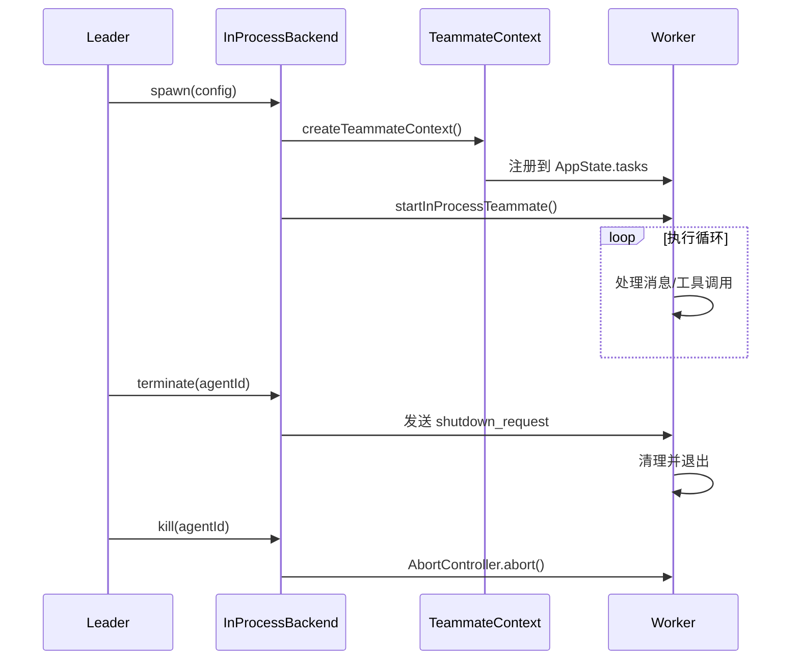
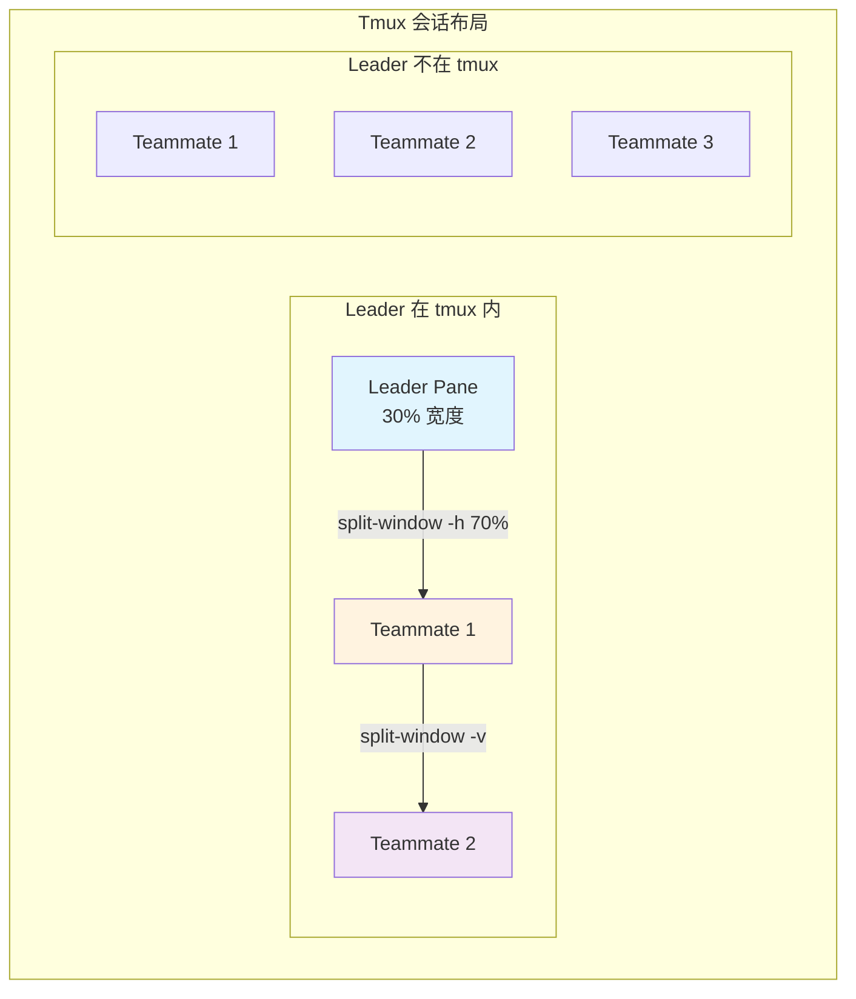
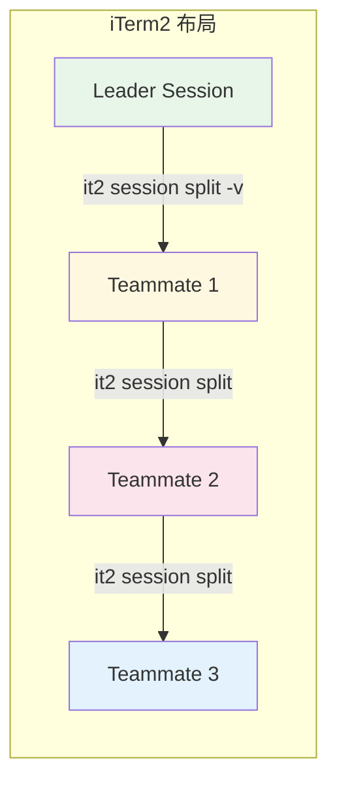
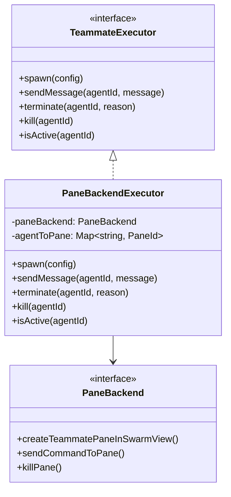

# 24. 后端实现

> 多代理执行后端的抽象、检测与实现

---

## 概述

Claude Code 的多代理系统支持多种执行后端，通过统一的 `TeammateExecutor` 接口抽象差异。后端选择基于环境检测自动完成，支持从进程内执行到终端分屏的多种模式。

**核心后端**：
- **InProcessBackend**：同进程执行，通过 AsyncLocalStorage 隔离上下文
- **TmuxBackend**：基于 tmux 的终端分屏，支持会话管理
- **ITermBackend**：基于 iTerm2 原生分屏的 macOS 专用后端

---

## 设计原理

### 后端抽象层



### 后端选择优先级



---

## 实现原理

### 核心接口定义

#### PaneBackend 接口

终端面板管理后端接口 (`src/utils/swarm/backends/types.ts:39-168`)：

```typescript
type PaneBackend = {
  readonly type: BackendType
  readonly displayName: string
  readonly supportsHideShow: boolean
  
  // 可用性检测
  isAvailable(): Promise<boolean>
  isRunningInside(): Promise<boolean>
  
  // 面板管理
  createTeammatePaneInSwarmView(name: string, color: AgentColorName): Promise<CreatePaneResult>
  sendCommandToPane(paneId: PaneId, command: string, useExternalSession?: boolean): Promise<void>
  killPane(paneId: PaneId, useExternalSession?: boolean): Promise<boolean>
  
  // 样式设置
  setPaneBorderColor(paneId: PaneId, color: AgentColorName): Promise<void>
  setPaneTitle(paneId: PaneId, name: string, color: AgentColorName): Promise<void>
  enablePaneBorderStatus(windowTarget?: string): Promise<void>
  
  // 布局管理
  rebalancePanes(windowTarget: string, hasLeader: boolean): Promise<void>
  hidePane(paneId: PaneId): Promise<boolean>
  showPane(paneId: PaneId, targetWindowOrPane: string): Promise<boolean>
}
```

#### TeammateExecutor 接口

代理执行器统一接口 (`src/utils/swarm/backends/types.ts:279-300`)：

```typescript
type TeammateExecutor = {
  readonly type: BackendType
  
  isAvailable(): Promise<boolean>
  spawn(config: TeammateSpawnConfig): Promise<TeammateSpawnResult>
  sendMessage(agentId: string, message: TeammateMessage): Promise<void>
  terminate(agentId: string, reason?: string): Promise<boolean>
  kill(agentId: string): Promise<boolean>
  isActive(agentId: string): Promise<boolean>
}
```

### 后端类型

```typescript
// src/utils/swarm/backends/types.ts:9-15
type BackendType = 'tmux' | 'iterm2' | 'in-process'
type PaneBackendType = 'tmux' | 'iterm2'

type PaneId = string  // tmux: "%1", iTerm2: session UUID
```

---

## 功能展开

### 1. InProcessBackend

进程内执行后端，代理运行在同一 Node.js 进程中 (`src/utils/swarm/backends/InProcessBackend.ts`)。



**关键特性**：

| 特性 | 说明 |
|------|------|
| 资源共享 | 共享 API client、MCP 连接 |
| 上下文隔离 | AsyncLocalStorage 独立上下文 |
| 生命周期 | AbortController 控制 |
| 消息通信 | 复用文件邮箱机制 |

**Spawn 实现** (`src/utils/swarm/backends/InProcessBackend.ts:72-143`)：

```typescript
async spawn(config: TeammateSpawnConfig): Promise<TeammateSpawnResult> {
  // 创建代理上下文和 AbortController
  const result = await spawnInProcessTeammate({
    name: config.name,
    teamName: config.teamName,
    prompt: config.prompt,
    color: config.color,
    planModeRequired: config.planModeRequired ?? false,
  }, this.context)
  
  // 启动代理执行循环
  if (result.success && result.taskId && result.teammateContext) {
    startInProcessTeammate({
      identity: { agentId: result.agentId, ... },
      taskId: result.taskId,
      prompt: config.prompt,
      teammateContext: result.teammateContext,
      toolUseContext: { ...this.context, messages: [] },
      abortController: result.abortController,
      model: config.model,
      systemPrompt: config.systemPrompt,
      allowedTools: config.permissions,
    })
  }
  
  return result
}
```

### 2. TmuxBackend

基于 tmux 的终端分屏后端 (`src/utils/swarm/backends/TmuxBackend.ts`)。



**两种运行模式**：

| 模式 | 条件 | 布局 |
|------|------|------|
| Native | Leader 在 tmux 内 | Leader 30% + Teammates 70% |
| External | Leader 不在 tmux | 创建 claude-swarm 会话，均分布局 |

**面板创建流程** (`src/utils/swarm/backends/TmuxBackend.ts:129-146`)：

```typescript
async createTeammatePaneInSwarmView(
  name: string,
  color: AgentColorName,
): Promise<CreatePaneResult> {
  const releaseLock = await acquirePaneCreationLock()
  
  try {
    const insideTmux = await this.isRunningInside()
    
    if (insideTmux) {
      return await this.createTeammatePaneWithLeader(name, color)
    }
    return await this.createTeammatePaneExternal(name, color)
  } finally {
    releaseLock()
  }
}
```

**关键实现**：
- 使用锁机制防止并发创建面板
- 缓存 Leader 的 pane ID 和 window target
- 自动 rebalance 面板布局
- 等待 shell 初始化延迟 (200ms)

### 3. ITermBackend

基于 iTerm2 原生分屏的 macOS 专用后端 (`src/utils/swarm/backends/ITermBackend.ts`)。



**依赖条件**：
- 运行在 iTerm2 终端内
- 安装 it2 CLI 工具 (`pip install it2`)
- iTerm2 Python API 已启用

**会话管理** (`src/utils/swarm/backends/ITermBackend.ts:63-73`)：

```typescript
function getLeaderSessionId(): string | null {
  // ITERM_SESSION_ID 格式: "wXtYpZ:UUID"
  const itermSessionId = process.env.ITERM_SESSION_ID
  if (!itermSessionId) return null
  const colonIndex = itermSessionId.indexOf(':')
  if (colonIndex === -1) return null
  return itermSessionId.slice(colonIndex + 1)
}
```

**容错处理** (`src/utils/swarm/backends/ITermBackend.ts:136-208`)：

```typescript
// 当目标会话已失效时，自动修剪并重试
while (true) {
  const splitResult = await runIt2(splitArgs)
  
  if (splitResult.code !== 0 && targetedTeammateId) {
    // 确认目标会话是否已失效
    const listResult = await runIt2(['session', 'list'])
    if (listResult.code === 0 && 
        !listResult.stdout.includes(targetedTeammateId)) {
      // 修剪失效会话并重试
      const idx = teammateSessionIds.indexOf(targetedTeammateId)
      if (idx !== -1) teammateSessionIds.splice(idx, 1)
      continue
    }
    throw new Error(`Failed to create iTerm2 split pane`)
  }
  break
}
```

### 4. 后端检测与注册

**检测逻辑** (`src/utils/swarm/backends/registry.ts:136-254`)：

```typescript
export async function detectAndGetBackend(): Promise<BackendDetectionResult> {
  // 优先级 1: 在 tmux 内，使用 tmux
  if (await isInsideTmux()) {
    return { backend: createTmuxBackend(), isNative: true }
  }
  
  // 优先级 2: 在 iTerm2 内
  if (isInITerm2()) {
    if (!getPreferTmuxOverIterm2() && await isIt2CliAvailable()) {
      return { backend: createITermBackend(), isNative: true }
    }
    // 回退到 tmux
    if (await isTmuxAvailable()) {
      return { backend: createTmuxBackend(), isNative: false, needsIt2Setup: true }
    }
    throw new Error('iTerm2 detected but it2 CLI not installed')
  }
  
  // 优先级 3: 外部 tmux 会话
  if (await isTmuxAvailable()) {
    return { backend: createTmuxBackend(), isNative: false }
  }
  
  throw new Error(getTmuxInstallInstructions())
}
```

**自注册机制** (`src/utils/swarm/backends/registry.ts:84-100`)：

```typescript
// TmuxBackend.ts 末尾
registerTmuxBackend(TmuxBackend)

// ITermBackend.ts 末尾
registerITermBackend(ITermBackend)

// registry.ts
export function registerTmuxBackend(backendClass: new () => PaneBackend): void {
  TmuxBackendClass = backendClass
}

export function registerITermBackend(backendClass: new () => PaneBackend): void {
  ITermBackendClass = backendClass
}
```

---

## 数据结构

### CreatePaneResult

```typescript
// src/utils/swarm/backends/types.ts:27-32
type CreatePaneResult = {
  paneId: PaneId
  isFirstTeammate: boolean
}
```

### BackendDetectionResult

```typescript
// src/utils/swarm/backends/types.ts:173-180
type BackendDetectionResult = {
  backend: PaneBackend
  isNative: boolean        // 是否在原生环境中运行
  needsIt2Setup?: boolean  // iTerm2 需要安装 it2
}
```

### TeammateModeSnapshot

```typescript
// 会话启动时快照的 teammate 模式
type TeammateMode = 'auto' | 'tmux' | 'in-process'

// 运行时解析后的模式
type ResolvedTeammateMode = 'in-process' | 'tmux'
```

---

## 组合使用

### PaneBackendExecutor

将 PaneBackend 包装为 TeammateExecutor (`src/utils/swarm/backends/PaneBackendExecutor.ts`)：



### 与 TeammateTool 集成

```typescript
// TeammateTool 中的后端选择
const executor = await getTeammateExecutor(preferInProcess)

const result = await executor.spawn({
  name: 'researcher',
  teamName: 'my-team',
  prompt: '分析 auth 模块',
  cwd: process.cwd(),
  parentSessionId: sessionId,
  permissions: ['Bash', 'Read', 'Edit'],
  color: 'blue',
})

// result.agentId = "researcher@my-team"
// result.paneId = "%1" (pane-based) or result.taskId = "task-xxx" (in-process)
```

### 与 AppState 集成

进程内代理注册到 AppState.tasks：

```typescript
type InProcessTeammateTask = {
  type: 'in_process_teammate'
  id: string
  status: 'running' | 'completed' | 'failed' | 'killed'
  identity: TeammateIdentity
  abortController: AbortController
  isIdle: boolean
  onIdleCallbacks: Array<() => void>
  shutdownRequested: boolean
}
```

---

## 小结

### 设计取舍

| 方面 | 选择 | 权衡 |
|------|------|------|
| 后端抽象 | TeammateExecutor | 统一接口，但需要适配层 |
| 检测时机 | 首次使用时 | 延迟检测，但可能有首次延迟 |
| 进程内优先 | 可配置 | 灵活，但需要理解场景 |
| 自注册模式 | 模块副作用 | 解耦，但依赖导入顺序 |

### 各后端对比

| 特性 | InProcess | Tmux | ITerm2 |
|------|-----------|------|--------|
| 资源共享 | ✓ 共享进程 | ✗ 独立进程 | ✗ 独立进程 |
| 可见性 | UI 内嵌 | 独立面板 | 独立面板 |
| 调试难度 | 低 | 中 | 中 |
| 跨平台 | ✓ 全平台 | ✓ Unix | ✗ macOS |
| 依赖要求 | 无 | tmux | it2 CLI |

### 局限性

1. **ITermBackend**：不支持 hide/show pane
2. **InProcessBackend**：代理崩溃可能影响主进程
3. **TmuxBackend**：布局策略相对固定

### 演进方向

1. **Web Backend**：基于 WebSocket 的远程代理
2. **Docker Backend**：容器隔离的代理执行
3. **动态后端切换**：运行时切换后端类型

---

*基于代码分析构建 · 关键路径: `src/utils/swarm/backends/types.ts`, `src/utils/swarm/backends/InProcessBackend.ts`, `src/utils/swarm/backends/TmuxBackend.ts`, `src/utils/swarm/backends/ITermBackend.ts`, `src/utils/swarm/backends/registry.ts`*
