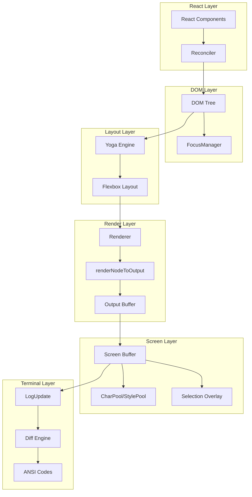

# 25. 终端渲染引擎

## 25.1 概述

Claude Code 的终端渲染引擎是一个高性能的 React-to-Terminal 桥接系统，将 React 组件树转换为 ANSI 终端输出。该引擎基于 Ink 框架深度定制，实现了从 React 组件到终端字符单元的完整渲染管线。

**核心设计目标：**
- **最小化终端写入**：通过双缓冲和差异检测，每帧只写入变化的单元格
- **流畅滚动体验**：DECSTBM 硬件滚动优化 + 虚拟滚动 + 智能节流
- **Unicode 完整支持**：正确处理 CJK 字符、emoji、grapheme clusters 的宽字符显示
- **原子化更新**：BSU/ESU 包裹确保无闪烁的屏幕更新

**关键性能指标：**
- 稳定状态（spinner/clock）下差异检测 O(changed cells) 而非 O(rows×cols)
- 滚动场景下通过 DECSTBM 跳过 90%+ 的单元格重绘
- 长会话下内存通过对象池（CharPool/StylePool/HyperlinkPool）保持稳定



## 25.2 设计原理

### 25.2.1 React Reconciler 集成

渲染引擎通过自定义 React Reconciler 将 React 组件树映射到 DOM 元素树：

**核心映射关系**（`src/ink/reconciler.ts`）：
- `createInstance()` 创建 `DOMElement`（`ink-box`, `ink-text` 等）
- `appendChild/insertBefore/removeChild` 维护 DOM 树结构
- `commitUpdate()` 更新 `attributes` 和 `style`

**关键优化**（`src/ink/dom.ts:247-264`）：
```typescript
export const setAttribute = (node: DOMElement, key: string, value: DOMNodeAttribute): void => {
  if (key === 'children') return  // React 通过 appendChild 处理 children
  if (node.attributes[key] === value) return  // 跳过未变化的属性
  node.attributes[key] = value
  markDirty(node)  // 标记脏节点，触发重新渲染
}
```

### 25.2.2 Yoga 布局引擎

渲染引擎使用 Yoga（Facebook 的 Flexbox 实现）计算每个节点的位置和尺寸：

**布局流程**（`src/ink/ink.tsx:322-339`）：
```typescript
this.rootNode.onComputeLayout = () => {
  if (this.rootNode.yogaNode) {
    this.rootNode.yogaNode.setWidth(this.terminalColumns)
    this.rootNode.yogaNode.calculateLayout(this.terminalColumns)
  }
}
```

**文本测量**（`src/ink/dom.ts:332-374`）：
- `measureTextNode()` 函数计算文本节点的自然宽高
- 支持 `wrap`、`wrap-trim`、`truncate-*` 等多种文本换行模式
- 处理嵌入换行符（`pre-wrapped` 内容）的特殊情况

### 25.2.3 双缓冲与差异检测

**双缓冲架构**：
- `frontFrame`：当前显示的帧
- `backFrame`：正在构建的帧
- 每帧渲染完成后交换缓冲区（`src/ink/ink.tsx:733-734`）

**差异检测优化**（`src/ink/screen.ts:1156-1206`）：
```typescript
export function diffEach(prev: Screen, next: Screen, cb: DiffCallback): boolean {
  // 只扫描 damage 区域而非整个屏幕
  let region: Rectangle
  if (next.damage) {
    region = next.damage
    if (prev.damage) region = unionRect(region, prev.damage)
  }
  // 使用 findNextDiff 批量跳过未变化单元格
  return diffSameWidth(prev, next, region.x, endX, region.y, endY, cb)
}
```

### 25.2.4 滚动优化策略

**DECSTBM 硬件滚动**（`src/ink/render-node-to-output.ts:46-68`）：
```typescript
export type ScrollHint = { top: number; bottom: number; delta: number }
// 当 scrollTop 变化但容器未移动时，记录滚动提示
// log-update.ts 使用 CSI n S/T 命令执行硬件滚动
```

**智能滚动节流**（`src/ink/render-node-to-output.ts:123-176`）：
- **原生终端**（iTerm2/Ghostty）：按比例节流（`step = max(MIN, floor(abs*3/4))`）
- **xterm.js**（VS Code）：自适应步长（慢速点击立即响应，快速滑动平滑）
- **最大值限制**：`innerHeight-1` 确保 DECSTBM + blit+shift 快速路径生效

**虚拟滚动支持**：
- `scrollClampMin/Max` 限制渲染范围到已挂载的子组件
- `pendingScrollDelta` 累积滚动事件，按帧速率节流应用

## 25.3 实现原理

### 25.3.1 渲染管线阶段

**阶段 1：React Commit → DOM 更新**
```
React.render() → reconciler.updateContainer() → 
createInstance/appendChild/commitUpdate → DOM 树更新 → markDirty()
```

**阶段 2：布局计算**
```
resetAfterCommit() → onComputeLayout() → 
yogaNode.calculateLayout() → 每个节点获得计算后的位置和尺寸
```

**阶段 3：节点渲染**（`src/ink/render-node-to-output.ts:387-408`）
```
renderNodeToOutput(rootNode, output, { prevScreen }) →
  递归遍历 DOM 树 → 
  - 检查是否可跳过（未脏 + 位置未变 + prevScreen 可用）→ blit
  - 否则重新渲染 → output.write(x, y, text)
```

**阶段 4：Screen 输出**
```
output.get() → Screen 缓冲区（TypedArray）
  - cells: Int32Array（2 个 int32/单元格：charId + packed(styleId|hyperlinkId|width)）
  - noSelect: Uint8Array（排除选择的标记）
  - softWrap: Int32Array（软换行标记）
```

**阶段 5：差异计算与终端输出**
```
log-update.ts: render(prevFrame, nextFrame) →
  diffEach → 比较 cells 数组 → 生成 ANSI 补丁序列 →
  writeDiffToTerminal → 终端输出
```

### 25.3.2 屏幕缓冲区结构

**紧凑存储格式**（`src/ink/screen.ts:332-364`）：
```typescript
// 每个单元格 2 个 Int32（8 字节）
// word0: charId（CharPool 中的索引）
// word1: styleId[31:17] | hyperlinkId[16:2] | width[1:0]

export type Screen = Size & {
  cells: Int32Array
  cells64: BigInt64Array  // 用于批量填充
  charPool: CharPool
  hyperlinkPool: HyperlinkPool
  emptyStyleId: number
  damage: Rectangle | undefined
  noSelect: Uint8Array
  softWrap: Int32Array
}
```

**字符池化**（`src/ink/screen.ts:21-53`）：
```typescript
export class CharPool {
  private strings: string[] = [' ', '']  // 索引 0=空格，1=空（spacer）
  private stringMap = new Map<string, number>()
  private ascii: Int32Array  // ASCII 快速路径：charCode → index
  
  intern(char: string): number {
    // ASCII 单字符：直接数组查找
    if (char.length === 1 && char.charCodeAt(0) < 128) {
      const cached = this.ascii[char.charCodeAt(0)]
      if (cached !== -1) return cached
    }
    // Unicode：Map 查找
  }
}
```

### 25.3.3 宽字符处理

**CellWidth 枚举**（`src/ink/screen.ts:289-300`）：
```typescript
export const enum CellWidth {
  Narrow = 0,      // 单元格宽度 1
  Wide = 1,        // 宽字符（CJK、emoji），占 2 个单元格
  SpacerTail = 2,  // 宽字符的第二列（空，不渲染）
  SpacerHead = 3,  // 软换行时的行首 spacer
}
```

**写入宽字符**（`src/ink/screen.ts:693-809`）：
```typescript
export function setCellAt(screen: Screen, x: number, y: number, cell: Cell): void {
  // 1. 清除可能存在的旧宽字符的 SpacerTail
  if (prevWidth === CellWidth.Wide && cell.width !== CellWidth.Wide) {
    // 清除 x+1 位置的 SpacerTail
  }
  
  // 2. 写入主单元格
  cells[ci] = internCharString(screen, cell.char)
  cells[ci + 1] = packWord1(styleId, hyperlinkId, width)
  
  // 3. 为宽字符创建 SpacerTail
  if (cell.width === CellWidth.Wide && x + 1 < screen.width) {
    cells[spacerCI] = SPACER_CHAR_INDEX
    cells[spacerCI + 1] = packWord1(emptyStyleId, 0, CellWidth.SpacerTail)
  }
}
```

### 25.3.4 选择叠加层

**选择状态**（`src/ink/selection.ts:19-63`）：
```typescript
export type SelectionState = {
  anchor: Point | null           // 起点（鼠标按下位置）
  focus: Point | null            // 终点（当前鼠标位置）
  isDragging: boolean            // 是否正在拖动
  anchorSpan: { lo: Point; hi: Point; kind: 'word' | 'line' } | null
  scrolledOffAbove: string[]     // 滚出屏幕上方的文本
  scrolledOffBelow: string[]     // 滚出屏幕下方的文本
  virtualAnchorRow?: number      // 虚拟行号（用于反向滚动恢复）
}
```

**应用选择叠加**（`src/ink/selection.ts:893-917`）：
```typescript
export function applySelectionOverlay(screen: Screen, selection: SelectionState, stylePool: StylePool): void {
  const b = selectionBounds(selection)
  for (let row = start.row; row <= end.row; row++) {
    for (let col = colStart; col <= colEnd; col++) {
      if (noSelect[idx] === 1) continue  // 跳过不可选择的单元格
      const cell = cellAtIndex(screen, idx)
      // 使用 StylePool.withSelectionBg 添加选择背景色
      setCellStyleId(screen, col, row, stylePool.withSelectionBg(cell.styleId))
    }
  }
}
```

### 25.3.5 Alt Screen 模式

**进入 Alt Screen**（`src/ink/ink.tsx:457-474`）：
```typescript
enterAlternateScreen(): void {
  this.pause()
  this.suspendStdin()
  this.options.stdout.write(
    DISABLE_KITTY_KEYBOARD +
    DISABLE_MODIFY_OTHER_KEYS +
    (this.altScreenMouseTracking ? DISABLE_MOUSE_TRACKING : '') +
    '\x1b[?1049h' +  // 进入 alt screen
    '\x1b[?1004l' +  // 禁用焦点报告
    '\x1b[0m\x1b[?25h\x1b[2J\x1b[H'  // 重置属性、显示光标、清屏
  )
}
```

**Alt Screen 特殊处理**：
- 每帧前写入 `CURSOR_HOME`（`\x1b[H`）确保物理光标位置一致
- 框架结束时写入 `cursorPosition(terminalRows, 1)` 将光标停在最底部
- SIGCONT 恢复时重新进入 alt screen 并清屏
- 禁用主屏幕的日志滚动行为

## 25.4 功能展开

### 25.4.1 文本换行模式

**支持的换行模式**（`src/ink/components/Text.tsx:57-106`）：
- `wrap`：标准换行，保留所有空白
- `wrap-trim`：换行并修剪行首/行尾空白
- `truncate-end/middle/start`：截断并添加省略号
- `end/middle`：换行到指定宽度（不截断）

**换行实现**（`src/ink/render-node-to-output.ts:335-357`）：
```typescript
function wrapWithSoftWrap(plainText: string, maxWidth: number, textWrap) {
  if (textWrap !== 'wrap' && textWrap !== 'wrap-trim') {
    return { wrapped: wrapText(plainText, maxWidth, textWrap), softWrap: undefined }
  }
  // 逐行换行，标记软换行（word-wrap 插入的换行符）
  const softWrap: boolean[] = []
  for (const orig of plainText.split('\n')) {
    const pieces = wrapText(orig, maxWidth, textWrap).split('\n')
    for (let i = 0; i < pieces.length; i++) {
      outLines.push(pieces[i])
      softWrap.push(i > 0)  // i>0 表示是软换行
    }
  }
}
```

### 25.4.2 边框与背景

**边框渲染**（`src/ink/render-border.ts`）：
- 支持 `borderStyle`：`single`、`double`、`round`、`bold`、`singleDouble`、`doubleSingle`、`classic`
- 支持 `borderColor` 和 `dimBorder` 属性
- 使用 Unicode 盒绘字符（`─`, `│`, `┌`, `┐`, `└`, `┘` 等）

**背景填充**（`src/ink/render-node-to-output.ts:1156-1160`）：
```typescript
// 在渲染子元素前，用背景色填充 Box 内部
output.write(x, y, Array(height).fill(' '.repeat(width)).join('\n'))
```

### 25.4.3 OSC 8 超链接

**超链接格式**（`src/ink/render-node-to-output.ts:178-186`）：
```typescript
const OSC = '\u001B]'
const BEL = '\u0007'

function wrapWithOsc8Link(text: string, url: string): string {
  return `${OSC}8;;${url}${BEL}${text}${OSC}8;;${BEL}`
}
```

**HyperlinkPool**（`src/ink/screen.ts:57-75`）：
```typescript
export class HyperlinkPool {
  private strings: string[] = ['']  // 索引 0=无链接
  private stringMap = new Map<string, number>()
  
  intern(hyperlink: string | undefined): number {
    if (!hyperlink) return 0
    // 字符串去重，节省内存
  }
}
```

### 25.4.4 性能监控

**帧统计**（`src/ink/ink.tsx:920-936`）：
```typescript
this.options.onFrame?.({
  durationMs: performance.now() - renderStart,
  phases: {
    renderer: rendererMs,     // 渲染阶段
    diff: diffMs,             // 差异计算
    optimize: optimizeMs,     // 输出优化
    write: writeMs,           // 终端写入
    patches: diff.length,     // 补丁数量
    yoga: yogaMs,             // 布局计算
    commit: commitMs,         // React commit
    yogaVisited: yc.visited,  // Yoga 访问节点数
    yogaMeasured: yc.measured,// Yoga 测量节点数
    yogaCacheHits: yc.cacheHits, // Yoga 缓存命中
    yogaLive: yc.live,        // Yoga 活跃节点
  },
  flickers,  // 闪烁事件
})
```

## 25.5 数据结构

### 25.5.1 DOMElement 结构

```typescript
// src/ink/dom.ts:31-91
export type DOMElement = {
  nodeName: ElementNames           // 'ink-box' | 'ink-text' | ...
  attributes: Record<string, DOMNodeAttribute>
  childNodes: DOMNode[]
  textStyles?: TextStyles
  
  // 内部属性
  onComputeLayout?: () => void
  onRender?: () => void
  dirty: boolean
  isHidden?: boolean
  _eventHandlers?: Record<string, unknown>
  
  // 滚动状态
  scrollTop?: number
  pendingScrollDelta?: number
  scrollClampMin?: number
  scrollClampMax?: number
  scrollHeight?: number
  scrollViewportHeight?: number
  stickyScroll?: boolean
  scrollAnchor?: { el: DOMElement; offset: number }
  
  // 焦点管理
  focusManager?: FocusManager
  
  // Yoga 布局节点
  yogaNode?: LayoutNode
  style: Styles
  parentNode: DOMElement | undefined
}
```

### 25.5.2 Frame 结构

```typescript
// src/ink/frame.ts
export type Frame = {
  screen: Screen
  viewport: { width: number; height: number }
  cursor: { x: number; y: number; visible: boolean }
  scrollHint?: ScrollHint
  scrollDrainPending?: boolean
}
```

### 25.5.3 Output 结构

```typescript
// src/ink/output.ts
export default class Output {
  width: number
  height: number
  stylePool: StylePool
  screen: Screen
  
  // 操作方法
  write(x: number, y: number, text: string, softWrap?: boolean[]): void
  blit(src: Screen, x: number, y: number, width: number, height: number): void
  clip(rect: { x1?, x2?, y1?, y2? }): void
  clear(rect: Rectangle, isAbsolute?: boolean): void
  shift(top: number, bottom: number, delta: number): void
  noSelect(rect: Rectangle): void
  get(): Screen
}
```

## 25.6 组合使用

### 25.6.1 与 ScrollBox 配合

**滚动容器结构**（`src/ink/render-node-to-output.ts:688-854`）：
```typescript
if (isScrollY) {
  // 1. 计算滚动参数
  const scrollHeight = contentYoga.getComputedHeight()
  const maxScroll = Math.max(0, scrollHeight - innerHeight)
  
  // 2. 处理粘性滚动（at-bottom follow）
  const atBottom = sticky || (grew && scrollTopBeforeFollow >= prevMaxScroll)
  if (atBottom && pendingScrollDelta >= 0) {
    node.scrollTop = maxScroll
  }
  
  // 3. 消耗 pendingScrollDelta
  cur += isXtermJsHost() 
    ? drainAdaptive(node, pending, eff) 
    : drainProportional(node, pending, eff)
  
  // 4. 渲染内容（带剪裁和偏移）
  renderScrolledChildren(content, output, contentX, contentY - scrollTop, ...)
}
```

### 25.6.2 与 Vim 模式配合

**光标定位**：
- Vim 模式的光标移动通过 `setOffset()` 更新 `Cursor` 对象
- 渲染引擎通过 `cursorDeclaration` 确定物理光标位置
- `useDeclaredCursor` hook 声明光标位置（`src/ink/ink.tsx:808-873`）

**文本操作**：
- Vim 的 `delete/change/yank` 操作通过 `ctx.setText()` 更新文本
- 渲染引擎在下一帧重新计算布局和渲染

### 25.6.3 与选择功能配合

**选择流程**：
1. 鼠标按下 → `startSelection()` 初始化 `SelectionState`
2. 鼠标移动 → `updateSelection()` 更新 `focus` 位置
3. 鼠标释放 → `finishSelection()` 保持选择可见
4. 渲染 → `applySelectionOverlay()` 应用选择背景色
5. 复制 → `getSelectedText()` 提取选择文本
6. 清除 → `clearSelection()` 移除选择

**拖拽滚动**：
- 当拖拽到视口边缘时触发自动滚动
- `captureScrolledRows()` 保存滚出屏幕的文本
- `shiftSelection()` 更新选择范围

## 25.7 小结

Claude Code 的终端渲染引擎是一个高度优化的系统，通过以下关键技术实现了流畅的终端 UI：

1. **React Reconciler 集成**：将 React 组件树映射到 DOM 树，利用 React 的声明式编程模型
2. **Yoga 布局引擎**：使用 Flexbox 布局算法自动计算元素位置和尺寸
3. **双缓冲 + 差异检测**：每帧只写入变化的单元格，最小化终端 I/O
4. **对象池**：CharPool/StylePool/HyperlinkPool 减少内存分配和 GC 压力
5. **紧凑存储**：TypedArray 存储单元格数据，每个单元格仅 8 字节
6. **智能滚动**：DECSTBM 硬件滚动 + 虚拟滚动 + 自适应节流
7. **宽字符支持**：通过 SpacerTail 正确处理 CJK 和 emoji
8. **Alt Screen 模式**：全屏应用的专用模式，避免滚动历史污染

**关键文件**：
- `src/ink/ink.tsx`：渲染引擎主入口，协调所有子系统
- `src/ink/dom.ts`：DOM 元素定义和操作
- `src/ink/screen.ts`：屏幕缓冲区和对象池
- `src/ink/render-node-to-output.ts`：节点渲染核心逻辑
- `src/ink/renderer.ts`：渲染器工厂函数
- `src/ink/selection.ts`：文本选择状态管理

**性能优化亮点**：
- 稳定状态帧（spinner/clock）：O(changed cells) 差异检测
- 滚动帧：DECSTBM 跳过 90%+ 单元格重绘
- 内存：对象池确保长会话内存稳定
- 宽字符：自动 SpacerTail 管理，正确处理 CJK/emoji
