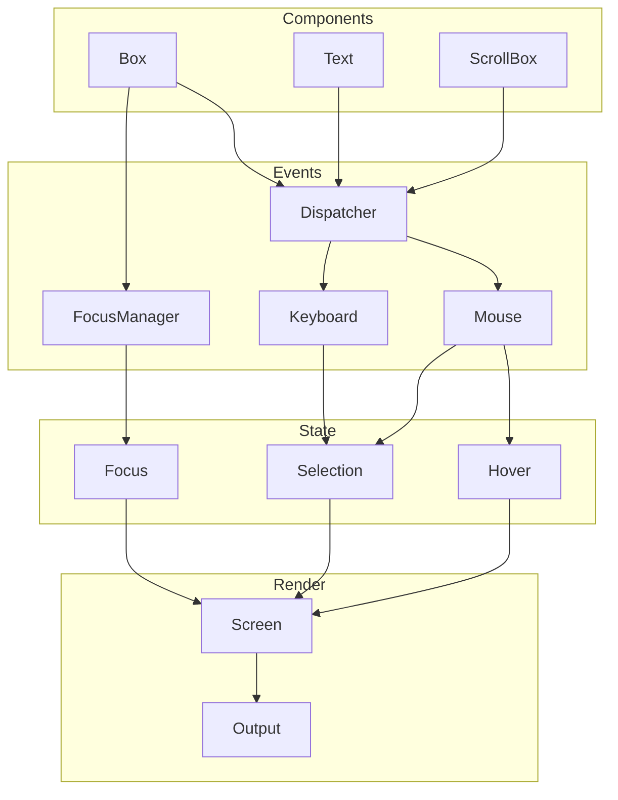

# 26. 交互组件

## 26.1 概述

Claude Code 的交互组件系统基于 Ink 框架构建，提供了终端环境下的丰富交互能力，包括焦点管理、键盘事件、鼠标事件、文本选择等。这些组件使得终端应用能够达到与 GUI 应用相似的交互体验。

**核心设计目标：**
- **事件冒泡与捕获**：支持 DOM 风格的事件传播机制
- **焦点管理**：Tab/Shift+Tab 循环、程序化聚焦、焦点事件
- **鼠标交互**：点击、悬停、拖拽、文本选择
- **无障碍支持**：原生光标定位、屏幕阅读器兼容

**关键特性：**
- `Box` 组件支持 `tabIndex`、`onClick`、`onFocus`、`onBlur` 等事件
- `FocusManager` 管理焦点链和焦点移动
- `hit-test.ts` 实现点击检测和悬停检测
- `selection.ts` 提供文本选择状态管理



## 26.2 设计原理

### 26.2.1 焦点管理系统

**FocusManager 职责**（`src/ink/focus.ts`）：
- 维护可聚焦节点列表（`tabIndex >= 0`）
- 处理 Tab/Shift+Tab 焦点循环
- 触发 `focus` 和 `blur` 事件

**焦点移动流程**：
```typescript
export class FocusManager {
  private focusableNodes: Set<DOMElement> = new Set()
  private focusedNode: DOMElement | undefined
  
  focus(node: DOMElement): void {
    if (this.focusedNode === node) return
    if (this.focusedNode) {
      this.dispatchBlur(this.focusedNode)
    }
    this.focusedNode = node
    this.dispatchFocus(node)
  }
  
  moveFocus(direction: 'forward' | 'backward'): void {
    const nodes = this.getFocusableNodesInOrder()
    const currentIndex = nodes.indexOf(this.focusedNode)
    const nextIndex = direction === 'forward' 
      ? (currentIndex + 1) % nodes.length
      : (currentIndex - 1 + nodes.length) % nodes.length
    this.focus(nodes[nextIndex])
  }
}
```

### 26.2.2 事件传播机制

**事件捕获与冒泡**：
```
捕获阶段：从根节点向下传播到目标节点
目标阶段：在目标节点触发
冒泡阶段：从目标节点向上传播到根节点
```

**事件调度器**：
```typescript
const dispatcher = {
  dispatchDiscrete(target: DOMElement, event: Event): void {
    // 1. 捕获阶段：从根到目标
    const capturePath = getCapturePath(target)
    for (const node of capturePath) {
      if (event.propagationStopped) break
      invokeHandler(node, event, 'capture')
    }
    
    // 2. 目标阶段
    if (!event.propagationStopped) {
      invokeHandler(target, event, 'bubble')
    }
    
    // 3. 冒泡阶段：从目标到根
    const bubblePath = getBubblePath(target)
    for (const node of bubblePath) {
      if (event.propagationStopped) break
      invokeHandler(node, event, 'bubble')
    }
  }
}
```

### 26.2.3 鼠标事件处理

**鼠标跟踪模式**（`src/ink/termio/dec.ts`）：
- DECSET 1000：启用基本鼠标报告
- DECSET 1003：启用鼠标移动报告（悬停检测）
- DECSET 1002：启用拖拽报告

**点击检测**（`src/ink/hit-test.ts`）：
```typescript
export function dispatchClick(
  root: DOMElement,
  x: number,
  y: number,
  dispatcher: (target: DOMElement, event: ClickEvent) => void,
): void {
  const target = findNodeAt(root, x, y)
  if (target && target._eventHandlers?.onClick) {
    const event = new ClickEvent(x, y)
    dispatcher(target, event)
  }
}
```

**悬停检测**：
```typescript
export function dispatchHover(
  root: DOMElement,
  x: number,
  y: number,
  hoveredNodes: Set<DOMElement>,
): void {
  const currentNodes = new Set<DOMElement>()
  const target = findNodeAt(root, x, y)
  
  // 收集带 onMouseEnter 的节点
  let node = target
  while (node) {
    if (node._eventHandlers?.onMouseEnter) {
      currentNodes.add(node)
    }
    node = node.parentNode
  }
  
  // 触发 mouseenter/mouseleave
  for (const n of currentNodes) {
    if (!hoveredNodes.has(n)) {
      n._eventHandlers.onMouseEnter()
    }
  }
  for (const n of hoveredNodes) {
    if (!currentNodes.has(n)) {
      n._eventHandlers.onMouseLeave?.()
    }
  }
  
  hoveredNodes.clear()
  for (const n of currentNodes) hoveredNodes.add(n)
}
```

### 26.2.4 键盘事件处理

**按键解析**（`src/ink/parse-keypress.ts`）：
```typescript
export type ParsedKey = {
  name: string          // 'a', 'enter', 'escape', 'up', ...
  ctrl: boolean
  shift: boolean
  meta: boolean
  sequence: string      // 原始 ANSI 序列
}
```

**键盘事件分发**：
```typescript
stdin.on('data', (data: Buffer) => {
  const keys = parseKeypress(data)
  for (const key of keys) {
    const event = new KeyboardEvent(key)
    
    // 在焦点节点上触发 onKeyDown
    if (this.focusManager.focusedNode) {
      dispatcher.dispatchDiscrete(this.focusManager.focusedNode, event)
    }
    
    // 处理全局快捷键
    if (!event.defaultPrevented) {
      this.handleGlobalKey(key)
    }
  }
})
```

## 26.3 实现原理

### 26.3.1 Box 组件

**组件接口**（`src/ink/components/Box.tsx:10-45`）：
```typescript
export type Props = Except<Styles, 'textWrap'> & {
  ref?: Ref<DOMElement>
  
  // 焦点管理
  tabIndex?: number       // Tab 顺序索引
  autoFocus?: boolean     // 挂载时自动聚焦
  
  // 鼠标事件
  onClick?: (event: ClickEvent) => void
  onMouseEnter?: () => void
  onMouseLeave?: () => void
  
  // 焦点事件
  onFocus?: (event: FocusEvent) => void
  onBlur?: (event: FocusEvent) => void
  
  // 键盘事件
  onKeyDown?: (event: KeyboardEvent) => void
}
```

**组件实现**：
```typescript
function Box({ children, tabIndex, autoFocus, onClick, ...props }: Props) {
  return (
    <ink-box
      tabIndex={tabIndex}
      autoFocus={autoFocus}
      onClick={onClick}
      onFocus={onFocus}
      onBlur={onBlur}
      onMouseEnter={onMouseEnter}
      onMouseLeave={onMouseLeave}
      onKeyDown={onKeyDown}
      style={{
        flexWrap: flexWrap ?? 'nowrap',
        flexDirection: flexDirection ?? 'row',
        flexGrow: flexGrow ?? 0,
        flexShrink: flexShrink ?? 1,
        ...style,
      }}
    >
      {children}
    </ink-box>
  )
}
```

### 26.3.2 Text 组件

**组件接口**（`src/ink/components/Text.tsx:5-55`）：
```typescript
type BaseProps = {
  color?: Color
  backgroundColor?: Color
  italic?: boolean
  underline?: boolean
  strikethrough?: boolean
  inverse?: boolean
  wrap?: Styles['textWrap']
  children?: ReactNode
}

// Bold 和 dim 互斥（终端限制）
type WeightProps =
  | { bold?: never; dim?: never }
  | { bold: boolean; dim?: never }
  | { dim: boolean; bold?: never }
```

### 26.3.3 选择状态管理

**选择模式**：
- **字符模式**：精确选择字符
- **单词模式**：双击选择单词
- **行模式**：三击选择整行

**选择状态**（`src/ink/selection.ts:19-63`）：
```typescript
export type SelectionState = {
  anchor: Point | null           // 起点
  focus: Point | null            // 终点
  isDragging: boolean            // 是否拖动中
  anchorSpan: { lo: Point; hi: Point; kind: 'word' | 'line' } | null
  scrolledOffAbove: string[]     // 滚出屏幕的上方文本
  scrolledOffBelow: string[]     // 滚出屏幕的下方文本
}
```

**选择操作**：
```typescript
export function startSelection(s: SelectionState, col: number, row: number): void {
  s.anchor = { col, row }
  s.focus = null
  s.isDragging = true
}

export function updateSelection(s: SelectionState, col: number, row: number): void {
  if (!s.isDragging) return
  s.focus = { col, row }
}

export function finishSelection(s: SelectionState): void {
  s.isDragging = false
}

export function clearSelection(s: SelectionState): void {
  s.anchor = null
  s.focus = null
  s.isDragging = false
}
```

## 26.4 功能展开

### 26.4.1 焦点循环

**Tab 键处理**：
```typescript
if (key.name === 'tab') {
  if (this.focusManager.focusedNode) {
    this.focusManager.moveFocus(key.shift ? 'backward' : 'forward')
  } else {
    this.focusManager.focusFirst()
  }
}
```

**焦点指示器**：
- 焦点节点通过边框颜色或背景色区分
- 开发者可通过 `onFocus`/`onBlur` 回调自定义样式

### 26.4.2 键盘快捷键

**全局快捷键**：
```typescript
handleGlobalKey(key: ParsedKey): void {
  // Ctrl+C: 退出
  if (key.ctrl && key.name === 'c') {
    this.unmount()
    return
  }
  
  // Ctrl+L: 强制重绘
  if (key.ctrl && key.name === 'l') {
    this.forceRedraw()
    return
  }
  
  // Escape: 清除选择
  if (key.name === 'escape') {
    this.clearTextSelection()
    return
  }
}
```

### 26.4.3 鼠标选择

**选择流程**：
1. 鼠标按下 → `startSelection()`
2. 鼠标移动 → `updateSelection()`
3. 鼠标释放 → `finishSelection()`
4. Cmd+C → `copySelection()`
5. Escape → `clearSelection()`

**双击和三击**：
```typescript
if (clickCount === 2) {
  selectWordAt(selection, screen, col, row)
} else if (clickCount === 3) {
  selectLineAt(selection, screen, row)
} else {
  startSelection(selection, col, row)
}
```

### 26.4.4 拖拽滚动

**自动滚动**：
```typescript
if (isDragging && mouseY < viewportTop + 5) {
  scrollBy(-1)  // 向上滚动
} else if (isDragging && mouseY > viewportBottom - 5) {
  scrollBy(1)   // 向下滚动
}
```

**选择同步**：
- 滚动时调用 `shiftSelection()` 更新选择范围
- 调用 `captureScrolledRows()` 保存滚出屏幕的文本

## 26.5 数据结构

### 26.5.1 FocusManager

```typescript
export class FocusManager {
  private focusableNodes: Set<DOMElement> = new Set()
  private focusedNode: DOMElement | undefined
  private dispatcher: (target: DOMElement, event: FocusEvent) => void
  
  register(node: DOMElement): void
  unregister(node: DOMElement): void
  focus(node: DOMElement): void
  blur(): void
  moveFocus(direction: 'forward' | 'backward'): void
  focusFirst(): void
  getFocusedNode(): DOMElement | undefined
}
```

### 26.5.2 SelectionState

```typescript
export type SelectionState = {
  anchor: Point | null
  focus: Point | null
  isDragging: boolean
  anchorSpan: { lo: Point; hi: Point; kind: 'word' | 'line' } | null
  scrolledOffAbove: string[]
  scrolledOffBelow: string[]
  scrolledOffAboveSW: boolean[]
  scrolledOffBelowSW: boolean[]
  virtualAnchorRow?: number
  virtualFocusRow?: number
  lastPressHadAlt: boolean
}
```

### 26.5.3 Event Types

```typescript
export class ClickEvent {
  readonly x: number
  readonly y: number
  stopPropagation(): void
}

export class KeyboardEvent {
  readonly key: ParsedKey
  preventDefault(): void
  stopPropagation(): void
}

export class FocusEvent {
  readonly target: DOMElement
  readonly relatedTarget: DOMElement | null
}
```

## 26.6 组合使用

### 26.6.1 可聚焦列表项

```typescript
function ListItem({ item, isSelected, onSelect }: Props) {
  const [isFocused, setFocused] = useState(false)
  
  return (
    <Box
      tabIndex={0}
      onFocus={() => setFocused(true)}
      onBlur={() => setFocused(false)}
      onClick={() => onSelect(item)}
      onKeyDown={(e) => {
        if (e.key.name === 'enter') {
          onSelect(item)
        }
      }}
      borderColor={isFocused ? 'blue' : undefined}
      backgroundColor={isSelected ? 'gray' : undefined}
    >
      <Text>{item.label}</Text>
    </Box>
  )
}
```

### 26.6.2 可选择文本区域

```typescript
function SelectableText({ text }: Props) {
  const selection = useSelection()
  
  return (
    <Box style={{ noSelect: false }}>
      <Text>{text}</Text>
    </Box>
  )
}
```

### 26.6.3 悬停效果

```typescript
function HoverableCard({ children }: Props) {
  const [isHovered, setHovered] = useState(false)
  
  return (
    <Box
      onMouseEnter={() => setHovered(true)}
      onMouseLeave={() => setHovered(false)}
      backgroundColor={isHovered ? 'gray' : undefined}
    >
      {children}
    </Box>
  )
}
```

## 26.7 小结

Claude Code 的交互组件系统为终端应用提供了完整的交互能力：

1. **焦点管理**：Tab/Shift+Tab 循环、程序化聚焦、焦点事件
2. **事件传播**：DOM 风格的捕获-目标-冒泡机制
3. **鼠标交互**：点击、悬停、拖拽、文本选择
4. **键盘事件**：按键解析、事件分发、全局快捷键
5. **文本选择**：字符模式、单词模式、行模式、拖拽滚动

**关键文件**：
- `src/ink/components/Box.tsx`：Box 组件定义
- `src/ink/components/Text.tsx`：Text 组件定义
- `src/ink/focus.ts`：焦点管理器
- `src/ink/hit-test.ts`：点击和悬停检测
- `src/ink/selection.ts`：文本选择状态
- `src/ink/events/*.ts`：事件类型定义

**设计亮点**：
- 事件传播机制与 DOM 标准一致，降低学习成本
- 焦点管理支持无障碍访问
- 文本选择支持多种模式和拖拽滚动
- 鼠标悬停检测使用 mode-1003 高效实现
