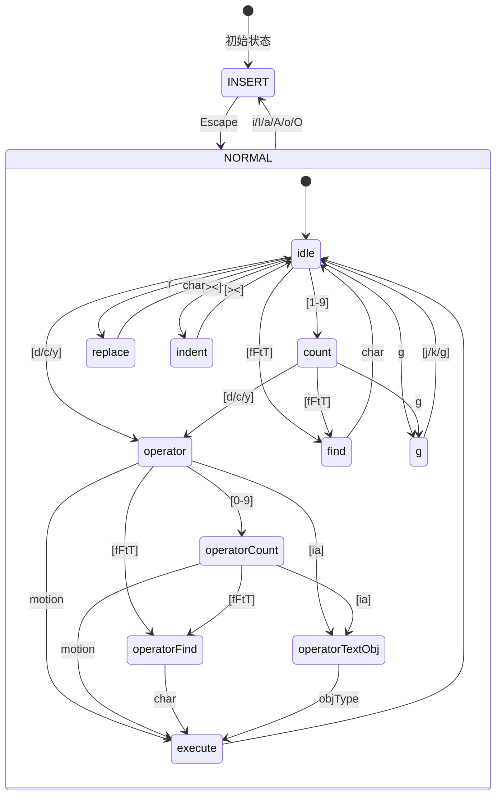

# 27. Vim 模式

## 27.1 概述

Claude Code 内置了一个完整的 Vim 模式实现，支持 Normal 和 Insert 两种模式，以及完整的 motion、operator、text object 操作。该实现采用状态机架构，将 Vim 的命令解析和执行清晰分离。

**核心设计目标：**
- **状态机驱动**：明确的类型化状态，无隐式状态
- **纯函数设计**：motion 和 operator 都是纯函数，易于测试
- **可扩展性**：易于添加新的 motion、operator 和 text object
- **点重复支持**：完整记录和回放上一个修改命令

**关键特性：**
- Normal 模式：完整的光标移动、操作符、文本对象支持
- Insert 模式：文本插入和 dot-repeat 记录
- 12 种状态：idle、count、operator、operatorCount、find 等
- 持久化状态：lastFind、register、lastChange



## 27.2 设计原理

### 27.2.1 状态机架构

**状态类型定义**（`src/vim/types.ts:49-76`）：
```typescript
export type VimState =
  | { mode: 'INSERT'; insertedText: string }
  | { mode: 'NORMAL'; command: CommandState }

export type CommandState =
  | { type: 'idle' }
  | { type: 'count'; digits: string }
  | { type: 'operator'; op: Operator; count: number }
  | { type: 'operatorCount'; op: Operator; count: number; digits: string }
  | { type: 'operatorFind'; op: Operator; count: number; find: FindType }
  | { type: 'operatorTextObj'; op: Operator; count: number; scope: TextObjScope }
  | { type: 'find'; find: FindType; count: number }
  | { type: 'g'; count: number }
  | { type: 'operatorG'; op: Operator; count: number }
  | { type: 'replace'; count: number }
  | { type: 'indent'; dir: '>' | '<'; count: number }
```

**状态转换表**（`src/vim/transitions.ts:59-88`）：
```typescript
export function transition(
  state: CommandState,
  input: string,
  ctx: TransitionContext,
): TransitionResult {
  switch (state.type) {
    case 'idle': return fromIdle(input, ctx)
    case 'count': return fromCount(state, input, ctx)
    case 'operator': return fromOperator(state, input, ctx)
    case 'operatorCount': return fromOperatorCount(state, input, ctx)
    case 'operatorFind': return fromOperatorFind(state, input, ctx)
    case 'operatorTextObj': return fromOperatorTextObj(state, input, ctx)
    case 'find': return fromFind(state, input, ctx)
    case 'g': return fromG(state, input, ctx)
    case 'operatorG': return fromOperatorG(state, input, ctx)
    case 'replace': return fromReplace(state, input, ctx)
    case 'indent': return fromIndent(state, input, ctx)
  }
}
```

### 27.2.2 Motion 系统

**Motion 解析**（`src/vim/motions.ts:13-25`）：
```typescript
export function resolveMotion(
  key: string,
  cursor: Cursor,
  count: number,
): Cursor {
  let result = cursor
  for (let i = 0; i < count; i++) {
    const next = applySingleMotion(key, result)
    if (next.equals(result)) break
    result = next
  }
  return result
}
```

**支持的 Motion**（`src/vim/motions.ts:30-67`）：
```typescript
function applySingleMotion(key: string, cursor: Cursor): Cursor {
  switch (key) {
    case 'h': return cursor.left()
    case 'l': return cursor.right()
    case 'j': return cursor.downLogicalLine()
    case 'k': return cursor.upLogicalLine()
    case 'gj': return cursor.down()
    case 'gk': return cursor.up()
    case 'w': return cursor.nextVimWord()
    case 'b': return cursor.prevVimWord()
    case 'e': return cursor.endOfVimWord()
    case 'W': return cursor.nextWORD()
    case 'B': return cursor.prevWORD()
    case 'E': return cursor.endOfWORD()
    case '0': return cursor.startOfLogicalLine()
    case '^': return cursor.firstNonBlankInLogicalLine()
    case '$': return cursor.endOfLogicalLine()
    case 'G': return cursor.startOfLastLine()
    default: return cursor
  }
}
```

**Motion 类型判断**：
```typescript
// 包含性 motion（包含目标字符）
export function isInclusiveMotion(key: string): boolean {
  return 'eE$'.includes(key)
}

// 行级 motion（操作整行）
export function isLinewiseMotion(key: string): boolean {
  return 'jkG'.includes(key) || key === 'gg'
}
```

### 27.2.3 Operator 系统

**Operator 类型**（`src/vim/types.ts:33`）：
```typescript
export type Operator = 'delete' | 'change' | 'yank'
```

**Operator 执行**（`src/vim/operators.ts`）：
```typescript
export function executeOperatorMotion(
  op: Operator,
  motion: string,
  count: number,
  ctx: OperatorContext,
): void {
  const startCursor = ctx.cursor
  const endCursor = resolveMotion(motion, ctx.cursor, count)
  
  // 判断是否为行级操作
  const linewise = isLinewiseMotion(motion)
  
  // 获取范围
  const range = getMotionRange(startCursor, endCursor, motion)
  
  // 执行操作
  switch (op) {
    case 'delete':
      const deleted = ctx.deleteText(range)
      ctx.setRegister(deleted, linewise)
      break
    case 'change':
      ctx.deleteText(range)
      ctx.enterInsert(range.start)
      break
    case 'yank':
      const yanked = ctx.getText(range)
      ctx.setRegister(yanked, linewise)
      break
  }
}
```

**行级操作**（`dd`、`cc`、`yy`）：
```typescript
export function executeLineOp(
  op: Operator,
  count: number,
  ctx: OperatorContext,
): void {
  const startRow = ctx.cursor.logicalRow
  const endRow = startRow + count - 1
  
  const range = {
    start: { row: startRow, col: 0 },
    end: { row: endRow, col: Infinity },
  }
  
  // 执行操作
  switch (op) {
    case 'delete':
      ctx.deleteLines(startRow, count)
      break
    case 'change':
      ctx.deleteLines(startRow, count)
      ctx.insertLine(startRow)
      ctx.enterInsert(startRow, 0)
      break
    case 'yank':
      ctx.yankLines(startRow, count)
      break
  }
}
```

### 27.2.4 Text Object 系统

**Text Object 范围**（`src/vim/types.ts:37`）：
```typescript
export type TextObjScope = 'inner' | 'around'
```

**支持的 Text Object**（`src/vim/types.ts:164-180`）：
```typescript
export const TEXT_OBJ_TYPES = new Set([
  'w', 'W',           // Word/WORD
  '"', "'", '`',      // Quotes
  '(', ')', 'b',      // Parens
  '[', ']',           // Brackets
  '{', '}', 'B',      // Braces
  '<', '>',           // Angle brackets
])
```

**Text Object 查找**（`src/vim/textObjects.ts`）：
```typescript
export function findTextObject(
  cursor: Cursor,
  scope: TextObjScope,
  objType: string,
): Range | null {
  switch (objType) {
    case 'w':
      return findWordObject(cursor, scope)
    case '"':
    case "'":
    case '`':
      return findQuoteObject(cursor, objType, scope)
    case '(':
    case ')':
    case 'b':
      return findBracketObject(cursor, '(', ')', scope)
    case '[':
    case ']':
      return findBracketObject(cursor, '[', ']', scope)
    case '{':
    case '}':
    case 'B':
      return findBracketObject(cursor, '{', '}', scope)
    default:
      return null
  }
}
```

## 27.3 实现原理

### 27.3.1 Idle 状态转换

**从 Idle 处理输入**（`src/vim/transitions.ts:248-263`）：
```typescript
function fromIdle(input: string, ctx: TransitionContext): TransitionResult {
  // 0 是行首 motion，不是 count 前缀
  if (/[1-9]/.test(input)) {
    return { next: { type: 'count', digits: input } }
  }
  if (input === '0') {
    return {
      execute: () => ctx.setOffset(ctx.cursor.startOfLogicalLine().offset),
    }
  }
  
  // 处理其他输入（motion、operator、特殊命令）
  const result = handleNormalInput(input, 1, ctx)
  if (result) return result
  
  return {}  // 未识别的输入，保持 idle
}
```

### 27.3.2 Operator 状态转换

**从 Operator 处理输入**（`src/vim/transitions.ts:283-308`）：
```typescript
function fromOperator(
  state: { type: 'operator'; op: Operator; count: number },
  input: string,
  ctx: TransitionContext,
): TransitionResult {
  // dd、cc、yy = 行级操作
  if (input === state.op[0]) {
    return { execute: () => executeLineOp(state.op, state.count, ctx) }
  }
  
  // 数字 = operator 级别的 count
  if (/[0-9]/.test(input)) {
    return {
      next: {
        type: 'operatorCount',
        op: state.op,
        count: state.count,
        digits: input,
      },
    }
  }
  
  // 处理 motion、find、text object
  const result = handleOperatorInput(state.op, state.count, input, ctx)
  if (result) return result
  
  return { next: { type: 'idle' } }  // 取消 operator
}
```

### 27.3.3 Find 状态转换

**从 Find 处理输入**（`src/vim/transitions.ts:369-383`）：
```typescript
function fromFind(
  state: { type: 'find'; find: FindType; count: number },
  input: string,
  ctx: TransitionContext,
): TransitionResult {
  return {
    execute: () => {
      const result = ctx.cursor.findCharacter(input, state.find, state.count)
      if (result !== null) {
        ctx.setOffset(result)
        ctx.setLastFind(state.find, input)  // 记录以供 ; 和 , 使用
      }
    },
  }
}
```

**Find 重复**（`;` 和 `,`）：
```typescript
function executeRepeatFind(
  reverse: boolean,
  count: number,
  ctx: TransitionContext,
): void {
  const lastFind = ctx.getLastFind()
  if (!lastFind) return
  
  // 根据方向翻转 find 类型
  let findType = lastFind.type
  if (reverse) {
    const flipMap: Record<FindType, FindType> = {
      f: 'F', F: 'f', t: 'T', T: 't',
    }
    findType = flipMap[findType]
  }
  
  const result = ctx.cursor.findCharacter(lastFind.char, findType, count)
  if (result !== null) ctx.setOffset(result)
}
```

### 27.3.4 Replace 状态转换

**从 Replace 处理输入**（`src/vim/transitions.ts:438-448`）：
```typescript
function fromReplace(
  state: { type: 'replace'; count: number },
  input: string,
  ctx: TransitionContext,
): TransitionResult {
  // Backspace/Delete 取消 replace
  if (input === '') return { next: { type: 'idle' } }
  
  return { execute: () => executeReplace(input, state.count, ctx) }
}
```

**执行 Replace**：
```typescript
export function executeReplace(char: string, count: number, ctx: OperatorContext): void {
  for (let i = 0; i < count; i++) {
    const pos = ctx.cursor.offset + i
    ctx.replaceCharAt(pos, char)
  }
  // 光标移到最后一个替换字符上
  ctx.setOffset(ctx.cursor.offset + count - 1)
}
```

### 27.3.5 Insert 模式

**Insert 模式处理**：
```typescript
// 进入 Insert 模式
function enterInsert(offset: number, ctx: TransitionContext): void {
  ctx.vimState = { mode: 'INSERT', insertedText: '' }
  ctx.setOffset(offset)
}

// Insert 模式下的输入处理
function handleInsertInput(input: string, ctx: TransitionContext): void {
  if (input === '\x1b') {  // Escape
    // 记录 lastChange
    ctx.setLastChange({ type: 'insert', text: ctx.vimState.insertedText })
    // 返回 Normal 模式
    ctx.vimState = { mode: 'NORMAL', command: { type: 'idle' } }
    // 光标后退一格（Vim 行为）
    ctx.setOffset(ctx.cursor.offset - 1)
  } else {
    // 插入字符
    ctx.insertText(ctx.cursor.offset, input)
    ctx.vimState.insertedText += input
  }
}
```

## 27.4 功能展开

### 27.4.1 光标移动

**基础移动**：
- `h`、`j`、`k`、`l`：左、下、上、右
- `gj`、`gk`：按显示行移动（而非逻辑行）
- `w`、`b`、`e`：单词移动
- `W`、`B`、`E`：WORD 移动（空格分隔）
- `0`、`^`、`$`：行首、首个非空、行尾

**跳转**：
- `G`：跳到最后一行
- `gg`：跳到第一行
- `{count}G`、`{count}gg`：跳到第 N 行

**查找**：
- `f{char}`、`F{char}`：向后/向前查找字符
- `t{char}`、`T{char}`：向后/向前查找字符（停在字符前）
- `;`、`,`：重复/反向重复上次查找

### 27.4.2 编辑操作

**删除**：
- `x`：删除光标下字符
- `X`：删除光标前字符
- `d{motion}`：删除 motion 范围
- `dd`：删除整行
- `D`：删除到行尾

**修改**：
- `c{motion}`：修改 motion 范围
- `cc`：修改整行
- `C`：修改到行尾
- `r{char}`：替换单个字符
- `~`：切换大小写

**复制粘贴**：
- `y{motion}`：复制 motion 范围
- `yy`：复制整行
- `Y`：复制整行
- `p`：粘贴到光标后
- `P`：粘贴到光标前

### 27.4.3 文本对象

**内部对象**（`i` 前缀）：
- `iw`：内部单词
- `i"`、`i'`、`i``：内部引号
- `i(`、`i)`、`ib`：内部括号
- `i[`、`i]`：内部方括号
- `i{`、`i}`、`iB`：内部大括号

**周围对象**（`a` 前缀）：
- `aw`：周围单词（包含空格）
- `a"`、`a'`、`a``：周围引号（包含引号）
- `a(`、`a)`、`ab`：周围括号（包含括号）

### 27.4.4 其他操作

**缩进**：
- `>>`：增加缩进
- `<<`：减少缩进

**行操作**：
- `J`：合并行
- `o`：在下方插入新行
- `O`：在上方插入新行

**撤销和重复**：
- `u`：撤销
- `.`：重复上次修改

## 27.5 数据结构

### 27.5.1 VimState

```typescript
export type VimState =
  | { mode: 'INSERT'; insertedText: string }
  | { mode: 'NORMAL'; command: CommandState }
```

### 27.5.2 PersistentState

```typescript
export type PersistentState = {
  lastChange: RecordedChange | null
  lastFind: { type: FindType; char: string } | null
  register: string
  registerIsLinewise: boolean
}
```

### 27.5.3 RecordedChange

```typescript
export type RecordedChange =
  | { type: 'insert'; text: string }
  | { type: 'operator'; op: Operator; motion: string; count: number }
  | { type: 'operatorTextObj'; op: Operator; objType: string; scope: TextObjScope; count: number }
  | { type: 'operatorFind'; op: Operator; find: FindType; char: string; count: number }
  | { type: 'replace'; char: string; count: number }
  | { type: 'x'; count: number }
  | { type: 'toggleCase'; count: number }
  | { type: 'indent'; dir: '>' | '<'; count: number }
  | { type: 'openLine'; direction: 'above' | 'below' }
  | { type: 'join'; count: number }
```

### 27.5.4 OperatorContext

```typescript
export type OperatorContext = {
  cursor: Cursor
  text: string
  setOffset: (offset: number) => void
  setText: (text: string) => void
  deleteText: (range: Range) => string
  insertText: (offset: number, text: string) => void
  enterInsert: (offset: number) => void
  setRegister: (text: string, linewise: boolean) => void
  setLastChange: (change: RecordedChange) => void
  setLastFind: (type: FindType, char: string) => void
  getLastFind: () => { type: FindType; char: string } | null
}
```

## 27.6 组合使用

### 27.6.1 与输入框集成

```typescript
function VimInput({ value, onChange }: Props) {
  const [vimState, setVimState] = useState<VimState>({ mode: 'INSERT', insertedText: '' })
  const [persistentState, setPersistentState] = useState<PersistentState>(createInitialPersistentState())
  
  const handleKeyDown = (e: KeyboardEvent) => {
    if (vimState.mode === 'INSERT') {
      // Insert 模式：直接输入
      if (e.key === 'Escape') {
        setVimState({ mode: 'NORMAL', command: { type: 'idle' } })
      } else {
        onChange(value + e.key)
      }
    } else {
      // Normal 模式：状态机处理
      const result = transition(vimState.command, e.key, {
        cursor: new Cursor(value, selectionStart),
        text: value,
        setOffset: setSelectionStart,
        // ...
      })
      
      if (result.next) {
        setVimState({ mode: 'NORMAL', command: result.next })
      }
      if (result.execute) {
        result.execute()
      }
    }
  }
  
  return (
    <input
      value={value}
      onKeyDown={handleKeyDown}
      // ...
    />
  )
}
```

### 27.6.2 状态指示器

```typescript
function VimModeIndicator({ vimState }: Props) {
  const modeText = vimState.mode === 'INSERT' ? 'INSERT' : 'NORMAL'
  const subMode = vimState.mode === 'NORMAL' ? vimState.command.type : null
  
  return (
    <Box>
      <Text color={vimState.mode === 'INSERT' ? 'green' : 'blue'}>
        {modeText}
      </Text>
      {subMode && subMode !== 'idle' && (
        <Text color="yellow">-- {subMode} --</Text>
      )}
    </Box>
  )
}
```

## 27.7 小结

Claude Code 的 Vim 模式是一个完整的状态机驱动实现：

1. **状态机架构**：12 种明确类型化的状态，无隐式状态
2. **纯函数设计**：motion 和 operator 都是纯函数
3. **完整功能**：支持 motion、operator、text object、find 等
4. **点重复**：记录和回放上次修改
5. **可扩展**：易于添加新的 motion 和 operator

**关键文件**：
- `src/vim/types.ts`：状态类型定义
- `src/vim/transitions.ts`：状态转换函数
- `src/vim/motions.ts`：光标移动函数
- `src/vim/operators.ts`：操作符执行函数
- `src/vim/textObjects.ts`：文本对象查找

**设计亮点**：
- 类型即文档：读取类型定义就能理解系统
- 状态转换表：清晰的状态转换逻辑
- 纯函数：motion 和 operator 无副作用
- 组合性：motion + operator 自然组合
