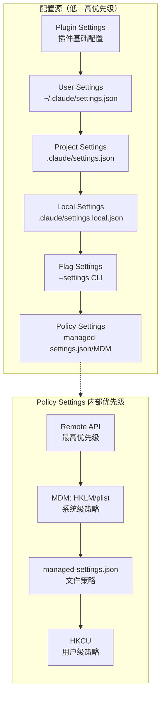
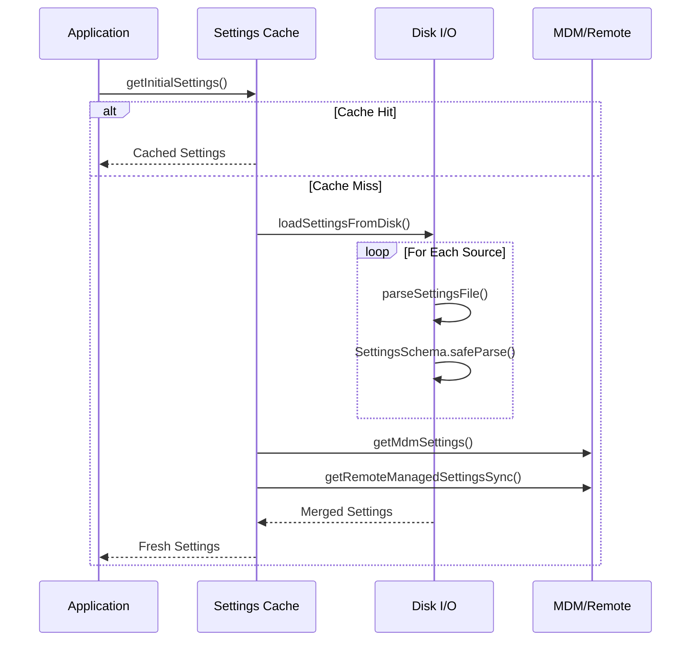

# 28. 设置管理 (Settings Management)

> **代码入口**: `src/utils/settings/settings.ts` · **类型定义**: `src/utils/settings/types.ts`
> **配置层级**: userSettings → projectSettings → localSettings → flagSettings → policySettings

## 概述

Claude Code 的设置管理系统采用分层架构，支持多源配置合并与优先级覆盖。系统设计解决了以下核心问题：

1. **多源配置合并**：支持用户、项目、本地、命令行、企业策略等多种配置来源
2. **权限边界**：projectSettings 不参与安全敏感决策（防止恶意项目 RCE）
3. **企业管控**：MDM/远程配置实现企业级策略强制执行
4. **类型安全**：Zod schema 确保配置验证与向后兼容

## 设计原理

### 配置优先级模型



**核心设计决策**：

- **First Source Wins（Policy）**：policySettings 采用"首个有内容的源获胜"策略
- **Deep Merge**：其他源采用深度合并，数组去重连接
- **不可编辑源**：`policySettings` 和 `flagSettings` 只读，防止运行时修改

### 安全边界设计

projectSettings 被有意排除在安全敏感决策之外：

```typescript
// src/utils/settings/settings.ts:882-888
export function hasSkipDangerousModePermissionPrompt(): boolean {
  return !!(
    getSettingsForSource('userSettings')?.skipDangerousModePermissionPrompt ||
    getSettingsForSource('localSettings')?.skipDangerousModePermissionPrompt ||
    getSettingsForSource('flagSettings')?.skipDangerousModePermissionPrompt ||
    getSettingsForSource('policySettings')?.skipDangerousModePermissionPrompt
    // projectSettings 有意排除 - 防止恶意项目绕过安全对话框
  )
}
```

## 实现原理

### 设置加载流程



**关键实现**：

1. **会话级缓存** (`src/utils/settings/settingsCache.ts:18-30`)
   - 避免重复文件 I/O
   - 设置变更需重启生效
   - 通过 `resetSettingsCache()` 失效

2. **文件解析与验证** (`src/utils/settings/settings.ts:178-231`)
   ```typescript
   export function parseSettingsFile(path: string): {
     settings: SettingsJson | null
     errors: ValidationError[]
   } {
     const cached = getCachedParsedFile(path)
     if (cached) return clone(cached) // 返回副本防止污染
     
     // 过滤无效权限规则（避免一个坏规则毁掉整个文件）
     const ruleWarnings = filterInvalidPermissionRules(data, path)
     
     const result = SettingsSchema().safeParse(data)
     // ...
   }
   ```

3. **深度合并策略** (`src/utils/settings/settings.ts:538-547`)
   - 数组：连接 + 去重
   - 对象：递归合并
   - `undefined`：触发删除

### Policy Settings 多源选择

```typescript
// src/utils/settings/settings.ts:319-345
function getSettingsForSourceUncached(source: SettingSource): SettingsJson | null {
  if (source === 'policySettings') {
    // 优先级：remote > HKLM/plist > file > HKCU
    const remoteSettings = getRemoteManagedSettingsSyncFromCache()
    if (remoteSettings && Object.keys(remoteSettings).length > 0) return remoteSettings
    
    const mdmResult = getMdmSettings()
    if (Object.keys(mdmResult.settings).length > 0) return mdmResult.settings
    
    const { settings: fileSettings } = loadManagedFileSettings()
    if (fileSettings) return fileSettings
    
    const hkcu = getHkcuSettings()
    if (Object.keys(hkcu.settings).length > 0) return hkcu.settings
    
    return null
  }
  // ...
}
```

## 功能展开

### 1. User Settings（用户全局配置）

**存储位置**: `~/.claude/settings.json` (或 `cowork_settings.json`)

**用途**:
- 用户的个人偏好设置
- 跨项目共享的配置
- MCP 服务器配置

**示例配置**:
```json
{
  "$schema": "https://json.schemastore.org/claude-code-settings.json",
  "permissions": {
    "allow": ["Read(**)", "Edit(**)"],
    "defaultMode": "plan"
  },
  "model": "claude-sonnet-4-6",
  "env": {
    "NODE_ENV": "development"
  }
}
```

### 2. Project Settings（项目共享配置）

**存储位置**: `$PROJECT/.claude/settings.json`

**用途**:
- 团队共享的项目配置
- 权限规则定义
- 提交到版本控制

**限制**:
- 不参与 `hasSkipDangerousModePermissionPrompt()` 决策
- 不参与 `hasAutoModeOptIn()` 决策
- 不参与 `getAutoModeConfig()` 配置

### 3. Local Settings（项目本地配置）

**存储位置**: `$PROJECT/.claude/settings.local.json`

**特点**:
- 自动添加到 `.gitignore`
- 用户私有配置（如 API keys）
- 优先级高于 projectSettings

### 4. Flag Settings（命令行配置）

**来源**: `--settings` CLI 参数或 SDK 内联设置

**特点**:
- 只读，不可运行时修改
- 支持内联 JSON 或文件路径
- 会话级别生效

### 5. Policy Settings（企业策略配置）

**多源优先级**:

| 来源 | 平台 | 写入权限 | 用途 |
|------|------|----------|------|
| Remote API | All | 企业管理员 | 动态策略下发 |
| HKLM/plist | Win/Mac | 系统管理员 | 静态企业策略 |
| managed-settings.json | All | 文件系统权限 | 文件策略 |
| HKCU | Win | 用户 | 用户策略（最低） |

**Drop-in 支持** (`src/utils/settings/settings.ts:91-112`):
```typescript
// 支持 managed-settings.d/*.json drop-in 文件
// 按字母序排序，后加载的覆盖先加载的
const entries = fs.readdirSync(dropInDir)
  .filter(d => d.name.endsWith('.json') && !d.name.startsWith('.'))
  .map(d => d.name)
  .sort()
```

## 数据结构

### SettingsJson 核心字段

```typescript
// src/utils/settings/types.ts:255-1079
export const SettingsSchema = lazySchema(() =>
  z.object({
    // 权限配置
    permissions: PermissionsSchema().optional(),
    
    // 模型配置
    model: z.string().optional(),
    modelType: z.enum(['anthropic', 'openai']).optional(),
    availableModels: z.array(z.string()).optional(), // 企业白名单
    
    // MCP 配置
    allowedMcpServers: z.array(AllowedMcpServerEntrySchema()).optional(),
    deniedMcpServers: z.array(DeniedMcpServerEntrySchema()).optional(),
    
    // 钩子配置
    hooks: HooksSchema().optional(),
    
    // 企业策略
    strictPluginOnlyCustomization: z.preprocess(...).optional(),
    strictKnownMarketplaces: z.array(MarketplaceSourceSchema()).optional(),
    
    // 环境变量
    env: EnvironmentVariablesSchema().optional(),
    
    // ... 更多字段
  }).passthrough()
)
```

### SettingSource 枚举

```typescript
// src/utils/settings/constants.ts:7-22
export const SETTING_SOURCES = [
  'userSettings',    // 用户全局
  'projectSettings', // 项目共享
  'localSettings',   // 项目本地
  'flagSettings',    // CLI 参数
  'policySettings',  // 企业策略
] as const
```

## 组合使用

### 与权限系统集成

```typescript
// 权限规则从所有启用的源合并
const settings = getInitialSettings()
const permissions = settings.permissions || {}

// allow/deny/ask 数组自动合并去重
const allAllowed = permissions.allow || []
const allDenied = permissions.deny || []
```

### 与 Hook 系统集成

```typescript
// hooks 配置支持多源合并
// policySettings 可强制覆盖其他源的 hooks
const hooks = settings.hooks

// allowManagedHooksOnly 可限制只执行 policy hooks
if (settings.allowManagedHooksOnly && source !== 'policySettings') {
  continue // 跳过非 policy hooks
}
```

### 与 MCP 系统集成

```typescript
// MCP 服务器白名单/黑名单
const allowed = settings.allowedMcpServers // 企业白名单
const denied = settings.deniedMcpServers   // 企业黑名单

// 黑名单优先
if (isInDenylist(server) && !isInAllowlist(server)) {
  block()
}
```

## 小结

### 设计取舍

| 决策 | 优势 | 劣势 |
|------|------|------|
| 会话级缓存 | 减少文件 I/O | 设置变更需重启 |
| projectSettings 排除敏感决策 | 防止恶意项目 RCE | 项目无法配置某些行为 |
| Policy "First Source Wins" | 企业策略明确 | 无法叠加多个策略源 |
| 深度合并 + 数组去重 | 灵活组合 | 数组顺序不可控 |

### 局限性

1. **缓存粒度**：目前是会话级缓存，无热重载支持
2. **错误恢复**：验证失败时整个文件被跳过，无部分恢复
3. **数组合并**：去重但无顺序保证

### 演进方向

1. **增量更新**：支持运行时设置变更通知
2. **部分验证**：验证失败时保留有效字段
3. **配置迁移**：自动迁移旧版本配置格式

---

*基于代码事实构建 · 最后更新: 2026-04-26*
