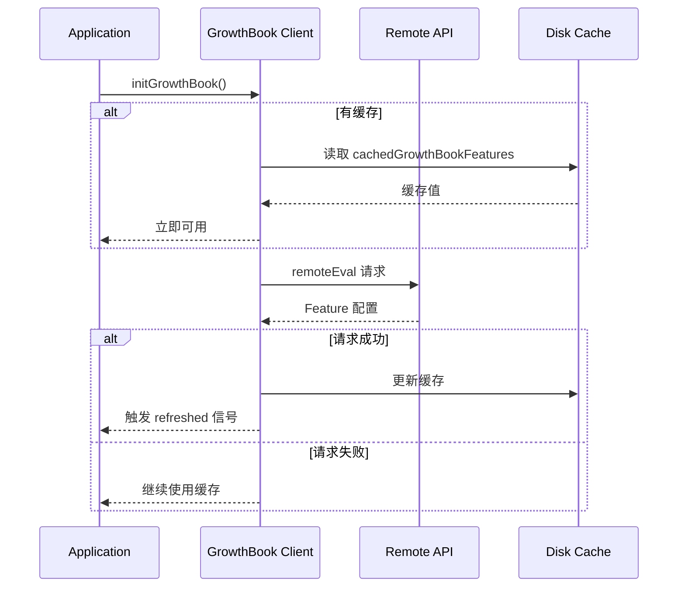

# 29. 环境与特性开关 (Environment & Feature Flags)

> **代码入口**: `src/utils/env.ts` · `src/utils/envUtils.ts`
> **Feature Flags**: `src/services/analytics/growthbook.ts` · **动态开关**: GrowthBook SDK

## 概述

Claude Code 的环境与特性开关系统实现了三层配置机制：

1. **环境变量层**：静态配置，启动时确定
2. **Feature Flags 层**：动态开关，支持远程控制
3. **GrowthBook 层**：A/B 测试与灰度发布

系统设计解决了以下核心问题：

- 跨平台环境检测与适配
- 运行时特性开关控制
- 企业级灰度发布能力
- 开发/生产环境隔离

## 设计原理

### 三层配置架构

```mermaid
flowchart TB
    subgraph Layer1["Layer 1: 环境变量"]
        direction LR
        ENV[process.env]
        CLI[CLI Args]
        FILE[Config Files]
    end
    
    subgraph Layer2["Layer 2: Feature Flags"]
        direction LR
        BUN[Bun Bundle<br/>feature()]
        STATIC[Static Flags<br/>编译时确定]
    end
    
    subgraph Layer3["Layer 3: GrowthBook"]
        direction LR
        REMOTE[Remote Eval<br/>API 动态下发]
        CACHE[Disk Cache<br/>离线可用]
        OVERRIDE[Local Overrides<br/>开发调试]
    end
    
    Layer1 --> Layer2 --> Layer3
    
    subgraph Consumers["消费者"]
        APP[Application Code]
        SEC[Security Gates]
        UI[UI Components]
    end
    
    Layer3 --> Consumers
```

**优先级规则**：

1. **环境变量覆盖**：`CLAUDE_INTERNAL_FC_OVERRIDES` > GrowthBook 远程值
2. **本地覆盖**：`growthBookOverrides` (config.json) > 远程值
3. **缓存降级**：远程不可用时使用磁盘缓存

## 实现原理

### 环境变量解析

**核心工具函数** (`src/utils/envUtils.ts:32-47`):

```typescript
export function isEnvTruthy(envVar: string | boolean | undefined): boolean {
  if (!envVar) return false
  if (typeof envVar === 'boolean') return envVar
  const normalizedValue = envVar.toLowerCase().trim()
  return ['1', 'true', 'yes', 'on'].includes(normalizedValue)
}

export function isEnvDefinedFalsy(envVar: string | boolean | undefined): boolean {
  if (envVar === undefined) return false
  if (typeof envVar === 'boolean') return !envVar
  if (!envVar) return false
  const normalizedValue = envVar.toLowerCase().trim()
  return ['0', 'false', 'no', 'off'].includes(normalizedValue)
}
```

**环境检测** (`src/utils/env.ts:240-305`):

```typescript
export const detectDeploymentEnvironment = memoize((): string => {
  // 云开发环境
  if (isEnvTruthy(process.env.CODESPACES)) return 'codespaces'
  if (process.env.GITPOD_WORKSPACE_ID) return 'gitpod'
  if (process.env.REPL_ID || process.env.REPL_SLUG) return 'replit'
  
  // 云平台
  if (isEnvTruthy(process.env.VERCEL)) return 'vercel'
  if (process.env.DYNO) return 'heroku'
  if (process.env.AWS_LAMBDA_FUNCTION_NAME) return 'aws-lambda'
  
  // CI/CD 平台
  if (isEnvTruthy(process.env.GITHUB_ACTIONS)) return 'github-actions'
  if (isEnvTruthy(process.env.GITLAB_CI)) return 'gitlab-ci'
  
  // 容器编排
  if (process.env.KUBERNETES_SERVICE_HOST) return 'kubernetes'
  
  // ...
})
```

### Feature Flag 系统

**Bun Bundle 集成** (`src/services/analytics/growthbook.ts`):

```typescript
// Bun 编译时注入的 feature() 函数
import { feature } from 'bun:bundle'

// 使用示例
if (feature('TRANSCRIPT_CLASSIFIER')) {
  // 启用 AI 分类器功能
  const classifier = await loadClassifier()
}
```

**Feature Flag 检查**:

```typescript
// src/services/analytics/growthbook.ts:199-200
export function hasGrowthBookEnvOverride(feature: string): boolean {
  const overrides = getEnvOverrides()
  return overrides ? feature in overrides : false
}
```

### GrowthBook 远程配置

**初始化流程**:



**缓存机制** (`src/utils/config.ts:448-449`):

```typescript
export type GlobalConfig = {
  // ...
  cachedGrowthBookFeatures?: { [featureName: string]: unknown }
  growthBookOverrides?: { [featureName: string]: unknown }
}
```

## 功能展开

### 1. 环境变量配置

**核心环境变量**:

| 变量名 | 用途 | 示例 |
|--------|------|------|
| `CLAUDE_CONFIG_DIR` | 配置目录覆盖 | `/custom/config` |
| `ANTHROPIC_API_KEY` | API 密钥 | `sk-ant-...` |
| `CLAUDE_CODE_SIMPLE` | 精简模式 | `1` |
| `CLAUDE_CODE_HOST_PLATFORM` | 主机平台覆盖 | `darwin` |
| `CLAUDE_CODE_USE_COWORK_PLUGINS` | Cowork 插件模式 | `true` |

**平台检测环境变量**:

```typescript
// 终端检测
process.env.TERM_PROGRAM      // vscode, iterm, ghostty
process.env.TMUX              // tmux
process.env.WT_SESSION        // Windows Terminal

// IDE 检测
process.env.VSCODE_GIT_ASKPASS_MAIN  // VS Code/Cursor/Windsurf
process.env.__CFBundleIdentifier      // macOS 应用 ID

// 云平台检测
process.env.CODESPACES        // GitHub Codespaces
process.env.VERCEL            // Vercel
process.env.AWS_LAMBDA_FUNCTION_NAME // AWS Lambda
```

### 2. 静态 Feature Flags

**编译时注入** (通过 `bun:bundle`):

```typescript
// 常见 Feature Flags
feature('TRANSCRIPT_CLASSIFIER')  // AI 分类器
feature('TEAMMEM')                // 团队记忆
feature('VOICE_MODE')             // 语音模式
feature('KAIROS')                 // KAIROS 功能
feature('PROACTIVE')              // 主动模式
feature('CCR_AUTO_CONNECT')       // CCR 自动连接
```

**使用模式**:

```typescript
// 条件渲染 UI
if (feature('VOICE_MODE')) {
  voiceEnabled: z.boolean().optional()
}

// 条件导入模块
const teamMemPaths = feature('TEAMMEM')
  ? require('../memdir/teamMemPaths.js')
  : null
```

### 3. GrowthBook 动态配置

**Remote Eval 特性**:

```typescript
// 初始化 GrowthBook
const client = new GrowthBook({
  apiHost: 'https://cdn.growthbook.io',
  clientKey: getGrowthBookClientKey(),
  remoteEval: true,  // 启用远程评估
  attributes: {
    id: userId,
    platform: env.platform,
    organizationUUID: orgId,
    // ...
  }
})
```

**获取 Feature 值**:

```typescript
// 同步获取（使用缓存）
const value = getFeatureValue_CACHED_MAY_BE_STALE('tengu_moth_copse', false)

// 异步获取（等待初始化）
const value = await getFeatureValue('tengu_moth_copse', false)
```

### 4. 本地覆盖机制

**环境变量覆盖** (仅限 `USER_TYPE=ant`):

```bash
# JSON 格式覆盖
export CLAUDE_INTERNAL_FC_OVERRIDES='{"my_feature": true}'
```

**配置文件覆盖**:

```typescript
// ~/.claude.json
{
  "growthBookOverrides": {
    "tengu_moth_copse": true,
    "tengu_paper_halyard": false
  }
}
```

## 数据结构

### GrowthBookUserAttributes

```typescript
// src/services/analytics/growthbook.ts:32-47
export type GrowthBookUserAttributes = {
  id: string
  sessionId: string
  deviceID: string
  platform: 'win32' | 'darwin' | 'linux'
  apiBaseUrlHost?: string
  organizationUUID?: string
  accountUUID?: string
  userType?: string
  subscriptionType?: string
  rateLimitTier?: string
  firstTokenTime?: number
  email?: string
  appVersion?: string
  github?: GitHubActionsMetadata
}
```

### 环境检测结果

```typescript
// src/utils/env.ts:316-333
export const env = {
  hasInternetAccess,
  isCI: boolean,
  platform: 'win32' | 'darwin' | 'linux',
  arch: string,
  nodeVersion: string,
  terminal: string | null,
  isSSH: boolean,
  getPackageManagers: () => Promise<string[]>,
  getRuntimes: () => Promise<string[]>,
  isRunningWithBun: boolean,
  isWslEnvironment: boolean,
  isNpmFromWindowsPath: boolean,
  isConductor: boolean,
  detectDeploymentEnvironment: string,
}
```

## 组合使用

### 与安全系统集成

```typescript
// 检查是否在受保护命名空间
if (isInProtectedNamespace()) {
  // 限制危险操作
  restrictDangerousOperations()
}

// 检查是否在 bare 模式
if (isBareMode()) {
  // 跳过钩子、LSP、插件同步
  skipNonEssentialFeatures()
}
```

### 与模型选择集成

```typescript
// Vertex AI 区域覆盖
const region = getVertexRegionForModel('claude-opus-4-1')
// 检查 VERTEX_REGION_CLAUDE_4_1_OPUS 环境变量
```

### 与权限系统集成

```typescript
// 根据环境调整权限模式
if (detectDeploymentEnvironment() === 'codespaces') {
  // Codespaces 环境的默认权限
  setDefaultPermissions('ask')
}
```

## 小结

### 设计取舍

| 决策 | 优势 | 劣势 |
|------|------|------|
| 三层配置 | 灵活性高 | 复杂度增加 |
| 缓存优先 | 离线可用 | 配置延迟生效 |
| 环境变量最高优先级 | 开发友好 | 生产环境需谨慎 |
| Remote Eval | 实时控制 | 依赖网络 |

### 局限性

1. **缓存一致性**：多实例间缓存可能不一致
2. **Feature Flag 耦合**：部分 Feature Flag 编译时确定
3. **覆盖范围**：本地覆盖仅限 `ant` 用户

### 演进方向

1. **热重载**：支持 Feature Flag 实时更新通知
2. **统一配置中心**：整合环境变量与 GrowthBook
3. **配置审计**：记录配置变更历史

---

*基于代码事实构建 · 最后更新: 2026-04-26*
