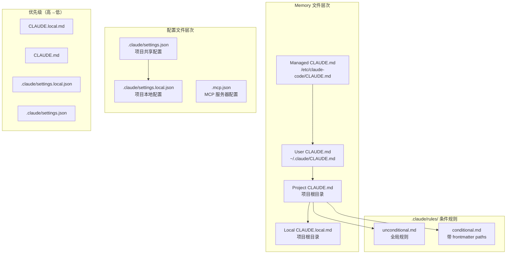
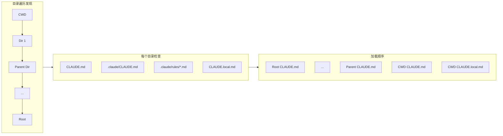

# 30. 项目配置 (Project Configuration)

> **代码入口**: `src/utils/config.ts` · `src/utils/claudemd.ts`
> **配置文件**: `CLAUDE.md` · `AGENTS.md` · `.claude/` · `.mcp.json`

## 概述

Claude Code 的项目配置系统实现了多层次的上下文注入机制：

1. **CLAUDE.md**：项目指令文件，注入到系统提示词
2. **AGENTS.md**：代理指令文件，覆盖 CLAUDE.md
3. **.claude/ 目录**：项目级配置与规则
4. **项目状态持久化**：信任对话框、MCP 审批等

系统设计解决了以下核心问题：

- 项目特定行为指导
- 团队共享配置管理
- 敏感配置与共享配置分离
- 信任边界与安全隔离

## 设计原理

### 项目配置层次结构



**核心设计原则**：

1. **就近优先**：离 CWD 更近的文件优先级更高
2. **内外分离**：checked-in 配置与 local 配置分离
3. **信任继承**：父目录信任自动继承到子目录
4. **安全隔离**：projectSettings 不参与敏感决策

### 文件发现机制



## 实现原理

### Memory 文件加载

**核心加载函数** (`src/utils/claudemd.ts:790-1075`):

```typescript
export const getMemoryFiles = memoize(
  async (forceIncludeExternal: boolean = false): Promise<MemoryFileInfo[]> => {
    const result: MemoryFileInfo[] = []
    const processedPaths = new Set<string>()
    
    // 1. Managed 文件（策略级别）
    const managedClaudeMd = getMemoryPath('Managed')
    result.push(...await processMemoryFile(managedClaudeMd, 'Managed', ...))
    
    // 2. User 文件（用户全局）
    if (isSettingSourceEnabled('userSettings')) {
      const userClaudeMd = getMemoryPath('User')
      result.push(...await processMemoryFile(userClaudeMd, 'User', ...))
    }
    
    // 3. Project/Local 文件（从 Root 到 CWD）
    const dirs = walkFromCwdToRoot(getOriginalCwd())
    for (const dir of dirs.reverse()) { // Root → CWD 顺序
      if (isSettingSourceEnabled('projectSettings')) {
        result.push(...await processMemoryFile(join(dir, 'CLAUDE.md'), 'Project', ...))
        result.push(...await processMemoryFile(join(dir, '.claude/CLAUDE.md'), 'Project', ...))
      }
      if (isSettingSourceEnabled('localSettings')) {
        result.push(...await processMemoryFile(join(dir, 'CLAUDE.local.md'), 'Local', ...))
      }
    }
    
    // 4. Auto Memory / Team Memory
    if (isAutoMemoryEnabled()) {
      result.push(...await safelyReadMemoryFileAsync(getAutoMemEntrypoint(), 'AutoMem'))
    }
    
    return result
  }
)
```

### @include 指令处理

**Include 解析** (`src/utils/claudemd.ts:451-535`):

```typescript
function extractIncludePathsFromTokens(
  tokens: ReturnType<Lexer['lex']>,
  basePath: string,
): string[] {
  const absolutePaths = new Set<string>()
  
  // 从 Markdown tokens 中提取 @path 引用
  function extractPathsFromText(textContent: string) {
    const includeRegex = /(?:^|\s)@((?:[^\s\\]|\\ )+)/g
    let match
    while ((match = includeRegex.exec(textContent)) !== null) {
      let path = match[1]
      
      // 移除 fragment (#heading)
      const hashIndex = path.indexOf('#')
      if (hashIndex !== -1) path = path.substring(0, hashIndex)
      
      // 反转义空格
      path = path.replace(/\\ /g, ' ')
      
      // 支持 @path, @./path, @~/path, @/path
      const resolvedPath = expandPath(path, dirname(basePath))
      absolutePaths.add(resolvedPath)
    }
  }
  
  // 递归处理 tokens（跳过代码块）
  processElements(tokens)
  return [...absolutePaths]
}
```

**递归限制**:

```typescript
const MAX_INCLUDE_DEPTH = 5

// 防止循环引用
const normalizedPath = normalizePathForComparison(filePath)
if (processedPaths.has(normalizedPath) || depth >= MAX_INCLUDE_DEPTH) {
  return []
}
```

### 项目配置持久化

**ProjectConfig 结构** (`src/utils/config.ts:76-136`):

```typescript
export type ProjectConfig = {
  allowedTools: string[]
  mcpContextUris: string[]
  mcpServers?: Record<string, McpServerConfig>
  
  // 性能指标
  lastAPIDuration?: number
  lastCost?: number
  lastModelUsage?: Record<string, {...}>
  
  // 信任对话框
  hasTrustDialogAccepted?: boolean
  
  // MCP 审批
  enabledMcpjsonServers?: string[]
  disabledMcpjsonServers?: string[]
  enableAllProjectMcpServers?: boolean
  
  // Worktree 管理
  activeWorktreeSession?: {
    originalCwd: string
    worktreePath: string
    worktreeName: string
    sessionId: string
  }
  
  // 远程控制模式
  remoteControlSpawnMode?: 'same-dir' | 'worktree'
}
```

**存储位置**: `~/.claude.json` 的 `projects` 字段

```typescript
export type GlobalConfig = {
  projects?: Record<string, ProjectConfig> // key: normalized project path
  // ...
}
```

### 信任继承机制

**信任对话框检查** (`src/utils/config.ts:697-743`):

```typescript
export function checkHasTrustDialogAccepted(): boolean {
  // 会话级信任（home 目录场景）
  if (getSessionTrustAccepted()) return true
  
  const config = getGlobalConfig()
  const projectPath = getProjectPathForConfig()
  
  // 检查主存储位置
  if (config.projects?.[projectPath]?.hasTrustDialogAccepted) return true
  
  // 遍历父目录检查继承
  let currentPath = normalizePathForConfigKey(getCwd())
  while (true) {
    if (config.projects?.[currentPath]?.hasTrustDialogAccepted) return true
    
    const parentPath = normalizePathForConfigKey(resolve(currentPath, '..'))
    if (parentPath === currentPath) break // 到达 root
    currentPath = parentPath
  }
  
  return false
}
```

## 功能展开

### 1. CLAUDE.md 项目指令

**标准位置**:

| 位置 | 类型 | Git | 用途 |
|------|------|-----|------|
| `$PROJECT/CLAUDE.md` | Project | ✅ | 项目根指令 |
| `$PROJECT/.claude/CLAUDE.md` | Project | ✅ | 项目次级指令 |
| `$PROJECT/CLAUDE.local.md` | Local | ❌ | 私有指令 |
| `~/.claude/CLAUDE.md` | User | ❌ | 用户全局指令 |

**内容格式**:

```markdown
# Project Instructions

## Build Commands
- Build: `npm run build`
- Test: `npm test`

## Code Style
- Use TypeScript strict mode
- Prefer functional components

## @include 支持
@include ./docs/api.md
@include ~/shared/instructions.md
```

### 2. AGENTS.md 代理指令

**用途**: 覆盖 CLAUDE.md，为代理提供特定指令

**优先级**: `AGENTS.md` > `CLAUDE.md`

**加载位置**: 与 CLAUDE.md 相同的目录层级

### 3. .claude/rules/ 条件规则

**无条件规则** (全局应用):

```markdown
<!-- .claude/rules/style.md -->
Always use 2-space indentation.
```

**条件规则** (带 frontmatter paths):

```markdown
<!-- .claude/rules/frontend.md -->
---
paths:
  - "src/**/*.tsx"
  - "src/**/*.css"
---

For React components:
- Use functional components
- Prefer hooks over class components
```

**路径匹配逻辑** (`src/utils/claudemd.ts:1354-1397`):

```typescript
export async function processConditionedMdRules(
  targetPath: string,
  rulesDir: string,
  type: MemoryType,
  ...
): Promise<MemoryFileInfo[]> {
  const rules = await processMdRules({ rulesDir, type, conditionalRule: true, ... })
  
  return rules.filter(file => {
    if (!file.globs) return false
    
    const baseDir = type === 'Project'
      ? dirname(dirname(rulesDir)) // .claude 的父目录
      : getOriginalCwd()
    
    const relativePath = relative(baseDir, targetPath)
    return ignore().add(file.globs).ignores(relativePath)
  })
}
```

### 4. .mcp.json MCP 配置

**示例配置**:

```json
{
  "mcpServers": {
    "filesystem": {
      "command": "npx",
      "args": ["-y", "@modelcontextprotocol/server-filesystem", "/path/to/dir"]
    },
    "postgres": {
      "command": "docker",
      "args": ["run", "-i", "--rm", "mcp/postgres"],
      "env": {
        "DATABASE_URL": "postgresql://..."
      }
    }
  }
}
```

**审批机制**:

- 首次发现 `.mcp.json` 时显示审批对话框
- 用户选择启用/禁用特定服务器
- 状态存储在 `ProjectConfig.enabledMcpjsonServers`

### 5. 项目信任对话框

**触发条件**:

1. 首次在项目目录运行 Claude Code
2. 目录不在信任列表中
3. 目录包含 `.claude/` 或 `.mcp.json`

**信任继承**:

```
/home/user/projects/         (trusted)
├── project-a/               (inherited trust)
│   └── subdir/              (inherited trust)
└── project-b/               (needs trust dialog)
```

## 数据结构

### MemoryFileInfo

```typescript
// src/utils/claudemd.ts:229-243
export type MemoryFileInfo = {
  path: string
  type: MemoryType
  content: string
  parent?: string        // @include 父文件路径
  globs?: string[]       // frontmatter paths
  contentDiffersFromDisk?: boolean
  rawContent?: string
}
```

### MemoryType 枚举

```typescript
type MemoryType = 
  | 'Managed'   // 策略级别
  | 'User'      // 用户全局
  | 'Project'   // 项目共享
  | 'Local'     // 项目本地
  | 'AutoMem'   // 自动记忆
  | 'TeamMem'   // 团队记忆
```

### 项目路径标准化

```typescript
// 用于 GlobalConfig.projects 的 key
function normalizePathForConfigKey(path: string): string {
  // 统一路径分隔符
  // 处理大小写（Windows）
  // 解析符号链接
}
```

## 组合使用

### 与设置系统集成

```typescript
// CLAUDE.md 可引用设置
const settings = getInitialSettings()

// 设置可控制 CLAUDE.md 加载
if (!isSettingSourceEnabled('projectSettings')) {
  // 跳过 Project 类型 CLAUDE.md
}
```

### 与权限系统集成

```typescript
// 外部 include 需要审批
if (isExternal && !includeExternal) {
  continue // 跳过外部文件
}

// 首次发现外部 include 时显示警告
if (hasExternalClaudeMdIncludes(files) && !config.hasClaudeMdExternalIncludesApproved) {
  showWarning()
}
```

### 与 Worktree 集成

```typescript
// Worktree 会话管理
const session: ProjectConfig['activeWorktreeSession'] = {
  originalCwd: '/path/to/main/repo',
  worktreePath: '/path/to/worktree',
  worktreeName: 'feature-branch',
  sessionId: 'uuid',
}

// Worktree 内的 CLAUDE.md 隔离
if (isNestedWorktree && pathInWorkingPath(dir, canonicalRoot) && !pathInWorkingPath(dir, gitRoot)) {
  skipProject = true // 跳过 main repo 的 Project 文件
}
```

## 小结

### 设计取舍

| 决策 | 优势 | 劣势 |
|------|------|------|
| 目录遍历发现 | 自动覆盖子目录 | 性能开销 |
| @include 递归限制 | 防止循环引用 | 限制复杂引用 |
| 信任继承 | 减少对话框 | 需理解继承规则 |
| Local 文件自动 gitignore | 安全隔离 | 需额外配置 |

### 局限性

1. **大文件处理**：超过 40KB 的 CLAUDE.md 会被截断
2. **条件规则性能**：大量条件规则影响匹配速度
3. **跨项目引用**：@include 不支持跨项目

### 演进方向

1. **增量加载**：按需加载条件规则
2. **缓存优化**：改进 Memory 文件缓存
3. **项目模板**：支持项目配置模板

---

*基于代码事实构建 · 最后更新: 2026-04-26*
