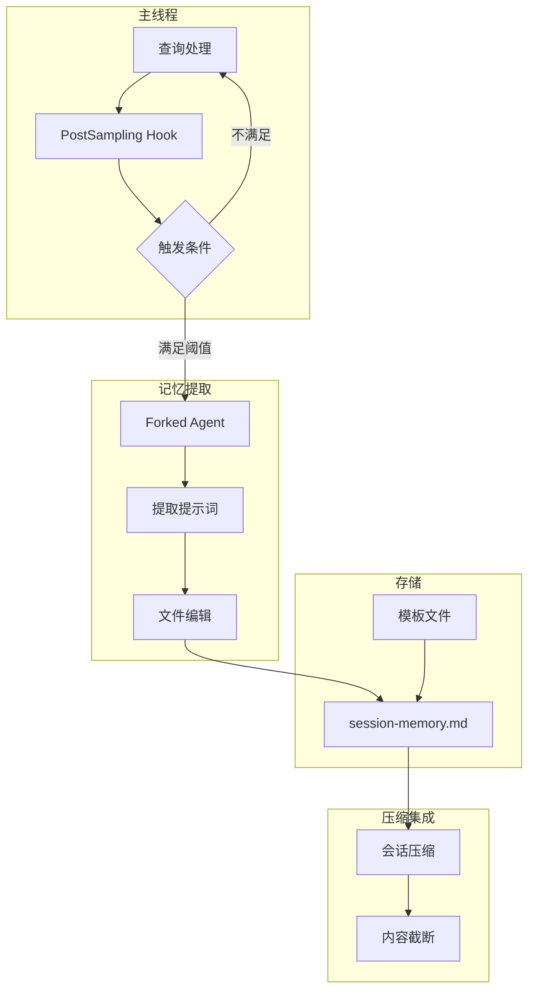
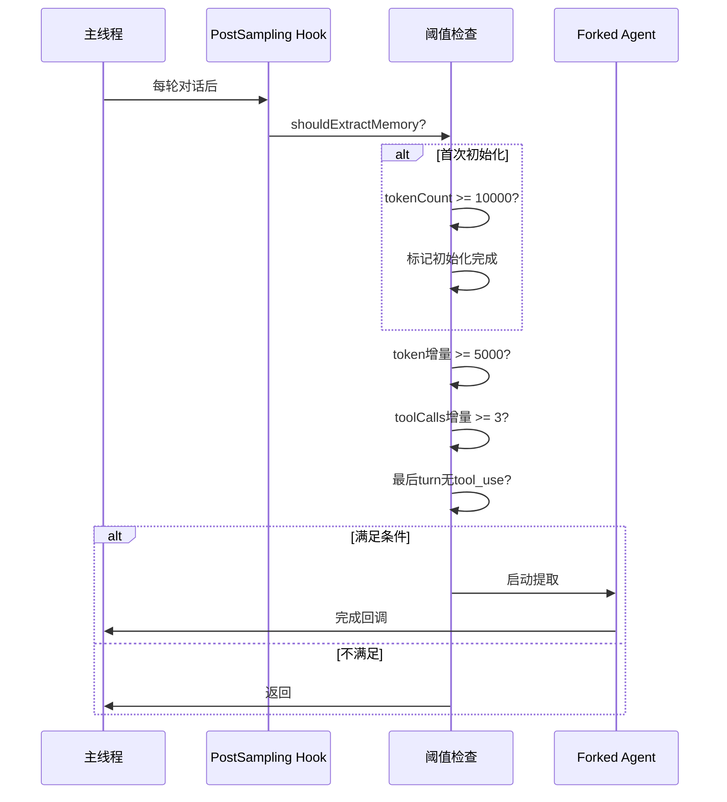

# 31. 会话记忆 (Session Memory)

> **代码入口**: `src/services/SessionMemory/`  
> **核心功能**: 对话笔记提取、会话状态持久化、智能摘要生成、压缩优化

## 概述

Session Memory 是 Claude Code 的对话记忆系统，通过后台 forked agent 自动从当前对话中提取关键信息并持久化为 Markdown 文件。核心设计目标：

1. **非阻塞提取**：使用 forked agent 在后台运行，不影响主对话流程
2. **智能触发**：基于 token 增长和工具调用频率自动判断提取时机
3. **结构化存储**：使用预定义模板组织信息，便于后续检索和注入
4. **压缩协同**：为上下文压缩提供摘要源，减少 token 消耗

## 设计原理

### 架构决策：后台 Forked Agent 模式



**设计动机**：
- 记忆提取需要 LLM 调用，如果在主线程同步执行会阻塞用户交互
- Forked Agent 提供隔离的执行上下文，避免污染主对话状态
- 使用 Prompt Caching 复用系统提示词，降低 API 成本

### 触发机制：双重阈值策略



**代码路径**：`src/services/SessionMemory/sessionMemory.ts:134-181`

## 实现原理

### 1. 初始化流程

**代码路径**：`src/services/SessionMemory/sessionMemory.ts:357-375`

```typescript
export function initSessionMemory(): void {
  if (getIsRemoteMode()) return
  const autoCompactEnabled = isAutoCompactEnabled()
  if (!autoCompactEnabled) return
  registerPostSamplingHook(extractSessionMemory)
}
```

初始化在 `src/setup.ts:294` 调用，同步注册 hook，避免竞态条件。

### 2. 提取条件判断

**代码路径**：`src/services/SessionMemory/sessionMemory.ts:134-181`

触发条件（满足任一）：
1. token 增量 >= 5000 **且** tool calls >= 3
2. token 增量 >= 5000 **且** 最后 assistant turn 无 tool calls

### 3. Forked Agent 执行

**代码路径**：`src/services/SessionMemory/sessionMemory.ts:318-325`

使用 `runForkedAgent` 创建隔离上下文，只允许编辑记忆文件。

### 4. 配置管理

**代码路径**：`src/services/SessionMemory/sessionMemoryUtils.ts:18-36`

默认配置：
- `minimumMessageTokensToInit`: 10000 tokens
- `minimumTokensBetweenUpdate`: 5000 tokens  
- `toolCallsBetweenUpdates`: 3 次

## 功能展开

### 31.1 记忆文件结构

**代码路径**：`src/services/SessionMemory/prompts.ts:11-41`

预定义模板包含以下 section：
- **Session Title**: 会话标题（5-10词）
- **Current State**: 当前工作状态
- **Task specification**: 任务规格说明
- **Files and Functions**: 相关文件和函数
- **Workflow**: 常用命令和工作流
- **Errors & Corrections**: 错误和修正
- **Codebase Documentation**: 代码库文档
- **Learnings**: 学习要点
- **Key results**: 关键结果
- **Worklog**: 工作日志

### 31.2 提取提示词

**代码路径**：`src/services/SessionMemory/prompts.ts:43-81`

提取提示词的关键约束：
1. 保持模板结构不变
2. 只更新内容，不修改 section 头和描述
3. 每个 section 限制 ~2000 tokens
4. 总大小限制 12000 tokens

### 31.3 内容截断

**代码路径**：`src/services/SessionMemory/prompts.ts:256-296`

`truncateSessionMemoryForCompact` 用于压缩时截断超长 section。

### 31.4 手动触发

**代码路径**：`src/services/SessionMemory/sessionMemory.ts:387-453`

`manuallyExtractSessionMemory` 用于 `/summary` 命令，跳过阈值检查。

## 数据结构

### 核心类型定义

```typescript
// src/services/SessionMemory/sessionMemoryUtils.ts:18-29
export type SessionMemoryConfig = {
  minimumMessageTokensToInit: number
  minimumTokensBetweenUpdate: number
  toolCallsBetweenUpdates: number
}

// 模块内部状态
let lastMemoryMessageUuid: string | undefined  // 上次提取的消息UUID
let lastSummarizedMessageId: string | undefined  // 上次摘要的消息ID
let tokensAtLastExtraction = 0  // 上次提取时的token数
let sessionMemoryInitialized = false  // 是否已初始化
```

### 存储位置

```
~/.claude/session-memory/
├── session-memory.md     # 当前会话的记忆文件
└── config/
    ├── template.md       # 自定义模板（可选）
    └── prompt.md         # 自定义提示词（可选）
```

## 组合使用

### 与压缩系统的协作

**代码路径**：`src/services/compact/sessionMemoryCompact.ts`

压缩时读取 session memory 作为摘要源：
1. 检查 session memory 是否为空
2. 截断超长 section
3. 注入压缩消息

### 与 Token 计算的协作

使用 `tokenCountWithEstimation` 计算上下文 token 数，与 autocompact 保持一致。

### 与 PostSampling Hook 的协作

**代码路径**：`src/utils/hooks/postSamplingHooks.ts`

注册为 `postSamplingHook`，每轮对话后检查触发条件。

## 小结

### 设计取舍

**优势**：
1. 非阻塞设计不影响用户交互体验
2. 双重阈值策略平衡提取频率和信息价值
3. 结构化模板便于后续检索和压缩

**局限**：
1. 首次提取需要 10000 tokens 积累，可能丢失早期重要信息
2. Forked Agent 增加了系统复杂度
3. 远程配置依赖 GrowthBook，离线时使用默认值

### 演进方向

1. 增量更新：只提取新信息，减少 API 调用
2. 多文件存储：按 topic 分离记忆文件
3. 向量检索：支持语义搜索查找相关记忆

---

**相关文档**：
- [[32-auto-dream]] - 自动整理
- [[33-team-memory]] - 团队记忆
- [[11-context-window]] - 上下文窗口优化

**代码索引**：
- `src/services/SessionMemory/sessionMemory.ts:134-181` - 触发条件判断
- `src/services/SessionMemory/sessionMemory.ts:272-350` - 提取执行流程
- `src/services/SessionMemory/prompts.ts:43-81` - 提取提示词
- `src/services/SessionMemory/sessionMemoryUtils.ts:18-36` - 配置定义
