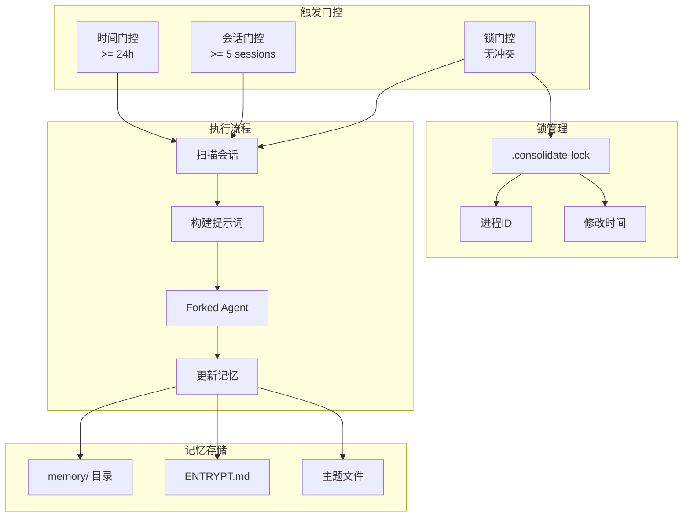
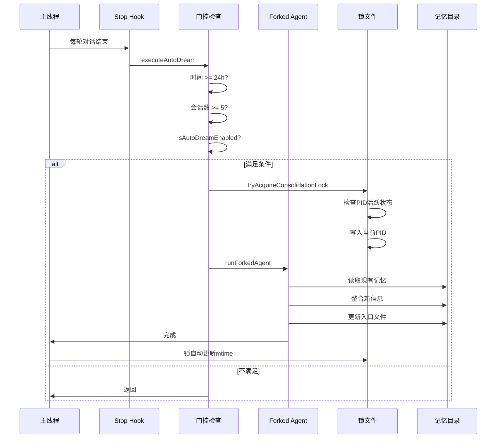

# 32. 自动整理 (Auto Dream)

> **代码入口**: `src/services/autoDream/`  
> **核心功能**: 后台记忆整合、跨会话学习、定期触发、锁机制防冲突

## 概述

Auto Dream 是 Claude Code 的后台记忆整合系统，模仿人类睡眠时的记忆巩固机制，定期回顾多个会话的学习内容并整合到长期记忆中。核心设计目标：

1. **跨会话学习**：从历史会话中提取有价值的信息
2. **非阻塞执行**：在后台 forked agent 中运行
3. **智能调度**：基于时间和会话数量双重触发
4. **冲突避免**：使用文件锁防止多进程冲突

## 设计原理

### 架构决策：三重门控机制



**设计动机**：
- 时间门控确保不会过于频繁地触发整理
- 会话门控确保有足够的新信息值得整理
- 锁门控防止多进程同时修改导致数据损坏

### 触发流程：Stop Hook 钩子



**代码路径**：`src/services/autoDream/autoDream.ts:321-326`

## 实现原理

### 1. 初始化流程

**代码路径**：`src/services/autoDream/autoDream.ts:123-274`

```typescript
export function initAutoDream(): void {
  let lastSessionScanAt = 0
  
  runner = async function runAutoDream(context, appendSystemMessage) {
    // 门控检查...
  }
}
```

初始化在 `src/utils/backgroundHousekeeping.ts:37` 调用。

### 2. 三重门控检查

**代码路径**：`src/services/autoDream/autoDream.ts:96-101, 131-191`

门控检查顺序（从便宜到昂贵）：
1. **功能开关**：`isAutoDreamEnabled()` - 读取缓存配置
2. **时间门控**：`hoursSince >= minHours` - 一次 stat 调用
3. **会话门控**：`sessionIds.length >= minSessions` - 扫描会话目录
4. **锁门控**：`tryAcquireConsolidationLock()` - 文件锁获取

### 3. 锁机制实现

**代码路径**：`src/services/autoDream/consolidationLock.ts:46-84`

锁文件设计：
- **文件位置**：`{memoryRoot}/.consolidate-lock`
- **文件内容**：持有锁的进程 PID
- **mtime**：作为 `lastConsolidatedAt` 时间戳
- **过期检测**：超过 1 小时自动回收

### 4. 整理提示词

**代码路径**：`src/services/autoDream/consolidationPrompt.ts:10-65`

四阶段整理流程：
1. **Phase 1 - Orient**：读取现有记忆结构
2. **Phase 2 - Gather**：收集新信号（日志、转录）
3. **Phase 3 - Consolidate**：整合到记忆文件
4. **Phase 4 - Prune**：修剪并更新入口索引

## 功能展开

### 32.1 配置管理

**代码路径**：`src/services/autoDream/config.ts:13-21`

```typescript
export function isAutoDreamEnabled(): boolean {
  const setting = getInitialSettings().autoDreamEnabled
  if (setting !== undefined) return setting
  return gb?.enabled === true
}
```

优先级：用户设置 > GrowthBook 配置 > 默认关闭

### 32.2 会话扫描

**代码路径**：`src/services/autoDream/consolidationLock.ts:118-124`

扫描指定时间后修改的会话文件，排除当前会话。

### 32.3 进度追踪

**代码路径**：`src/services/autoDream/autoDream.ts:282-315`

通过 `DreamTask` 追踪整理进度：
- 收集每轮的文本输出
- 记录编辑的文件路径
- 用于 UI 显示进度条

### 32.4 失败回滚

**代码路径**：`src/services/autoDream/autoDream.ts:259-272`

失败时回滚锁文件 mtime，使时间门控在下次扫描时重新通过。

## 数据结构

### 核心类型定义

```typescript
// src/services/autoDream/autoDream.ts:59-67
type AutoDreamConfig = {
  minHours: number      // 默认 24
  minSessions: number   // 默认 5
}

// 锁文件结构
// 文件内容: PID 字符串
// mtime: lastConsolidatedAt 时间戳
```

### 记忆目录结构

```
~/.claude/memory/
├── ENTRYPNT.md           # 入口索引
├── topic-1.md            # 主题文件
├── topic-2.md
├── logs/                 # 日志目录（可选）
│   └── 2025/01/2025-01-15.md
├── sessions/             # 会话记录（可选）
└── .consolidate-lock     # 整理锁文件
```

## 组合使用

### 与 Session Memory 的协作

Session Memory 记录单次会话的信息，Auto Dream 跨会话整合到长期记忆。

### 与 Extract Memories 的协作

**代码路径**：`src/services/extractMemories/`

Extract Memories 在对话中即时提取记忆，Auto Dream 定期整合这些记忆。

### 与 Forked Agent 的协作

使用 `runForkedAgent` 执行整理：
- `querySource: 'auto_dream'`
- `canUseTool: createAutoMemCanUseTool()` - 限制只操作记忆目录
- `skipTranscript: true` - 不记录到会话转录

### 与 PostSampling Hook 的协作

**代码路径**：`src/query/stopHooks.ts:155`

在 stop hook 中触发，每轮对话后检查门控条件。

## 小结

### 设计取舍

**优势**：
1. 三重门控避免不必要的整理开销
2. 文件锁设计简单可靠，无需外部服务
3. Forked Agent 隔离确保不影响主对话

**局限**：
1. 整理时机取决于用户使用频率
2. 多 worktree 场景可能触发多次整理
3. 锁过期检测依赖进程存活检查

### 演进方向

1. 智能调度：基于会话内容变化量动态调整触发阈值
2. 增量整合：只处理新增会话，减少重复整理
3. 冲突解决：当多个整理结果冲突时的合并策略

---

**相关文档**：
- [[31-session-memory]] - 会话记忆
- [[33-team-memory]] - 团队记忆
- [[04-agent-tools]] - Agent 工具集

**代码索引**：
- `src/services/autoDream/autoDream.ts:96-101` - 门控检查
- `src/services/autoDream/autoDream.ts:131-191` - 触发流程
- `src/services/autoDream/consolidationLock.ts:46-84` - 锁机制
- `src/services/autoDream/consolidationPrompt.ts:10-65` - 整理提示词
