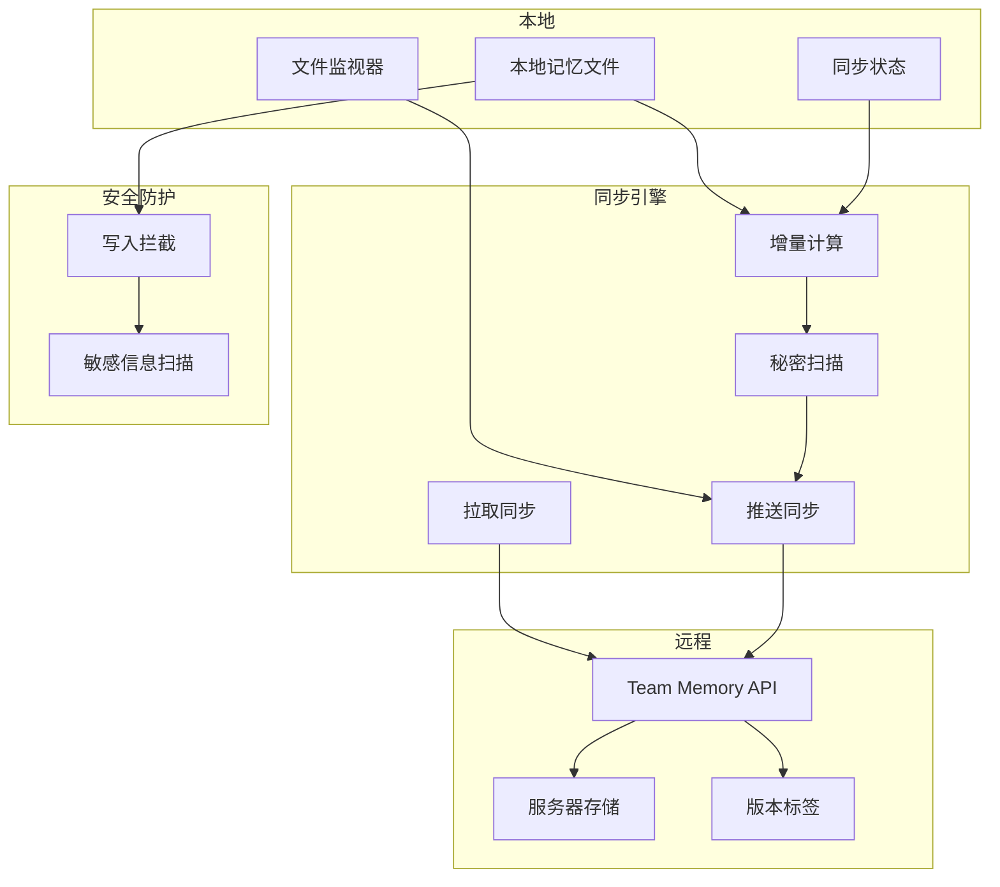
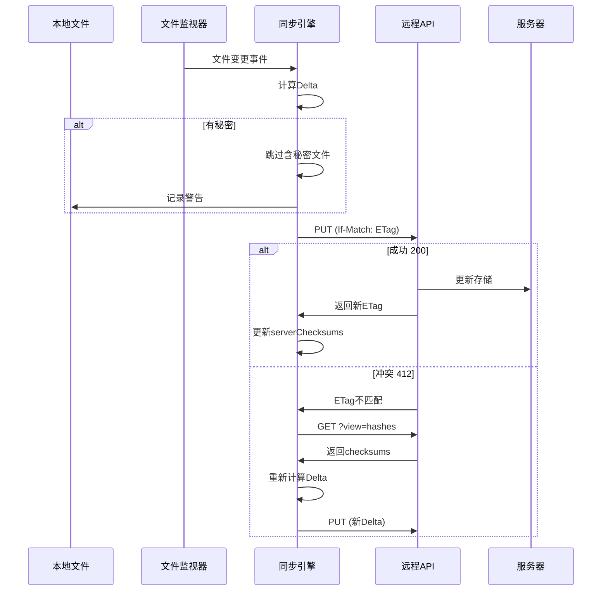

# 33. 团队记忆 (Team Memory)

> **代码入口**: `src/services/teamMemorySync/`  
> **核心功能**: 跨代理记忆同步、秘密扫描脱敏、增量上传、文件监视

## 概述

Team Memory 是 Claude Code 的团队记忆同步系统，将项目级别的记忆文件同步到云端，使团队成员可以共享上下文和学习经验。核心设计目标：

1. **团队共享**：同一仓库的所有成员共享记忆文件
2. **增量同步**：只上传变化的内容，减少带宽消耗
3. **安全防护**：上传前扫描并阻止敏感信息外泄
4. **冲突处理**：支持乐观锁和冲突重试机制

## 设计原理

### 架构决策：Pull-Push 双向同步



**设计动机**：
- Pull 先行确保本地有最新状态
- Delta 上传减少带宽和 API 调用
- 秘密扫描防止凭证泄露
- 文件监视实现实时同步

### 同步流程：乐观锁机制



**代码路径**：`src/services/teamMemorySync/index.ts:889-1146`

## 实现原理

### 1. 初始化流程

**代码路径**：`src/services/teamMemorySync/watcher.ts:252-305`

```typescript
export async function startTeamMemoryWatcher(): Promise<void> {
  if (!feature('TEAMMEM')) return
  if (!isTeamMemoryEnabled() || !isTeamMemorySyncAvailable()) return
  if (!await getGithubRepo()) return  // 必须有 github.com remote
  
  syncState = createSyncState()
  await pullTeamMemory(syncState)  // 初始拉取
  await startFileWatcher(getTeamMemPath())  // 启动监视器
}
```

初始化在 `src/setup.ts:365-368` 调用。

### 2. 拉取同步

**代码路径**：`src/services/teamMemorySync/index.ts:770-867`

拉取流程：
1. 发送 GET 请求（可带 If-None-Match 头）
2. 304 响应表示无变化
3. 404 响应表示服务器无数据
4. 200 响应写入本地文件

### 3. 推送同步

**代码路径**：`src/services/teamMemorySync/index.ts:889-1146`

推送流程：
1. 读取本地文件并扫描秘密
2. 计算 Delta（与 serverChecksums 比较）
3. 分批上传（每批 <= 200KB）
4. 处理冲突（412 响应）

### 4. 文件监视器

**代码路径**：`src/services/teamMemorySync/watcher.ts:167-229`

使用 `fs.watch({recursive: true})` 监视目录变化：
- macOS: FSEvents（O(1) fd）
- Linux: inotify（O(subdirs) fd）
- 2秒防抖避免频繁触发

## 功能展开

### 33.1 秘密扫描

**代码路径**：`src/services/teamMemorySync/secretScanner.ts:48-224`

使用 gitleaks 规则子集扫描：
- 云服务：AWS、GCP、Azure、DigitalOcean
- AI API：Anthropic、OpenAI、HuggingFace
- 版本控制：GitHub、GitLab
- 通讯工具：Slack、Twilio、SendGrid
- 开发工具：NPM、PyPI、Databricks
- 支付平台：Stripe、Shopify
- 私钥：PEM 格式

### 33.2 写入拦截

**代码路径**：`src/services/teamMemorySync/teamMemSecretGuard.ts:15-44`

在 FileWriteTool 和 FileEditTool 的 validateInput 中调用，阻止写入含秘密的内容。

### 33.3 增量计算

**代码路径**：`src/services/teamMemorySync/index.ts:949-972`

```typescript
const delta: Record<string, string> = {}
for (const [key, localHash] of localHashes) {
  if (state.serverChecksums.get(key) !== localHash) {
    delta[key] = entries[key]!
  }
}
```

### 33.4 冲突解决

**代码路径**：`src/services/teamMemorySync/index.ts:1087-1137`

冲突处理策略：
1. 收到 412 响应
2. 探测服务器获取最新 checksums
3. 重新计算 Delta
4. 最多重试 2 次

### 33.5 批量上传

**代码路径**：`src/services/teamMemorySync/index.ts:426-460`

`batchDeltaByBytes` 将大批量分割为多个 PUT 请求，每个不超过 200KB。

## 数据结构

### 核心类型定义

```typescript
// src/services/teamMemorySync/index.ts:100-127
export type SyncState = {
  lastKnownChecksum: string | null     // ETag
  serverChecksums: Map<string, string> // sha256:hex
  serverMaxEntries: number | null      // 服务器条目上限
}

// src/services/teamMemorySync/types.ts:66-72
export type SkippedSecretFile = {
  path: string      // 相对路径
  ruleId: string    // gitleaks 规则ID
  label: string     // 可读标签
}

// src/services/teamMemorySync/types.ts:29-38
export const TeamMemoryDataSchema = z.object({
  organizationId: z.string(),
  repo: z.string(),
  version: z.number(),
  checksum: z.string(),
  content: TeamMemoryContentSchema(),
})
```

### API 协议

```
GET  /api/claude_code/team_memory?repo={owner/repo}
     → TeamMemoryData（含 entryChecksums）

GET  /api/claude_code/team_memory?repo={owner/repo}&view=hashes
     → 仅返回 checksums，不含内容体

PUT  /api/claude_code/team_memory?repo={owner/repo}
     → 上传 entries（upsert 语义）
     → If-Match: ETag（乐观锁）
     → 412 = ETag 不匹配
```

### 目录结构

```
~/.claude/team-mem/{repo-hash}/
├── MEMORY.md           # 主记忆文件
├── patterns.md         # 模式记录
├── decisions/          # 决策记录
│   └── 2025-01-*.md
└── .consolidate-lock   # 整理锁（与 auto-dream 共享）
```

## 组合使用

### 与 Auto Dream 的协作

共享 `.consolidate-lock` 文件，确保记忆整理和同步不会同时修改文件。

### 与 Extract Memories 的协作

提取的记忆文件可放入 team memory 目录，自动同步给团队。

### 与 OAuth 认证的协作

**代码路径**：`src/services/teamMemorySync/index.ts:151-161`

团队记忆同步要求 First-Party OAuth 认证。

### 与 Hook 系统的协作

**代码路径**：`src/utils/sessionFileAccessHooks.ts`

记录团队记忆文件的访问日志。

## 小结

### 设计取舍

**优势**：
1. 增量同步减少带宽和延迟
2. 多层秘密扫描防止凭证泄露
3. 乐观锁机制支持高并发

**局限**：
1. 文件删除不会传播到服务器
2. 同一 key 的并发编辑会覆盖
3. 需要 GitHub remote 才能同步

### 演进方向

1. 三方合并：支持同 key 并发编辑合并
2. 版本历史：保留历史版本便于回滚
3. 权限控制：细粒度的读写权限管理

---

**相关文档**：
- [[31-session-memory]] - 会话记忆
- [[32-auto-dream]] - 自动整理
- [[13-authentication]] - OAuth 认证

**代码索引**：
- `src/services/teamMemorySync/index.ts:770-867` - 拉取同步
- `src/services/teamMemorySync/index.ts:889-1146` - 推送同步
- `src/services/teamMemorySync/watcher.ts:167-229` - 文件监视
- `src/services/teamMemorySync/secretScanner.ts:48-224` - 秘密扫描规则
