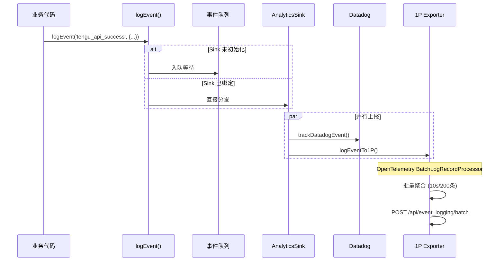

# 34. 事件追踪 (Analytics)

> 事件追踪系统为 Claude Code 提供全链路可观测性，支持产品决策、问题诊断和用户体验优化。

---

## 1. 概述

### 功能定位

Claude Code 的事件追踪系统负责收集、聚合、上报用户行为和系统事件，实现：

- **产品分析**：用户行为模式、功能使用率、转化漏斗
- **故障诊断**：错误追踪、性能瓶颈定位、异常检测
- **实验评估**：A/B 测试、Feature Flag 效果度量

### 解决的问题

| 问题 | 解决方案 |
|------|---------|
| 事件丢失 | Sink 队列缓冲 + 磁盘持久化 |
| 启动阻塞 | 异步初始化 + 缓存优先读取 |
| 基数爆炸 | 工具名/MCP名脱敏、版本截断 |
| PII 泄漏 | 类型标记强制审核 + _PROTO_ 字段隔离 |

---

## 2. 设计原理

### 架构决策

**1. Sink 抽象解耦**

```
┌─────────────┐     ┌─────────────┐     ┌─────────────┐
│ logEvent()  │────▶│ Sink 队列   │────▶│ 1P Exporter │
└─────────────┘     └─────────────┘     └─────────────┘
                          │
                          ▼
                    ┌─────────────┐
                    │  Datadog    │
                    └─────────────┘
```

设计动机：
- **无依赖原则**：`index.ts` 零依赖避免循环引用
- **延迟初始化**：Sink 在 `attachAnalyticsSink()` 后才绑定
- **多目标路由**：同一事件并行分发到多个后端

**2. 采样与节流**

`src/services/analytics/firstPartyEventLogger.ts:57-85`

```typescript
export function shouldSampleEvent(eventName: string): number | null {
  const config = getEventSamplingConfig()
  const eventConfig = config[eventName]
  if (!eventConfig) return null  // 未配置=100%上报
  const sampleRate = eventConfig.sample_rate
  return Math.random() < sampleRate ? sampleRate : 0
}
```

- 动态采样率从 GrowthBook 配置读取
- 采样事件添加 `sample_rate` 元数据便于统计还原

**3. PII 隔离机制**

`src/services/analytics/index.ts:21-58`

```typescript
export type AnalyticsMetadata_I_VERIFIED_THIS_IS_NOT_CODE_OR_FILEPATHS = never
export type AnalyticsMetadata_I_VERIFIED_THIS_IS_PII_TAGGED = never

export function stripProtoFields<V>(metadata: Record<string, V>): Record<string, V> {
  for (const key in metadata) {
    if (key.startsWith('_PROTO_')) delete result[key]
  }
  return result ?? metadata
}
```

- `_PROTO_*` 前缀字段仅在 1P 后端可见
- Datadog 扇出前自动剥离敏感字段

---

## 3. 实现原理

### 核心流程



### 事件元数据丰富

`src/services/analytics/metadata.ts:693-743`

每个事件自动附加：

| 类别 | 字段 |
|------|-----|
| 环境 | platform, arch, nodeVersion, terminal |
| 会话 | sessionId, model, betas |
| 代理 | agentId, parentSessionId, teamName |
| 进程 | uptime, rss, heapUsed, cpuPercent |
| 订阅 | subscriptionType, isClaudeAiAuth |

### 关键代码路径

| 功能 | 入口 | 说明 |
|------|-----|------|
| 事件入口 | `src/services/analytics/index.ts:133-144` | `logEvent()` 同步/异步版本 |
| Sink 绑定 | `src/services/analytics/sink.ts:109-114` | 初始化时绑定后端 |
| Datadog 上报 | `src/services/analytics/datadog.ts:174-293` | 批量聚合 + 基数控制 |
| 1P 上报 | `src/services/analytics/firstPartyEventLogger.ts:216-230` | OTel 批处理导出 |
| 元数据构建 | `src/services/analytics/metadata.ts:693-743` | 环境上下文聚合 |

---

## 4. 功能展开

### 4.1 Datadog 集成

**白名单机制**

`src/services/analytics/datadog.ts:27-72`

```typescript
const DATADOG_ALLOWED_EVENTS = new Set([
  'tengu_api_error',
  'tengu_api_success',
  'tengu_tool_use_error',
  'tengu_uncaught_exception',
  // ... 45+ 预定义事件
])
```

设计动机：控制基数，避免无效事件污染监控面板。

**基数控制策略**

| 字段 | 策略 |
|------|-----|
| toolName | MCP 工具统一为 `mcp` |
| model | 映射为短名，未知模型归为 `other` |
| version | dev 版本截断为 `2.0.53-dev.20251124` |
| userBucket | 用户ID哈希分桶 (30桶) |

**批量发送**

- 默认 15 秒或 100 条触发 flush
- 网络超时 5 秒，失败静默重试

### 4.2 1P Event Logging

**OpenTelemetry 集成**

`src/services/analytics/firstPartyEventLogger.ts:312-389`

```typescript
const eventLoggingExporter = new FirstPartyEventLoggingExporter({...})
firstPartyEventLoggerProvider = new LoggerProvider({
  processors: [
    new BatchLogRecordProcessor(eventLoggingExporter, {
      scheduledDelayMillis: 10000,  // 10秒批量
      maxExportBatchSize: 200,
      maxQueueSize: 8192,
    }),
  ],
})
```

**动态配置热更新**

`src/services/analytics/firstPartyEventLogger.ts:407-449`

- GrowthBook 配置变更时重建 LoggerProvider
- 旧 Provider 优雅关闭，事件零丢失

### 4.3 GrowthBook Feature Flags

**远程评估模式**

`src/services/analytics/growthbook.ts:533-554`

```typescript
const thisClient = new GrowthBook({
  apiHost: baseUrl,
  clientKey,
  attributes,
  remoteEval: true,  // 服务端预计算
  cacheKeyAttributes: ['id', 'organizationUUID'],
})
```

优势：
- 服务端预计算所有 Feature 规则
- 客户端缓存评估结果，零延迟读取

**多级缓存策略**

```
远程服务端 → 内存缓存 (remoteEvalFeatureValues)
                        ↓
                   磁盘缓存 (cachedGrowthBookFeatures)
                        ↓
                   默认值 (defaultValue)
```

**刷新机制**

- Ant 用户：20 分钟
- 外部用户：6 小时
- 登录/登出时强制刷新

---

## 5. 数据结构

### 事件元数据

`src/services/analytics/metadata.ts:472-496`

```typescript
type EventMetadata = {
  model: string
  sessionId: string
  userType: string
  betas?: string
  envContext: EnvContext
  agentId?: string
  parentSessionId?: string
  teamName?: string
  subscriptionType?: string
  processMetrics?: ProcessMetrics
}
```

### Datadog 日志格式

`src/services/analytics/datadog.ts:97-104`

```typescript
type DatadogLog = {
  ddsource: 'nodejs'
  ddtags: string      // event:tengu_api_success,model:claude-3-5-sonnet,...
  message: string     // 事件名
  service: 'claude-code'
  hostname: 'claude-code'
  env: string         // ant/external
}
```

### 采样配置

`src/services/analytics/firstPartyEventLogger.ts:32-36`

```typescript
type EventSamplingConfig = {
  [eventName: string]: {
    sample_rate: number  // 0.0 ~ 1.0
  }
}
```

---

## 6. 组合使用

### 与错误监控协作

```
logError() → errorLogSink → Sentry + Debug Log
                              ↓
                        logEvent('tengu_uncaught_exception')
```

### 与权限系统集成

- 权限拒绝事件上报：`tengu_tool_use_rejected_in_prompt`
- 沙箱违规追踪：`tengu_security_violation`

### 与成本追踪联动

`src/cost-tracker.ts:286-301`

```typescript
getCostCounter()?.add(cost, { model })
getTokenCounter()?.add(usage.input_tokens, { type: 'input' })
```

---

## 7. 小结

### 设计取舍

| 决策 | 收益 | 代价 |
|------|-----|------|
| Sink 队列缓冲 | 启动零阻塞 | 早期事件可能丢失 |
| 远程评估模式 | 客户端零计算 | 依赖网络可用性 |
| 工具名脱敏 | 控制基数 | 丢失细粒度信息 |

### 局限性

1. **事件顺序**：异步队列不保证严格时序
2. **离线场景**：网络不可用时会丢失事件（磁盘持久化仅 1P）
3. **采样偏差**：低采样率事件统计置信度下降

### 演进方向

1. **离线缓冲**：Disk-backed retry queue for Datadog
2. **实时仪表盘**：WebSocket 推送关键指标
3. **采样自适应**：根据事件量动态调整采样率

---

## 附录：关键文件索引

| 模块 | 文件 | 职责 |
|------|-----|------|
| 公共 API | `src/services/analytics/index.ts` | `logEvent()` 入口 |
| Sink 实现 | `src/services/analytics/sink.ts` | 多目标路由 |
| Datadog | `src/services/analytics/datadog.ts` | 日志聚合上报 |
| 1P Logging | `src/services/analytics/firstPartyEventLogger.ts` | OTel 集成 |
| GrowthBook | `src/services/analytics/growthbook.ts` | Feature Flags |
| 元数据 | `src/services/analytics/metadata.ts` | 事件丰富化 |
| 配置 | `src/services/analytics/config.ts` | 禁用条件判断 |
| 熔断 | `src/services/analytics/sinkKillswitch.ts` | Sink 级别开关 |
