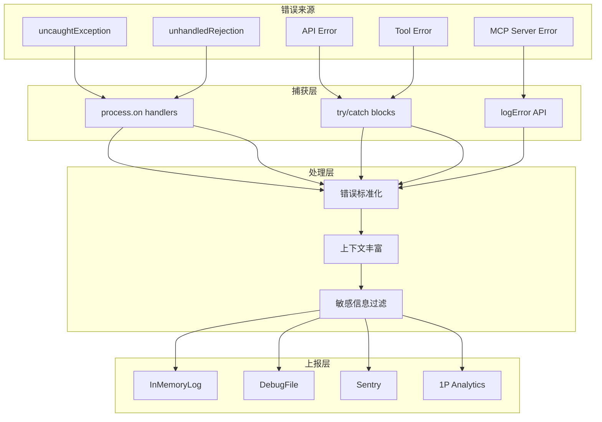

# 35. 错误监控 (Error Monitoring)

> 错误监控系统为 Claude Code 提供全链路异常捕获、分类、上报能力，支持快速定位和修复问题。

---

## 1. 概述

### 功能定位

Claude Code 的错误监控系统实现：

- **异常捕获**：全局 uncaughtException、unhandledRejection、API 错误
- **错误分类**：按来源、类型、严重程度自动归类
- **上下文保留**：堆栈跟踪、请求信息、环境上下文
- **多通道上报**：Sentry、Debug Log、内存日志、1P Analytics

### 解决的问题

| 问题 | 解决方案 |
|------|---------|
| 错误丢失 | 内存队列 + Sink 绑定前缓冲 |
| 敏感信息泄漏 | Auth Header 过滤、请求体脱敏 |
| 噪声淹没 | 忽略已知不可操作错误（网络中断） |
| 上下文缺失 | 自动附加环境、会话、请求元数据 |

---

## 2. 设计原理

### 架构决策

**1. Sink 抽象模式**

与 Analytics 相同的设计，错误监控也采用 Sink 抽象：

```
┌─────────────┐     ┌─────────────┐     ┌─────────────┐
│ logError()  │────▶│ ErrorQueue  │────▶│ ErrorLogSink│
└─────────────┘     └─────────────┘     └─────────────┘
                                              │
                              ┌───────────────┼───────────────┐
                              ▼               ▼               ▼
                        ┌──────────┐   ┌──────────┐   ┌──────────┐
                        │ Sentry   │   │Debug Log │   │JSONL File│
                        └──────────┘   └──────────┘   └──────────┘
```

设计动机：
- `log.ts` 零依赖，避免循环引用
- 延迟绑定实现，初始化顺序解耦

**2. 多通道并行上报**

`src/utils/errorLogSink.ts:153-178`

```typescript
function logErrorImpl(error: Error): void {
  // 1. Debug 日志（用户可见）
  logForDebugging(`${error.name}: ${context}${errorStr}`, { level: 'error' })
  
  // 2. 文件日志（ant 用户持久化）
  appendToLog(getErrorsPath(), { error: `${context}${errorStr}` })
  
  // 3. Sentry 上报（生产环境）
  captureException(error)
}
```

**3. 条件上报**

`src/utils/log.ts:166-178`

```typescript
if (
  isEnvTruthy(process.env.CLAUDE_CODE_USE_BEDROCK) ||
  isEnvTruthy(process.env.CLAUDE_CODE_USE_VERTEX) ||
  isEnvTruthy(process.env.CLAUDE_CODE_USE_FOUNDRY) ||
  process.env.DISABLE_ERROR_REPORTING ||
  isEssentialTrafficOnly()
) {
  return  // 第三方云服务不报告错误
}
```

---

## 3. 实现原理

### 核心流程



### Sentry 集成

**初始化流程**

`src/utils/sentry.ts:17-83`

```typescript
export function initSentry(): void {
  const dsn = process.env.SENTRY_DSN
  if (!dsn) return  // 未配置则跳过

  Sentry.init({
    dsn,
    release: MACRO.VERSION,
    environment: BUILD_ENV,
    maxBreadcrumbs: 20,
    sampleRate: 1.0,
    
    beforeSend(event) {
      // 剥离敏感 Header
      if (request?.headers) {
        const sensitiveHeaders = ['authorization', 'x-api-key', 'cookie']
        for (const key of Object.keys(request.headers)) {
          if (sensitiveHeaders.includes(key.toLowerCase())) {
            delete request.headers[key]
          }
        }
      }
      return event
    },
    
    ignoreErrors: [
      'ECONNREFUSED', 'ECONNRESET', 'ENOTFOUND', 'ETIMEDOUT',
      'AbortError', 'CancelError',
    ],
  })
}
```

**错误捕获 API**

`src/utils/sentry.ts:89-104`

```typescript
export function captureException(
  error: unknown,
  context?: Record<string, unknown>
): void {
  if (!initialized) return
  
  Sentry.withScope(scope => {
    if (context) scope.setExtras(context)
    Sentry.captureException(error)
  })
}
```

### Debug 日志系统

**分级日志**

`src/utils/debug.ts:18-26`

```typescript
type DebugLogLevel = 'verbose' | 'debug' | 'info' | 'warn' | 'error'

const LEVEL_ORDER: Record<DebugLogLevel, number> = {
  verbose: 0, debug: 1, info: 2, warn: 3, error: 4,
}
```

**输出模式**

| 模式 | 触发条件 | 输出位置 |
|------|---------|---------|
| 实时 | `--debug` 或 `USER_TYPE=ant` | `~/.claude/debug/{sessionId}.txt` |
| 缓冲 | 非调试模式 ant 用户 | 1秒批量写入 |
| StdErr | `--debug-to-stderr` | 标准错误流 |

**缓冲写入器**

`src/utils/debug.ts:155-196`

```typescript
debugWriter = createBufferedWriter({
  writeFn: content => {
    const path = getDebugLogPath()
    getFsImplementation().appendFileSync(path, content)
  },
  flushIntervalMs: 1000,
  maxBufferSize: 100,
  immediateMode: isDebugMode(),  // 调试模式立即写入
})
```

### 关键代码路径

| 功能 | 入口 | 说明 |
|------|-----|------|
| 错误入口 | `src/utils/log.ts:158-199` | `logError()` 主函数 |
| Sink 初始化 | `src/utils/errorLogSink.ts:229-238` | 绑定实现 |
| Sentry 初始化 | `src/utils/sentry.ts:17-83` | SDK 配置 |
| Sentry 捕获 | `src/utils/sentry.ts:89-104` | 上报 API |
| Debug 写入 | `src/utils/debug.ts:203-228` | 分级日志 |
| 内存日志 | `src/utils/log.ts:66-77` | 最近 100 条错误 |

---

## 4. 功能展开

### 4.1 全局异常捕获

**进程级 Handler**

`src/entrypoints/init.ts:154-155`

```typescript
// 初始化时注册 Sentry
initSentry()
```

异常处理器注册位置（推断）：
- `process.on('uncaughtException', handler)`
- `process.on('unhandledRejection', handler)`

### 4.2 MCP 错误日志

**专用日志通道**

`src/utils/errorLogSink.ts:183-199`

```typescript
function logMCPErrorImpl(serverName: string, error: unknown): void {
  const logFile = getMCPLogsPath(serverName)  // 按服务器分文件
  
  const errorInfo = {
    error: errorStr,
    timestamp: new Date().toISOString(),
    sessionId: getSessionId(),
    cwd: getFsImplementation().cwd(),
  }
  
  getLogWriter(logFile).write(errorInfo)
}
```

**路径规则**

`src/utils/errorLogSink.ts:37-39`

```typescript
export function getMCPLogsPath(serverName: string): string {
  return join(CACHE_PATHS.mcpLogs(serverName), DATE + '.jsonl')
}
```

### 4.3 慢操作检测

**阈值配置**

`src/utils/slowOperations.ts:29-44`

```typescript
const SLOW_OPERATION_THRESHOLD_MS = (() => {
  if (process.env.CLAUDE_CODE_SLOW_OPERATION_THRESHOLD_MS) {
    return Number(envValue)
  }
  if (process.env.NODE_ENV === 'development') return 20
  if (process.env.USER_TYPE === 'ant') return 300
  return Infinity  // 外部用户默认禁用
})()
```

**检测机制**

`src/utils/slowOperations.ts:96-125`

```typescript
class AntSlowLogger {
  [Symbol.dispose](): void {
    const duration = performance.now() - this.startTime
    if (duration > SLOW_OPERATION_THRESHOLD_MS) {
      logForDebugging(`[SLOW OPERATION] ${description} (${duration}ms)`)
      addSlowOperation(description, duration)
    }
  }
}
```

使用方式：

```typescript
using _ = slowLogging`JSON.stringify(${value})`
const result = JSON.stringify(value)  // 自动计时
```

### 4.4 Axios 错误增强

**上下文提取**

`src/utils/errorLogSink.ts:153-168`

```typescript
if (axios.isAxiosError(error) && error.config?.url) {
  const parts = [`url=${error.config.url}`]
  if (error.response?.status !== undefined) {
    parts.push(`status=${error.response.status}`)
  }
  const serverMessage = extractServerMessage(error.response?.data)
  if (serverMessage) {
    parts.push(`body=${serverMessage}`)
  }
  context = `[${parts.join(',')}] `
}
```

---

## 5. 数据结构

### 错误队列事件

`src/utils/log.ts:91-94`

```typescript
type QueuedErrorEvent =
  | { type: 'error'; error: Error }
  | { type: 'mcpError'; serverName: string; error: unknown }
  | { type: 'mcpDebug'; serverName: string; message: string }
```

### 内存错误日志

`src/utils/log.ts:66-77`

```typescript
const MAX_IN_MEMORY_ERRORS = 100
let inMemoryErrorLog: Array<{ 
  error: string
  timestamp: string 
}> = []
```

### JSONL 日志格式

```json
{
  "timestamp": "2024-01-15T10:30:00.000Z",
  "error": "Error: Connection refused\n    at ...",
  "cwd": "/Users/xxx/project",
  "userType": "ant",
  "sessionId": "abc123",
  "version": "2.0.36"
}
```

---

## 6. 组合使用

### 与 Analytics 协作

错误事件同时触发分析上报：

```
logError(error)
  → captureException(error)          // Sentry
  → logEvent('tengu_uncaught_exception', {...})  // Analytics
```

### 与 Graceful Shutdown 协作

`src/utils/gracefulShutdown.ts:507`

```typescript
Promise.all([
  shutdown1PEventLogging(),
  shutdownDatadog(),
  closeSentry(2000),  // 等待 Sentry 刷新
])
```

### 与权限系统集成

- 安全违规错误特殊标记
- 权限拒绝事件独立上报

---

## 7. 小结

### 设计取舍

| 决策 | 收益 | 代价 |
|------|-----|------|
| 多通道并行 | 冗余保障不丢失 | 重复上报需去重 |
| 忽略网络错误 | 减少噪声 | 可能遗漏真实问题 |
| 条件上报 | 第三方隐私保护 | 监控覆盖不完整 |

### 局限性

1. **异步丢失**：`process.exit()` 直接退出可能丢失未刷新的日志
2. **堆栈截断**：极深调用栈可能被截断
3. **Source Map**：生产环境堆栈需服务端 Source Map 还原

### 演进方向

1. **错误聚合**：相似错误自动分组，减少重复通知
2. **智能告警**：基于历史模式的异常检测
3. **错误回放**：记录错误前后的用户操作序列

---

## 附录：关键文件索引

| 模块 | 文件 | 职责 |
|------|-----|------|
| 公共 API | `src/utils/log.ts` | `logError()` 入口 |
| Sink 实现 | `src/utils/errorLogSink.ts` | 多通道上报 |
| Sentry SDK | `src/utils/sentry.ts` | 错误监控平台集成 |
| Debug 日志 | `src/utils/debug.ts` | 分级日志输出 |
| 慢操作检测 | `src/utils/slowOperations.ts` | 性能问题定位 |
| 初始化 | `src/entrypoints/init.ts` | 全局 Handler 注册 |
| 优雅关闭 | `src/utils/gracefulShutdown.ts` | 确保日志刷新 |
