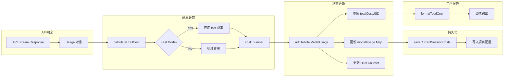

# 36. 性能监控 (Performance Monitoring)

> 性能监控系统追踪 Claude Code 运行时指标，包括 Token 消耗、API 延迟、成本统计，支持资源优化和成本控制。

---

## 1. 概述

### 功能定位

Claude Code 的性能监控系统实现：

- **Token 追踪**：输入/输出/缓存读写 Token 统计
- **成本计算**：按模型定价实时计算费用
- **延迟监控**：API 响应时间、工具执行时长
- **代码变更**：行数统计、变更追踪
- **慢操作检测**：JSON 序列化、深拷贝等耗时操作

### 解决的问题

| 问题 | 解决方案 |
|------|---------|
| 成本超支 | 实时累计 + 会话结束汇报 |
| 性能瓶颈 | 慢操作自动检测 + 调用栈定位 |
| Token 浪费 | 缓存命中率统计 + 提示词优化指导 |
| 数据丢失 | 会话恢复时成本状态持久化 |

---

## 2. 设计原理

### 架构决策

**1. 集中式状态管理**

所有性能指标存储在 `bootstrap/state.ts` 的全局状态中：

```
┌─────────────────────────────────────────────────────────────┐
│                    bootstrap/state.ts                       │
├─────────────────────────────────────────────────────────────┤
│ totalCostUSD: number          // 总成本                      │
│ totalAPIDuration: number      // API 总耗时                  │
│ modelUsage: Map<model, Usage> // 按模型统计                  │
│ tokenCounter: Counter         // OpenTelemetry Counter       │
│ costCounter: Counter          // OpenTelemetry Counter       │
└─────────────────────────────────────────────────────────────┘
            ▲                              │
            │ 更新                          │ 读取
            │                              ▼
┌───────────────────┐          ┌───────────────────┐
│ addToTotalSession │          │ formatTotalCost() │
│     Cost()        │          │   用户报告         │
└───────────────────┘          └───────────────────┘
```

设计动机：
- 单一数据源，避免状态分散
- 支持会话恢复时状态重建

**2. OpenTelemetry 集成**

`src/cost-tracker.ts:291-301`

```typescript
getCostCounter()?.add(cost, { model, speed: 'fast' })
getTokenCounter()?.add(usage.input_tokens, { type: 'input' })
getTokenCounter()?.add(usage.output_tokens, { type: 'output' })
getTokenCounter()?.add(usage.cache_read_input_tokens ?? 0, { type: 'cacheRead' })
```

- 使用 OTel Counter 导出指标
- 支持自定义属性（model、type）

**3. 模型成本映射**

`src/utils/modelCost.ts` (推断)

每个模型定义成本系数：

```typescript
const MODEL_COSTS = {
  'claude-sonnet-4-20250514': {
    input: 3.00 / 1_000_000,    // $3/M input tokens
    output: 15.00 / 1_000_000,  // $15/M output tokens
    cacheRead: 0.30 / 1_000_000,
    cacheWrite: 3.75 / 1_000_000,
  },
  // ...
}
```

---

## 3. 实现原理

### 核心流程



### Token 统计

**使用量累加**

`src/cost-tracker.ts:250-276`

```typescript
function addToTotalModelUsage(cost: number, usage: Usage, model: string): ModelUsage {
  const modelUsage = getUsageForModel(model) ?? {
    inputTokens: 0,
    outputTokens: 0,
    cacheReadInputTokens: 0,
    cacheCreationInputTokens: 0,
    webSearchRequests: 0,
    costUSD: 0,
    contextWindow: 0,
    maxOutputTokens: 0,
  }

  modelUsage.inputTokens += usage.input_tokens
  modelUsage.outputTokens += usage.output_tokens
  modelUsage.cacheReadInputTokens += usage.cache_read_input_tokens ?? 0
  modelUsage.cacheCreationInputTokens += usage.cache_creation_input_tokens ?? 0
  modelUsage.webSearchRequests += usage.server_tool_use?.web_search_requests ?? 0
  modelUsage.costUSD += cost
  
  return modelUsage
}
```

**按模型聚合**

`src/cost-tracker.ts:181-226`

显示时按短名称聚合，避免同一模型不同版本重复显示：

```typescript
const usageByShortName: { [shortName: string]: ModelUsage } = {}
for (const [model, usage] of Object.entries(modelUsageMap)) {
  const shortName = getCanonicalName(model)  // claude-sonnet-4-20250514 → claude-sonnet-4
  // 累加到 shortName bucket
}
```

### 成本计算

**USD 转换**

`src/cost-tracker.ts:278-322`

```typescript
export function addToTotalSessionCost(cost: number, usage: Usage, model: string): number {
  const modelUsage = addToTotalModelUsage(cost, usage, model)
  addToTotalCostState(cost, modelUsage, model)

  // OTel 指标上报
  const attrs = isFastModeEnabled() && usage.speed === 'fast'
    ? { model, speed: 'fast' }
    : { model }

  getCostCounter()?.add(cost, attrs)
  getTokenCounter()?.add(usage.input_tokens, { ...attrs, type: 'input' })
  // ...

  // 递归处理 advisor usage
  for (const advisorUsage of getAdvisorUsage(usage)) {
    const advisorCost = calculateUSDCost(advisorUsage.model, advisorUsage)
    logEvent('tengu_advisor_tool_token_usage', {...})
    totalCost += addToTotalSessionCost(advisorCost, advisorUsage, advisorUsage.model)
  }
  
  return totalCost
}
```

### 会话持久化

**保存成本状态**

`src/cost-tracker.ts:143-175`

```typescript
export function saveCurrentSessionCosts(fpsMetrics?: FpsMetrics): void {
  saveCurrentProjectConfig(current => ({
    ...current,
    lastCost: getTotalCostUSD(),
    lastAPIDuration: getTotalAPIDuration(),
    lastAPIDurationWithoutRetries: getTotalAPIDurationWithoutRetries(),
    lastToolDuration: getTotalToolDuration(),
    lastDuration: getTotalDuration(),
    lastLinesAdded: getTotalLinesAdded(),
    lastLinesRemoved: getTotalLinesRemoved(),
    lastTotalInputTokens: getTotalInputTokens(),
    lastTotalOutputTokens: getTotalOutputTokens(),
    lastTotalCacheCreationInputTokens: getTotalCacheCreationInputTokens(),
    lastTotalCacheReadInputTokens: getTotalCacheReadInputTokens(),
    lastTotalWebSearchRequests: getTotalWebSearchRequests(),
    lastFpsAverage: fpsMetrics?.averageFps,
    lastFpsLow1Pct: fpsMetrics?.low1PctFps,
    lastModelUsage: Object.fromEntries(...),
    lastSessionId: getSessionId(),
  }))
}
```

**恢复成本状态**

`src/cost-tracker.ts:130-137`

```typescript
export function restoreCostStateForSession(sessionId: string): boolean {
  const data = getStoredSessionCosts(sessionId)
  if (!data) return false
  setCostStateForRestore(data)
  return true
}
```

### 慢操作检测

**阈值配置**

`src/utils/slowOperations.ts:29-44`

| 环境 | 阈值 | 说明 |
|------|-----|------|
| 开发 | 20ms | 更敏感的检测 |
| Ant 用户 | 300ms | 生产环境监控 |
| 外部用户 | Infinity | 默认禁用 |

**检测实现**

`src/utils/slowOperations.ts:96-125`

```typescript
class AntSlowLogger {
  constructor(args: IArguments) {
    this.startTime = performance.now()
    this.err = new Error()  // 延迟捕获堆栈
  }

  [Symbol.dispose](): void {
    const duration = performance.now() - this.startTime
    if (duration > SLOW_OPERATION_THRESHOLD_MS) {
      const description = buildDescription(this.args) + callerFrame(this.err.stack)
      logForDebugging(`[SLOW OPERATION] ${description} (${duration.toFixed(1)}ms)`)
      addSlowOperation(description, duration)
    }
  }
}
```

**使用方式**

```typescript
// JSON 序列化
using _ = slowLogging`JSON.stringify(${value})`
const json = jsonStringify(data)

// 深拷贝
using _ = slowLogging`cloneDeep(${value})`
const copy = cloneDeep(original)

// 文件写入
using _ = slowLogging`fs.writeFileSync(${filePath})`
fs.writeFileSync(path, content)
```

### 关键代码路径

| 功能 | 入口 | 说明 |
|------|-----|------|
| 成本累加 | `src/cost-tracker.ts:278-322` | `addToTotalSessionCost()` |
| 使用量统计 | `src/cost-tracker.ts:250-276` | `addToTotalModelUsage()` |
| 格式化报告 | `src/cost-tracker.ts:228-244` | `formatTotalCost()` |
| 状态持久化 | `src/cost-tracker.ts:143-175` | `saveCurrentSessionCosts()` |
| 状态恢复 | `src/cost-tracker.ts:130-137` | `restoreCostStateForSession()` |
| 慢操作检测 | `src/utils/slowOperations.ts:130-157` | `slowLogging` 标签模板 |

---

## 4. 功能展开

### 4.1 Token 使用统计

**输入输出 Token**

```typescript
type Usage = {
  input_tokens: number
  output_tokens: number
  cache_read_input_tokens?: number
  cache_creation_input_tokens?: number
  server_tool_use?: {
    web_search_requests?: number
  }
}
```

**缓存命中率计算**

```
缓存命中率 = cache_read_input_tokens / (input_tokens + cache_creation_input_tokens)
```

高命中率表示提示词缓存有效，降低成本。

### 4.2 成本追踪

**实时累计**

每次 API 响应后立即更新：

```
API Response → calculateUSDCost() → addToTotalSessionCost() → totalCostUSD += cost
```

**模型级明细**

按模型分别统计，支持：

- 混合模型会话的成本分解
- 模型切换时的成本过渡
- Advisor 模型的独立统计

### 4.3 延迟监控

**API 延迟**

| 指标 | 含义 |
|------|-----|
| `totalAPIDuration` | 所有 API 调用总耗时（含重试） |
| `totalAPIDurationWithoutRetries` | 排除重试的纯 API 时间 |
| `totalToolDuration` | 工具执行总耗时 |

**FPS 监控**

`src/utils/fpsTracker.ts` (推断)

- 平均帧率
- 1% 低帧率（P99 延迟）

### 4.4 代码变更统计

**行数追踪**

`src/bootstrap/state.ts` (推断)

```typescript
totalLinesAdded: number
totalLinesRemoved: number
```

通过 `addToTotalLinesChanged()` 累加。

---

## 5. 数据结构

### ModelUsage

`src/entrypoints/agentSdkTypes.ts` (推断)

```typescript
type ModelUsage = {
  inputTokens: number
  outputTokens: number
  cacheReadInputTokens: number
  cacheCreationInputTokens: number
  webSearchRequests: number
  costUSD: number
  contextWindow: number
  maxOutputTokens: number
}
```

### StoredCostState

`src/cost-tracker.ts:71-80`

```typescript
type StoredCostState = {
  totalCostUSD: number
  totalAPIDuration: number
  totalAPIDurationWithoutRetries: number
  totalToolDuration: number
  totalLinesAdded: number
  totalLinesRemoved: number
  lastDuration: number | undefined
  modelUsage: { [modelName: string]: ModelUsage } | undefined
}
```

### 慢操作记录

```typescript
type SlowOperation = {
  description: string
  duration: number
  timestamp: string
}
```

---

## 6. 组合使用

### 与 Analytics 协作

成本事件触发分析上报：

```
addToTotalSessionCost()
  → logEvent('tengu_advisor_tool_token_usage', {...})
```

### 与会话管理协作

```
会话保存 → saveCurrentSessionCosts()
会话恢复 → restoreCostStateForSession()
```

### 与状态显示协作

```
组件渲染 → getTotalCostUSD() → 显示当前成本
会话结束 → formatTotalCost() → 终端输出报告
```

---

## 7. 小结

### 设计取舍

| 决策 | 收益 | 代价 |
|------|-----|------|
| 集中式状态 | 简单可靠 | 全局状态难以测试 |
| OTel 集成 | 标准化导出 | 增加依赖 |
| 模型短名聚合 | 显示简洁 | 丢失版本信息 |

### 局限性

1. **精度限制**：成本计算基于预定义价格，促销/折扣未纳入
2. **实时性**：仅在 API 响应后更新，无法预测成本
3. **历史数据**：仅保留会话级统计，无跨会话分析

### 演进方向

1. **成本预测**：基于历史模式预测会话总成本
2. **预算控制**：超阈值自动告警或暂停
3. **优化建议**：基于缓存命中率给出提示词优化建议

---

## 附录：关键文件索引

| 模块 | 文件 | 职责 |
|------|-----|------|
| 成本追踪 | `src/cost-tracker.ts` | Token 统计、成本计算 |
| 全局状态 | `src/bootstrap/state.ts` | 性能指标存储 |
| 模型成本 | `src/utils/modelCost.ts` | 定价表、USD 计算 |
| 慢操作 | `src/utils/slowOperations.ts` | 性能问题检测 |
| FPS 追踪 | `src/utils/fpsTracker.ts` | 帧率监控 |
| 上下文窗口 | `src/utils/context.ts` | Token 预算计算 |

---

## 附录：用户报告示例

```
Total cost:            $0.1234
Total duration (API):  12.5s
Total duration (wall): 45.2s
Total code changes:    127 lines added, 45 lines removed

Usage by model:
  claude-sonnet-4:  15,234 input, 3,456 output, 8,901 cache read, 1,234 cache write ($0.0987)
  claude-haiku-4:   5,678 input, 1,234 output, 0 cache read, 0 cache write ($0.0247)
```
