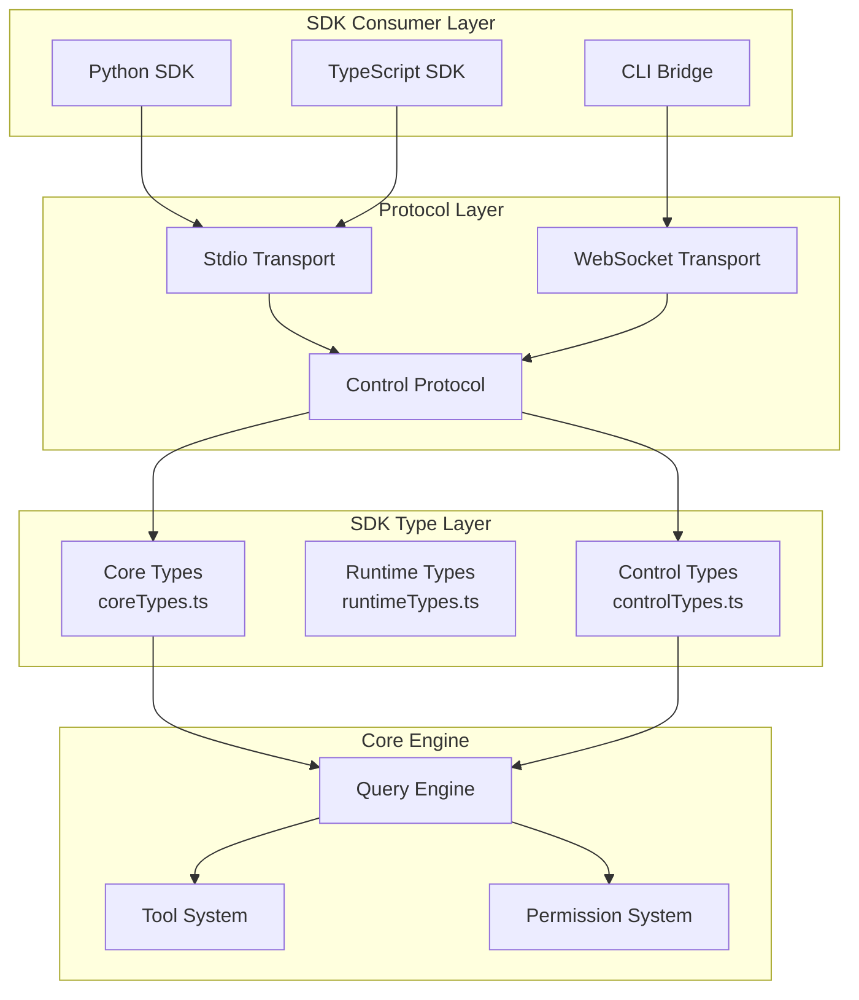
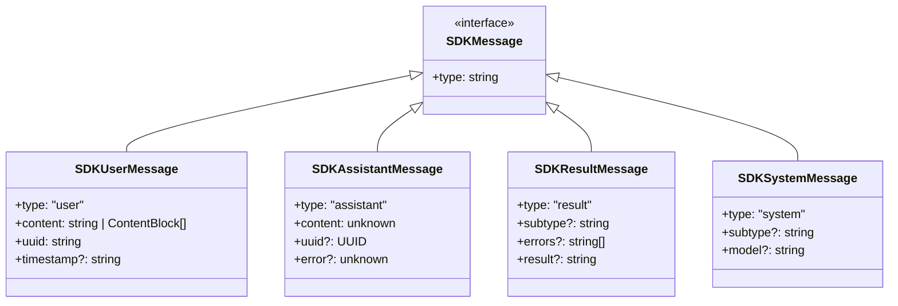
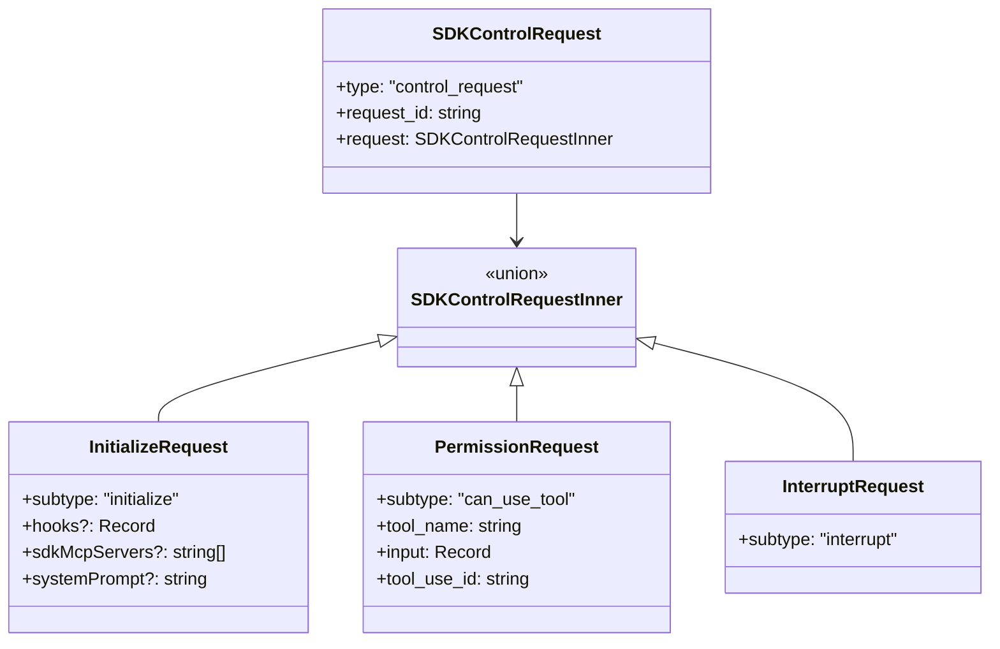

# 37. Agent SDK

> Claude Code 的程序化接口，支持嵌入式集成、脚本化操作和远程控制场景。

---

## 概述

Agent SDK 是 Claude Code 的开发者接口层，将 CLI 能力封装为可编程的 API。它解决了以下问题：

- **嵌入式集成**：将 Claude Code 作为子进程嵌入到应用程序中
- **脚本化操作**：通过代码而非交互式 CLI 使用 Claude 能力
- **远程控制**：支持 daemon 架构下的持久化会话管理
- **跨语言绑定**：通过 stdio 协议支持 Python 等多语言 SDK

### 核心设计目标

1. **类型安全**：所有类型由 Zod schema 生成，保证序列化兼容
2. **协议解耦**：SDK 消息与控制协议分离，支持不同传输层
3. **渐进式 API**：从单次查询到持久会话的多级抽象

---

## 设计原理

### 架构分层



### 类型体系

SDK 类型分为三层：

| 层级 | 文件 | 用途 | 特点 |
|------|------|------|------|
| Core Types | `sdk/coreTypes.ts` | 可序列化数据结构 | 消息、配置、状态 |
| Runtime Types | `sdk/runtimeTypes.ts` | 运行时接口 | 回调、会话对象 |
| Control Types | `sdk/controlTypes.ts` | 控制协议 | 初始化、权限、中断 |

**代码入口**：`src/entrypoints/agentSdkTypes.ts:1-445`

---

## 实现原理

### 1. 类型定义与生成

SDK 类型由 Zod schema 定义，通过脚本自动生成 TypeScript 类型：

```
sdk/coreSchemas.ts (Zod) → generate-sdk-types.ts → sdk/coreTypes.generated.ts (TS)
```

**关键 schema 定义**：`src/entrypoints/sdk/coreSchemas.ts:1-200`

核心消息类型：

```typescript
SDKMessage = SDKUserMessage | SDKAssistantMessage | SDKResultMessage | ...
```

**生成类型**：`src/entrypoints/sdk/coreTypes.generated.ts:100-179`

### 2. 公共 API 签名

SDK 导出一组函数签名，实际实现在 CLI 进程中：

**核心函数**：`src/entrypoints/agentSdkTypes.ts:73-274`

| 函数 | 用途 | 稳定性 |
|------|------|--------|
| `query()` | 单次查询 | 稳定 |
| `unstable_v2_createSession()` | 创建持久会话 | @alpha |
| `unstable_v2_resumeSession()` | 恢复会话 | @alpha |
| `unstable_v2_prompt()` | 单次提示 | @alpha |
| `tool()` | 定义 MCP 工具 | @internal |
| `createSdkMcpServer()` | 创建 SDK MCP 服务器 | @internal |

### 3. 控制协议

控制协议定义了 SDK 与 CLI 进程之间的通信格式：

**协议 schema**：`src/entrypoints/sdk/controlSchemas.ts:57-619`

主要请求类型：

| 请求类型 | 用途 |
|----------|------|
| `initialize` | 初始化会话，注册 hooks、MCP 服务器 |
| `interrupt` | 中断当前操作 |
| `can_use_tool` | 权限请求 |
| `set_model` | 切换模型 |
| `mcp_set_servers` | 动态管理 MCP 服务器 |
| `reload_plugins` | 重新加载插件 |

**请求包装格式**：`src/entrypoints/sdk/controlSchemas.ts:578-584`

```typescript
SDKControlRequest = {
  type: 'control_request',
  request_id: string,
  request: SDKControlRequestInner
}
```

---

## 功能展开

### 1. 会话管理 API

V2 API 提供持久化会话支持：

**会话接口**：`src/entrypoints/sdk/runtimeTypes.ts:17-28`

```typescript
interface SDKSession {
  sessionId: string
  prompt(input: string | AsyncIterable): Promise<unknown>
  abort(): void
}
```

**会话操作**：

| 函数 | 功能 | 代码位置 |
|------|------|----------|
| `createSession` | 创建新会话 | `agentSdkTypes.ts:129-133` |
| `resumeSession` | 恢复已存在会话 | `agentSdkTypes.ts:139-145` |
| `listSessions` | 列出会话 | `agentSdkTypes.ts:204-208` |
| `getSessionInfo` | 获取会话元数据 | `agentSdkTypes.ts:219-224` |
| `forkSession` | 分叉会话 | `agentSdkTypes.ts:268-273` |

### 2. MCP 工具集成

SDK 支持在进程内定义 MCP 工具：

**工具定义**：`src/entrypoints/sdk/runtimeTypes.ts:30-36`

```typescript
interface SdkMcpToolDefinition {
  name: string
  description: string
  inputSchema: AnyZodRawShape
  handler: (args, extra) => Promise<CallToolResult>
}
```

**创建 MCP 服务器**：`src/entrypoints/agentSdkTypes.ts:103-107`

### 3. Hook 系统

SDK 支持注册事件钩子：

**支持的事件**：`src/entrypoints/sdk/coreTypes.ts:25-53`

```typescript
HOOK_EVENTS = [
  'PreToolUse', 'PostToolUse', 'SessionStart', 'SessionEnd',
  'PermissionRequest', 'PermissionDenied', ...
]
```

**Hook 配置**：`src/entrypoints/sdk/controlSchemas.ts:43-51`

### 4. 定时任务调度

SDK 提供内置的 cron 调度能力：

**任务定义**：`src/entrypoints/agentSdkTypes.ts:283-305`

```typescript
type CronTask = {
  id: string
  cron: string
  prompt: string
  createdAt: number
  recurring?: boolean
}
```

**调度器 API**：`src/entrypoints/agentSdkTypes.ts:350-356`

---

## 数据结构

### 核心消息类型

**SDKMessage 联合类型**：`src/entrypoints/sdk/coreTypes.generated.ts:101-143`



### 控制请求类型



---

## 组合使用

### 1. SDK + 远程控制

SDK 的 `connectRemoteControl` 函数支持 daemon 架构：

**远程控制句柄**：`src/entrypoints/agentSdkTypes.ts:397-417`

```typescript
type RemoteControlHandle = {
  sessionUrl: string
  write(msg: SDKMessage): void
  sendResult(): void
  inboundPrompts(): AsyncGenerator<InboundPrompt>
  controlRequests(): AsyncGenerator<unknown>
  teardown(): Promise<void>
}
```

**连接函数**：`src/entrypoints/agentSdkTypes.ts:439-443`

### 2. SDK + MCP

SDK 可以定义进程内 MCP 服务器：

```typescript
const mcpServer = createSdkMcpServer({
  name: 'my-tools',
  tools: [
    tool('my_tool', 'Description', schema, handler)
  ]
})
```

### 3. SDK + Hook

通过控制协议注册钩子：

```typescript
// 初始化请求中包含 hooks
{
  subtype: 'initialize',
  hooks: {
    'PreToolUse': [{ matcher: 'Bash', hookCallbackIds: ['check-cmd'] }]
  }
}
```

---

## 小结

### 设计取舍

| 决策 | 理由 | 代价 |
|------|------|------|
| Zod schema 生成类型 | 保证序列化兼容 | 需要生成步骤 |
| 控制协议分离 | 支持多种传输层 | 增加复杂度 |
| 函数签名占位 | 允许跨包类型共享 | 实现在其他包 |

### 当前局限

1. **V2 API 不稳定**：会话管理 API 标记为 `@alpha`
2. **REPL 模式互斥**：SDK 入口不启用 REPL 模式（见 `src/tools/REPLTool/constants.ts:22-30`）
3. **类型 stub**：部分类型为占位符，未完全实现

### 演进方向

1. **稳定化 V2 API**：会话管理成为稳定特性
2. **增强跨语言支持**：Python SDK 完善后的其他语言绑定
3. **协议版本化**：支持向后兼容的协议升级

---

## 关键代码路径

| 功能 | 文件路径 | 行号 |
|------|----------|------|
| SDK 入口 | `src/entrypoints/agentSdkTypes.ts` | 1-445 |
| 核心类型 | `src/entrypoints/sdk/coreTypes.ts` | 1-62 |
| 生成类型 | `src/entrypoints/sdk/coreTypes.generated.ts` | 1-179 |
| 核心Schema | `src/entrypoints/sdk/coreSchemas.ts` | 1-200 |
| 控制Schema | `src/entrypoints/sdk/controlSchemas.ts` | 1-663 |
| 控制类型 | `src/entrypoints/sdk/controlTypes.ts` | 1-34 |
| 运行时类型 | `src/entrypoints/sdk/runtimeTypes.ts` | 1-63 |

---

*基于 graphify 知识图谱构建 · 最后更新: 2026-04-26*
