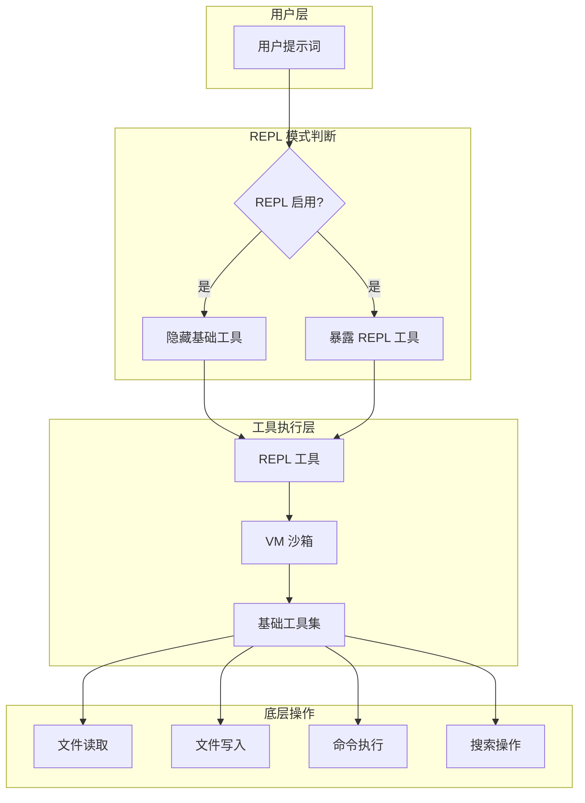
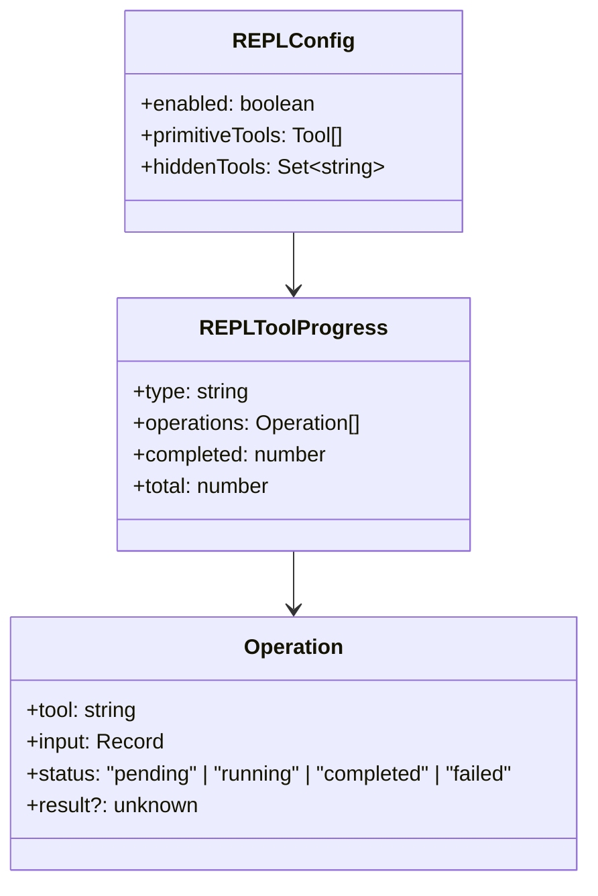
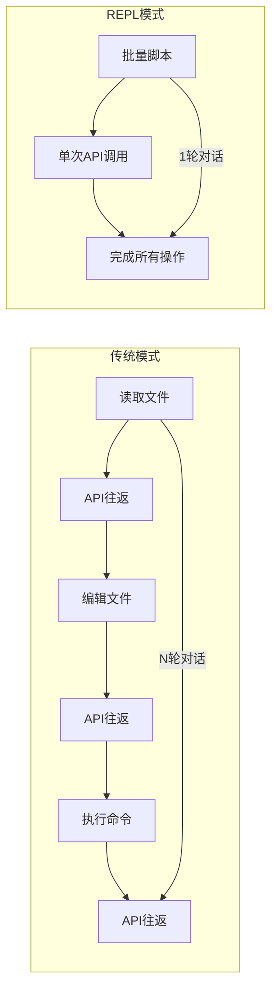

# 38. REPL 模式

> Claude Code 的批量操作执行模式，通过 VM 沙箱支持脚本化的工具调用。

---

## 概述

REPL (Read-Eval-Print Loop) 模式是 Claude Code 的高效执行模式，解决了以下问题：

- **减少 Token 消耗**：批量操作无需逐轮对话
- **提高执行效率**：一次调用完成多个文件操作
- **脚本化操作**：支持类似代码的批量执行语法
- **降低延迟**：减少 API 往返次数

### 核心特性

1. **工具隐藏**：基础工具（Read/Write/Edit/Bash）在 REPL 模式下隐藏
2. **VM 沙箱执行**：脚本在隔离环境中执行
3. **批量操作**：支持循环、条件等控制流
4. **错误隔离**：单个操作失败不影响整体执行

---

## 设计原理

### 架构设计



### REPL 模式启用逻辑

**模式检测**：`src/tools/REPLTool/constants.ts:23-30`

```typescript
function isReplModeEnabled(): boolean {
  // 显式禁用
  if (isEnvDefinedFalsy(process.env.CLAUDE_CODE_REPL)) return false
  // 遗留环境变量强制启用
  if (isEnvTruthy(process.env.CLAUDE_REPL_MODE)) return true
  // Ant 原生 CLI 默认启用
  return (
    process.env.USER_TYPE === 'ant' &&
    process.env.CLAUDE_CODE_ENTRYPOINT === 'cli'
  )
}
```

### 工具隐藏机制

**REPL 独占工具**：`src/tools/REPLTool/constants.ts:37-46`

```typescript
const REPL_ONLY_TOOLS = new Set([
  'FileRead', 'FileWrite', 'FileEdit',
  'Glob', 'Grep', 'Bash',
  'NotebookEdit', 'Agent'
])
```

这些工具在 REPL 模式启用时：
- 从模型可见的工具列表中移除
- 仅在 VM 沙箱内可用
- 通过 REPL 工具间接调用

**工具过滤逻辑**：`src/tools.ts:269-279`

---

## 实现原理

### 1. 工具注册与过滤

REPL 模式下的工具注册流程：

**工具获取**：`src/tools.ts:191-249`

```typescript
function getAllBaseTools(): Tools {
  return [
    // ... 标准工具
    ...(process.env.USER_TYPE === 'ant' && REPLTool ? [REPLTool] : []),
    // ... 其他工具
  ]
}
```

**工具过滤**：当 REPL 模式启用时：
1. `REPL_ONLY_TOOLS` 中的工具从可见列表移除
2. REPL 工具被添加到工具列表
3. 模型只能通过 REPL 工具访问基础操作

### 2. 原语工具集

**定义**：`src/tools/REPLTool/primitiveTools.ts:28-39`

```typescript
function getReplPrimitiveTools(): readonly Tool[] {
  return [
    FileReadTool,
    FileWriteTool,
    FileEditTool,
    GlobTool,
    GrepTool,
    BashTool,
    NotebookEditTool,
    AgentTool,
  ]
}
```

这些工具：
- 在 REPL 模式下对模型不可见
- 在 VM 沙箱内完整可用
- 用于渲染虚拟消息

### 3. VM 沙箱执行

REPL 工具的核心是在隔离的 VM 环境中执行脚本：

**沙箱特性**：
- 独立的执行上下文
- 受限的全局对象访问
- 工具调用的封装
- 错误隔离

---

## 功能展开

### 1. 批量文件操作

REPL 模式的典型场景：

```
# 批量读取多个文件
for file in ["a.ts", "b.ts", "c.ts"]:
  read(file)

# 批量编辑
for file in files:
  edit(file, old, new)
```

### 2. 搜索与处理

```
# 搜索并处理
results = grep("pattern", "**/*.ts")
for result in results:
  file = result.file
  content = read(file)
  # 处理...
```

### 3. 条件执行

```
# 条件操作
if file_exists("config.json"):
  config = read("config.json")
  # 处理配置
else:
  write("config.json", default_config)
```

### 4. 命令组合

```
# 组合操作
files = glob("src/**/*.ts")
for file in files:
  content = read(file)
  new_content = transform(content)
  edit(file, content, new_content)
bash("npm run lint")
```

---

## 数据结构

### REPL 模式配置



### 工具可见性矩阵

| 工具 | REPL 关闭 | REPL 开启 |
|------|-----------|-----------|
| FileRead | 直接可用 | 仅通过 REPL |
| FileWrite | 直接可用 | 仅通过 REPL |
| FileEdit | 直接可用 | 仅通过 REPL |
| Bash | 直接可用 | 仅通过 REPL |
| Glob | 直接可用 | 仅通过 REPL |
| Grep | 直接可用 | 仅通过 REPL |
| REPL | 不可见 | 可用 |

---

## 组合使用

### 1. REPL + 权限系统

REPL 操作仍受权限系统控制：

**权限检查**：`src/utils/permissions/permissions.ts:13`

```
REPL 工具调用 → 权限检查 → 基础工具执行
```

### 2. REPL + 工具搜索

**引用**：`src/utils/collapseReadSearch.ts:8-9`

REPL 工具的消息折叠与搜索集成。

### 3. REPL + 会话存储

**引用**：`src/utils/sessionStorage.ts:37`

会话存储处理 REPL 相关消息。

### 4. REPL + SDK

**互斥关系**：SDK 入口点不启用 REPL 模式

```typescript
// SDK 入口不启用 REPL
return (
  process.env.USER_TYPE === 'ant' &&
  process.env.CLAUDE_CODE_ENTRYPOINT === 'cli'  // 非 SDK 入口
)
```

---

## 小结

### 设计取舍

| 决策 | 理由 | 代价 |
|------|------|------|
| 隐藏基础工具 | 强制批量操作模式 | 学习曲线 |
| VM 沙箱隔离 | 安全性和错误隔离 | 性能开销 |
| 默认启用 | 优化 Token 使用 | 需要显式禁用 |

### Token 效率对比



### 当前局限

1. **Ant 专属**：仅 `USER_TYPE=ant` 的构建包含完整 REPL 实现
2. **VM 开销**：沙箱执行有一定性能开销
3. **调试困难**：脚本错误需要特殊处理

### 演进方向

1. **跨平台支持**：非 Ant 构建也可能支持 REPL
2. **增强语法**：更丰富的脚本语法支持
3. **调试工具**：改进错误消息和调试体验

---

## 关键代码路径

| 功能 | 文件路径 | 行号 |
|------|----------|------|
| 模式检测 | `src/tools/REPLTool/constants.ts` | 23-30 |
| 隐藏工具集 | `src/tools/REPLTool/constants.ts` | 37-46 |
| 原语工具 | `src/tools/REPLTool/primitiveTools.ts` | 28-39 |
| 工具注册 | `src/tools.ts` | 191-249 |
| 工具过滤 | `src/tools.ts` | 269-279 |
| 权限引用 | `src/utils/permissions/permissions.ts` | 13 |
| 消息折叠 | `src/utils/collapseReadSearch.ts` | 8-9 |

---

*基于 graphify 知识图谱构建 · 最后更新: 2026-04-26*
