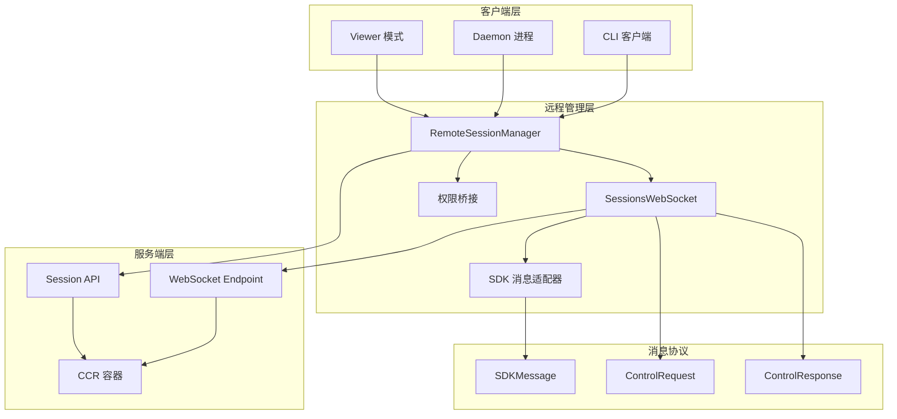
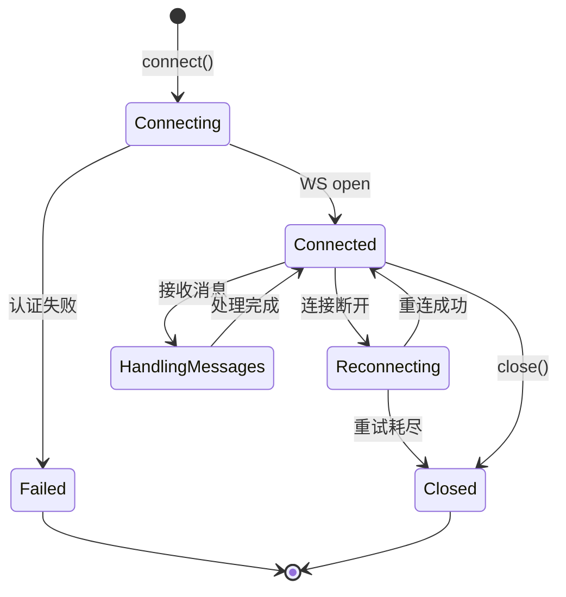
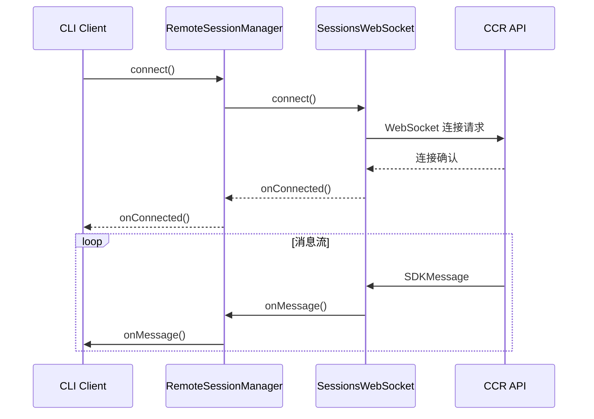
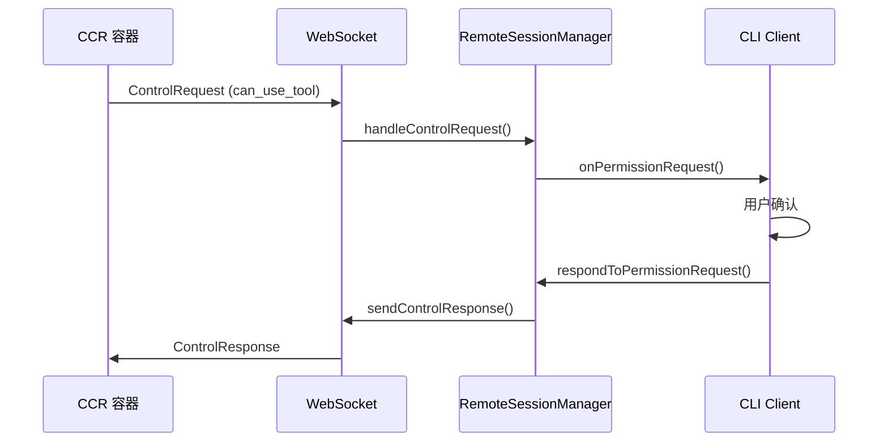
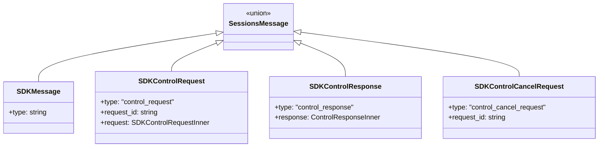
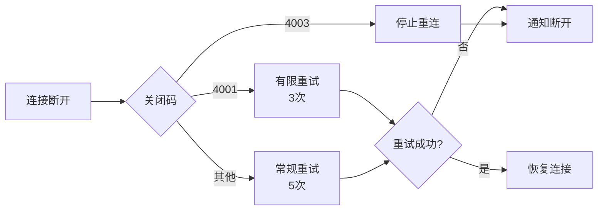

# 39. 远程控制

> Claude Code 的远程会话管理机制，支持 WebSocket 连接、权限桥接和跨进程通信。

---

## 概述

远程控制是 Claude Code 支持云端协作的核心机制，解决了以下问题：

- **云端会话**：在 claude.ai 上控制本地或云端 Claude Code
- **会话持久化**：跨设备、跨终端的会话连续性
- **权限桥接**：远程操作的本地权限控制
- **实时同步**：消息、状态、权限的实时双向同步

### 核心场景

1. **Claude.ai 远程控制**：从网页控制本地/云端 Claude Code
2. **Daemon 架构**：后台进程持有连接，子进程执行任务
3. **会话查看**：只读模式查看远程会话状态

---

## 设计原理

### 架构设计



### 连接生命周期



---

## 实现原理

### 1. RemoteSessionManager

远程会话管理的核心类，协调 WebSocket、HTTP API 和权限处理。

**类定义**：`src/remote/RemoteSessionManager.ts:95-344`

```typescript
class RemoteSessionManager {
  private websocket: SessionsWebSocket | null
  private pendingPermissionRequests: Map<string, SDKControlPermissionRequest>

  constructor(config: RemoteSessionConfig, callbacks: RemoteSessionCallbacks) {}

  connect(): void
  sendMessage(content: RemoteMessageContent): Promise<boolean>
  respondToPermissionRequest(requestId: string, result: RemotePermissionResponse): void
  cancelSession(): void
  disconnect(): void
}
```

**配置结构**：`src/remote/RemoteSessionManager.ts:50-62`

```typescript
type RemoteSessionConfig = {
  sessionId: string
  getAccessToken: () => string
  orgUuid: string
  hasInitialPrompt?: boolean
  viewerOnly?: boolean  // 只读模式
}
```

### 2. SessionsWebSocket

WebSocket 客户端，处理连接管理和消息收发。

**类定义**：`src/remote/SessionsWebSocket.ts:82-404`

**连接流程**：

1. 构建 WebSocket URL：`wss://api.anthropic.com/v1/sessions/ws/{sessionId}/subscribe`
2. 通过 headers 传递 OAuth token
3. 处理连接、消息、错误、关闭事件
4. 实现自动重连机制

**连接代码**：`src/remote/SessionsWebSocket.ts:100-205`

**重连策略**：
- 常规断开：最多 5 次重试，每次间隔 2s
- 4001 (Session Not Found)：最多 3 次重试（可能因 compaction 短暂不可用）
- 4003 (Unauthorized)：立即停止，不重连

**代码位置**：`src/remote/SessionsWebSocket.ts:234-288`

### 3. SDK 消息适配器

将 SDK 格式消息转换为内部消息格式。

**适配器定义**：`src/remote/sdkMessageAdapter.ts:1-306`

**消息转换表**：

| SDK 消息类型 | 内部消息类型 | 处理方式 |
|-------------|-------------|----------|
| `user` | UserMessage | 可选转换 |
| `assistant` | AssistantMessage | 直接映射 |
| `stream_event` | StreamEvent | 事件提取 |
| `result` | SystemMessage | 仅错误显示 |
| `system` | SystemMessage | 子类型处理 |
| `tool_progress` | SystemMessage | 进度信息 |

**转换函数**：`src/remote/sdkMessageAdapter.ts:169-282`

### 4. 权限桥接

远程权限请求的本地处理。

**桥接器定义**：`src/remote/remotePermissionBridge.ts:1-78`

```typescript
// 创建合成的 AssistantMessage（远程工具调用无本地消息）
function createSyntheticAssistantMessage(
  request: SDKControlPermissionRequest,
  requestId: string
): AssistantMessage

// 创建工具 stub（本地不存在的工具）
function createToolStub(toolName: string): Tool
```

---

## 功能展开

### 1. 会话连接

**连接配置**：`src/remote/RemoteSessionManager.ts:330-344`

```typescript
function createRemoteSessionConfig(
  sessionId: string,
  getAccessToken: () => string,
  orgUuid: string,
  hasInitialPrompt = false,
  viewerOnly = false
): RemoteSessionConfig
```

**连接流程**：



### 2. 消息发送

**发送方法**：`src/remote/RemoteSessionManager.ts:220-243`

```typescript
async sendMessage(content: RemoteMessageContent): Promise<boolean> {
  return sendEventToRemoteSession(sessionId, content, opts)
}
```

消息通过 HTTP POST 发送，保证可靠性。

### 3. 权限处理

**权限请求流程**：



**权限请求结构**：`src/entrypoints/sdk/controlSchemas.ts:106-122`

```typescript
SDKControlPermissionRequest = {
  subtype: 'can_use_tool',
  tool_name: string,
  input: Record<string, unknown>,
  permission_suggestions?: PermissionUpdate[],
  tool_use_id: string,
  agent_id?: string
}
```

### 4. 中断控制

**中断方法**：`src/remote/RemoteSessionManager.ts:295-298`

```typescript
cancelSession(): void {
  this.websocket?.sendControlRequest({ subtype: 'interrupt' })
}
```

### 5. 只读模式

**Viewer 模式配置**：`src/remote/RemoteSessionManager.ts:59-61`

```typescript
viewerOnly?: boolean  // Ctrl+C 不发送中断，禁用重连超时
```

用于 `claude assistant` 等查看场景。

---

## 数据结构

### 消息类型层次



### 回调接口

**SessionsWebSocketCallbacks**：`src/remote/SessionsWebSocket.ts:57-65`

```typescript
type SessionsWebSocketCallbacks = {
  onMessage: (message: SessionsMessage) => void
  onClose?: () => void
  onError?: (error: Error) => void
  onConnected?: () => void
  onReconnecting?: () => void
}
```

**RemoteSessionCallbacks**：`src/remote/RemoteSessionManager.ts:64-85`

```typescript
type RemoteSessionCallbacks = {
  onMessage: (message: SDKMessage) => void
  onPermissionRequest: (request, requestId) => void
  onPermissionCancelled?: (requestId, toolUseId) => void
  onConnected?: () => void
  onDisconnected?: () => void
  onReconnecting?: () => void
  onError?: (error: Error) => void
}
```

---

## 组合使用

### 1. 远程控制 + SDK

**Daemon 架构**：`src/entrypoints/agentSdkTypes.ts:419-443`

```typescript
type RemoteControlHandle = {
  sessionUrl: string
  write(msg: SDKMessage): void
  sendResult(): void
  sendControlRequest(req: unknown): void
  inboundPrompts(): AsyncGenerator<InboundPrompt>
  controlRequests(): AsyncGenerator<unknown>
  permissionResponses(): AsyncGenerator<unknown>
  teardown(): Promise<void>
}

async function connectRemoteControl(
  opts: ConnectRemoteControlOptions
): Promise<RemoteControlHandle | null>
```

Daemon 进程持有 WebSocket，子进程通过 SDK `query()` 执行任务。

### 2. 远程控制 + 权限系统

权限请求通过桥接器转为本地权限检查：

```
远程权限请求 → PermissionBridge → 本地权限UI → 响应回CCR
```

### 3. 远程控制 + MCP

远程会话中的 MCP 工具：
- 通过 `createToolStub()` 创建 stub
- 使用 `FallbackPermissionRequest` 处理
- 权限检查回退到通用处理

---

## 小结

### 设计取舍

| 决策 | 理由 | 代价 |
|------|------|------|
| WebSocket 双向通信 | 实时性和推送能力 | 连接管理复杂 |
| HTTP POST 发送消息 | 可靠性保证 | 双通道开销 |
| 权限请求合成 | 无本地消息上下文 | 需要特殊处理 |
| Viewer 模式 | 安全的只读访问 | 功能受限 |

### 连接可靠性机制



### 当前局限

1. **MCP 工具处理**：本地无定义的工具需要 stub
2. **权限 UI 复杂**：需要合成消息上下文
3. **网络依赖**：弱网环境体验不佳

### 演进方向

1. **离线支持**：本地缓存和同步机制
2. **工具发现**：动态获取远程工具定义
3. **多会话管理**：同时管理多个远程会话

---

## 关键代码路径

| 功能 | 文件路径 | 行号 |
|------|----------|------|
| 会话管理器 | `src/remote/RemoteSessionManager.ts` | 95-344 |
| WebSocket 客户端 | `src/remote/SessionsWebSocket.ts` | 82-404 |
| 消息适配器 | `src/remote/sdkMessageAdapter.ts` | 169-282 |
| 权限桥接 | `src/remote/remotePermissionBridge.ts` | 12-78 |
| 控制协议 | `src/entrypoints/sdk/controlSchemas.ts` | 106-122 |
| 远程控制句柄 | `src/entrypoints/agentSdkTypes.ts` | 397-443 |

---

*基于 graphify 知识图谱构建 · 最后更新: 2026-04-26*
