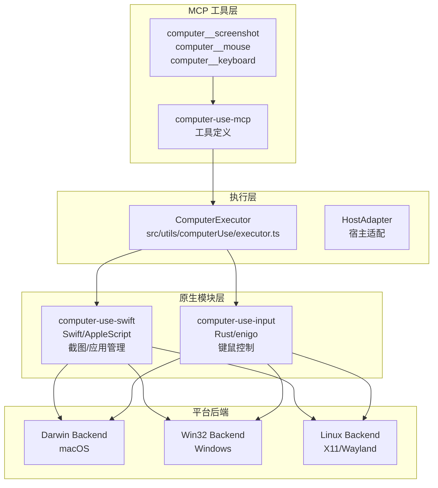
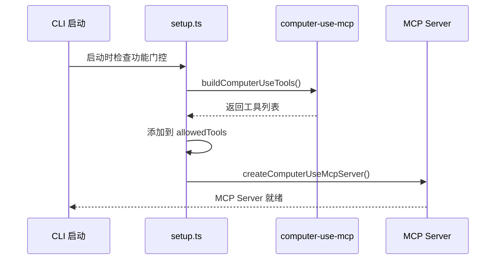
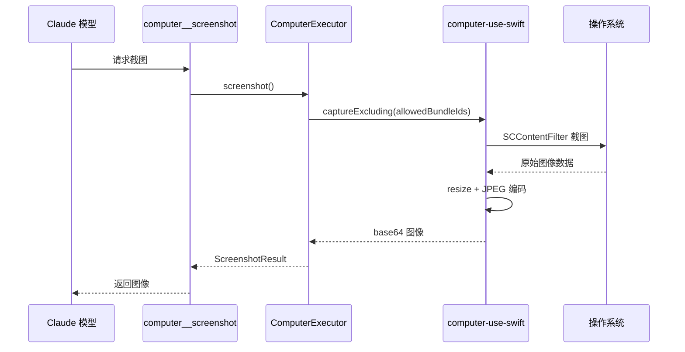

# 40. Computer Use

> 屏幕感知与键鼠控制，让AI能够直接操作图形界面

**功能入口**: `src/utils/computerUse/` · `packages/@ant/computer-use-swift/`
**核心包**: `@ant/computer-use-mcp` · `@ant/computer-use-input` · `@ant/computer-use-swift`
**Feature Gate**: `tengu_computer_use` · `tengu_computer_use_no_confirm`

---

## 概述

Computer Use 是 Claude Code 的 GUI 自动化能力，允许模型：
- 截取屏幕截图并分析UI状态
- 模拟鼠标点击、移动、滚动
- 模拟键盘输入和快捷键
- 检测并管理应用程序窗口

这使 Claude Code 能够完成需要图形界面操作的任务，如点击按钮、填写表单、操作桌面应用等。

### 解决的问题

1. **跨应用操作**：突破命令行限制，操作任意 GUI 应用
2. **视觉理解**：通过截图理解当前界面状态
3. **自动化测试**：执行端到端的 GUI 测试流程
4. **桌面应用集成**：与无法通过 CLI 操作的应用交互

---

## 设计原理

### 架构分层



### 设计动机

1. **MCP 协议封装**：工具以 MCP Server 形式暴露，保持架构统一
2. **原生性能优先**：Rust/Swift 原生模块确保低延迟操作
3. **跨平台抽象**：`SwiftBackend` 接口统一不同平台实现
4. **终端友好**：CLI 模式下无需 Electron 依赖

---

## 实现原理

### 核心机制

#### 1. 工具注册流程



**关键代码路径**:
- `src/utils/computerUse/setup.ts:23-52` — 工具注册入口
- `src/utils/computerUse/mcpServer.ts:60-78` — MCP Server 创建

#### 2. 截图捕获流程



**实现细节**:
- `src/utils/computerUse/executor.ts:424-470` — 截图逻辑
- macOS 使用 `SCContentFilter` 实现窗口排除
- 自动缩放到模型支持的最大分辨率

#### 3. 键鼠控制

**鼠标操作** (`src/utils/computerUse/executor.ts:500-620`):
```typescript
// 点击坐标
async function click(x: number, y: number, button: 'left' | 'right' | 'middle') {
  await moveAndSettle(input, x, y)  // 移动 + 50ms settle
  await input.mouseButton(button, 'press')
  await sleep(50)
  await input.mouseButton(button, 'release')
}

// 拖拽
async function drag(path: Array<{x, y}>) {
  await moveAndSettle(input, path[0].x, path[0].y)
  await input.mouseButton('left', 'press')
  for (const point of path.slice(1)) {
    await input.moveMouse(point.x, point.y, true)  // animated
  }
  await input.mouseButton('left', 'release')
}
```

**键盘操作** (`src/utils/computerUse/executor.ts:580-645`):
```typescript
// 单键
await input.key('escape', 'press')
await sleep(50)
await input.key('escape', 'release')

// 组合键 (修饰键压栈)
const pressed: string[] = []
try {
  for (const mod of ['command', 'shift']) {
    await input.key(mod, 'press')
    pressed.push(mod)
  }
  await input.key('c', 'press')
  await input.key('c', 'release')
} finally {
  // 逆序释放
  while ((k = pressed.pop())) await input.key(k, 'release')
}
```

#### 4. 应用窗口管理

**核心能力**:
- `prepareDisplay` — 激活目标应用，隐藏其他窗口
- `listInstalled` — 列出已安装应用
- `listRunning` — 列出运行中应用
- `open` — 启动应用

**终端特殊处理** (`src/utils/computerUse/executor.ts:324-340`):
```typescript
// 检测终端应用，避免遮挡目标
const terminalBundleId = getTerminalBundleId()
if (terminalBundleId) {
  // 终端作为 surrogate host，豁免隐藏和激活
  surrogateHost = terminalBundleId
}
```

### 关键数据结构

**ComputerExecutor 接口** (`@ant/computer-use-mcp`):
```typescript
interface ComputerExecutor {
  screenshot(displayId?: number): Promise<ScreenshotResult>
  mouse_move(x: number, y: number): Promise<void>
  mouse_click(x: number, y: number, button: MouseButton): Promise<void>
  mouse_scroll(x: number, y: number, direction: ScrollDirection): Promise<void>
  mouse_drag(path: DragPath): Promise<void>
  keyboard_key(key: string, action: KeyAction): Promise<void>
  keyboard_type(text: string): Promise<void>
  keyboard_hotkey(keys: string[]): Promise<void>
  get_display(): Promise<DisplayGeometry>
  list_apps(): Promise<InstalledApp[]>
}
```

**ScreenshotResult**:
```typescript
interface ScreenshotResult {
  base64: string      // JPEG 编码的图像
  width: number       // 物理像素宽度
  height: number      // 物理像素高度
  displayId: number   // 显示器 ID
}
```

---

## 功能展开

### 1. 屏幕截图与分析

**子工具**: `computer__screenshot`

**参数**:
- `display_id` (可选): 目标显示器 ID，默认主显示器

**实现路径**: `src/utils/computerUse/executor.ts:424-470`

**特色功能**:
- 自动排除 Claude Code 自身窗口
- 支持多显示器
- 自动缩放到模型支持的分辨率

### 2. 鼠标控制

**子工具**: 
- `computer__mouse_move` — 移动鼠标
- `computer__mouse_click` — 点击
- `computer__mouse_scroll` — 滚动
- `computer__mouse_drag` — 拖拽

**实现路径**: `src/utils/computerUse/executor.ts:500-620`

**安全机制**:
- 移动后 50ms settle 等待系统响应
- 拖拽使用动画路径避免触发意外事件

### 3. 键盘控制

**子工具**:
- `computer__keyboard_key` — 单键操作
- `computer__keyboard_type` — 文本输入
- `computer__keyboard_hotkey` — 快捷键

**实现路径**: `src/utils/computerUse/executor.ts:580-645`

**修饰键处理**:
- 压栈式管理（先按后放）
- 异常安全：finally 块确保释放

### 4. Escape 热键监听

**用途**: 用户按 Escape 随时中止 Computer Use 操作

**实现**: `src/utils/computerUse/escHotkey.ts:28-54`
```typescript
// 注册全局 Escape 监听
const cu = requireComputerUseSwift()
cu.hotkey.registerEscape(() => {
  // 中止当前操作
})
```

### 5. 会话锁机制

**问题**: 多个 Claude Code 实例同时操作 GUI 会冲突

**解决**: `src/utils/computerUse/computerUseLock.ts`
```typescript
// 独占锁文件
const LOCK_FILENAME = 'computer-use.lock'

interface ComputerUseLock {
  sessionId: string
  pid: number
  timestamp: number
}

// 尝试获取锁
async function tryAcquireComputerUseLock(): Promise<boolean>

// 检查现有锁
async function checkComputerUseLock(): Promise<CheckResult>
```

---

## 数据结构

### 平台后端抽象

**SwiftBackend 接口** (`packages/@ant/computer-use-swift/src/types.ts`):
```typescript
interface SwiftBackend {
  display: DisplayAPI
  apps: AppsAPI
  screenshot: ScreenshotAPI
  hotkey?: HotkeyAPI
}

interface DisplayAPI {
  getSize(): DisplayGeometry
  listAll(): DisplayGeometry[]
}

interface AppsAPI {
  prepareDisplay(bundleId: string): Promise<PrepareDisplayResult>
  listInstalled(): InstalledApp[]
  listRunning(): RunningApp[]
  open(bundleId: string): Promise<void>
}

interface ScreenshotAPI {
  captureExcluding(
    allowedBundleIds: string[],
    quality: number,
    targetW: number,
    targetH: number,
    displayId?: number
  ): Promise<ScreenshotResult>
}
```

### 平台实现

**macOS** (`packages/@ant/computer-use-swift/src/backends/darwin.ts`):
- 截图: `screencapture` + SCContentFilter
- 应用: AppleScript/JXA + NSWorkspace
- 键鼠: CGEventTap

**Windows** (`packages/@ant/computer-use-swift/src/backends/win32.ts`):
- 截图: PowerShell + System.Drawing
- 应用: PowerShell + Win32 API
- 键鼠: SendInput P/Invoke

**Linux** (`packages/@ant/computer-use-swift/src/backends/linux.ts`):
- 截图: gnome-screenshot / scrot
- 应用: .desktop 文件解析
- 键鼠: X11 / Wayland 协议

---

## 组合使用

### 与 MCP 集成

Computer Use 工具通过 MCP 协议暴露：

```typescript
// src/utils/computerUse/setup.ts
export function setupComputerUseMCP(): {
  mcpConfig: Record<string, ScopedMcpServerConfig>
  allowedTools: string[]
} {
  const allowedTools = buildComputerUseTools().map(
    tool => `mcp__computer-use__${tool.name}`
  )
  
  return {
    mcpConfig: {
      'computer-use': {
        type: 'stdio',
        command: process.execPath,
        args: ['--computer-use-mcp'],
      }
    },
    allowedTools
  }
}
```

### 权限控制

**确认模式**:
- 默认每次操作需用户确认
- `tengu_computer_use_no_confirm` 门控可跳过确认

**权限规则**:
```json
{
  "denyTools": [
    "mcp__computer-use__*"
  ]
}
```

### 与 Chrome Use 对比

| 特性 | Computer Use | Chrome Use |
|------|--------------|------------|
| 范围 | 全桌面 | 仅浏览器 |
| 精度 | 像素级 | DOM 级 |
| 速度 | 中等 | 快 |
| 适用场景 | 任意应用 | Web 应用 |

---

## 小结

### 设计取舍

**优势**:
1. **通用性**：可操作任意 GUI 应用
2. **视觉理解**：通过截图理解界面状态
3. **跨平台**：统一抽象 + 平台实现

**局限**:
1. **延迟**：截图 + 分析 + 操作流程较长
2. **精度**：像素坐标定位可能不够精确
3. **安全**：需要用户信任模型操作

### 演进方向

1. **视觉模型优化**：更准确的 UI 理解
2. **操作确认优化**：智能风险判断，减少不必要的确认
3. **多显示器增强**：更好的多屏支持
4. **无障碍集成**：利用 Accessibility API 获取更精确的 UI 信息

---

## 关键文件索引

| 文件 | 用途 | 行数参考 |
|------|------|----------|
| `src/utils/computerUse/setup.ts` | 工具注册入口 | 23-52 |
| `src/utils/computerUse/executor.ts` | 核心执行器 | 1-703 |
| `src/utils/computerUse/mcpServer.ts` | MCP Server 封装 | 60-89 |
| `src/utils/computerUse/swiftLoader.ts` | Swift 模块加载 | 15-29 |
| `src/utils/computerUse/inputLoader.ts` | Input 模块加载 | 22-36 |
| `src/utils/computerUse/escHotkey.ts` | Escape 热键监听 | 28-54 |
| `src/utils/computerUse/computerUseLock.ts` | 会话锁机制 | 48-110 |
| `packages/@ant/computer-use-swift/src/index.ts` | 跨平台 API | 56-101 |
| `packages/@ant/computer-use-swift/src/types.ts` | 类型定义 | - |

---

*基于代码事实构建 · 最后更新: 2026-04-26*
