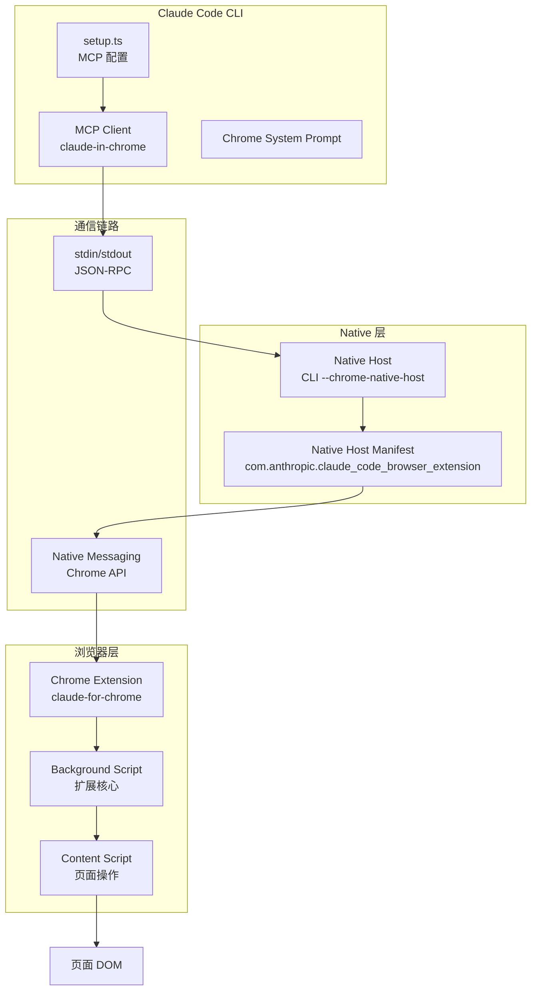
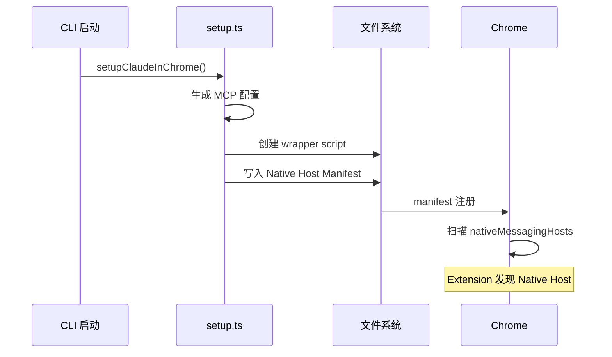
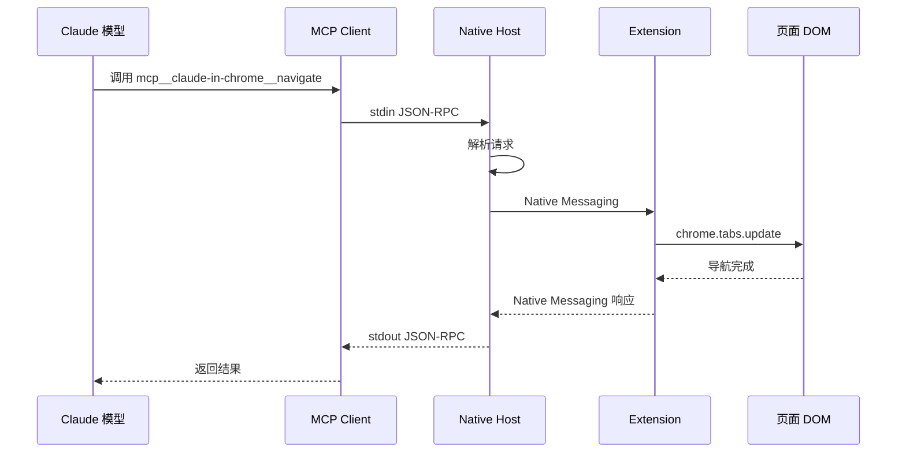
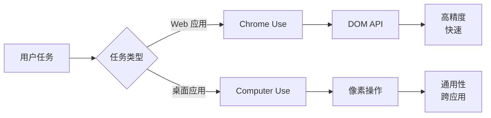

# 41. Chrome 集成

> 浏览器扩展与 Native Host 通信，实现 AI 驱动的网页操作

**功能入口**: `src/utils/claudeInChrome/` · `@ant/claude-for-chrome-mcp`
**核心协议**: Chrome Native Messaging
**Feature Gate**: `tengu_chrome_auto_enable`

---

## 概述

Chrome 集成让 Claude Code 能够：
- 直接操作浏览器标签页和页面元素
- 读取和填写网页表单
- 执行页面自动化任务
- 与 Web 应用深度交互

相比 Computer Use 的像素级操作，Chrome 集成使用 DOM API，操作更精准、速度更快。

### 解决的问题

1. **Web 应用操作**：突破 CLI 限制，操作在线服务
2. **表单自动化**：自动填写复杂表单
3. **数据提取**：从网页结构化提取信息
4. **测试自动化**：端到端 Web 测试

---

## 设计原理

### 架构概览



### 设计动机

1. **MCP 统一接口**：浏览器工具通过 MCP 暴露，与工具系统无缝集成
2. **Native Messaging**：官方推荐的扩展通信协议，安全可靠
3. **双层代理**：CLI 作为 Native Host，Extension 作为浏览器侧代理

---

## 实现原理

### 核心机制

#### 1. 安装与配置流程



**关键代码路径**:
- `src/utils/claudeInChrome/setup.ts:91-171` — MCP 配置生成
- `src/utils/claudeInChrome/setup.ts:191-276` — Native Host Manifest 安装

#### 2. Native Host Manifest

**定义** (`src/utils/claudeInChrome/setup.ts:199-220`):
```json
{
  "name": "com.anthropic.claude_code_browser_extension",
  "description": "Claude Code Browser Extension Host",
  "path": "/path/to/wrapper-script",
  "type": "stdio",
  "allowed_origins": [
    "chrome-extension://fcoeoabgfenejglbffodgkkbkcdhcgfn/",
    "chrome-extension://dihbgbndebgnbjfmelmegjepbnkhlgni/",
    "chrome-extension://dngcpimnedloihjnnfngkgjoidhnaolf/"
  ]
}
```

**安装位置**:
- **macOS**: `~/Library/Application Support/Google/Chrome/NativeMessagingHosts/`
- **Linux**: `~/.config/google-chrome/NativeMessagingHosts/`
- **Windows**: Registry + `%APPDATA%/Claude Code/ChromeNativeHost/`

#### 3. 工具调用链路



#### 4. MCP Server 启动

**启动命令** (`src/utils/claudeInChrome/setup.ts:107-136`):
```typescript
// 原生构建模式
mcpConfig: {
  'claude-in-chrome': {
    type: 'stdio',
    command: process.execPath,  // CLI 二进制
    args: ['--claude-in-chrome-mcp'],
    scope: 'dynamic'
  }
}

// NPM 模式
mcpConfig: {
  'claude-in-chrome': {
    type: 'stdio',
    command: process.execPath,  // node
    args: ['/path/to/cli.js', '--claude-in-chrome-mcp'],
    scope: 'dynamic'
  }
}
```

### 关键数据结构

**浏览器工具列表** (`@ant/claude-for-chrome-mcp`):
```typescript
const BROWSER_TOOLS = [
  { name: 'navigate', description: '导航到 URL' },
  { name: 'click', description: '点击元素' },
  { name: 'type', description: '输入文本' },
  { name: 'scroll', description: '滚动页面' },
  { name: 'wait', description: '等待元素' },
  { name: 'screenshot', description: '截图' },
  { name: 'evaluate', description: '执行 JavaScript' },
  // ... 更多工具
]
```

**MCP 工具命名** (`src/utils/claudeInChrome/setup.ts:97-99`):
```typescript
const allowedTools = BROWSER_TOOLS.map(
  tool => `mcp__claude-in-chrome__${tool.name}`
)
// 例如: mcp__claude-in-chrome__navigate
```

---

## 功能展开

### 1. 自动启用机制

**判断逻辑** (`src/utils/claudeInChrome/setup.ts:72-84`):
```typescript
function shouldAutoEnableClaudeInChrome(): boolean {
  return (
    getIsInteractive() &&  // 交互式会话
    isChromeExtensionInstalled() &&  // 扩展已安装
    (
      process.env.USER_TYPE === 'ant' ||  // 内部用户
      getFeatureValue('tengu_chrome_auto_enable', false)  // 功能开关
    )
  )
}
```

### 2. 手动控制

**CLI 标志**:
```bash
claude --chrome  # 强制启用
claude --no-chrome  # 强制禁用
```

**环境变量**:
```bash
CLAUDE_CODE_ENABLE_CFC=1  # 启用
CLAUDE_CODE_ENABLE_CFC=0  # 禁用
```

**配置文件**:
```json
{
  "claudeInChromeDefaultEnabled": true
}
```

### 3. 权限模式

**传递给扩展** (`src/utils/claudeInChrome/setup.ts:102-105`):
```typescript
const env: Record<string, string> = {}
if (getSessionBypassPermissionsMode()) {
  env.CLAUDE_CHROME_PERMISSION_MODE = 'skip_all_permission_checks'
}
```

### 4. 系统提示词

**Chrome 专用提示词** (`src/utils/claudeInChrome/prompt.ts`):
- 告知模型可用的浏览器工具
- 指导最佳实践（如何等待、如何定位元素）
- 安全边界说明

### 5. Wrapper Script

**目的**: Native Messaging 要求 manifest 的 `path` 字段不能带参数

**实现** (`src/utils/claudeInChrome/setup.ts:107-153`):
```bash
#!/bin/bash
exec "/path/to/claude" --chrome-native-host
```

**创建流程**:
1. 生成脚本内容
2. 写入临时文件
3. 设置可执行权限 (`chmod +x`)
4. 返回脚本路径给 manifest

---

## 数据结构

### Native Host Manifest Schema

```typescript
interface NativeHostManifest {
  name: string           // 唯一标识符
  description: string    // 描述
  path: string          // Native Host 可执行文件路径
  type: 'stdio'         // 通信类型
  allowed_origins: string[]  // 允许的扩展 ID
}
```

### MCP 工具配置

```typescript
interface ScopedMcpServerConfig {
  type: 'stdio'
  command: string       // 可执行文件
  args: string[]        // 命令行参数
  scope: 'dynamic'      // 作用域
  env?: Record<string, string>  // 环境变量
}
```

### Extension ID 管理

**生产环境**: `fcoeoabgfenejglbffodgkkbkcdhcgfn`
**开发环境**: `dihbgbndebgnbjfmelmegjepbnkhlgni`
**Ant 内部**: `dngcpimnedloihjnnfngkgjoidhnaolf`

---

## 组合使用

### 与 Computer Use 协作



**选择策略**:
- **Chrome Use**: Web 应用、表单填写、数据抓取
- **Computer Use**: 桌面应用、无 DOM API 的场景

### 与 WebFetch 对比

| 特性 | Chrome Use | WebFetch |
|------|------------|----------|
| 方式 | 浏览器自动化 | HTTP 请求 |
| JavaScript 执行 | ✅ 完整支持 | ❌ 不支持 |
| 动态内容 | ✅ 可交互 | ❌ 仅静态 |
| 需要登录 | ✅ 支持 | ❌ 复杂 |
| 速度 | 中等 | 快 |

### 集成到工具系统

**工具池合并** (`src/utils/claudeInChrome/setup.ts:91-99`):
```typescript
// 在工具注册时合并
const { mcpConfig, allowedTools, systemPrompt } = setupClaudeInChrome()

// MCP 配置添加到全局配置
Object.assign(allMcpConfig, mcpConfig)

// allowedTools 添加到工具白名单
allAllowedTools.push(...allowedTools)
```

---

## 小结

### 设计取舍

**优势**:
1. **精准操作**：DOM API 比像素定位更可靠
2. **速度快**：无需截图分析，直接操作
3. **双向通信**：可读取页面状态和响应

**局限**:
1. **范围限制**：仅限浏览器内
2. **依赖扩展**：需要用户安装 Chrome Extension
3. **平台兼容**：不同浏览器可能需要不同实现

### 演进方向

1. **多浏览器支持**：Firefox、Edge、Safari 扩展
2. **增强工具集**：更多页面操作能力
3. **智能等待**：基于页面状态自动等待
4. **安全增强**：更细粒度的权限控制

---

## 关键文件索引

| 文件 | 用途 | 行数参考 |
|------|------|----------|
| `src/utils/claudeInChrome/setup.ts` | 安装与配置入口 | 91-276 |
| `src/utils/claudeInChrome/common.ts` | 平台路径工具 | - |
| `src/utils/claudeInChrome/prompt.ts` | Chrome 系统提示词 | - |
| `@ant/claude-for-chrome-mcp` | MCP 工具定义 | - |

---

*基于代码事实构建 · 最后更新: 2026-04-26*
