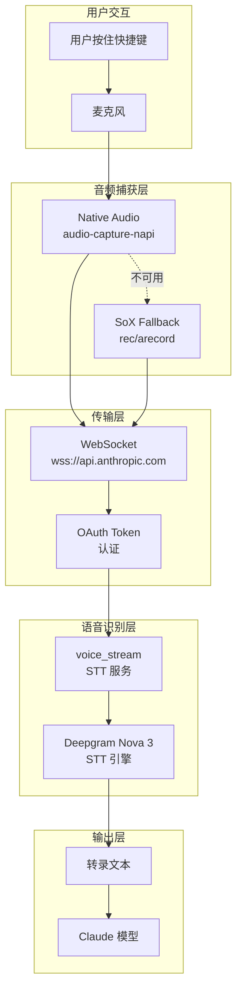
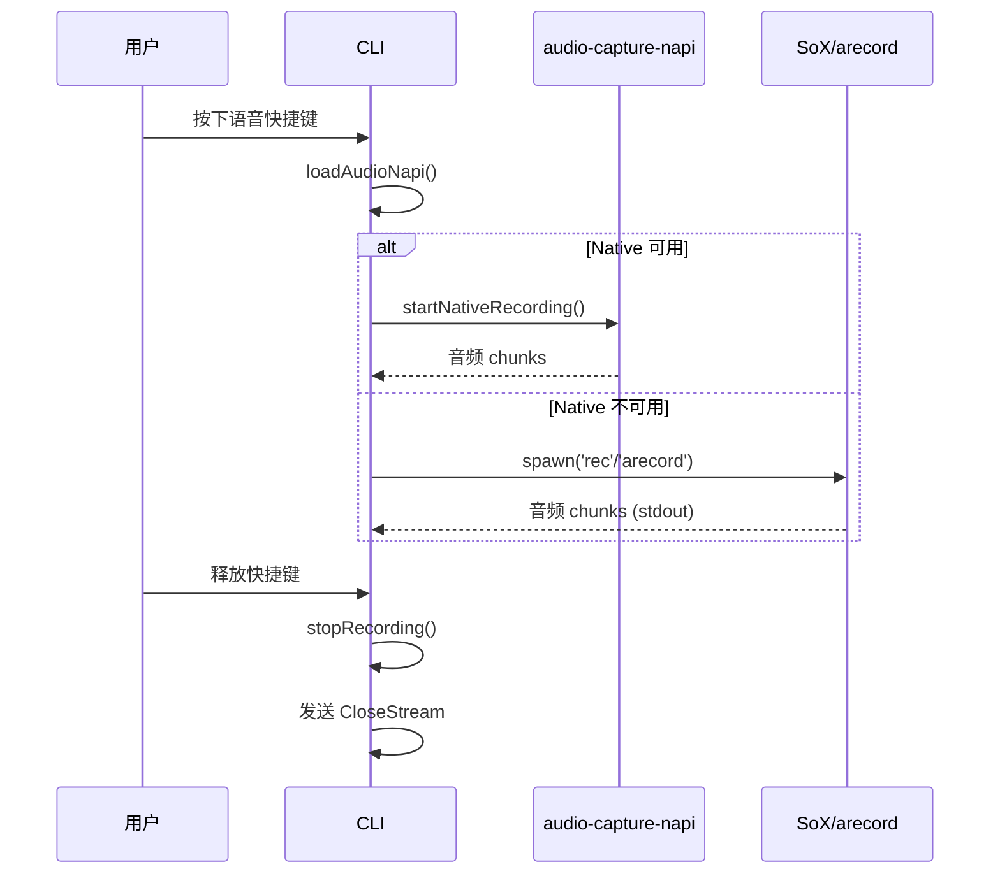
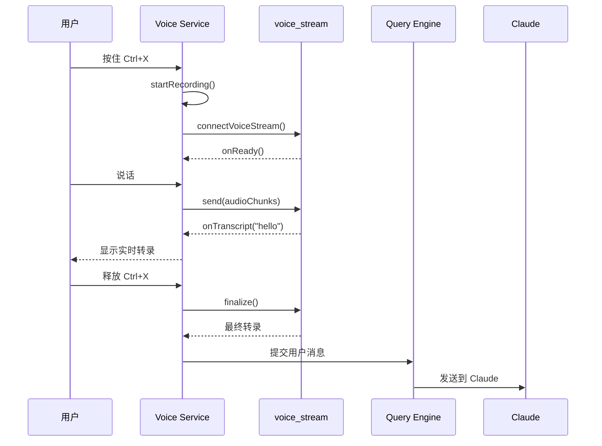

# 42. Voice Mode

> 语音输入与实时转录，解放双手的交互方式

**功能入口**: `src/services/voice.ts` · `src/services/voiceStreamSTT.ts`
**核心依赖**: `audio-capture-napi` · `ws`
**Feature Gate**: `VOICE_MODE` · `tengu_cobalt_frost`

---

## 概述

Voice Mode 让 Claude Code 支持：
- 按住快捷键录音，释放自动提交
- 实时语音转文字
- 多语言识别支持
- 关键词识别优化

这为用户提供了更自然的交互方式，特别是在编程、代码审查等双手忙碌的场景。

### 解决的问题

1. **输入效率**：语音输入比打字更快
2. **无障碍访问**：为行动不便用户提供替代输入方式
3. **多任务场景**：编码时语音输入指令
4. **自然交互**：更接近人与人对话的体验

---

## 设计原理

### 架构概览



### 设计动机

1. **原生优先**：`audio-capture-napi` (cpal) 提供最低延迟
2. **优雅降级**：SoX/arecord 作为后备方案
3. **云端识别**：利用 Anthropic 的语音服务，无需本地模型
4. **实时反馈**：WebSocket 流式传输，边说边识别

---

## 实现原理

### 核心机制

#### 1. 音频捕获流程



**关键代码路径**:
- `src/services/voice.ts:335-396` — 录音启动逻辑
- `src/services/voice.ts:515-524` — 录音停止逻辑

#### 2. 原生音频捕获

**加载策略** (`src/services/voice.ts:24-36`):
```typescript
let audioNapi: AudioNapi | null = null
let audioNapiPromise: Promise<AudioNapi> | null = null

function loadAudioNapi(): Promise<AudioNapi> {
  audioNapiPromise ??= (async () => {
    const t0 = Date.now()
    const mod = await import('audio-capture-napi')
    mod.isNativeAudioAvailable()  // 触发 dlopen
    audioNapi = mod
    logForDebugging(`[voice] audio-capture-napi loaded in ${Date.now() - t0}ms`)
    return mod
  })()
  return audioNapiPromise
}
```

**延迟加载原因** (`src/services/voice.ts:14-19`):
```
dlopen is synchronous and blocks the event loop for ~1s warm, 
up to ~8s on cold coreaudiod (post-wake, post-boot). 
Load happens on first voice keypress — no preload.
```

#### 3. 平台降级策略

**macOS/Linux/Windows**: 原生 `audio-capture-napi` (cpal)

**Linux 后备** (`src/services/voice.ts:468-513`):
```typescript
// ALSA 录音 (arecord)
function startArecordRecording(onData, onEnd): boolean {
  const args = ['-f', 'S16_LE', '-r', '16000', '-c', '1', '-t', 'raw', '-q', '-']
  const child = spawn('arecord', args)
  child.stdout.on('data', onData)
  return true
}

// SoX 录音 (rec)
function startSoxRecording(onData, onEnd, options): boolean {
  const args = ['-q', '--buffer', '1024', '-t', 'raw', '-r', '16000', ...]
  if (options.silenceDetection) {
    args.push('silence', '1', '0.1', '3%', '1', '2.0', '3%')
  }
  const child = spawn('rec', args)
  child.stdout.on('data', onData)
  return true
}
```

#### 4. WebSocket 语音流

**连接建立** (`src/services/voiceStreamSTT.ts:111-195`):
```typescript
async function connectVoiceStream(callbacks, options): Promise<VoiceStreamConnection | null> {
  // 1. 刷新 OAuth token
  await checkAndRefreshOAuthTokenIfNeeded()
  
  // 2. 构建 WebSocket URL
  const params = new URLSearchParams({
    encoding: 'linear16',
    sample_rate: '16000',
    channels: '1',
    endpointing_ms: '300',
    utterance_end_ms: '1000',
    language: options?.language ?? 'en'
  })
  
  // 3. Deepgram Nova 3 开关
  if (getFeatureValue('tengu_cobalt_frost', false)) {
    params.set('use_conversation_engine', 'true')
    params.set('stt_provider', 'deepgram-nova3')
  }
  
  // 4. 建立 WebSocket
  const ws = new WebSocket(`${baseUrl}${VOICE_STREAM_PATH}?${params}`, {
    headers: { Authorization: `Bearer ${accessToken}` }
  })
  
  // 5. Keepalive 心跳
  setInterval(() => ws.send(KEEPALIVE_MSG), 8000)
}
```

**消息协议** (`src/services/voiceStreamSTT.ts:75-94`):
```typescript
type VoiceStreamMessage =
  | { type: 'TranscriptText', data: string }
  | { type: 'TranscriptEndpoint' }
  | { type: 'TranscriptError', error_code?: string, description?: string }

// 发送
ws.send(audioChunk)  // 二进制音频帧
ws.send('{"type":"CloseStream"}')  // 结束录音

// 接收
ws.on('message', (data) => {
  const msg = JSON.parse(data)
  if (msg.type === 'TranscriptText') {
    callbacks.onTranscript(msg.data, false)
  }
})
```

#### 5. 录音可用性检测

**多级检测** (`src/services/voice.ts:259-328`):
```typescript
async function checkRecordingAvailability(): Promise<RecordingAvailability> {
  // 1. 远程环境检测
  if (isRunningOnHomespace() || process.env.CLAUDE_CODE_REMOTE) {
    return { available: false, reason: 'Voice mode requires microphone access...' }
  }
  
  // 2. 原生模块检测
  const napi = await loadAudioNapi()
  if (napi.isNativeAudioAvailable()) {
    return { available: true, reason: null }
  }
  
  // 3. Windows 无后备
  if (process.platform === 'win32') {
    return { available: false, reason: 'Native audio module required' }
  }
  
  // 4. Linux arecord 探测
  if (hasCommand('arecord')) {
    const probe = await probeArecord()  // 实际打开设备
    if (probe.ok) return { available: true, reason: null }
    if (isWSL()) return { available: false, reason: wslNoAudioReason }
  }
  
  // 5. SoX 检测
  if (!hasCommand('rec')) {
    return { available: false, reason: 'Install SoX: brew install sox' }
  }
  
  return { available: true, reason: null }
}
```

**WSL 特殊处理** (`src/services/voice.ts:284-286`):
```
WSL1/Win10-WSL2: 无音频设备
WSL2+WSLg (Win11): PulseAudio via RDP 可用
```

### 关键数据结构

**VoiceStreamConnection** (`src/services/voiceStreamSTT.ts:67-72`):
```typescript
interface VoiceStreamConnection {
  send: (audioChunk: Buffer) => void      // 发送音频
  finalize: () => Promise<FinalizeSource>  // 结束并等待最终结果
  close: () => void                        // 关闭连接
  isConnected: () => boolean               // 连接状态
}
```

**RecordingAvailability** (`src/services/voice.ts:231-234`):
```typescript
interface RecordingAvailability {
  available: boolean
  reason: string | null  // 不可用时的错误信息
}
```

**FinalizeSource** (`src/services/voiceStreamSTT.ts:60-65`):
```typescript
type FinalizeSource =
  | 'post_closestream_endpoint'  // 正常结束
  | 'no_data_timeout'            // 无数据超时
  | 'safety_timeout'             // 安全超时
  | 'ws_close'                   // WebSocket 关闭
  | 'ws_already_closed'          // 已关闭
```

---

## 功能展开

### 1. 麦克风权限请求

**macOS TCC 处理** (`src/services/voice.ts:241-257`):
```typescript
async function requestMicrophonePermission(): Promise<boolean> {
  const napi = await loadAudioNapi()
  if (!napi.isNativeAudioAvailable()) {
    return true  // 非原生平台跳过
  }
  
  // 尝试录音触发权限对话框
  const started = await startRecording(_chunk => {}, () => {}, { 
    silenceDetection: false 
  })
  
  if (started) {
    stopRecording()
    return true
  }
  return false
}
```

### 2. 静音检测

**SoX 静音检测** (`src/services/voice.ts:429-438`):
```typescript
// 自动停止参数
args.push(
  'silence',           // 静音检测模式
  '1', '0.1', '3%',   // 开始: 0.1s 低于 3%
  '1', '2.0', '3%'    // 结束: 2.0s 低于 3%
)
```

**推送对话模式**: 禁用静音检测，用户手动控制

### 3. 依赖检测

**包管理器检测** (`src/services/voice.ts:151-188`):
```typescript
function detectPackageManager(): PackageManagerInfo | null {
  if (process.platform === 'darwin') {
    if (hasCommand('brew')) {
      return { cmd: 'brew', args: ['install', 'sox'], displayCommand: 'brew install sox' }
    }
  }
  if (process.platform === 'linux') {
    if (hasCommand('apt-get')) return { cmd: 'sudo', args: ['apt-get', 'install', '-y', 'sox'], ... }
    if (hasCommand('dnf')) return { cmd: 'sudo', args: ['dnf', 'install', '-y', 'sox'], ... }
    if (hasCommand('pacman')) return { cmd: 'sudo', args: ['pacman', '-S', '--noconfirm', 'sox'], ... }
  }
  return null
}
```

### 4. 关键词优化

**实现位置**: `src/services/voiceKeyterms.ts`

**用途**: 提供项目相关的关键词，提升识别准确率

**应用场景**:
- 变量名、函数名
- 技术术语
- 项目特定词汇

### 5. 实时转录显示

**回调机制** (`src/services/voiceStreamSTT.ts:51-56`):
```typescript
interface VoiceStreamCallbacks {
  onTranscript: (text: string, isFinal: boolean) => void
  onError: (error: string, opts?: { fatal?: boolean }) => void
  onClose: () => void
  onReady: (connection: VoiceStreamConnection) => void
}
```

---

## 数据结构

### 音频参数

```typescript
const RECORDING_SAMPLE_RATE = 16000   // 16kHz
const RECORDING_CHANNELS = 1          // 单声道
const SILENCE_DURATION_SECS = '2.0'   // 静音时长
const SILENCE_THRESHOLD = '3%'        // 静音阈值
```

### WebSocket 参数

```typescript
const VOICE_STREAM_PATH = '/api/ws/speech_to_text/voice_stream'
const KEEPALIVE_INTERVAL_MS = 8_000

const FINALIZE_TIMEOUTS_MS = {
  safety: 5_000,
  noData: 1_500
}
```

### Arecord 探测结果

```typescript
interface ArecordProbeResult {
  ok: boolean
  stderr: string  // 错误信息
}
```

---

## 组合使用

### 与对话系统集成



### 与推送对话模式

**Hold-to-talk 流程**:
1. 用户按住快捷键
2. 开始录音（禁用静音检测）
3. 实时发送音频到 STT
4. 用户释放快捷键
5. 停止录音，发送 CloseStream
6. 等待最终转录结果
7. 自动提交到对话

---

## 小结

### 设计取舍

**优势**:
1. **跨平台支持**：原生 + 降级策略覆盖主流平台
2. **低延迟**：原生音频捕获 + WebSocket 流式传输
3. **实时反馈**：边说边识别，用户体验好

**局限**:
1. **依赖网络**：需要连接 Anthropic 语音服务
2. **OAuth 依赖**：需要 Anthropic 账户认证
3. **WSL 兼容**：WSL1/Win10 不支持，WSL2+WSLg 需要额外配置

### 演进方向

1. **本地 STT**：离线语音识别支持
2. **多语言增强**：更多语言和方言支持
3. **语音命令**：直接语音控制 CLI
4. **语音输出**：TTS 集成，双向语音交互

---

## 关键文件索引

| 文件 | 用途 | 行数参考 |
|------|------|----------|
| `src/services/voice.ts` | 音频捕获服务 | 1-525 |
| `src/services/voiceStreamSTT.ts` | WebSocket STT 客户端 | 1-544 |
| `src/services/voiceKeyterms.ts` | 关键词优化 | - |

---

*基于代码事实构建 · 最后更新: 2026-04-26*
