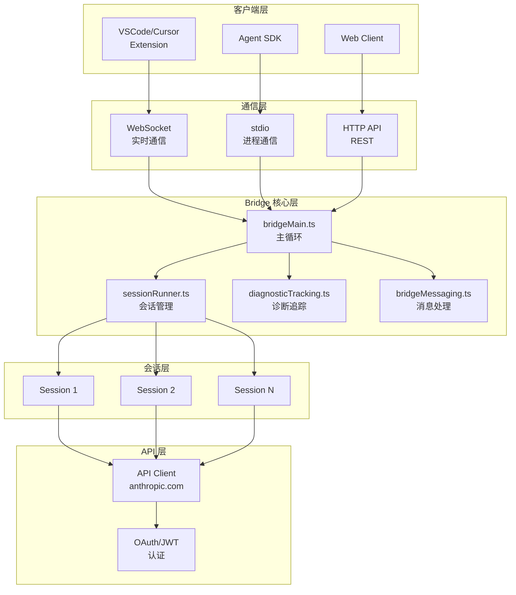
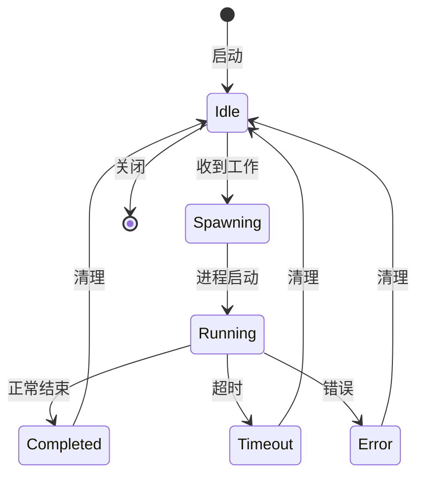
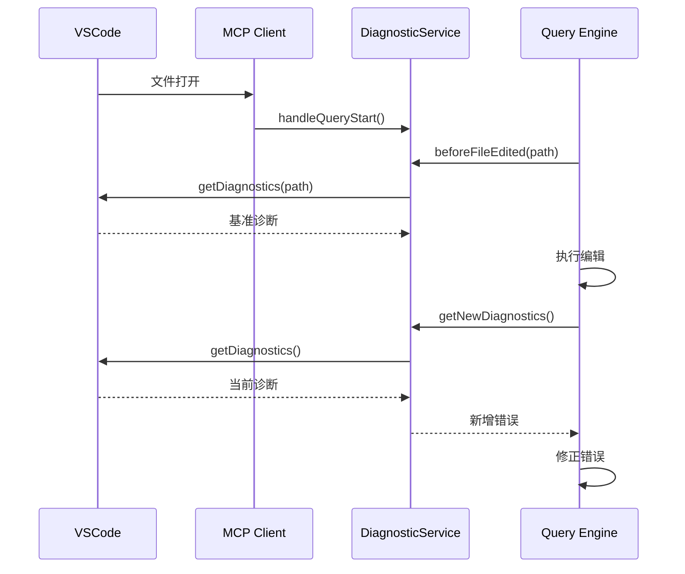

# 43. Bridge Mode

> IDE 集成与会话管理，Claude Code 作为后端服务

**功能入口**: `src/bridge/` · `src/remote/`
**核心能力**: 会话生命周期管理、诊断追踪、远程通信
**主要场景**: VSCode/Cursor 集成、远程会话

---

## 概述

Bridge Mode 让 Claude Code 能够：
- 作为后端服务被 IDE 或其他客户端调用
- 管理多个并发会话的生命周期
- 追踪文件变更和诊断信息
- 提供远程控制和状态同步能力

这使 Claude Code 从单一 CLI 工具转变为可嵌入的 AI 能力平台。

### 解决的问题

1. **IDE 集成**：在编辑器内无缝使用 Claude Code
2. **会话持久化**：支持跨编辑器会话的对话连续性
3. **诊断反馈**：实时获取 IDE 的错误和警告
4. **多客户端**：一个后端服务多个前端

---

## 设计原理

### 架构概览



### 设计动机

1. **服务化架构**：将 CLI 转变为可被外部调用的服务
2. **会话隔离**：每个工作空间/项目独立会话
3. **实时同步**：通过 WebSocket 实现双向通信
4. **诊断驱动**：利用 IDE 的语言服务获取即时反馈

---

## 实现原理

### 核心机制

#### 1. Bridge 主循环

```mermaid
sequenceDiagram
    participant API as Bridge API
    participant Loop as runBridgeLoop
    participant Session as Session Manager
    participant Child as Child Process

    loop 轮询
        API->>Loop: pollWork()
        alt 有新工作
            Loop->>Session: spawnSession()
            Session->>Child: 启动 claude 子进程
            Child-->>Session: stdout/stderr 流
            Session-->>Loop: SessionHandle
        else 无工作
            Loop->>Loop: sleep(pollInterval)
        end
        Loop->>API: heartbeatWork()
    end
```

**关键代码路径** (`src/bridge/bridgeMain.ts:141-300`):
```typescript
export async function runBridgeLoop(
  config: BridgeConfig,
  environmentId: string,
  environmentSecret: string,
  api: BridgeApiClient,
  spawner: SessionSpawner,
  logger: BridgeLogger,
  signal: AbortSignal
): Promise<void> {
  const activeSessions = new Map<string, SessionHandle>()
  const sessionWorkIds = new Map<string, string>()
  const sessionIngressTokens = new Map<string, string>()
  
  // 主循环
  while (!signal.aborted) {
    // 轮询新工作
    const workItems = await api.pollWork(environmentId)
    
    for (const work of workItems) {
      // 启动会话
      const handle = spawner.spawn({
        sessionId: work.data.id,
        accessToken: work.ingressToken
      })
      
      activeSessions.set(work.data.id, handle)
      sessionWorkIds.set(work.data.id, work.id)
      sessionIngressTokens.set(work.data.id, work.ingressToken)
    }
    
    // 心跳保活
    await heartbeatActiveWorkItems()
    
    // 清理已完成会话
    // ...
  }
}
```

#### 2. 会话生命周期

**状态机**:


**会话句柄** (`src/bridge/types.ts`):
```typescript
interface SessionHandle {
  process: ChildProcess
  sessionId: string
  accessToken: string
  startTime: number
  status: 'running' | 'completed' | 'error'
}
```

**会话启动** (`src/bridge/sessionRunner.ts:127-200`):
```typescript
export function createSessionSpawner(): SessionSpawner {
  return {
    spawn(opts: SessionSpawnOpts, dir: string): SessionHandle {
      const args = [
        ...spawnScriptArgs(),
        '--sdk-url', opts.sdkUrl,
        '--session-id', opts.sessionId
      ]
      
      const child = spawn(process.execPath, args, {
        cwd: dir,
        stdio: ['ignore', 'pipe', 'pipe']
      })
      
      return {
        process: child,
        sessionId: opts.sessionId,
        accessToken: opts.accessToken,
        startTime: Date.now(),
        status: 'running'
      }
    }
  }
}
```

#### 3. 诊断追踪服务

**核心类** (`src/services/diagnosticTracking.ts:30-77`):
```typescript
class DiagnosticTrackingService {
  private baseline: Map<string, Diagnostic[]> = new Map()
  private mcpClient: MCPServerConnection | undefined
  
  // 编辑前捕获基准诊断
  async beforeFileEdited(filePath: string): Promise<void> {
    const result = await callIdeRpc('getDiagnostics', { uri: `file://${filePath}` })
    this.baseline.set(filePath, result.diagnostics)
  }
  
  // 获取新增诊断（错误/警告）
  async getNewDiagnostics(): Promise<DiagnosticFile[]> {
    const allDiagnostics = await callIdeRpc('getDiagnostics', {})
    
    return allDiagnostics
      .filter(file => this.baseline.has(file.uri))
      .map(file => ({
        uri: file.uri,
        diagnostics: file.diagnostics.filter(
          d => !this.baseline.get(file.uri)?.some(b => this.areDiagnosticsEqual(d, b))
        )
      }))
      .filter(file => file.diagnostics.length > 0)
  }
}
```

**诊断数据结构** (`src/services/diagnosticTracking.ts:14-28`):
```typescript
interface Diagnostic {
  message: string
  severity: 'Error' | 'Warning' | 'Info' | 'Hint'
  range: {
    start: { line: number; character: number }
    end: { line: number; character: number }
  }
  source?: string   // 例如 "typescript"
  code?: string     // 例如 "TS2322"
}

interface DiagnosticFile {
  uri: string
  diagnostics: Diagnostic[]
}
```

#### 4. Token 刷新机制

**JWT 过期处理** (`src/bridge/bridgeMain.ts:277-320`):
```typescript
// 主动刷新: 5分钟前刷新
const tokenRefresh = createTokenRefreshScheduler({
  getAccessToken,
  onRefresh: (sessionId, oauthToken) => {
    const handle = activeSessions.get(sessionId)
    if (!handle) return
    
    if (v2Sessions.has(sessionId)) {
      // v2: 调用 reconnectSession 触发重新分发
      void api.reconnectSession(environmentId, sessionId)
    } else {
      // v1: 直接更新 OAuth token
      handle.accessToken = oauthToken
    }
  }
})
```

**心跳认证失败处理** (`src/bridge/bridgeMain.ts:202-270`):
```typescript
async function heartbeatActiveWorkItems(): Promise<'ok' | 'auth_failed' | 'fatal' | 'failed'> {
  const authFailedSessions: string[] = []
  
  for (const [sessionId] of activeSessions) {
    try {
      await api.heartbeatWork(environmentId, workId, ingressToken)
    } catch (err) {
      if (err.status === 401 || err.status === 403) {
        // JWT 过期，触发重新分发
        authFailedSessions.push(sessionId)
      }
    }
  }
  
  // 重新排队过期会话
  for (const sessionId of authFailedSessions) {
    await api.reconnectSession(environmentId, sessionId)
  }
}
```

#### 5. 多会话管理

**容量控制** (`src/bridge/bridgeMain.ts:83-98`):
```typescript
const SPAWN_SESSIONS_DEFAULT = 32

async function isMultiSessionSpawnEnabled(): Promise<boolean> {
  return checkGate_CACHED_OR_BLOCKING('tengu_ccr_bridge_multi_session')
}

// 容量唤醒机制
const capacityWake = createCapacityWake(loopSignal)

// 当会话完成时唤醒
capacityWake.notify()

// 等待容量可用
await capacityWake.wait()
```

### 关键数据结构

**BridgeConfig** (`src/bridge/types.ts`):
```typescript
interface BridgeConfig {
  environmentId: string
  environmentSecret: string
  spawnMode: 'single' | 'multi'
  maxSessions: number
  timeout: number
}
```

**SessionSpawnOpts** (`src/bridge/types.ts`):
```typescript
interface SessionSpawnOpts {
  sessionId: string
  accessToken: string
  sdkUrl: string
  worktreePath?: string
}
```

**BackoffConfig** (`src/bridge/bridgeMain.ts:59-70`):
```typescript
interface BackoffConfig {
  connInitialMs: number      // 连接初始延迟
  connCapMs: number          // 连接延迟上限
  connGiveUpMs: number       // 连接放弃时间
  generalInitialMs: number   // 通用初始延迟
  generalCapMs: number       // 通用延迟上限
  generalGiveUpMs: number    // 通用放弃时间
  shutdownGraceMs?: number   // 关闭宽限期
}
```

---

## 功能展开

### 1. IDE 集成

**诊断集成流程**:


**文件 URI 规范** (`src/services/diagnosticTracking.ts:78-97`):
```typescript
// 支持多种 URI 格式
const protocolPrefixes = [
  'file://',
  '_claude_fs_right:',  // IDE 右侧面板
  '_claude_fs_left:'    // IDE 左侧面板
]

function normalizeFileUri(fileUri: string): string {
  let normalized = fileUri
  for (const prefix of protocolPrefixes) {
    if (fileUri.startsWith(prefix)) {
      normalized = fileUri.slice(prefix.length)
      break
    }
  }
  return normalizePathForComparison(normalized)  // Windows 大小写处理
}
```

### 2. 远程会话

**远程模式** (`src/remote/`):
- WebSocket 会话管理
- SDK 消息适配
- 远程权限桥接

**会话恢复** (`src/bridge/bridgeMain.ts:240-262`):
```typescript
// 重新连接断开的会话
for (const sessionId of authFailedSessions) {
  logger.logVerbose(`Session ${sessionId} token expired — re-queuing`)
  await api.reconnectSession(environmentId, sessionId)
}
```

### 3. 工作树隔离

**工作树管理** (`src/bridge/bridgeMain.ts:176-184`):
```typescript
const sessionWorktrees = new Map<string, {
  worktreePath: string
  worktreeBranch?: string
  gitRoot?: string
  hookBased?: boolean
}>()

// 每个会话独立的 git worktree
// 避免多个会话修改同一分支
```

### 4. 心跳保活

**心跳机制** (`src/bridge/bridgeMain.ts:202-270`):
- 定期向服务器发送心跳
- 检测会话存活状态
- 处理认证过期

### 5. 状态报告

**状态更新** (`src/bridge/bridgeMain.ts:81-82`):
```typescript
const STATUS_UPDATE_INTERVAL_MS = 1_000  // 1秒更新一次

// 定时报告会话状态
setInterval(() => {
  for (const [sessionId, handle] of activeSessions) {
    logger.logStatus(sessionId, handle.status)
  }
}, STATUS_UPDATE_INTERVAL_MS)
```

---

## 数据结构

### 诊断严重性符号

```typescript
static getSeveritySymbol(severity: Diagnostic['severity']): string {
  return {
    'Error': figures.cross,      // ✗
    'Warning': figures.warning,  // ⚠
    'Info': figures.info,        // ℹ
    'Hint': figures.star         // ★
  }[severity] || figures.bullet  // •
}
```

### 会话完成状态

```typescript
type SessionDoneStatus =
  | 'completed'    // 正常完成
  | 'timeout'      // 超时
  | 'interrupted'  // 被中断
  | 'error'        // 错误
```

### Poll 配置

```typescript
interface PollIntervalConfig {
  baseMs: number       // 基础间隔
  maxMs: number        // 最大间隔
  backoffFactor: number // 退避因子
}
```

---

## 组合使用

### 与 MCP 集成

**IDE MCP 客户端**:
```typescript
// 诊断追踪需要 IDE 的 MCP 连接
const connectedIdeClient = getConnectedIdeClient(clients)
if (connectedIdeClient) {
  diagnosticTracker.initialize(connectedIdeClient)
}
```

### 与权限系统集成

**权限回调** (`src/bridge/bridgePermissionCallbacks.ts`):
- 桥接 IDE 的权限确认界面
- 支持远程权限请求

### 与成本追踪集成

**会话成本统计**:
- 每个 session 追踪 token 使用
- 汇总到 environment 级别

---

## 小结

### 设计取舍

**优势**:
1. **服务化**：从 CLI 到服务的架构升级
2. **多会话**：支持并发处理多个工作
3. **诊断驱动**：利用 IDE 语言服务提升代码质量
4. **实时同步**：WebSocket 实现双向通信

**局限**:
1. **复杂度**：会话管理增加系统复杂度
2. **资源消耗**：多会话并发消耗更多资源
3. **网络依赖**：需要稳定的网络连接

### 演进方向

1. **边缘部署**：支持本地部署 Bridge
2. **更多 IDE**：JetBrains、Vim 等编辑器集成
3. **协作模式**：多人共享会话
4. **智能调度**：基于负载的会话调度

---

## 关键文件索引

| 文件 | 用途 | 行数参考 |
|------|------|----------|
| `src/bridge/bridgeMain.ts` | Bridge 主循环 | 141-300 |
| `src/bridge/sessionRunner.ts` | 会话启动管理 | 127-200 |
| `src/bridge/types.ts` | 类型定义 | - |
| `src/bridge/bridgeApi.ts` | API 客户端 | - |
| `src/bridge/jwtUtils.ts` | Token 刷新 | - |
| `src/bridge/capacityWake.ts` | 容量管理 | - |
| `src/services/diagnosticTracking.ts` | 诊断追踪服务 | 30-397 |

---

*基于代码事实构建 · 最后更新: 2026-04-26*
