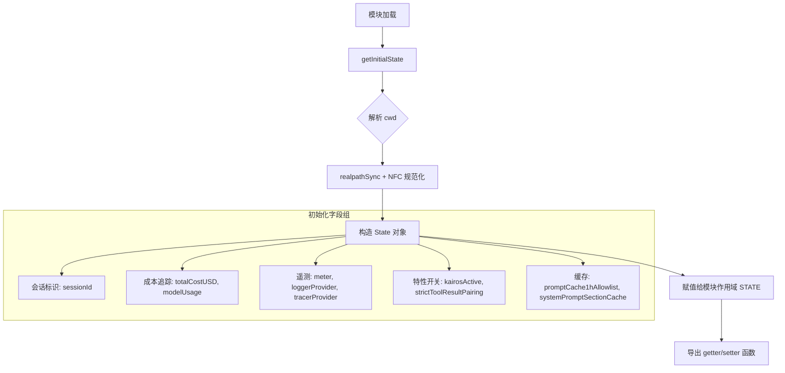
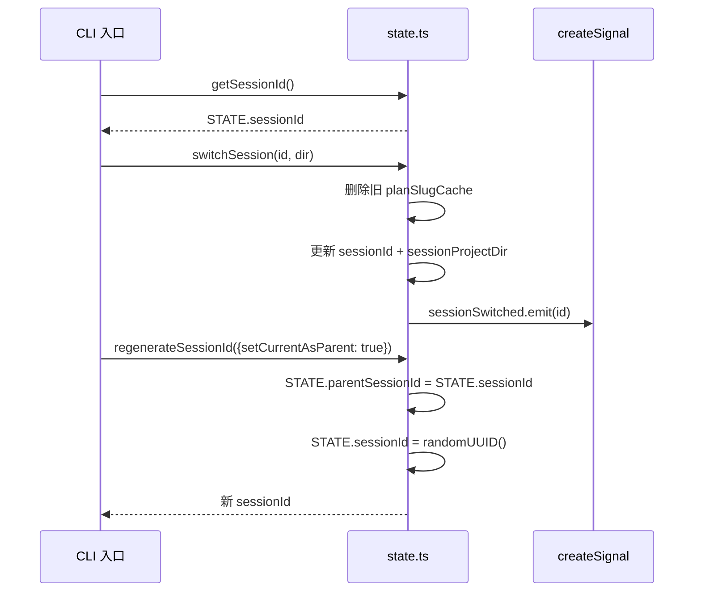

# 全局状态管理

## 概述

`src/bootstrap/state.ts` 是 Claude Code 的全局状态管理中心，采用单例模式集中管理会话生命周期内的所有运行时状态。该模块作为导入 DAG 的叶子节点，不依赖任何业务模块，为 CLI 会话、子代理、远程模式等场景提供统一的状态访问接口。核心设计原则：**谨慎添加全局状态**、**原子性更新关联字段**、**模块作用域隔离**。

---

## 设计原理

### 状态管理哲学

全局状态是必要的恶。该模块在文件头部明确标注 `DO NOT ADD MORE STATE HERE - BE JUDICIOUS WITH GLOBAL STATE`，强调状态膨胀会带来测试困难、隐式耦合和并发风险。每个状态字段的添加都需权衡：

1. **跨模块共享必要性**：是否有多处访问需求
2. **生命周期一致性**：是否与会话生命周期绑定
3. **测试隔离可行性**：是否可通过 `resetStateForTests()` 清理

### 单例模式

```typescript
const STATE: State = getInitialState()  // src/bootstrap/state.ts:429
```

模块加载时初始化唯一的 `STATE` 对象，所有访问通过 getter/setter 函数，确保：
- **单一真相来源**：避免多实例状态漂移
- **封装访问逻辑**：setter 可添加校验、副作用、事件发射
- **测试可控**：`resetStateForTests()` 可重置到初始状态

### 原子性更新

关联字段必须同步更新，防止中间状态：

```typescript
export function switchSession(
  sessionId: SessionId,
  projectDir: string | null = null,
): void {
  STATE.planSlugCache.delete(STATE.sessionId)
  STATE.sessionId = sessionId
  STATE.sessionProjectDir = projectDir
  sessionSwitched.emit(sessionId)
}
```

`sessionId` 和 `sessionProjectDir` 绑定更新，无独立 setter，避免 CC-34 漏洞。

---

## 实现原理

### 状态初始化流程



### 核心函数调用链



### 关键函数

| 函数 | 行号 | 职责 |
|------|------|------|
| `getInitialState()` | 260-426 | 构造初始 State 对象，处理 cwd 符号链接解析 |
| `switchSession()` | 468-479 | 原子切换会话，发射 sessionSwitched 信号 |
| `regenerateSessionId()` | 435-450 | 生成新 sessionId，可选设置 parentSessionId |
| `resetStateForTests()` | 919-930 | 测试专用重置，恢复初始状态 |
| `setMeter()` | 948-987 | 初始化 OpenTelemetry Meter 和所有 Counter |

---

## 功能展开

### 1. 会话状态管理

管理会话标识和项目目录：

```typescript
sessionId: SessionId                    // 当前会话 UUID
parentSessionId: SessionId | undefined  // 父会话 ID（plan mode -> implementation）
sessionProjectDir: string | null        // 会话文件所在目录
projectRoot: string                     // 稳定项目根目录（不受 worktree 切换影响）
originalCwd: string                     // 启动时的工作目录
cwd: string                             // 当前工作目录
```

**关键操作**：

- `getSessionId()` / `switchSession()` - 会话切换 `src/bootstrap/state.ts:431-479`
- `getProjectRoot()` - 获取稳定项目根（不随 worktree 变化）`src/bootstrap/state.ts:511-513`
- `regenerateSessionId({setCurrentAsParent: true})` - 创建子会话时设置父 ID `src/bootstrap/state.ts:435-450`

**会话切换信号**：

```typescript
const sessionSwitched = createSignal<[id: SessionId]>()
export const onSessionSwitch = sessionSwitched.subscribe
```

外部模块可订阅会话切换事件，如 `concurrentSessions.ts` 同步 PID 文件。

### 2. 成本与性能追踪

实时追踪 API 调用成本和性能指标：

```typescript
totalCostUSD: number                    // 累计成本（美元）
totalAPIDuration: number                // API 调用总耗时（含重试）
totalAPIDurationWithoutRetries: number  // API 调用耗时（不含重试）
totalToolDuration: number               // 工具执行耗时
modelUsage: { [modelName: string]: ModelUsage }  // 按模型的用量统计
```

**Turn 级别追踪**：

```typescript
turnHookDurationMs: number       // 本轮 Hook 耗时
turnToolDurationMs: number       // 本轮工具耗时
turnClassifierDurationMs: number // 本轮分类器耗时
turnToolCount: number            // 本轮工具调用次数
```

**关键函数**：

- `addToTotalCostState(cost, modelUsage, model)` - 累加成本 `src/bootstrap/state.ts:557-564`
- `getTotalInputTokens()` / `getTotalOutputTokens()` - 汇总 token 用量 `src/bootstrap/state.ts:704-710`
- `getTotalCacheReadInputTokens()` - 缓存读取 token `src/bootstrap/state.ts:712-714`
- `snapshotOutputTokensForTurn(budget)` - 记录 turn 开始时的输出 token `src/bootstrap/state.ts:733-737`

**Token Budget 管理**：

```typescript
let outputTokensAtTurnStart = 0
let currentTurnTokenBudget: number | null = null
let budgetContinuationCount = 0
```

支持预算续写计数，用于控制单次对话的输出长度。

### 3. 特性开关与模式状态

控制运行时行为特性：

```typescript
kairosActive: boolean              // Kairos 模式激活
strictToolResultPairing: boolean   // 严格工具结果配对（HFI 模式）
isInteractive: boolean             // 交互式会话
isRemoteMode: boolean              // 远程模式
clientType: string                 // 客户端类型
```

**模式切换追踪**：

```typescript
hasExitedPlanMode: boolean              // 是否已退出 plan mode
needsPlanModeExitAttachment: boolean    // 需要发送 plan_mode_exit 附件
needsAutoModeExitAttachment: boolean    // 需要发送 auto_mode_exit 附件

export function handlePlanModeTransition(fromMode: string, toMode: string): void
export function handleAutoModeTransition(fromMode: string, toMode: string): void
```

`src/bootstrap/state.ts:1349-1399` 实现模式转换逻辑，防止快速切换时发送重复附件。

**权限与会话状态**：

```typescript
sessionBypassPermissionsMode: boolean   // 绕过权限检查
sessionTrustAccepted: boolean           // 会话级信任已接受
sessionPersistenceDisabled: boolean     // 禁用会话持久化
```

### 4. 缓存状态管理

多层缓存状态协调：

```typescript
// Prompt Cache 1h TTL
promptCache1hAllowlist: string[] | null   // GrowthBook 白名单
promptCache1hEligible: boolean | null     // 用户资格

// Beta Header Latches（粘性开关，防止 cache bust）
afkModeHeaderLatched: boolean | null      // AFK 模式 header
fastModeHeaderLatched: boolean | null     // 快速模式 header
cacheEditingHeaderLatched: boolean | null // 缓存编辑 header
thinkingClearLatched: boolean | null      // 清除 thinking header
```

**粘性开关机制**：一旦激活，后续模式切换不再更改 header，避免破坏服务端 prompt cache。

```typescript
export function clearBetaHeaderLatches(): void {
  STATE.afkModeHeaderLatched = null
  STATE.fastModeHeaderLatched = null
  STATE.cacheEditingHeaderLatched = null
  STATE.thinkingClearLatched = null
}
```

在 `/clear` 和 `/compact` 时重置，让新对话重新评估 header。

**系统 Prompt 缓存**：

```typescript
systemPromptSectionCache: Map<string, string | null>
cachedClaudeMdContent: string | null
```

`src/bootstrap/state.ts:1207-1213` 缓存 CLAUDE.md 内容，打破 `yoloClassifier → claudemd → filesystem → permissions` 循环。

### 5. OpenTelemetry 集成

完整的可观测性支持：

```typescript
// Providers
meterProvider: MeterProvider | null
loggerProvider: LoggerProvider | null
tracerProvider: BasicTracerProvider | null

// Meter 和 Counters
meter: Meter | null
sessionCounter: AttributedCounter | null
locCounter: AttributedCounter | null
prCounter: AttributedCounter | null
commitCounter: AttributedCounter | null
costCounter: AttributedCounter | null
tokenCounter: AttributedCounter | null
codeEditToolDecisionCounter: AttributedCounter | null
activeTimeCounter: AttributedCounter | null
```

**Counter 初始化**：

```typescript
export function setMeter(
  meter: Meter,
  createCounter: (name: string, options: MetricOptions) => AttributedCounter,
): void {
  STATE.meter = meter
  STATE.sessionCounter = createCounter('claude_code.session.count', {...})
  STATE.locCounter = createCounter('claude_code.lines_of_code.count', {...})
  // ... 更多 counters
}
```

`src/bootstrap/state.ts:948-987` 初始化所有遥测计数器。

---

## 核心数据结构

### State 类型定义

```typescript
type State = {
  // 会话标识
  sessionId: SessionId
  parentSessionId: SessionId | undefined
  sessionProjectDir: string | null
  projectRoot: string
  originalCwd: string
  cwd: string
  
  // 成本追踪
  totalCostUSD: number
  totalAPIDuration: number
  totalAPIDurationWithoutRetries: number
  totalToolDuration: number
  modelUsage: { [modelName: string]: ModelUsage }
  
  // Turn 级别统计
  turnHookDurationMs: number
  turnToolDurationMs: number
  turnClassifierDurationMs: number
  turnToolCount: number
  turnHookCount: number
  turnClassifierCount: number
  
  // 特性开关
  kairosActive: boolean
  strictToolResultPairing: boolean
  isInteractive: boolean
  isRemoteMode: boolean
  
  // 缓存状态
  promptCache1hAllowlist: string[] | null
  promptCache1hEligible: boolean | null
  afkModeHeaderLatched: boolean | null
  fastModeHeaderLatched: boolean | null
  cacheEditingHeaderLatched: boolean | null
  thinkingClearLatched: boolean | null
  systemPromptSectionCache: Map<string, string | null>
  cachedClaudeMdContent: string | null
  
  // OpenTelemetry
  meter: Meter | null
  meterProvider: MeterProvider | null
  loggerProvider: LoggerProvider | null
  tracerProvider: BasicTracerProvider | null
  sessionCounter: AttributedCounter | null
  // ... 更多 counters
  
  // Hook 注册
  registeredHooks: Partial<Record<HookEvent, RegisteredHookMatcher[]>> | null
  
  // 技能调用追踪
  invokedSkills: Map<string, InvokedSkillInfo>
  
  // 慢操作追踪
  slowOperations: Array<{
    operation: string
    durationMs: number
    timestamp: number
  }>
}
```

### AttributedCounter

```typescript
export type AttributedCounter = {
  add(value: number, additionalAttributes?: Attributes): void
}
```

### InvokedSkillInfo

```typescript
export type InvokedSkillInfo = {
  skillName: string
  skillPath: string
  content: string
  invokedAt: number
  agentId: string | null
}
```

### SessionCronTask

```typescript
export type SessionCronTask = {
  id: string
  cron: string
  prompt: string
  createdAt: number
  recurring?: boolean
  agentId?: string
}
```

---

## 组合使用

### 与 cost-tracker 协作

```typescript
// cost-tracker.ts 调用
import { addToTotalCostState, getTotalCostUSD } from 'src/bootstrap/state.js'

function trackCost(usage: Usage, model: string) {
  const cost = calculateCost(usage)
  addToTotalCostState(cost, usage, model)
}
```

### 与 REPL 协作

```typescript
// REPL.tsx 会话切换
import { switchSession, onSessionSwitch } from 'src/bootstrap/state.js'

function clearContext() {
  const newId = regenerateSessionId({ setCurrentAsParent: true })
  loadSession(newId)
}

// 订阅会话切换
onSessionSwitch((id) => {
  updatePidFile(id)
})
```

### 与 context.ts 协作

```typescript
// context.ts 缓存 CLAUDE.md
import { setCachedClaudeMdContent, getCachedClaudeMdContent } from 'src/bootstrap/state.js'

async function loadClaudeMd() {
  if (getCachedClaudeMdContent()) {
    return getCachedClaudeMdContent()
  }
  const content = await readFile('CLAUDE.md')
  setCachedClaudeMdContent(content)
  return content
}
```

### 与 OTel 初始化协作

```typescript
// main.tsx 初始化遥测
import { setMeter, setMeterProvider, setLoggerProvider, setTracerProvider } from 'src/bootstrap/state.js'

async function initTelemetry() {
  const meterProvider = createMeterProvider()
  const loggerProvider = createLoggerProvider()
  const tracerProvider = createTracerProvider()
  
  setMeterProvider(meterProvider)
  setLoggerProvider(loggerProvider)
  setTracerProvider(tracerProvider)
  
  const meter = meterProvider.getMeter('claude-code')
  setMeter(meter, createCounter)
}
```

---

## 小结

### 设计亮点

1. **谨慎的状态管理**：通过显式注释和代码审查限制状态膨胀
2. **原子性更新**：关联字段绑定更新，防止中间状态漏洞
3. **模块隔离**：作为 DAG 叶子节点，无循环依赖风险
4. **测试友好**：`resetStateForTests()` 提供干净的测试重置
5. **事件驱动**：`createSignal` 实现会话切换通知机制
6. **缓存一致性**：粘性开关防止 prompt cache bust

### 演进方向

1. **状态分片**：考虑按功能域拆分，减少单一 STATE 对象大小
2. **持久化策略**：当前仅内存状态，可探索选择性持久化
3. **并发安全**：多子代理场景下可能需要更细粒度的锁
4. **类型安全增强**：考虑使用 branded type 区分不同 ID 类型

---

## 代码引用

| 功能 | 位置 |
|------|------|
| State 类型定义 | `src/bootstrap/state.ts:45-257` |
| 初始状态构造 | `src/bootstrap/state.ts:260-426` |
| 单例实例 | `src/bootstrap/state.ts:429` |
| 会话切换 | `src/bootstrap/state.ts:468-479` |
| 成本累加 | `src/bootstrap/state.ts:557-564` |
| Token 汇总 | `src/bootstrap/state.ts:704-718` |
| OTel 初始化 | `src/bootstrap/state.ts:948-987` |
| 模式转换 | `src/bootstrap/state.ts:1349-1399` |
| 缓存 Header 重置 | `src/bootstrap/state.ts:1744-1749` |
| 测试重置 | `src/bootstrap/state.ts:919-930` |
