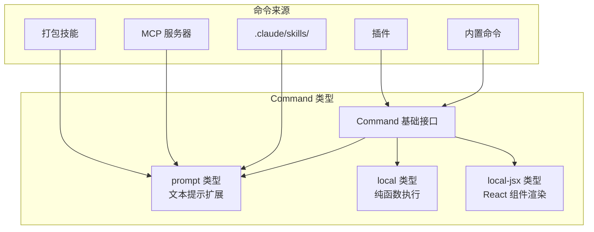
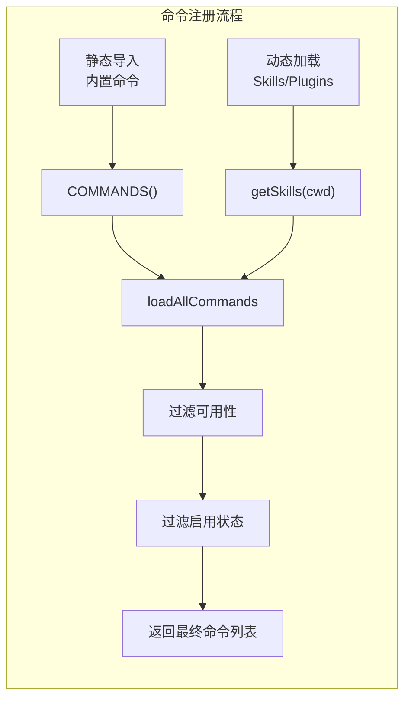
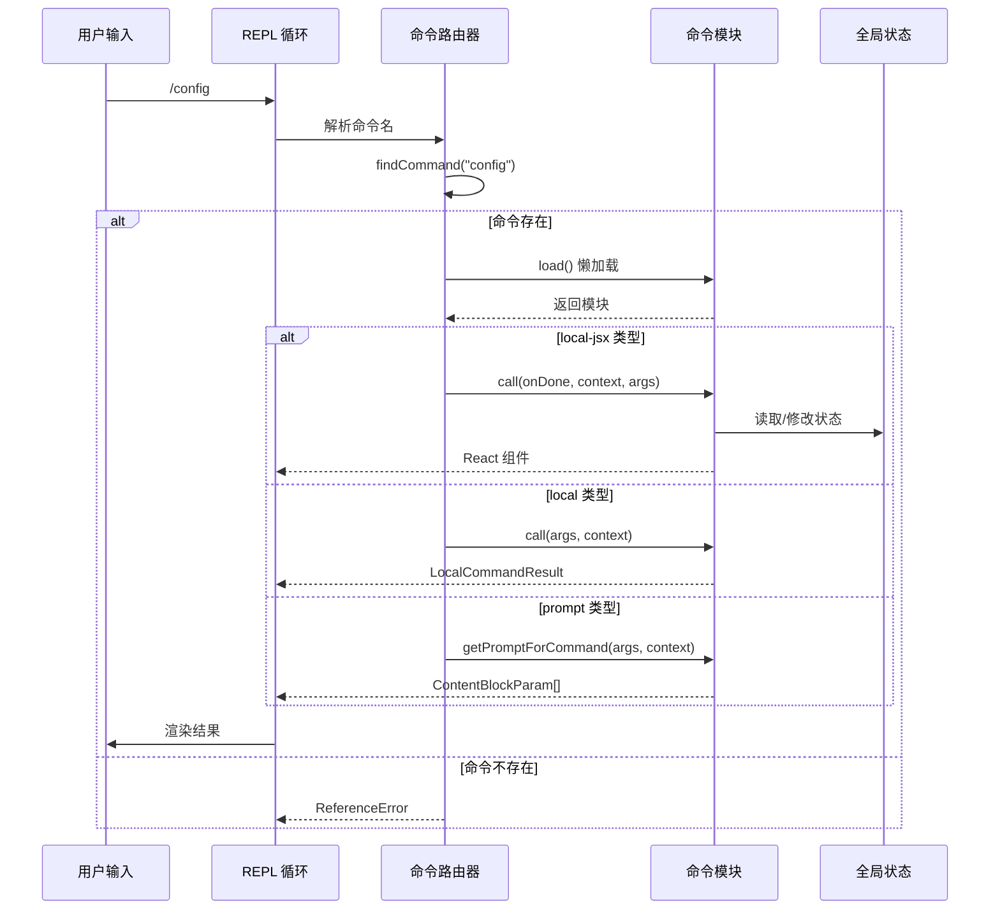

# 45. CLI Commands

## 1. 概述

Claude Code 的命令系统采用**子命令模式 (Subcommand Pattern)**，将功能拆分为独立的命令模块，通过统一的命令路由器进行分发。每个命令是类型化的独立单元，支持懒加载、条件启用、多环境适配。

### 命令类型体系



### 设计模式特点

| 特性 | 实现方式 |
|------|----------|
| **懒加载** | `load()` 返回动态 import，延迟加载实现代码 |
| **条件启用** | `isEnabled()` 运行时判断是否显示 |
| **多环境** | `availability` 声明 auth/provider 依赖 |
| **别名支持** | `aliases` 数组支持多名称触发 |
| **参数提示** | `argumentHint` 显示参数格式 |
| **即时执行** | `immediate` 跳过队列立即执行 |

---

## 2. 设计原理

### 2.1 子命令独立模块

每个命令是独立文件，通过 `index.ts` 导出元数据，实现懒加载：

```
src/commands/
├── config/
│   ├── index.ts      # 元数据声明
│   └── config.ts     # 实现代码（懒加载）
├── model/
│   ├── index.ts
│   └── model.ts
└── doctor/
    ├── index.ts
    └── doctor.ts
```

**元数据声明示例** (`src/commands/config/index.ts:3-9`)：

```typescript
const config = {
  aliases: ['settings'],
  type: 'local-jsx',
  name: 'config',
  description: 'Open config panel',
  load: () => import('./config.js'),
} satisfies Command
```

### 2.2 参数解析策略

CLI 参数解析在 `src/bridge/bridgeMain.ts:1737` 的 `parseArgs` 函数中实现：

- 支持长选项 (`--verbose`) 和短选项 (`-v`)
- 支持 `--flag value` 和 `--flag=value` 两种格式
- 特性门控标志 (`feature('KAIROS')`) 控制选项可见性
- 参数交叉验证（如 `--capacity` 与 `--spawn` 的兼容性检查）

### 2.3 命令注册与发现

`src/commands.ts` 是命令注册中心：



**关键函数** (`src/commands.ts:476-517`)：

| 函数 | 职责 |
|------|------|
| `COMMANDS()` | 返回内置命令数组（memoized） |
| `getSkills(cwd)` | 加载 skills/plugins/bundled skills |
| `loadAllCommands(cwd)` | 合并所有命令源（memoized by cwd） |
| `getCommands(cwd)` | 应用过滤后返回可用命令 |
| `findCommand(name, commands)` | 按名称或别名查找命令 |
## 3. 实现原理

### 3.1 命令分发流程



### 3.2 命令类型执行差异

| 类型 | 执行方式 | 返回值 | 适用场景 |
|------|----------|--------|----------|
| `prompt` | 扩展对话上下文 | `ContentBlockParam[]` | 技能、工作流、提示模板 |
| `local` | 纯函数执行 | `{type: 'text', value}` | 简单操作（vim 切换、compact） |
| `local-jsx` | React 组件渲染 | `React.ReactNode` | 交互式 UI（config 面板、doctor） |

### 3.3 命令上下文

`LocalJSXCommandContext` (`src/types/command.ts:80-98`) 提供命令执行所需的环境：

```typescript
type LocalJSXCommandContext = ToolUseContext & {
  canUseTool?: CanUseToolFn
  setMessages: (updater: (prev: Message[]) => Message[]) => void
  options: {
    dynamicMcpConfig?: Record<string, ScopedMcpServerConfig>
    ideInstallationStatus: IDEExtensionInstallationStatus | null
    theme: ThemeName
  }
  onChangeAPIKey: () => void
  resume?: (sessionId: UUID, log: LogOption, entrypoint: ResumeEntrypoint) => Promise<void>
}
```

---

## 4. 功能展开

### 4.1 核心子命令

#### `/config` - 配置管理

| 属性 | 值 |
|------|-----|
| 路径 | `src/commands/config/index.ts` |
| 类型 | `local-jsx` |
| 别名 | `settings` |
| 功能 | 打开配置面板，管理 MCP、权限、主题等 |

#### `/model` - 模型选择

| 属性 | 值 |
|------|-----|
| 路径 | `src/commands/model/index.ts:5-16` |
| 类型 | `local-jsx` |
| 功能 | 切换 AI 模型，动态显示当前模型名 |
| 特性 | `immediate` 根据条件即时执行 |

```typescript
export default {
  type: 'local-jsx',
  name: 'model',
  get description() {
    return `Set the AI model (currently ${renderModelName(getMainLoopModel())})`
  },
  get immediate() {
    return shouldInferenceConfigCommandBeImmediate()
  },
}
```

#### `/doctor` - 诊断工具

| 属性 | 值 |
|------|-----|
| 路径 | `src/commands/doctor/index.ts` |
| 类型 | `local-jsx` |
| 功能 | 诊断安装和配置问题 |
| 条件 | 可通过 `DISABLE_DOCTOR_COMMAND` 禁用 |

#### `/resume` - 会话恢复

| 属性 | 值 |
|------|-----|
| 路径 | `src/commands/resume/index.ts` |
| 类型 | `local-jsx` |
| 别名 | `continue` |
| 参数 | `[conversation id or search term]` |

### 4.2 配置管理命令组

#### `/login` - 登录

| 属性 | 值 |
|------|-----|
| 路径 | `src/commands/login/index.ts` |
| 类型 | `local-jsx` |
| 条件 | 可通过 `DISABLE_LOGIN_COMMAND` 禁用 |
| 描述 | 动态显示当前认证状态 |

#### `/logout` - 登出

| 属性 | 值 |
|------|-----|
| 路径 | `src/commands/logout/index.ts` |
| 类型 | `local-jsx` |
| 条件 | 可通过 `DISABLE_LOGOUT_COMMAND` 禁用 |

#### `/mcp` - MCP 管理

| 属性 | 值 |
|------|-----|
| 路径 | `src/commands/mcp/index.ts` |
| 类型 | `local-jsx` |
| 即时 | `true` |
| 参数 | `[enable|disable [server-name]]` |
### 4.3 会话管理命令组

#### `/compact` - 上下文压缩

| 属性 | 值 |
|------|-----|
| 路径 | `src/commands/compact/index.ts` |
| 类型 | `local` |
| 非交互 | 支持 |
| 功能 | 清空对话但保留摘要 |
| 条件 | 可通过 `DISABLE_COMPACT` 禁用 |

#### `/cost` - 成本统计

| 属性 | 值 |
|------|-----|
| 路径 | `src/commands/cost/index.ts` |
| 类型 | `local` |
| 非交互 | 支持 |
| 可见性 | Claude AI 订阅者隐藏（Ant 除外） |

#### `/session` - 远程会话

| 属性 | 值 |
|------|-----|
| 路径 | `src/commands/session/index.ts` |
| 类型 | `local-jsx` |
| 别名 | `remote` |
| 条件 | 仅 Remote 模式启用 |

### 4.4 交互模式命令

#### `/vim` - Vim 模式

| 属性 | 值 |
|------|-----|
| 路径 | `src/commands/vim/index.ts` |
| 类型 | `local` |
| 非交互 | 不支持 |
| 功能 | 切换 Vim/Normal 编辑模式 |

#### `/help` - 帮助信息

| 属性 | 值 |
|------|-----|
| 路径 | `src/commands/help/index.ts` |
| 类型 | `local-jsx` |
| 功能 | 显示可用命令列表 |

#### `/context` - 上下文可视化

| 属性 | 值 |
|------|-----|
| 路径 | `src/commands/context/index.ts:4-24` |
| 类型 | `local-jsx` (交互) / `local` (非交互) |
| 条件 | 交互模式版本 `isEnabled: () => !getIsNonInteractiveSession()` |

### 4.5 扩展命令

#### `/init` - 项目初始化

| 属性 | 值 |
|------|-----|
| 路径 | `src/commands/init.ts` |
| 类型 | `prompt` |
| 功能 | 生成 CLAUDE.md、skills、hooks |
| 特性 | 新版本支持多阶段交互式创建 |

#### `/review` / `/ultrareview` - 代码审查

| 属性 | review | ultrareview |
|------|--------|-------------|
| 路径 | `src/commands/review.ts` | 同文件 |
| 类型 | `prompt` | `local-jsx` |
| 功能 | 本地 PR 审查 | 远程深度审查 |

#### `/tasks` - 后台任务

| 属性 | 值 |
|------|-----|
| 路径 | `src/commands/tasks/index.ts` |
| 类型 | `local-jsx` |
| 别名 | `bashes` |
| 功能 | 管理后台 Bash 任务 |

#### `/upgrade` - 升级订阅

| 属性 | 值 |
|------|-----|
| 路径 | `src/commands/upgrade/index.ts` |
| 类型 | `local-jsx` |
| 可用性 | `['claude-ai']` - 仅订阅者可见 |
| 条件 | 非企业用户 |
---

## 5. 核心数据结构

### 5.1 Command 接口

`src/types/command.ts:175-206`：

```typescript
export type CommandBase = {
  availability?: CommandAvailability[]    // auth/provider 依赖
  description: string                     // 命令描述
  hasUserSpecifiedDescription?: boolean   // 用户自定义描述
  isEnabled?: () => boolean               // 运行时启用判断
  isHidden?: boolean                      // 隐藏命令
  name: string                            // 命令名
  aliases?: string[]                      // 别名
  isMcp?: boolean                         // MCP 命令标记
  argumentHint?: string                   // 参数提示
  whenToUse?: string                      // 使用场景说明
  version?: string                        // 版本号
  disableModelInvocation?: boolean        // 禁止模型调用
  userInvocable?: boolean                 // 用户可触发
  loadedFrom?: 'skills' | 'plugin' | 'bundled' | 'mcp' | ...
  kind?: 'workflow'                       // 工作流标记
  immediate?: boolean                     // 即时执行
  isSensitive?: boolean                   // 敏感命令
  userFacingName?: () => string           // 显示名称
}

export type Command = CommandBase &
  (PromptCommand | LocalCommand | LocalJSXCommand)
```

### 5.2 PromptCommand 类型

`src/types/command.ts:25-57`：

```typescript
export type PromptCommand = {
  type: 'prompt'
  progressMessage: string              // 进度提示
  contentLength: number                // 内容长度（token 估算）
  argNames?: string[]                  // 参数名
  allowedTools?: string[]              // 允许的工具
  model?: string                       // 指定模型
  source: SettingSource | 'builtin' | 'mcp' | 'plugin' | 'bundled'
  disableNonInteractive?: boolean      // 禁用非交互模式
  hooks?: HooksSettings                // 注册的钩子
  skillRoot?: string                   // 技能根目录
  context?: 'inline' | 'fork'          // 执行上下文
  agent?: string                       // fork 时使用的 agent 类型
  effort?: EffortValue                 // 努力级别
  paths?: string[]                     // 文件路径匹配
  getPromptForCommand(args, context): Promise<ContentBlockParam[]>
}
```

### 5.3 命令可用性类型

`src/types/command.ts:169-174`：

```typescript
export type CommandAvailability =
  | 'claude-ai'    // Claude AI 订阅者 (Pro/Max/Team/Enterprise)
  | 'console'      // Console API key 用户 (api.anthropic.com)
```

---

## 6. 组合使用

### 6.1 与配置系统协作

命令可通过 `availability` 声明对认证状态的依赖：

```typescript
// src/commands/upgrade/index.ts:5-14
const upgrade = {
  type: 'local-jsx',
  name: 'upgrade',
  availability: ['claude-ai'],  // 仅 claude.ai 订阅者可见
  isEnabled: () =>
    !isEnvTruthy(process.env.DISABLE_UPGRADE_COMMAND) &&
    getSubscriptionType() !== 'enterprise',
}
```

`meetsAvailabilityRequirement()` (`src/commands.ts:417-443`) 在过滤链中首先执行：

```typescript
export function meetsAvailabilityRequirement(cmd: Command): boolean {
  if (!cmd.availability || cmd.availability.length === 0) return true
  for (const a of cmd.availability) {
    switch (a) {
      case 'claude-ai':
        if (isClaudeAISubscriber()) return true
        break
      case 'console':
        if (!isClaudeAISubscriber() && !isUsing3PServices() && isFirstPartyAnthropicBaseUrl())
          return true
        break
    }
  }
  return false
}
```

### 6.2 与会话管理协作

#### Remote 模式命令过滤

`src/commands.ts:619-636` 定义了 Remote 安全命令列表：

```typescript
export const REMOTE_SAFE_COMMANDS: Set<Command> = new Set([
  session,   // 显示远程会话 URL/QR
  exit,      // 退出 TUI
  clear,     // 清屏
  help,      // 帮助
  theme,     // 主题切换
  color,     // Agent 颜色
  vim,       // Vim 模式
  cost,      // 成本统计
  usage,     // 使用信息
  copy,      // 复制消息
])
```

#### Bridge 模式命令过滤

`src/commands.ts:651-676`：

```typescript
export const BRIDGE_SAFE_COMMANDS: Set<Command> = new Set([
  compact, clear, cost, summary, releaseNotes, files
])

export function isBridgeSafeCommand(cmd: Command): boolean {
  if (cmd.type === 'local-jsx') return false   // 阻止 Ink UI
  if (cmd.type === 'prompt') return true       // 允许技能
  return BRIDGE_SAFE_COMMANDS.has(cmd)         // 白名单 local 命令
}
```

### 6.3 与上下文系统协作

`isInteractive` 和 `clientType` 存储在全局状态中：

`src/bootstrap/state.ts:71-80`：

```typescript
type State = {
  isInteractive: boolean
  clientType: string
}
```

访问函数 `src/bootstrap/state.ts:1057-1074`：

```typescript
export function getIsNonInteractiveSession(): boolean {
  return !STATE.isInteractive
}

export function getIsInteractive(): boolean {
  return STATE.isInteractive
}

export function getClientType(): string {
  return STATE.clientType
}
```

命令根据交互模式调整行为：

- `context` 命令提供两个版本：交互模式使用 `local-jsx` 渲染网格图，非交互模式使用 `local` 输出文本
- `vim` 命令不支持非交互模式（`supportsNonInteractive: false`）
- `session` 命令仅在 Remote 模式启用（`isEnabled: () => getIsRemoteMode()`）

---

## 7. 小结

Claude Code 的命令系统体现了现代 CLI 工具的演进方向：

1. **类型化命令** - 三种命令类型满足不同场景需求
2. **懒加载设计** - 元数据与实现分离，减少启动开销
3. **条件可见性** - 多层过滤机制（availability、isEnabled、isHidden）
4. **环境适配** - Remote/Bridge 模式的安全命令列表
5. **扩展机制** - 支持 Skills、Plugins、MCP 等多种扩展来源

### 代码证据索引

| 功能 | 文件路径 | 关键行 |
|------|----------|--------|
| 命令注册中心 | `src/commands.ts` | 258-346 |
| Command 类型定义 | `src/types/command.ts` | 25-216 |
| 参数解析 | `src/bridge/bridgeMain.ts` | 1737-1849 |
| 命令可用性过滤 | `src/commands.ts` | 417-443 |
| Remote 安全命令 | `src/commands.ts` | 619-636 |
| Bridge 安全命令 | `src/commands.ts` | 651-676 |
| 交互状态管理 | `src/bootstrap/state.ts` | 1057-1074 |
