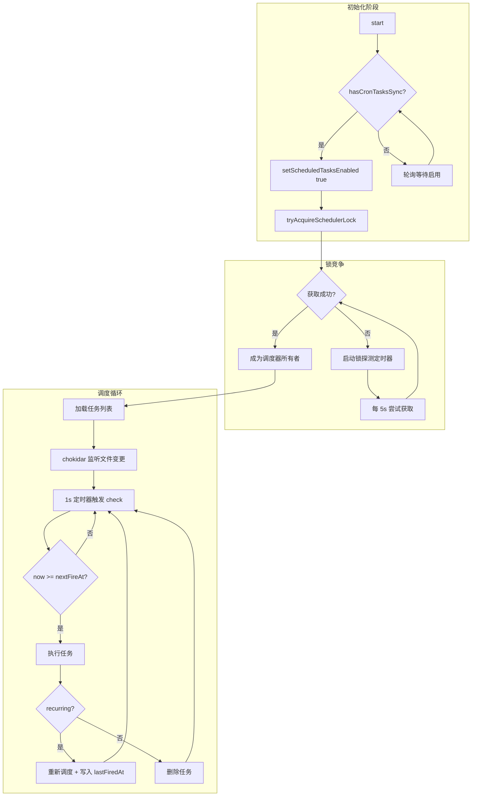
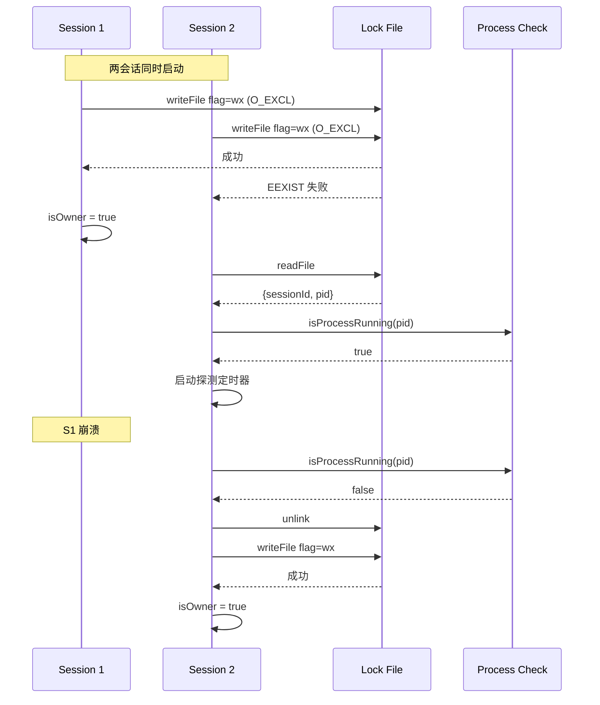

# 定时任务系统 (Cron Tasks)

## 概述

定时任务系统为 CLI 提供可靠的 Cron 表达式解析与任务调度能力，支持持久化任务与会话级临时任务两种模式，通过分布式锁避免多会话重复执行，并采用抖动策略缓解 Thundering Herd 问题。

**设计目标**：
- 标准化 Cron 表达式解析（5 字段语法）
- 持久化任务跨进程存活
- 会话级临时任务无需磁盘写入
- 多会话协作时的锁竞争处理
- 集群级负载分散（抖动策略）

**代码入口**：
- `src/utils/cron.ts` — Cron 表达式解析
- `src/utils/cronTasks.ts` — 任务管理、抖动计算
- `src/utils/cronTasksLock.ts` — 分布式锁
- `src/utils/cronScheduler.ts` — 调度器核心

---

## 设计原理

### Cron 表达式解析

采用标准 5 字段语法（本地时区）：

```
minute hour day-of-month month day-of-week
  0-59   0-23     1-31      1-12      0-6 (0=Sunday)
```

**支持语法**：
- 通配符 `*`
- 步进 `*/N`
- 范围 `N-M`、`N-M/S`
- 列表 `N,M,...`

**不支持**：`L`、`W`、`?`、名称别名（如 `JAN`）

**关键决策**：
1. **本地时区**：所有时间按进程本地时区解释，`0 9 * * *` 表示本地 9 点
2. **DST 处理**：夏令时跳跃日，gap 小时的任务跳过，wildcard 小时触发一次
3. **dayOfMonth/dayOfWeek 语义**：两者均约束时，任一匹配即触发（OR 语义）

### 抖动策略设计

**问题**：多用户设置相同 Cron（如 `0 * * * *`）会导致整点推理请求峰值。

**解决方案**：

| 任务类型 | 抖动方向 | 计算方式 | 配置参数 |
|---------|---------|---------|---------|
| 单次任务 | **提前** | 根据 taskId 哈希在 `[floor, max]` 区间均匀分布 | `oneShotMaxMs`, `oneShotFloorMs`, `oneShotMinuteMod` |
| 周期任务 | **延后** | 按间隔比例延迟，上限封顶 | `recurringFrac`, `recurringCapMs` |

**单次任务抖动**：
- 仅在分钟边界命中 `minute % oneShotMinuteMod === 0` 时生效
- 默认 `oneShotMinuteMod: 30` → 只对 `:00` 和 `:30` 抖动
- 提前范围：`[floor, max)` 毫秒

**周期任务抖动**：
- 延迟 = `min(frac × interval × jitterFrac, cap)`
- 小时级任务默认分散到 `[:00, :06)`，分钟级任务仅偏移几秒

**哈希函数**：`jitterFrac(taskId) = parseInt(taskId[0:8], 16) / 0x100000000`
- 任务 ID 为 8 字符 hex，解析为 `[0, 1)` 均匀分布
- 确定性：相同 taskId 始终产生相同抖动

---

## 实现原理

### 任务调度流程



### 锁机制实现



**锁文件格式**：
```json
{
  "sessionId": "uuid-string",
  "pid": 12345,
  "acquiredAt": 1714022400000
}
```

**关键逻辑**：
1. 原子创建：`writeFile(path, body, { flag: 'wx' })` — O_EXCL
2. 幂等重入：同一 sessionId 可重获锁（更新 PID）
3. 存活探测：检查 PID 是否仍在运行
4. 陈旧恢复：PID 死亡时，删除并重试创建
5. 清理注册：`registerCleanup` 确保退出时释放锁

---

## 功能展开

### Cron 解析

**核心函数**：`parseCronExpression(expr: string): CronFields | null`

```typescript
type CronFields = {
  minute: number[]    // [0, 5, 10, ..., 55]
  hour: number[]      // [9]
  dayOfMonth: number[]
  month: number[]
  dayOfWeek: number[]
}
```

**解析流程**：
1. 按空白分割为 5 字段
2. 每字段按逗号拆分为 parts
3. 对每个 part：匹配通配符/范围/单值语法
4. 合并去重并排序

**下次执行计算**：`computeNextCronRun(fields, from): Date | null`
- 从 `from` 的下一分钟开始逐分钟扫描
- 按 month → day → hour → minute 逐级检查
- 月/日不匹配时跳转到下一单位起点
- 最多扫描 366 天

### 任务调度

**任务分类**：

| 类型 | 存储 | 生命周期 | 用途 |
|-----|------|---------|------|
| 持久化任务 | `.claude/scheduled_tasks.json` | 跨进程存活 | 用户预约提醒 |
| 会话任务 | 内存 `sessionCronTasks` | 进程结束销毁 | 临时性自动化 |
| 永久任务 | 同持久化，无过期 | 仅显式删除 | 系统内置任务 |

**任务 ID 生成**：`randomUUID().slice(0, 8)` — 8 字符 hex，足够区分最多 50 任务

**错过检测**：`findMissedTasks(tasks, now)`
- 任务创建时 `nextFireAt < now` 即为错过
- 仅单次任务会通知用户选择执行或放弃
- 周期任务错过时立即触发并重新调度

**过期清理**：
- 周期任务默认 7 天后过期（`recurringMaxAgeMs`）
- 永久任务（`permanent: true`）永不过期
- 过期任务触发后删除

### 锁机制

**竞争场景**：多 Claude 会话运行于同一项目目录

**解决策略**：
- 首个获取锁的会话成为调度器所有者
- 其他会话每 5 秒探测锁状态
- 所有者进程死亡后，探测者竞争接管

**错误处理**：
- 锁文件损坏 → 视为陈旧，尝试恢复
- 创建时目录不存在 → 递归创建后重试
- 释放时文件已删除 → 静默忽略

### 抖动策略

**周期任务抖动**：`jitteredNextCronRunMs(cron, from, taskId, cfg)`

```
t1 = nextCronRunMs(cron, from)      // 原始下次执行时间
t2 = nextCronRunMs(cron, t1)        // 再下一次执行时间
interval = t2 - t1                   // 执行间隔
jitter = min(jitterFrac(taskId) * frac * interval, cap)
return t1 + jitter
```

**单次任务抖动**：`oneShotJitteredNextCronRunMs(cron, from, taskId, cfg)`

```
t1 = nextCronRunMs(cron, from)
if (t1.getMinutes() % minuteMod !== 0) return t1  // 非热点分钟不抖动
lead = floor + jitterFrac(taskId) * (max - floor)  // 提前量
return max(t1 - lead, from)                         // 不早于创建时间
```

**配置参数**：

```typescript
type CronJitterConfig = {
  recurringFrac: number      // 0.1 - 延迟比例
  recurringCapMs: number     // 15*60*1000 - 延迟上限 15 分钟
  oneShotMaxMs: number       // 90*1000 - 单次最大提前 90 秒
  oneShotFloorMs: number     // 0 - 单次最小提前
  oneShotMinuteMod: number   // 30 - 热点分钟检测周期
  recurringMaxAgeMs: number  // 7*24*60*60*1000 - 周期任务过期时间
}
```

---

## 核心数据结构

### CronTask 接口

```typescript
type CronTask = {
  id: string              // 8 字符 UUID 片段
  cron: string            // 5 字段 Cron 表达式
  prompt: string          // 触发时执行的提示词
  createdAt: number       // 创建时间戳 (epoch ms)
  lastFiredAt?: number    // 最近触发时间 (仅周期任务)
  recurring?: boolean     // 是否周期任务
  permanent?: boolean     // 是否永久任务 (不过期)
  durable?: boolean       // 运行时标记：false=会话任务
  agentId?: string        // 目标 Agent ID (多 Agent 场景)
}
```

### CronJitterConfig 定义

```typescript
const DEFAULT_CRON_JITTER_CONFIG: CronJitterConfig = {
  recurringFrac: 0.1,           // 延迟 10% 间隔
  recurringCapMs: 15 * 60 * 1000, // 最多延迟 15 分钟
  oneShotMaxMs: 90 * 1000,      // 最多提前 90 秒
  oneShotFloorMs: 0,            // 最少提前 0 秒
  oneShotMinuteMod: 30,         // 每 30 分钟检测热点
  recurringMaxAgeMs: 7 * 24 * 60 * 60 * 1000, // 7 天过期
}
```

### SchedulerLock 结构

```typescript
type SchedulerLock = {
  sessionId: string   // 会话标识
  pid: number         // 进程 ID
  acquiredAt: number  // 获取时间戳
}
```

---

## 组合使用

### 与 Hook 系统协作

```
CronCreate Tool
    │
    ▼
scheduled_tasks.json
    │
    ▼ (chokidar)
cronScheduler.check()
    │
    ▼ (触发时)
onFire(prompt)
    │
    ▼
消息队列 → Agent 执行
```

### 与会话管理协作

- **会话恢复**：`--resume` 恢复 sessionId，锁文件 PID 更新为新进程
- **会话级任务**：`durable: false` 创建的任务存于 `bootstrap/state.ts`
- **清理注册**：`registerCleanup` 确保锁释放和资源清理

### 与 Agent SDK 集成

SDK daemon 模式独立运行，无需 REPL：
- 显式传入 `dir` 和 `lockIdentity`
- 使用 `onFireTask` 回调获取完整任务信息
- 通过 `filter` 函数限定可见任务范围

---

## 小结

**设计取舍**：
- ✓ 标准 Cron 子集，避免复杂度
- ✓ 本地时区，贴近用户直觉
- ✓ 确定性抖动，相同任务行为一致
- ✓ 文件锁简单可靠，无需外部依赖
- ✗ 不支持时区指定，跨时区用户需注意
- ✗ 不支持年字段，超年度任务需其他方案

**演进方向**：
- 远程配置热更新（GrowthBook 集成已支持）
- 更精细的抖动控制（毫秒级分布）
- 任务执行状态持久化与重试
