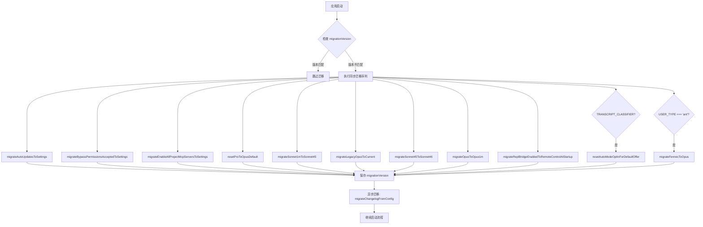

# 47. 迁移系统 (Migration System)

## 概述

迁移系统负责在版本升级时自动迁移用户配置，确保设置和模型选择平滑过渡到新版本。该系统采用幂等设计，每个迁移函数可安全重复执行，避免用户数据丢失或状态不一致。

**设计理念**：
- **幂等性**：迁移函数通过条件判断确保重复执行不会产生副作用
- **版本控制**：通过 `migrationVersion` 标记已执行的迁移集
- **分层隔离**：仅操作 `userSettings`，避免意外提升项目级配置到全局

**触发时机**：
- 应用启动时 (`src/main.tsx:1295`)
- 在信任对话框接受后、主循环启动前执行
- 通过 `CURRENT_MIGRATION_VERSION` 版本号控制是否需要运行

---

## 设计原理

### 版本检测机制

迁移系统使用整数版本号 `migrationVersion` 追踪迁移状态：

```typescript
// src/main.tsx:582
const CURRENT_MIGRATION_VERSION = 11

// src/main.tsx:584
if (getGlobalConfig().migrationVersion !== CURRENT_MIGRATION_VERSION) {
  // 执行所有同步迁移
  // ...
  saveGlobalConfig(prev => ({
    ...prev,
    migrationVersion: CURRENT_MIGRATION_VERSION
  }))
}
```

**版本更新规则**：
1. 新增迁移脚本时，递增 `CURRENT_MIGRATION_VERSION`
2. 版本号变更触发所有迁移重新执行
3. 迁移完成后保存新版本号，下次启动跳过

### 迁移脚本组织

所有迁移脚本位于 `src/migrations/` 目录，采用统一的命名约定：

```
src/migrations/
├── migrateAutoUpdatesToSettings.ts              # 设置迁移
├── migrateBypassPermissionsAcceptedToSettings.ts
├── migrateEnableAllProjectMcpServersToSettings.ts
├── migrateReplBridgeEnabledToRemoteControlAtStartup.ts
├── migrateSonnet1mToSonnet45.ts                 # 模型迁移
├── migrateSonnet45ToSonnet46.ts
├── migrateFennecToOpus.ts
├── migrateLegacyOpusToCurrent.ts
├── migrateOpusToOpus1m.ts
├── resetProToOpusDefault.ts                     # 重置迁移
└── resetAutoModeOptInForDefaultOffer.ts
```

**文件命名规范**：
- `migrate*`：数据从一个位置/格式迁移到另一个
- `reset*`：重置特定配置状态

---

## 实现原理

### 迁移执行流程



### 幂等性保障机制

每个迁移函数内置幂等检查：

```typescript
// 方式1: 检查完成标记
export function migrateSonnet1mToSonnet45(): void {
  const config = getGlobalConfig()
  if (config.sonnet1m45MigrationComplete) {
    return  // 已完成，跳过
  }
  // ... 执行迁移
  saveGlobalConfig(current => ({
    ...current,
    sonnet1m45MigrationComplete: true,
  }))
}

// 方式2: 检查源数据状态
export function migrateFennecToOpus(): void {
  const settings = getSettingsForSource('userSettings')
  const model = settings?.model
  if (!model?.startsWith('fennec-')) {
    return  // 无需迁移
  }
  // ... 执行迁移
  // 读取和写入同一源保持幂等
}

// 方式3: 条件更新
export function migrateReplBridgeEnabledToRemoteControlAtStartup(): void {
  saveGlobalConfig(prev => {
    const oldValue = (prev as Record<string, unknown>)['replBridgeEnabled']
    if (oldValue === undefined) return prev  // 无旧值
    if (prev.remoteControlAtStartup !== undefined) return prev  // 新值已存在
    // 执行迁移
  })
}
```

---

## 功能展开

### 模型迁移

模型迁移处理模型别名的更新，确保用户选择的模型在版本升级后保持语义一致。

#### 1. Sonnet 1m → Sonnet 4.5

**文件**: `src/migrations/migrateSonnet1mToSonnet45.ts:25`

**背景**：`sonnet` 别名从指向 Sonnet 4.5 更新为 Sonnet 4.6，需要将原 `sonnet[1m]` 用户固定到明确的 `sonnet-4-5-20250929[1m]`。

**迁移逻辑**：
```typescript
const model = getSettingsForSource('userSettings')?.model
if (model === 'sonnet[1m]') {
  updateSettingsForSource('userSettings', {
    model: 'sonnet-4-5-20250929[1m]',
  })
}
```

#### 2. Sonnet 4.5 → Sonnet 4.6

**文件**: `src/migrations/migrateSonnet45ToSonnet46.ts:29`

**背景**：Pro/Max/Team Premium 一方用户从显式 Sonnet 4.5 模型字符串迁移到 `sonnet` 别名。

**条件限制**：
- 仅限 `firstParty` API 提供商
- 仅限 Pro/Max/Team Premium 订阅用户

```typescript
if (getAPIProvider() !== 'firstParty') return
if (!isProSubscriber() && !isMaxSubscriber() && !isTeamPremiumSubscriber()) return

const model = getSettingsForSource('userSettings')?.model
if (
  model !== 'claude-sonnet-4-5-20250929' &&
  model !== 'claude-sonnet-4-5-20250929[1m]' &&
  model !== 'sonnet-4-5-20250929' &&
  model !== 'sonnet-4-5-20250929[1m]'
) return

const has1m = model.endsWith('[1m]')
updateSettingsForSource('userSettings', {
  model: has1m ? 'sonnet[1m]' : 'sonnet',
})
```

#### 3. Fennec → Opus

**文件**: `src/migrations/migrateFennecToOpus.ts:18`

**背景**：`fennec` 别名已被移除，需要迁移到对应的 `opus` 别名。

**迁移映射**：
| 旧别名 | 新配置 |
|--------|--------|
| `fennec-latest` | `opus` |
| `fennec-latest[1m]` | `opus[1m]` |
| `fennec-fast-latest` | `opus[1m]` + `fastMode: true` |
| `opus-4-5-fast` | `opus[1m]` + `fastMode: true` |

**条件限制**：仅限内部用户 (`USER_TYPE === 'ant'`)

#### 4. Legacy Opus → Current

**文件**: `src/migrations/migrateLegacyOpusToCurrent.ts:29`

**背景**：将显式 Opus 4.0/4.1 模型字符串迁移到 `opus` 别名。

**迁移的模型**：
- `claude-opus-4-20250514`
- `claude-opus-4-1-20250805`
- `claude-opus-4-0`
- `claude-opus-4-1`

#### 5. Opus → Opus[1m]

**文件**: `src/migrations/migrateOpusToOpus1m.ts:24`

**背景**：Max/Team Premium 一方用户从 `opus` 迁移到 `opus[1m]`（合并后的 Opus 1M 体验）。

**条件限制**：
- 需要 `isOpus1mMergeEnabled()` 返回 true
- Pro 订阅者跳过（保留独立的 Opus 和 Opus 1M 选项）
- 第三方用户跳过

### 设置迁移

设置迁移将配置项从一个存储位置迁移到另一个，保持用户意图不变。

#### 1. Auto Updates → Settings

**文件**: `src/migrations/migrateAutoUpdatesToSettings.ts:13`

**背景**：将 `globalConfig.autoUpdates` 迁移到 `settings.json` 的环境变量。

**迁移逻辑**：
```typescript
if (
  globalConfig.autoUpdates !== false ||
  globalConfig.autoUpdatesProtectedForNative === true
) return

updateSettingsForSource('userSettings', {
  env: {
    ...userSettings.env,
    DISABLE_AUTOUPDATER: '1',
  },
})

// 同时更新运行时环境
process.env.DISABLE_AUTOUPDATER = '1'

// 清理旧配置
saveGlobalConfig(current => {
  const { autoUpdates: _, autoUpdatesProtectedForNative: __, ...rest } = current
  return rest
})
```

#### 2. Bypass Permissions Accepted → Settings

**文件**: `src/migrations/migrateBypassPermissionsAcceptedToSettings.ts:14`

**背景**：将 `globalConfig.bypassPermissionsModeAccepted` 迁移到 `settings.json` 的 `skipDangerousModePermissionPrompt`。

**原因**：`settings.json` 是用户可配置的设置文件，更适合存储用户偏好。

#### 3. MCP Server Approval Fields

**文件**: `src/migrations/migrateEnableAllProjectMcpServersToSettings.ts:17`

**背景**：将 MCP 服务器审批字段从 `projectConfig` 迁移到 `localSettings`。

**迁移字段**：
- `enableAllProjectMcpServers`
- `enabledMcpjsonServers`
- `disabledMcpjsonServers`

**特点**：合并现有设置，避免覆盖用户在其他位置的配置。

#### 4. REPL Bridge Enabled → Remote Control

**文件**: `src/migrations/migrateReplBridgeEnabledToRemoteControlAtStartup.ts:10`

**背景**：将内部实现细节 `replBridgeEnabled` 重命名为用户友好的 `remoteControlAtStartup`。

---

## 核心数据结构

### GlobalConfig 迁移相关字段

```typescript
// src/utils/config.ts:574-577
interface GlobalConfig {
  // 最后应用的迁移集版本号
  // 当等于 CURRENT_MIGRATION_VERSION 时，跳过所有同步迁移
  migrationVersion?: number
  
  // 各迁移的完成标记（按需添加）
  sonnet1m45MigrationComplete?: boolean
  opusProMigrationComplete?: boolean
  legacyOpusMigrationTimestamp?: number
  sonnet45To46MigrationTimestamp?: number
  hasResetAutoModeOptInForDefaultOffer?: boolean
}
```

### 迁移函数签名

```typescript
// 同步迁移：无参数，无返回值
type SyncMigration = () => void

// 异步迁移：无参数，返回 Promise
type AsyncMigration = () => Promise<void>
```

### 迁移脚本模板

```typescript
// src/migrations/[name].ts
export function migrate[Name](): void {
  // 1. 幂等检查
  const config = getGlobalConfig()
  if (config.[completionFlag]) return
  
  // 2. 条件检查
  const settings = getSettingsForSource('userSettings')
  if (!needsMigration(settings)) return
  
  // 3. 执行迁移
  updateSettingsForSource('userSettings', { ... })
  
  // 4. 标记完成
  saveGlobalConfig(current => ({
    ...current,
    [completionFlag]: true,
  }))
  
  // 5. 记录事件（可选）
  logEvent('tengu_migration_[name]', { ... })
}
```

---

## 组合使用

### 与设置系统协作

迁移系统与设置系统紧密配合，主要通过以下 API：

```typescript
// 读取特定源的设置（避免合并）
import { getSettingsForSource, updateSettingsForSource } from '../utils/settings/settings.js'

// 仅操作 userSettings，保持项目级配置独立
const userSettings = getSettingsForSource('userSettings')
updateSettingsForSource('userSettings', { model: 'new-model' })
```

**设计约束**：
- 仅读取 `userSettings`，不读取合并后的设置
- 避免将项目级配置意外提升到全局
- 保持幂等性，同一源读取和写入

### 与模型管理协作

模型迁移依赖模型系统的判断函数：

```typescript
import { getAPIProvider } from '../utils/model/providers.js'
import { isLegacyModelRemapEnabled, isOpus1mMergeEnabled } from '../utils/model/model.js'

// 条件迁移
if (getAPIProvider() !== 'firstParty') return
if (!isOpus1mMergeEnabled()) return
```

### 与订阅系统协作

部分迁移依赖用户订阅状态：

```typescript
import { isProSubscriber, isMaxSubscriber, isTeamPremiumSubscriber } from '../utils/auth.js'

if (!isProSubscriber() && !isMaxSubscriber() && !isTeamPremiumSubscriber()) return
```

---

## 代码证据

### 迁移脚本清单

| 文件 | 行数 | 类型 | 触发条件 |
|------|------|------|----------|
| `migrateAutoUpdatesToSettings.ts` | 61 | 设置 | `autoUpdates === false` |
| `migrateBypassPermissionsAcceptedToSettings.ts` | 40 | 设置 | `bypassPermissionsModeAccepted` 存在 |
| `migrateEnableAllProjectMcpServersToSettings.ts` | 118 | 设置 | MCP 字段存在于 projectConfig |
| `migrateReplBridgeEnabledToRemoteControlAtStartup.ts` | 22 | 设置 | `replBridgeEnabled` 存在 |
| `migrateSonnet1mToSonnet45.ts` | 48 | 模型 | `model === 'sonnet[1m]'` |
| `migrateSonnet45ToSonnet46.ts` | 67 | 模型 | Pro/Max/Team + 1P + Sonnet 4.5 |
| `migrateFennecToOpus.ts` | 45 | 模型 | `USER_TYPE === 'ant'` + Fennec 模型 |
| `migrateLegacyOpusToCurrent.ts` | 57 | 模型 | 1P + Opus 4.0/4.1 |
| `migrateOpusToOpus1m.ts` | 43 | 模型 | `isOpus1mMergeEnabled()` + `model === 'opus'` |
| `resetProToOpusDefault.ts` | 51 | 重置 | Pro + 1P |
| `resetAutoModeOptInForDefaultOffer.ts` | 51 | 重置 | `TRANSCRIPT_CLASSIFIER` feature |

### Community 3 关联节点

从知识图谱 Community 3 提取的迁移相关节点：

- `src_migrations_migrateAutoUpdatesToSettings_ts`
- `src_migrations_migrateBypassPermissionsAcceptedToSettings_ts`
- `src_migrations_migrateEnableAllProjectMcpServersToSettings_ts`
- `src_migrations_migrateFennecToOpus_ts`
- `src_migrations_migrateLegacyOpusToCurrent_ts`
- `src_migrations_migrateOpusToOpus1m_ts`
- `src_migrations_migrateReplBridgeEnabledToRemoteControlAtStartup_ts`
- `src_migrations_migrateSonnet1mToSonnet45_ts`
- `src_migrations_migrateSonnet45ToSonnet46_ts`
- `src_migrations_resetAutoModeOptInForDefaultOffer_ts`
- `src_migrations_resetProToOpusDefault_ts`

**关键依赖**：
- `src_utils_settings_settings_ts` (181 connections) — 设置读写
- `src_utils_config_ts` (配置管理) — GlobalConfig 读写

---

## 小结

迁移系统是 Claude Code 版本升级的平滑过渡机制，核心特点：

1. **版本号控制**：通过 `migrationVersion` 批量执行迁移，避免逐个追踪
2. **幂等设计**：每个迁移函数可安全重复执行，无副作用
3. **分层隔离**：仅操作 `userSettings`，保持项目配置独立
4. **条件触发**：根据用户类型、订阅状态、API 提供商等条件精准迁移
5. **异步扩展**：支持异步迁移（如 `migrateChangelogFromConfig`）

**最佳实践**：
- 新增迁移时递增 `CURRENT_MIGRATION_VERSION`
- 使用幂等检查避免重复执行
- 仅操作 `userSettings`，避免配置提升
- 记录迁移事件用于分析
- 参考 `migrateSonnet1mToSonnet45.ts` 模板
